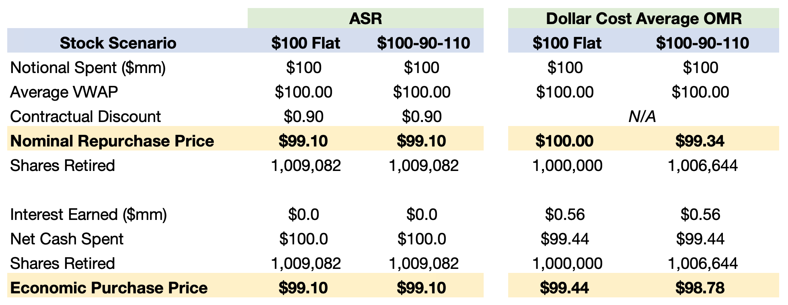

## Table of Contents

## What are share purchase costs and fees?

When you buy shares, you have to pay some costs and fees. These are like extra charges on top of the price of the shares. The main cost is usually called a brokerage fee or commission. This is what you pay to the broker or the company that helps you buy the shares. The amount can be different depending on the broker and how much you are buying.

There are also other fees you might have to pay. One is called a stamp duty, which is a tax you pay to the government when you buy shares. Another fee could be for keeping your shares safe, which is called a custody fee. Some brokers might also charge you if you don't trade often enough, which is known as an inactivity fee. It's good to know about all these costs before you start buying shares so you can plan better.

## What types of fees might I encounter when buying shares?

When you buy shares, you'll come across different fees that add to the cost of your investment. The most common fee is the brokerage fee or commission. This is what you pay to the broker or company that helps you buy the shares. The amount you pay can change depending on which broker you use and how many shares you're buying. Some brokers might charge you a flat fee for each trade, while others might take a percentage of the total amount you're spending.

There are other fees you might have to pay too. One of these is called a stamp duty, which is like a tax you pay to the government when you buy shares. Another fee you might see is a custody fee, which is for keeping your shares safe. If you don't trade often, you might also have to pay an inactivity fee. It's a good idea to know about all these fees before you start buying shares so you can plan your investments better.

## How do brokerage commissions work when purchasing shares?

When you buy shares, you usually have to pay a brokerage commission. This is a fee that you pay to the broker or the company that helps you buy the shares. The commission can be different depending on which broker you use. Some brokers might charge you a flat fee for each trade. For example, they might charge you $5 every time you buy shares. Other brokers might take a percentage of the total amount you're spending. So if you're buying $1,000 worth of shares and the commission is 1%, you'd pay $10.

It's important to understand how much you'll be paying in commissions because it can affect how much money you have left to invest. If you're making a lot of trades, those fees can add up quickly. Some brokers offer lower commissions if you trade a lot or if you keep a certain amount of money with them. It's a good idea to compare different brokers to see which one offers the best deal for the way you want to buy shares.

## What is a transaction fee and how does it affect the cost of buying shares?

A transaction fee is a charge you pay when you buy or sell shares. It's like a small cost for making the trade happen. Brokers or trading platforms usually charge this fee, and it can be a fixed amount, like $5 per trade, or a percentage of the total amount you're spending on shares. For example, if you're buying $1,000 worth of shares and the transaction fee is 0.5%, you'll pay an extra $5.

This fee affects the overall cost of buying shares because it adds to the price you're already paying for the shares themselves. If you're not careful, these fees can eat into your investment returns, especially if you trade often. It's important to know how much you're paying in transaction fees so you can plan your investments better and choose a broker or platform that offers the best deal for your needs.

## Can you explain the difference between a flat fee and a percentage-based fee for share purchases?

When you buy shares, you might have to pay a flat fee or a percentage-based fee. A flat fee is a set amount of money you pay every time you make a trade. For example, if your broker charges a flat fee of $5, you'll pay $5 no matter how many shares you buy or how much money you spend. This can be good if you're buying a lot of shares because the fee stays the same even if the total cost of your shares goes up.

A percentage-based fee is different because it depends on how much money you're spending on shares. If your broker charges a 1% fee, you'll pay 1% of the total amount you're spending. So if you're buying $1,000 worth of shares, you'll pay $10 in fees. This kind of fee can be better if you're buying fewer shares or spending less money because the fee will be smaller. But if you're buying a lot of shares, the fee can add up quickly and might be more than a flat fee.

## How do exchange fees impact the total cost of buying shares?

Exchange fees are charges that stock exchanges might add on top of the price you pay for shares. These fees can be a small part of the total cost of buying shares, but they still add to what you have to pay. For example, if you're buying shares through a broker that uses a specific exchange, that exchange might charge a fee for each trade. This fee can be a fixed amount or a percentage of the total value of your trade.

These fees can affect how much money you have left to invest. If you're making a lot of trades, the exchange fees can add up and make your investments more expensive. It's important to know about these fees so you can choose the best way to buy shares. Sometimes, you might find a broker that doesn't charge these fees or uses an exchange with lower fees, which can help you save money in the long run.

## What are the regulatory fees associated with share purchases and how are they calculated?

Regulatory fees are charges that you might have to pay when you buy shares. These fees come from government agencies or regulatory bodies that watch over the stock market to make sure everything is fair and safe. The most common regulatory fee is called the Securities and Exchange Commission (SEC) fee. This fee helps pay for the costs of regulating the stock market. The SEC fee is usually very small, but it's based on the total value of your trade. So, if you're buying a lot of shares, the fee will be a bit higher.

Another regulatory fee you might see is the Financial Industry Regulatory Authority (FINRA) fee. FINRA is another group that helps keep the stock market honest and safe. The FINRA fee is also based on the total value of your trade, but it's usually even smaller than the SEC fee. Both of these fees are added to the cost of buying your shares, so they can make your investment a little more expensive. It's good to know about these fees so you can understand the total cost of buying shares and plan your investments better.

## How can I minimize the costs and fees when buying shares?

To minimize the costs and fees when buying shares, start by choosing a broker that offers low or no commissions. Some brokers charge a flat fee for each trade, while others take a percentage of the total amount you spend. If you trade a lot, a broker with a low flat fee might save you money. Also, look for brokers that don't charge extra fees like inactivity fees or high custody fees. Comparing different brokers can help you find the best deal for your needs.

Another way to keep costs down is to trade less often. Every time you buy or sell shares, you pay fees, so making fewer trades can save you money. If you're planning to invest for the long term, you might want to buy shares and hold onto them instead of trading a lot. Also, be aware of the total value of your trades because some fees, like regulatory fees, are based on how much you're spending. By keeping your trades big but less frequent, you can lower the impact of these fees on your investment.

## Are there any hidden fees I should be aware of when purchasing shares?

When you buy shares, you might come across some hidden fees that can add to your costs. One of these is called a clearing fee, which is charged by the clearinghouse that helps make sure your trade goes through smoothly. This fee is usually small, but it can add up if you trade a lot. Another hidden fee could be a platform fee, which some brokers charge just for using their trading platform. This fee might not be obvious when you're looking at the main costs, so it's good to check the fine print.

Also, watch out for fees like account maintenance fees or transfer fees. An account maintenance fee is what some brokers charge just for keeping your account open, even if you're not trading. A transfer fee might come up if you want to move your shares from one broker to another. These fees can sneak up on you if you're not careful, so it's important to read all the details about what you might have to pay before you start buying shares. Knowing about these hidden fees can help you plan better and keep more of your money for investing.

## How do the costs and fees of buying shares vary between different brokers?

The costs and fees of buying shares can be very different from one broker to another. Some brokers charge a flat fee for each trade, like $5 no matter how many shares you buy. Other brokers might take a percentage of the total amount you're spending, so if you buy $1,000 worth of shares and the fee is 1%, you'll pay $10. Some brokers might not charge any commission at all, but they might make money in other ways, like by charging for things like keeping your shares safe or if you don't trade often enough. It's good to compare different brokers to see which one offers the best deal for the way you want to buy shares.

Besides the main fees, different brokers might also have other costs that can add up. Some might charge a fee for using their trading platform, or for keeping your account open even if you're not trading. There might also be fees for moving your shares from one broker to another. These extra costs can be hidden and might not be obvious when you're looking at the main costs. Knowing about all these fees can help you choose a broker that keeps your costs low and lets you keep more of your money for investing.

## What impact do share purchase costs and fees have on long-term investment returns?

Share purchase costs and fees can eat into your long-term investment returns. Every time you buy or sell shares, you pay fees like brokerage commissions, exchange fees, and regulatory fees. These fees might seem small, but they add up over time. If you're trading a lot, these costs can take a big chunk out of your investment. This means you'll have less money left to grow and earn more money for you. So, it's important to pick a broker with low fees and to trade less often if you want to keep more of your money working for you in the long run.

If you're investing for the long term, choosing a broker with low or no fees can make a big difference. For example, if you're paying a high percentage-based fee every time you buy shares, it can really hurt your returns over many years. But if you find a broker with a low flat fee or no fee at all, you'll save money on each trade. This means more of your money can stay in the market and grow over time. So, when you're planning your investments, think about how fees can affect your money over the long term and try to keep those costs as low as you can.

## How can advanced investors use fee structures to their advantage in share trading?

Advanced investors can use fee structures to their advantage by carefully choosing brokers that offer the best deals based on their trading habits. If they trade a lot, they might pick a broker with a low flat fee instead of a percentage-based fee. This way, they can save money on each trade and have more money left to invest. They might also look for brokers that don't charge extra fees like inactivity fees or high custody fees. By understanding and comparing different fee structures, advanced investors can lower their costs and keep more of their money working for them in the market.

Another way advanced investors can use fee structures to their advantage is by planning their trades to minimize fees. They might choose to make fewer, bigger trades instead of a lot of small ones to reduce the impact of transaction fees and regulatory fees. They can also take advantage of brokers that offer [volume](/wiki/volume-trading-strategy) discounts or lower fees for frequent traders. By being smart about when and how they trade, advanced investors can keep their costs down and improve their long-term investment returns.

## How do costs impact investment performance?

High trading costs can substantially reduce profits, particularly in the context of [algorithmic trading](/wiki/algorithmic-trading) where rapid trade executions often come with additional expenses. Algorithmic trading involves numerous micro-transactions, and even small fees associated with each trade can cumulate over time, resulting in a marked impact on an investment's overall performance. This is especially impactful in high-frequency trading, where the volume of trades magnifies the accumulation of fees.

To better illustrate this, consider a high-frequency trading scenario with a transaction cost of only $0.001 per share. While this may appear negligible, trading large volumes frequently can lead to significant fees. Mathematically, if an algorithmic trading strategy involves executing 1,000 trades per day, with an average order size of 10,000 shares per trade, the daily transaction cost is calculated as:

$$
\text{Daily Transaction Cost} = \text{Transaction Cost Per Share} \times \text{Number of Trades} \times \text{Average Order Size}
$$

Substituting the values:

$$
\text{Daily Transaction Cost} = 0.001 \times 1,000 \times 10,000 = 10,000
$$

This results in a daily cost of $10,000, which, when compounded over weeks or months, can significantly diminish profits.

Understanding these costs allows traders to better align their strategies to enhance net returns. For instance, reducing the frequency of trades or optimizing algorithms to minimize unnecessary trades can significantly reduce cumulative costs. Additionally, choosing trading platforms with lower fees and implementing improved risk management practices can enhance cost-efficiency.

Moreover, traders should conduct regular cost audits to understand how transaction fees impact their trading strategies. By closely monitoring cost performance, traders can adjust their trading algorithms to balance the trade-off between the volume of trades and incurred costs. Leveraging technology for automated tracking and analysis can also aid in pinpointing areas where costs might be reduced.

Ultimately, a clear understanding of how trading costs impact investment performance enables traders to develop effective strategies for minimizing these expenses, allowing for better alignment with investment goals and maximizing net returns.

## What is the conclusion?

Investment fees, stock buying expenses, and algo trading costs are vital elements that significantly impact investment strategies. Whether you're a traditional investor or a participant in algorithmic trading, understanding and managing these costs is imperative to maximize financial results.

Being aware of the underlying costs can help investors make more informed decisions. For example, even minimal fees can accumulate and compound over time, reducing net returns. The effects of these costs are illustrated by the formula for calculating net returns:

$$
\text{Net Return} = (\text{Gross Return} - \text{Fees})
$$

This simple calculation underscores the importance of fee awareness in preserving investment performance.

Effective management strategies can enhance returns by reducing unnecessary expenses. Selecting low-cost brokers and investment platforms can be a straightforward method to minimize costs. Additionally, investors engaged in algorithmic trading can optimize algorithm parameters and leverage technology to enhance efficiency and reduce data feed and infrastructure expenses.

Technology plays an increasingly crucial role in managing and predicting the stock market's fluctuations and, consequently, managing trading costs. Regularly conducting cost audits can further help identify and eliminate redundant expenditures, thereby enhancing profitability.

To secure favorable investment outcomes, adopting a tactical approach to navigate these expenses is crucial. Implementing informed strategies allows investors to manage their costs more effectively, ultimately amplifying their net returns and achieving optimal financial results.

## References & Further Reading

[1]: Bergstra, J., Bardenet, R., Bengio, Y., & Kégl, B. (2011). ["Algorithms for Hyper-Parameter Optimization."](https://dl.acm.org/doi/10.5555/2986459.2986743) Advances in Neural Information Processing Systems 24.

[2]: ["Advances in Financial Machine Learning"](https://www.amazon.com/Advances-Financial-Machine-Learning-Marcos/dp/1119482089) by Marcos Lopez de Prado

[3]: ["Evidence-Based Technical Analysis: Applying the Scientific Method and Statistical Inference to Trading Signals"](https://www.amazon.com/Evidence-Based-Technical-Analysis-Scientific-Statistical/dp/0470008741) by David Aronson

[4]: ["Machine Learning for Algorithmic Trading"](https://github.com/stefan-jansen/machine-learning-for-trading) by Stefan Jansen

[5]: ["Quantitative Trading: How to Build Your Own Algorithmic Trading Business"](https://www.amazon.com/Quantitative-Trading-Build-Algorithmic-Business/dp/1119800064) by Ernest P. Chan