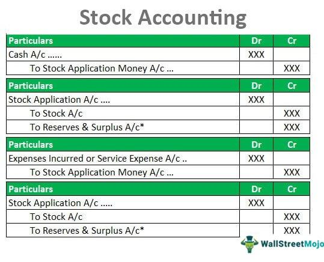

Investing in the stock market presents a complex landscape of costs that investors must navigate to optimize their returns. At the forefront of these costs are investment fees, which encompass broker commissions, transaction fees, and other expenses related to stock trading and share purchases. These fees can vary significantly based on the choice of brokerage services, impacting the overall cost of investment activities.

Algorithmic trading, or algo trading, has emerged as a significant force reshaping traditional approaches to stock market investments. By utilizing complex algorithms and high-speed data processing, algo trading offers distinct advantages such as enhanced trading speed, efficiency, and the potential for higher profitability. However, these advantages come with their own set of unique costs, including expenses related to software development, data feed subscriptions, and maintaining technologically advanced infrastructure. As algorithms become increasingly sophisticated, the costs associated with developing and maintaining such systems rise correspondingly, especially within high-frequency trading environments.



This article aims to provide a comprehensive exploration of the costs involved in purchasing stocks, including the brokerage fees associated with different types of trades and the intricacies of algo trading expenses. By examining these aspects, investors can better understand how these costs may impact their investment strategies and overall returns. The transparency of these expenses is crucial, as they can significantly influence both short-term trading outcomes and long-term financial success. Understanding and effectively managing these costs enables investors to refine their strategies and potentially enhance their investment performance over time.

## Table of Contents

## Understanding Investment Fees

Investment fees are a crucial [factor](/wiki/factor-investing) to consider when engaging in stock market investments, as they represent the various charges incurred during the buying and selling of securities. These fees can substantially influence the overall investment performance, making it essential for investors to have a detailed understanding of what they entail.

Investment fees consist of multiple components, including broker commissions, transaction fees, and the costs associated with using trading platforms. Broker commissions are perhaps the most recognized form of investment fees. Traditional full-service brokers usually charge a commission based on a percentage of the trade value, typically ranging from 1% to 2%. This means that a $10,000 trade could incur a fee of $100 to $200, directly affecting the investor’s net returns.

In contrast, online brokers have revolutionized the market by offering lower fees or even zero-commission trades. The rise of these platforms has introduced competition and has largely been driven by advances in technology that facilitate more efficient transaction processing. As a result, investors can execute trades at a lower cost, which can preserve a significant portion of their returns over time.

Aside from commission fees, transaction fees are another critical component of investment fees. These charges can vary depending on the trading platform and the specific services provided. They may include costs for order processing, regulatory fees, and sometimes a fee for withdrawing funds. Each of these charges contributes to the cumulative cost of trading and can become substantial depending on the frequency and size of trades.

Investors must also consider the cost of using trading platforms themselves. These platforms often offer varying tiers of service, with more advanced platforms providing greater analytical tools, better data feeds, and faster execution times. Such platforms may impose periodic subscription fees, which should be factored into the overall cost structure of one’s trading strategy.

Understanding these fees is crucial because even incremental costs can have a compounding effect on overall investment returns over time. For example, a seemingly modest annual fee of 0.5% on a portfolio valued at $100,000 results in a cost of $500 per year. Over a decade, if not managed effectively, such fees could amount to thousands of dollars, representing a significant diminution of potential investment gains.

In conclusion, being aware and knowledgeable about investment fees is essential for any investor looking to maximize their net returns. By choosing appropriate brokers and being mindful of trading practices that minimize unnecessary fees, investors can achieve more favorable financial outcomes.

## Stock Buying Expenses

Buying stocks involves not only the purchase price of the shares but also a variety of associated expenses that investors must consider. These include brokerage fees, market spreads, and other transaction-related costs. Understanding and calculating these expenses helps investors assess the true cost of their stock purchases, ultimately impacting their investment decisions and returns.

**Brokerage Fees**

Brokerage fees are charges levied by brokers for executing transactions or providing specialized services. While traditional brokerage firms typically charge a percentage of the trade value, modern online brokers often provide zero-commission trades, significantly reducing these costs. For instance, if an investor places an order through a broker charging a 1% fee on a $10,000 stock purchase, the brokerage fee would amount to \$100. Online brokers offering zero commissions allow investors to eliminate this specific cost, retaining more of their invested capital.

**Market Spreads**

The market spread is the difference between the buying (ask) price and the selling (bid) price of a stock. The spread compensates market makers for facilitating trades and maintaining [liquidity](/wiki/liquidity-risk-premium). A narrower spread indicates a more liquid market, whereas a wider spread can signify lower liquidity or higher [volatility](/wiki/volatility-trading-strategies). For example, if the asking price of a stock is \$50.10, and the bid price is \$50.00, the spread is \$0.10. This spread represents an immediate cost when purchasing the stock, as investors typically buy at the higher ask price. Calculating and understanding the impact of spreads helps investors assess the actual cost of entering and exiting stock positions.

```python
# Calculate brokerage fee
def calculate_brokerage_fee(trade_value, fee_percentage):
    return trade_value * fee_percentage / 100

# Calculate market spread cost
def calculate_spread_cost(ask_price, bid_price):
    return ask_price - bid_price

# Example usage
trade_value = 10000  # Example trade value
fee_percentage = 1  # Example brokerage fee percentage
ask_price = 50.10  # Example ask price
bid_price = 50.00  # Example bid price

brokerage_fee = calculate_brokerage_fee(trade_value, fee_percentage)
spread_cost = calculate_spread_cost(ask_price, bid_price)

brokerage_fee, spread_cost
```

By considering brokerage fees, market spreads, and other potential costs such as custody fees or foreign transaction fees, investors can make more informed decisions about their stock purchases. Awareness of these charges is essential for optimizing investment performance, preventing erosion of returns, and ensuring alignment with broader financial goals.

## Algo Trading and its Unique Costs

Algorithmic trading, commonly known as algo trading, revolutionizes financial markets by executing trades at speeds and volumes beyond human capability. Despite its advantages, algo trading incurs several specific costs that can impact traders' profitability if not managed properly.

**Software Development Costs:** Algo trading relies on sophisticated algorithms designed to make autonomous trading decisions. Developing these algorithms involves hiring skilled developers and data scientists, which can be expensive. Coders use languages like Python, C++, and R to create algorithms based on statistical models and historical data analysis. Ongoing maintenance and updates contribute to these costs, ensuring algorithms remain efficient and competitive as market conditions change.

**Data Feed Subscriptions:** Real-time data feeds are crucial for algo trading, especially in high-frequency trading where milliseconds matter. Traders must subscribe to reliable data providers for market data, news, and economic indicators, often at considerable expense. Costs vary based on the depth, frequency, and latency of the data required. Enterprises operating at high scales may spend significant amounts to secure premium data that provides accurate and timely information.

**Technological Infrastructure:** To compete effectively, algo traders need robust technological infrastructure. This includes high-speed internet connections, powerful servers, and co-location facilities near exchange data centers to reduce latency. Additionally, backup systems and security measures are necessary to handle system failures and protect sensitive trading data from cyber threats. These infrastructure investments can form a substantial portion of trading costs.

**Comparison with Traditional Trading:** Compared to traditional trading, algo trading offers advantages in speed and reduced emotional bias. However, these benefits come with added costs. Traditional traders, relying on manual research and execution, incur fewer infrastructure-related expenses but may face higher trading fees due to slower, less efficient trading processes. Algo traders, in contrast, front-load costs into technology and data but enjoy potentially lower per-trade fees thanks to rapid and automated executions.

In conclusion, while [algorithmic trading](/wiki/algorithmic-trading) provides unparalleled efficiency and precision, it necessitates significant investments in software, data, and technology. Traders must carefully balance these costs with the potential gains in speed and accuracy to maximize their returns.

## Strategies to Minimize Trading Costs

To enhance profitability and minimize trading costs, investors can employ various strategies. These methods not only help in reducing unnecessary expenses but also contribute to optimizing overall investment outcomes.

One primary strategy is choosing low-cost brokers. Many online brokers offer reduced fees or zero-commission trades, providing a cost-effective alternative to traditional full-service brokers, which often charge 1% to 2% of the trade value. Selecting brokers that align with one's trading [volume](/wiki/volume-trading-strategy) and investment style can lead to significant savings.

Another effective strategy is optimizing trading algorithms. In algorithmic trading, refining algorithms to reduce execution costs is crucial. This involves improving the efficiency of the algorithm to ensure that trades are executed at the best possible price, minimizing market impact costs and slippage. Additionally, [backtesting](/wiki/backtesting) algorithms against historical data can help identify and eliminate inefficiencies.

Using tax-advantaged accounts is another way to minimize trading costs. By investing through accounts like 401(k)s or IRAs, investors can defer taxes, which may enhance net returns. These accounts offer benefits such as tax deductions on contributions or tax-free growth, depending on the account type, which can offset some trading costs.

Regular cost audits are instrumental in identifying areas of excess expenditure. Investors should routinely evaluate their trading activities and related expenses to pinpoint where costs can be curtailed. This analysis helps in ensuring that fees are not eroding potential profits.

Leveraging technology also plays a critical role in minimizing trading costs. Technologies and tools that offer insights into market conditions and automate parts of the trading process can reduce time and trading errors that may lead to costly mistakes. For instance, using automated rebalancing tools in portfolio management can optimize transactions for cost efficiency.

By implementing these strategies, investors can effectively manage and reduce their trading costs, ultimately leading to enhanced profitability and better investment outcomes.

## The Impact of Costs on Investment Performance

High trading costs can substantially reduce profits, particularly in the context of algorithmic trading where rapid trade executions often come with additional expenses. Algorithmic trading involves numerous micro-transactions, and even small fees associated with each trade can cumulate over time, resulting in a marked impact on an investment's overall performance. This is especially impactful in high-frequency trading, where the volume of trades magnifies the accumulation of fees.

To better illustrate this, consider a high-frequency trading scenario with a transaction cost of only $0.001 per share. While this may appear negligible, trading large volumes frequently can lead to significant fees. Mathematically, if an algorithmic trading strategy involves executing 1,000 trades per day, with an average order size of 10,000 shares per trade, the daily transaction cost is calculated as:

$$
\text{Daily Transaction Cost} = \text{Transaction Cost Per Share} \times \text{Number of Trades} \times \text{Average Order Size}
$$

Substituting the values:

$$
\text{Daily Transaction Cost} = 0.001 \times 1,000 \times 10,000 = 10,000
$$

This results in a daily cost of $10,000, which, when compounded over weeks or months, can significantly diminish profits.

Understanding these costs allows traders to better align their strategies to enhance net returns. For instance, reducing the frequency of trades or optimizing algorithms to minimize unnecessary trades can significantly reduce cumulative costs. Additionally, choosing trading platforms with lower fees and implementing improved risk management practices can enhance cost-efficiency.

Moreover, traders should conduct regular cost audits to understand how transaction fees impact their trading strategies. By closely monitoring cost performance, traders can adjust their trading algorithms to balance the trade-off between the volume of trades and incurred costs. Leveraging technology for automated tracking and analysis can also aid in pinpointing areas where costs might be reduced.

Ultimately, a clear understanding of how trading costs impact investment performance enables traders to develop effective strategies for minimizing these expenses, allowing for better alignment with investment goals and maximizing net returns.

## Conclusion

Investment fees, stock buying expenses, and algo trading costs are vital elements that significantly impact investment strategies. Whether you're a traditional investor or a participant in algorithmic trading, understanding and managing these costs is imperative to maximize financial results.

Being aware of the underlying costs can help investors make more informed decisions. For example, even minimal fees can accumulate and compound over time, reducing net returns. The effects of these costs are illustrated by the formula for calculating net returns:

$$
\text{Net Return} = (\text{Gross Return} - \text{Fees})
$$

This simple calculation underscores the importance of fee awareness in preserving investment performance.

Effective management strategies can enhance returns by reducing unnecessary expenses. Selecting low-cost brokers and investment platforms can be a straightforward method to minimize costs. Additionally, investors engaged in algorithmic trading can optimize algorithm parameters and leverage technology to enhance efficiency and reduce data feed and infrastructure expenses.

Technology plays an increasingly crucial role in managing and predicting the stock market's fluctuations and, consequently, managing trading costs. Regularly conducting cost audits can further help identify and eliminate redundant expenditures, thereby enhancing profitability.

To secure favorable investment outcomes, adopting a tactical approach to navigate these expenses is crucial. Implementing informed strategies allows investors to manage their costs more effectively, ultimately amplifying their net returns and achieving optimal financial results.

## References & Further Reading

[1]: Bergstra, J., Bardenet, R., Bengio, Y., & Kégl, B. (2011). ["Algorithms for Hyper-Parameter Optimization."](https://dl.acm.org/doi/10.5555/2986459.2986743) Advances in Neural Information Processing Systems 24.

[2]: ["Advances in Financial Machine Learning"](https://www.amazon.com/Advances-Financial-Machine-Learning-Marcos/dp/1119482089) by Marcos Lopez de Prado

[3]: ["Evidence-Based Technical Analysis: Applying the Scientific Method and Statistical Inference to Trading Signals"](https://www.amazon.com/Evidence-Based-Technical-Analysis-Scientific-Statistical/dp/0470008741) by David Aronson

[4]: ["Machine Learning for Algorithmic Trading"](https://github.com/stefan-jansen/machine-learning-for-trading) by Stefan Jansen

[5]: ["Quantitative Trading: How to Build Your Own Algorithmic Trading Business"](https://www.amazon.com/Quantitative-Trading-Build-Algorithmic-Business/dp/1119800064) by Ernest P. Chan