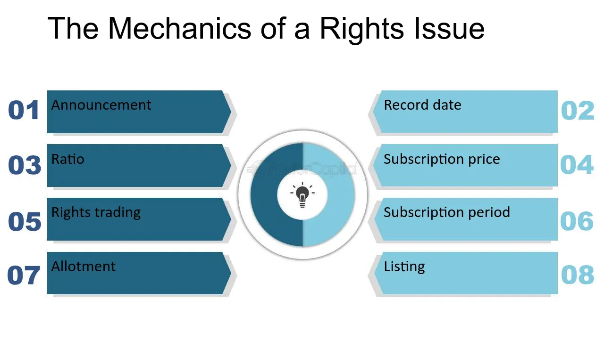

## Table of Contents

## What are share purchase rights?

Share purchase rights, also known as stock purchase rights or subscription rights, are a type of financial instrument that gives existing shareholders the opportunity to buy additional shares of a company's stock, usually at a discounted price. These rights are often issued by companies to raise additional capital without going through a full public offering. When a company decides to issue new shares, it might offer these rights to its current shareholders as a way to give them the first chance to increase their ownership before the shares are offered to the public.

The process typically works like this: for every share a shareholder already owns, they receive a right to purchase a certain number of new shares at a specified price within a certain time frame. If a shareholder decides not to exercise their rights, they can usually sell them to other investors. This can be beneficial for the company because it helps maintain the loyalty of existing shareholders and can also attract new investors who are interested in the discounted shares.

## Why are share purchase rights important for shareholders?

Share purchase rights are important for shareholders because they give them a chance to buy more shares of the company at a lower price. This is good because it lets shareholders increase how much of the company they own without spending as much money. When shareholders can buy more shares cheaply, it can make their investment worth more over time.

Also, share purchase rights help shareholders keep their ownership percentage the same. When a company issues new shares, it can make each share worth a smaller piece of the company. But with purchase rights, shareholders can buy enough new shares to keep their ownership the same. This is important because it stops their share of the company from getting smaller when new shares are added.

## How do share purchase rights differ from stock options?

Share purchase rights and stock options are both ways for people to buy a company's shares, but they work differently. Share purchase rights are given to existing shareholders and let them buy more shares at a set price for a short time. They are usually offered when a company wants to raise money and wants to give current shareholders a chance to buy new shares first. If a shareholder doesn't want to use their rights, they can often sell them to others.

Stock options, on the other hand, are often given to employees as part of their pay. They give the employee the right to buy shares at a set price, but they can usually use this right over a longer time. Stock options are not just for current shareholders; they are a way for companies to reward and keep their workers. Unlike share purchase rights, stock options might not have a short time limit and are not usually offered to all shareholders.

## What is the process for issuing share purchase rights?

When a company decides to issue share purchase rights, it first announces the plan to its shareholders. The company explains how many new shares will be issued and at what price. Each existing shareholder gets a certain number of rights based on how many shares they already own. For example, if a shareholder owns 100 shares and the company is issuing one right for each share, the shareholder gets 100 rights. These rights allow the shareholder to buy new shares at a discounted price within a set time period, usually a few weeks.

Once the rights are issued, shareholders can decide what to do with them. They can use their rights to buy the new shares at the special price, or they can sell their rights to other investors who want to buy the shares. If a shareholder does nothing, the rights will expire and they won't be able to buy the new shares. The company uses the money from selling the new shares to grow the business or pay off debts. This way, the company raises money while giving its current shareholders a chance to increase their ownership at a lower cost.

## Can you explain the mechanism of exercising share purchase rights?

When a company decides to issue new shares, it gives share purchase rights to its current shareholders. These rights let shareholders buy the new shares at a lower price than what other people might have to pay. If you own shares in the company, you get one right for each share you have. The company tells you how many new shares you can buy with each right and how much you have to pay for them. You have a short time, usually a few weeks, to decide if you want to use your rights.

To exercise your share purchase rights, you need to tell the company you want to buy the new shares. You can do this by filling out a form and sending it back to the company with the money for the shares. If you don't want to buy the new shares, you can sell your rights to someone else who does want them. If you do nothing, your rights will expire and you won't be able to buy the new shares. This way, the company can raise money while giving its current shareholders a chance to own more of the company at a good price.

## What are the typical terms and conditions associated with share purchase rights?

When a company issues share purchase rights, it sets specific terms and conditions that shareholders need to follow. The main term is the subscription price, which is the discounted price at which shareholders can buy the new shares. There's also a subscription ratio, which tells shareholders how many new shares they can buy for each right they own. For example, a 1:4 ratio means you can buy 4 new shares for every right you have. Another important condition is the exercise period, which is the time frame during which shareholders can use their rights to buy the new shares. This period usually lasts a few weeks.

Additionally, the terms often include what happens if a shareholder decides not to exercise their rights. In many cases, shareholders can sell their rights to other investors if they don't want to use them themselves. This is called trading the rights. If a shareholder does nothing, the rights will expire at the end of the exercise period, and they won't be able to buy the new shares. The company might also include other conditions, like how the rights are distributed or any restrictions on who can buy the new shares. These terms make sure that the process of issuing new shares is clear and fair for everyone involved.

## How do share purchase rights affect the company's capital structure?

When a company issues share purchase rights, it can change its capital structure. The capital structure is how a company is financed, including how much money comes from stocks and how much comes from loans. When the company issues new shares through share purchase rights, it gets more money from selling those shares. This money can be used to pay off debts or to invest in growing the business. By doing this, the company might have less debt and more equity, which can make the company's financial situation more stable.

However, issuing new shares also means that the ownership of the company gets spread out more. If existing shareholders don't buy all the new shares, their percentage of ownership in the company might go down. This is called dilution. But if many shareholders use their rights to buy the new shares, they can keep their ownership percentage the same or even increase it. So, share purchase rights can help the company raise money and change its capital structure, but it also depends on how shareholders react to the offer.

## What are the tax implications of exercising share purchase rights?

When you use share purchase rights to buy new shares, you might have to pay taxes. If you buy the shares at a lower price than they are worth, you could have to pay tax on the difference between what you paid and what the shares are really worth. This is called a taxable benefit. The exact tax you have to pay depends on where you live and the tax laws there. You might have to pay income tax on this benefit, and it could also affect how much capital gains tax you pay if you sell the shares later.

In some places, you don't have to pay tax right away when you buy the shares. Instead, you might only have to pay tax when you sell the shares. If you sell the shares for more than you paid for them, you might have to pay capital gains tax on the profit. But if you sell them for less than you paid, you might be able to use that loss to lower your taxes in other ways. It's a good idea to talk to a tax expert to understand exactly how exercising share purchase rights will affect your taxes.

## How do share purchase rights impact the valuation of a company?

When a company gives out share purchase rights, it can change how much the company is worth. The company gets more money from selling the new shares, which can make it look more valuable because it has more cash. This extra money can be used to pay off debts or to grow the business, which might make the company stronger and more valuable over time. But if the market thinks the company is issuing too many new shares, it might worry that the value of each share will go down. This could make the company's total value go down if people think the shares are worth less.

Also, share purchase rights can affect the company's value because of something called dilution. If existing shareholders don't buy all the new shares, their ownership in the company gets smaller. This can make the company seem less valuable to them because they own a smaller piece of it. But if many shareholders use their rights to buy the new shares, they can keep their ownership the same or even increase it. This can make the company's value stay the same or go up because shareholders feel good about keeping their share of the company.

## What are the strategic considerations for a company when issuing share purchase rights?

When a company decides to issue share purchase rights, it thinks about how it can raise money without making its shareholders unhappy. By giving existing shareholders the chance to buy new shares at a lower price, the company can get more cash to grow its business or pay off debts. This can make the company stronger and more stable. But the company also has to think about how issuing new shares might make each share worth a smaller piece of the company. If too many new shares are issued, the value of each share could go down, which might make shareholders unhappy.

Another thing the company thinks about is how share purchase rights can help keep shareholders loyal. When shareholders can buy more shares at a good price, they might feel more connected to the company and want to keep their investment. This can be good for the company because it keeps the shareholders happy and might even attract new investors who want to buy the discounted shares. But the company has to be careful not to issue too many new shares, or it could end up with too much dilution, which means the ownership of the company gets spread out too much and the value of each share goes down.

## How do regulatory frameworks influence the implementation of share purchase rights?

Regulatory frameworks play a big role in how companies can issue share purchase rights. Different countries have different rules about how companies can offer these rights to their shareholders. For example, some places might need the company to get approval from a financial authority before they can issue new shares. These rules are there to make sure that the process is fair and that shareholders are told everything they need to know about the offer. Companies have to follow these rules carefully, or they could get in trouble.

These regulations can also affect how the share purchase rights are given out and used. For instance, there might be rules about how long shareholders have to decide if they want to buy the new shares. There could also be rules about who can buy the shares if the original shareholders don't want to. By setting these rules, the government tries to protect investors and make sure that the market works fairly. Companies need to understand these rules well so they can plan their share purchase rights offers in a way that follows the law and helps them reach their goals.

## What are some case studies or examples of share purchase rights in action?

One example of share purchase rights in action is when Tesla Motors issued rights to its shareholders in 2020. Tesla wanted to raise more money to grow its business, so it gave each shareholder the chance to buy more shares at a lower price. For every share a shareholder owned, they got one right to buy a new share at a discount. This helped Tesla get the money it needed, and many shareholders used their rights to buy more shares, which made them feel more connected to the company.

Another example is when Unilever issued share purchase rights in 2018. Unilever wanted to simplify its corporate structure and needed money to do it. So, it offered its shareholders the chance to buy new shares at a good price. Shareholders could use their rights to buy the new shares or sell them to others who wanted to buy them. This helped Unilever raise the money it needed while also keeping its shareholders happy because they got a good deal on the new shares.

## References & Further Reading

[1]: Bergstra, J., Bardenet, R., Bengio, Y., & Kégl, B. (2011). ["Algorithms for Hyper-Parameter Optimization."](https://dl.acm.org/doi/10.5555/2986459.2986743) Advances in Neural Information Processing Systems 24.

[2]: ["Advances in Financial Machine Learning"](https://www.amazon.com/Advances-Financial-Machine-Learning-Marcos/dp/1119482089) by Marcos Lopez de Prado

[3]: ["Evidence-Based Technical Analysis: Applying the Scientific Method and Statistical Inference to Trading Signals"](https://www.amazon.com/Evidence-Based-Technical-Analysis-Scientific-Statistical/dp/0470008741) by David Aronson

[4]: ["Machine Learning for Algorithmic Trading"](https://github.com/stefan-jansen/machine-learning-for-trading) by Stefan Jansen

[5]: ["Quantitative Trading: How to Build Your Own Algorithmic Trading Business"](https://www.amazon.com/Quantitative-Trading-Build-Algorithmic-Business/dp/1119800064) by Ernest P. Chan