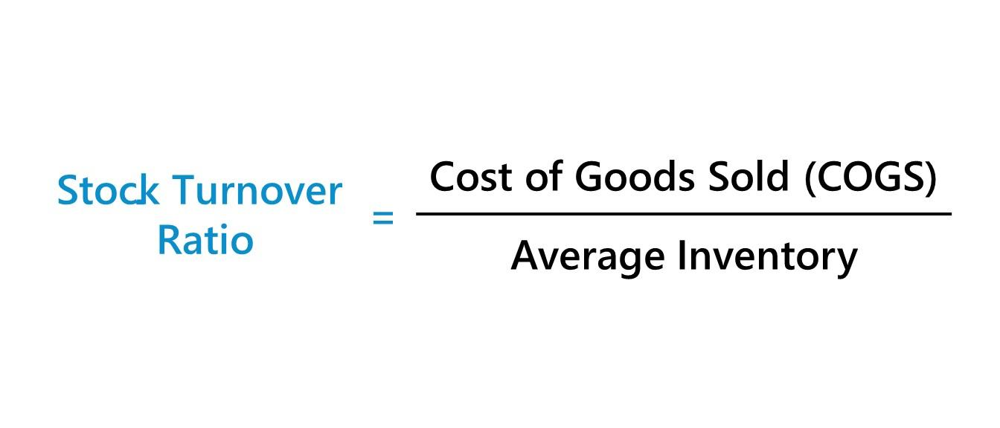

The evolution of stock trading over recent decades is a testament to the profound impact of technological advancements on financial markets. Among the key concepts shaping this landscape are share turnover, liquidity, and algorithmic trading. These components are fundamental for understanding how modern market dynamics operate, offering a framework through which investors and traders can navigate today's complex financial environments.

Share turnover serves as a pivotal metric in assessing stock liquidity, essentially measuring how frequently shares change hands in the marketplace. A higher turnover suggests that a stock is more liquid, which facilitates easier and quicker transactions for market participants. Liquidity, in this sense, represents the ease with which assets can be converted into cash without affecting their market price, thus playing a critical role in investment decisions.

Algorithmic trading further transforms the landscape by harnessing sophisticated algorithms to execute trades with remarkable speed and efficiency. This technological integration into trade execution reduces costs, enhances precision, and allows scalability in ways traditional trading cannot. Algorithms analyze extensive market data in real-time, identifying trends and opportunities invisible to human traders, thus optimizing trade execution strategies.

The interplay between these elements—share turnover, liquidity, and algorithmic trading—is essential for modern-day traders and investors aiming to make informed decisions. By leveraging these concepts, they can gain competitive advantages, enabling enhanced portfolio performance and strategic market engagement. This article offers an overview of these elements, examining how their interconnection is vital for understanding and thriving in contemporary stock trading contexts.

## Table of Contents

## Understanding Share Turnover in Stock Trading

Share turnover is a fundamental metric in stock trading that quantifies a stock's liquidity. Liquidity refers to the ease with which an asset can be bought or sold in the market without affecting its price. Share turnover measures how frequently shares are traded over a certain period, thereby providing insights into the stock's market liquidity.

A higher share turnover ratio indicates better liquidity. This means that it is easier to buy or sell shares of that stock without causing significant price changes. Stocks with high liquidity attract more investors and traders as they provide the flexibility to enter and exit positions easily. Conversely, stocks with low share turnover may pose challenges in trading due to less frequent exchange of shares, possibly resulting in higher transaction costs or larger bid-ask spreads.

The calculation of share turnover involves two essential components: the total number of shares traded during a specific period and the average number of shares outstanding during that same period. The formula for share turnover is as follows:

$$
\text{Share Turnover} = \frac{\text{Total Shares Traded}}{\text{Average Shares Outstanding}}
$$

This formula highlights the relationship between trading activity and the number of shares available in the market. It is a useful indicator for traders and investors assessing the trading [volume](/wiki/volume-trading-strategy) relative to the available supply of shares.

For instance, if a company has 1,000,000 shares outstanding on average and 500,000 of these shares are traded within a given period, the share turnover would be:

$$
\text{Share Turnover} = \frac{500,000}{1,000,000} = 0.5
$$

This implies that, on average, 50% of the company's shares were traded during the period analyzed. A high share turnover ratio, such as this example, would generally suggest robust trading activity and strong [liquidity](/wiki/liquidity-risk-premium), allowing investors to confidently buy or sell the stock without substantial price movements. 

In summary, share turnover is a critical measure for evaluating the liquidity of stocks in the market, aiding investors and traders in making informed decisions about stock purchases and sales.

## Financial Analysis and Its Role in Evaluating Share Turnover

Financial analysis is a fundamental component for evaluating a company's performance, driven by the assessment of various financial metrics and ratios. Among these, turnover ratios, including share turnover, offer a nuanced understanding of how efficiently a company utilizes its assets. Share turnover specifically measures the volume of shares traded relative to the number of shares outstanding, providing insights into the liquidity and market activity of a company's stock.

To calculate share turnover, one uses the following formula:

$$
\text{Share Turnover} = \frac{\text{Total Shares Traded}}{\text{Average Shares Outstanding}}
$$

This ratio is integral in gauging the financial health and operational efficiency of a business. Companies with high share turnover generally enjoy greater liquidity, which is beneficial for investors seeking to enter or [exit](/wiki/exit-strategy) positions without significantly affecting the stock price. Moreover, high liquidity is often a sign of strong investor interest and confidence, indicating a robust secondary market for the stock.

Turnover ratios, beyond share turnover, include inventory turnover and asset turnover, each highlighting different aspects of operational efficiency. Inventory turnover assesses how quickly a company sells and replaces its stock of goods, while asset turnover provides insights into how effectively a firm uses its assets to generate sales. Together, these ratios form a comprehensive view of a company's operational dynamics.

Incorporating turnover ratios into financial analysis enables investors and analysts to assess the operational performance of a company. It aids in identifying whether the company is utilizing its resources optimally to achieve profitability and growth. Businesses with efficient turnover ratios are often in a better position to adapt to changing market conditions and sustain long-term growth.

Hence, turnover ratios are not just metrics of efficiency but also crucial indicators of a firm's operational health and strategic effectiveness. They play a pivotal role in informing investment decisions and strategies by highlighting areas where a company excels or may need improvement. Through thorough financial analysis, investors can glean valuable insights, bolstering their ability to make informed decisions based on comprehensive market and company performance data.

## Algorithmic Trading: Integrating Technology with Financial Markets

Algorithmic trading employs sophisticated computer algorithms to execute trades swiftly and in large volumes. It leverages advanced mathematical models and centralizes the analysis of market data and trends to optimize trade execution, reduce transaction costs, and enhance precision. This technological advancement has significantly shifted trading strategies towards being more efficient and data-driven.

The algorithms used in this type of trading are designed to identify profitable opportunities in financial markets by processing vast amounts of data in real-time. They can access multiple markets and exchanges simultaneously, enabling the execution of trades at lightning speed—much faster than any human could achieve. This speed is essential in capturing favorable price movements which might only exist for a fraction of a second.

Moreover, [algorithmic trading](/wiki/algorithmic-trading) reduces market impact by strategically timing trades. Algorithms can slice and dice large orders into smaller, more manageable parts to minimize the effect on market prices. This process is known as "order fragmentation," and it helps maintain order execution at near-optimal prices.

Algorithmic trading also plays a crucial role in liquidity provision and market-making. By employing algorithms that automatically quote buy and sell prices, traders can provide liquidity to the markets, narrowing the bid-ask spread and enabling smoother and more liquid markets.

In corporate terms, the adoption of algorithmic trading has enabled hedge funds, institutional investors, and individual traders to implement systematic trading strategies, often employing techniques such as statistical [arbitrage](/wiki/arbitrage), mean reversion, and [momentum](/wiki/momentum) strategies. These strategies are based on quantitative analysis and are designed to exploit market inefficiencies.

With technological advancements, [machine learning](/wiki/machine-learning) and [artificial intelligence](/wiki/ai-artificial-intelligence) are increasingly being integrated into algorithmic trading models. These technologies allow the modeling of more complex trading scenarios and the anticipation of market behavior with higher accuracy. Although, it is essential to acknowledge the risks, such as overfitting models to historical data or creating feedback loops that could lead to abnormal market [volatility](/wiki/volatility-trading-strategies).

In summary, algorithmic trading offers remarkable advantages in trading efficiency and precision. By effectively integrating technology with financial markets, it represents a transformative shift in how trading operations are conducted, driving them towards a more efficient, systematic, and data-centric approach.

## The Interplay between Share Turnover, Financial Analysis, and Algo Trading

Share turnover, financial analysis, and algorithmic trading form a synergistic relationship that enhances the efficiency and effectiveness of trading strategies. Share turnover is a key indicator of market liquidity, reflecting how often stocks are bought and sold over a specific period. High share turnover typically signals high liquidity, facilitating smoother transactions and narrower bid-ask spreads. Consequently, liquidity insights derived from share turnover are critical for developing and refining algorithmic trading strategies. 

Algorithmic trading relies on sophisticated computer algorithms to execute trades at high speeds and volumes. These algorithms analyze substantial amounts of market data, including liquidity indicators like share turnover, to identify optimal trading opportunities. For instance, a high share turnover suggests a liquid stock, allowing algorithms to execute larger trades without significantly impacting the stock's price. This integration of share turnover insights ensures the algorithms function with greater precision and efficiency.

Financial analysis complements share turnover and algorithmic trading by providing a comprehensive evaluation of market conditions. Financial ratios and performance indicators help traders assess a company's financial health and the broader market landscape. By aligning algorithmic models with financial analysis outcomes, traders can adjust strategies to reflect current market conditions and optimize trade execution. This alignment facilitates more informed decision-making, reducing risks associated with market volatility and enhancing portfolio returns.

Overall, combining share turnover with financial analysis enables traders to tailor algorithmic strategies to prevailing market dynamics. This integration not only enhances decision-making processes but also promotes portfolio performance through more strategic and data-driven trade executions. As market environments continually evolve, the ability to adapt and integrate these elements becomes increasingly vital for traders seeking to leverage technological advancements in stock trading.

## Conclusion

The intricate interactions of share turnover, financial analysis, and algorithmic trading form the backbone of modern financial markets. Share turnover acts as a barometer for liquidity, a primary consideration for both individual and institutional investors. The ability to quickly buy or sell assets at stable prices is a fundamental requirement for efficient market participation, thus making liquidity metrics and, consequently, share turnover indispensable.

Financial analysis advances this understanding by providing a detailed evaluation of an entity's performance through the lens of various metrics and ratios. By interpreting these measures, investors can assess the financial health and operational efficiency of businesses, helping them make well-informed decisions. Turnover ratios, particularly share turnover, serve as indicators of how effectively a company manages its resources, reflecting its capability to meet market demand efficiently.

Algorithmic trading adds another layer of sophistication by leveraging technology to enhance trading speed and accuracy. The integration of algorithmic strategies enables traders to rapidly respond to market signals, optimizing trade execution while minimizing costs and human error. These algorithms rely on robust datasets, including insights gleaned from share turnover and financial analysis, to develop strategies that align with market conditions.

Together, these elements form a comprehensive toolkit essential for achieving success in stock trading. The adaptability to technological progress and the systematic analysis of market metrics are vital skills in a trader's arsenal. As markets continue to evolve, a deep understanding of these components not only aids in mitigating risks but also opens avenues for capitalizing on emerging opportunities, underscoring their enduring significance for contemporary investors and traders.

## References & Further Reading

[1]: Bergstra, J., Bardenet, R., Bengio, Y., & Kégl, B. (2011). ["Algorithms for Hyper-Parameter Optimization."](https://dl.acm.org/doi/10.5555/2986459.2986743) Advances in Neural Information Processing Systems 24.

[2]: ["Advances in Financial Machine Learning"](https://www.amazon.com/Advances-Financial-Machine-Learning-Marcos/dp/1119482089) by Marcos Lopez de Prado

[3]: ["Evidence-Based Technical Analysis: Applying the Scientific Method and Statistical Inference to Trading Signals"](https://www.amazon.com/Evidence-Based-Technical-Analysis-Scientific-Statistical/dp/0470008741) by David Aronson

[4]: ["Machine Learning for Algorithmic Trading"](https://github.com/stefan-jansen/machine-learning-for-trading) by Stefan Jansen

[5]: ["Quantitative Trading: How to Build Your Own Algorithmic Trading Business"](https://github.com/LucindaYa/quant-resources/blob/master/Quantitative%20Trading%20How%20to%20Build%20Your%20Own%20Algorithmic%20Trading%20Business.pdf) by Ernest P. Chan