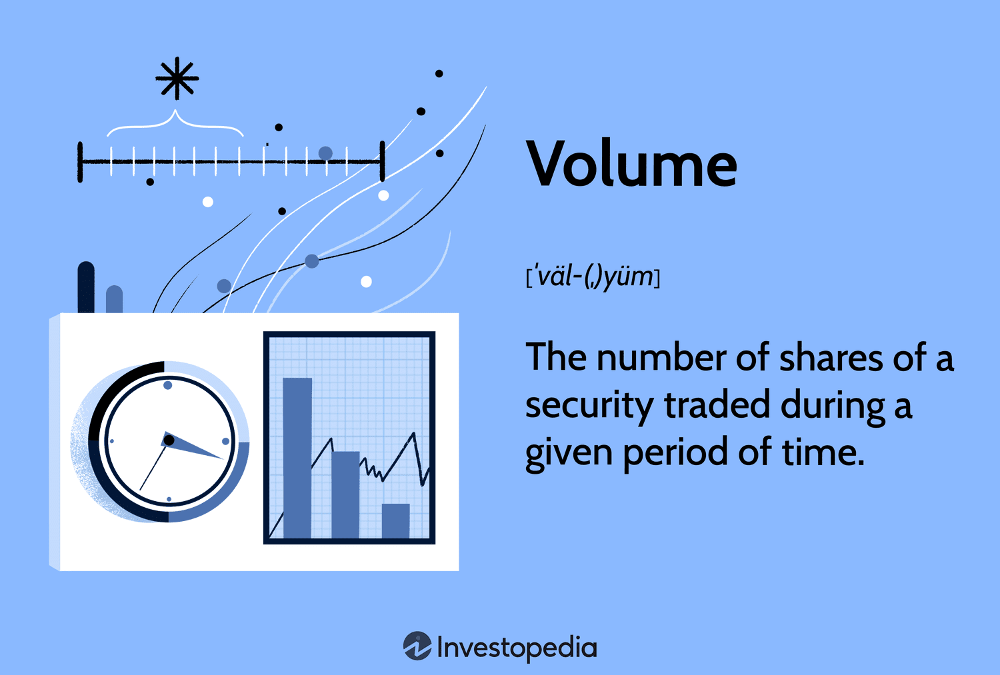

## Table of Contents

## What is share volume?

Share volume is the number of shares of a stock that are traded on a particular day. When people buy and sell stocks, each trade adds to the total volume for that day. If a lot of people are trading a stock, the volume will be high. If fewer people are trading, the volume will be low. Volume is important because it can show how interested people are in a stock.

High volume can mean that a stock is popular or that something important is happening with the company. For example, if a company announces good news, more people might want to buy the stock, which increases the volume. On the other hand, low volume might mean that fewer people are interested in the stock at that time. By looking at the volume, investors can get a better idea of what other people think about a stock and make more informed decisions.

## How is share volume measured?

Share volume is measured by counting the total number of shares that are bought and sold during a trading day. Every time someone buys or sells a stock, that transaction is added to the day's total volume. For example, if one person sells 100 shares and another person buys those 100 shares, the volume for that stock increases by 100 shares.

This information is recorded and reported by stock exchanges, like the New York Stock Exchange or Nasdaq. They keep track of all the trades that happen on their exchange and then report the total volume at the end of the day. This data is important for investors because it helps them understand how active the market is for a particular stock.

## What does stock liquidity mean?

Stock liquidity means how easily you can buy or sell a stock without affecting its price too much. If a stock is very liquid, it means there are a lot of people wanting to buy and sell it, so you can trade it quickly and easily. Think of it like a busy market where you can always find someone to trade with.

On the other hand, if a stock is not very liquid, it might be harder to find someone to buy or sell it to. This can make the price go up or down a lot when you try to trade. It's like trying to sell something in a quiet market where not many people are around. Liquidity is important because it helps investors know how easy it will be to get their money out of a stock when they want to.

## Why is liquidity important for stocks?

Liquidity is important for stocks because it makes it easier for people to buy and sell them. When a stock is very liquid, it means there are lots of people interested in trading it. This means you can quickly turn your stock into cash if you need to, without having to wait a long time to find someone to buy it. It's like having a popular item that many people want to buy, so you can sell it easily whenever you want.

If a stock is not very liquid, it can be harder to sell it when you want to. You might have to wait longer to find a buyer, or you might have to lower the price to make it more attractive. This can be a problem if you need your money quickly or if you want to sell at a certain price. So, liquidity helps make the stock market work smoothly and helps investors feel more confident about their investments.

## How does share volume affect stock liquidity?

Share volume is a big part of how liquid a stock is. When a lot of shares are being traded, it means the stock is very liquid. This happens because more people are buying and selling the stock, so it's easy to find someone to trade with. If you want to sell your shares, you can do it quickly because there are lots of buyers out there.

On the other hand, if the share volume is low, it means fewer people are trading the stock. This can make the stock less liquid. When you want to sell your shares, it might take longer to find a buyer, or you might have to sell them for a lower price. So, share volume is important because it shows how easy or hard it is to trade a stock.

## What are the typical indicators of high liquidity in a stock?

High liquidity in a stock is usually shown by a high share volume. This means a lot of people are buying and selling the stock every day. When you see a big number of shares traded, it's a sign that the stock is easy to buy or sell. This is good because it means you can get in and out of the stock quickly without waiting for a buyer or seller.

Another sign of high liquidity is a small difference between the price someone is willing to buy the stock for (the bid) and the price someone is willing to sell it for (the ask). When this difference, called the bid-ask spread, is small, it means the stock is very liquid. It's easier to trade because you won't lose much money just to make the trade happen. So, if you see a stock with a high volume and a small bid-ask spread, it's likely to be very liquid.

## Can you explain the relationship between trading volume and price volatility?

Trading volume and price volatility are closely connected. When the trading volume is high, it means a lot of people are buying and selling the stock. This can make the price move around more because there are so many trades happening. Think of it like a busy market where prices can change quickly because everyone is trying to buy and sell at the same time. So, high volume often leads to more price volatility.

On the other hand, when the trading volume is low, the price might not change as much. With fewer people trading, there's less activity to push the price up or down. It's like a quiet market where things stay pretty steady because not many people are buying or selling. So, low volume usually means less price volatility. But sometimes, if a big trade happens in a low volume stock, it can still cause the price to jump a lot.

## How do market makers influence stock liquidity?

Market makers help make stocks more liquid. They do this by always being ready to buy or sell a stock. When you want to trade a stock, market makers are there to make sure you can do it quickly. They keep the market moving by offering to buy your shares if you want to sell, or sell you shares if you want to buy. This makes it easier for everyone to trade because there's always someone ready to take the other side of the deal.

Sometimes, market makers can also help keep the price from moving around too much. They do this by setting a price they're willing to buy at (the bid) and a price they're willing to sell at (the ask). The difference between these prices is called the bid-ask spread. When market makers keep this spread small, it makes the stock more liquid because it's cheaper and easier to trade. So, market makers are important for keeping the stock market smooth and liquid.

## What role do electronic trading platforms play in enhancing stock liquidity?

Electronic trading platforms make it easier for people to buy and sell stocks, which helps increase stock liquidity. These platforms let people trade from anywhere, anytime, without needing to go to a physical stock exchange. This means more people can trade, which leads to more buying and selling. When more people are trading, it's easier to find someone to buy or sell your shares to, making the stock more liquid.

These platforms also make trading faster and cheaper. They use computers to match buyers and sellers quickly, so trades happen almost instantly. This speed and efficiency encourage more people to trade, which increases the volume of shares traded. When the volume is high, it's easier to trade without affecting the price too much, which is another way electronic trading platforms help improve stock liquidity.

## How can investors use volume data to make informed trading decisions?

Investors can use volume data to understand how interested people are in a stock. If a stock has high volume, it means a lot of people are buying and selling it. This can be a sign that something important is happening with the company, like good news or a big event. When investors see high volume, they might think the stock is popular and decide to buy it too. On the other hand, if the volume is low, it might mean fewer people are interested in the stock. This could make investors think twice before buying, as it might be harder to sell the stock later.

Volume data can also help investors spot trends and make better decisions. For example, if the volume goes up when the stock price is going up, it might mean the price will keep going up because more people are buying. This can be a good time to buy the stock. But if the volume goes up when the price is going down, it might mean the price will keep falling because more people are selling. This could be a sign to sell the stock or wait for a better time to buy. By looking at volume data, investors can get a better idea of what other people are doing and make smarter choices about when to buy or sell.

## What are some advanced metrics used to assess stock liquidity beyond simple volume?

Besides just looking at how many shares are traded each day, there are other ways to figure out how easy it is to buy or sell a stock. One way is by checking the bid-ask spread. This is the difference between the highest price someone is willing to pay for the stock and the lowest price someone is willing to sell it for. When this difference is small, it means the stock is very liquid because you can buy or sell it without losing much money on the trade. Another way is to look at the turnover ratio, which is the total volume of shares traded divided by the total number of shares available. A high turnover ratio means the stock is being traded a lot, which is a good sign of liquidity.

Another important metric is the market depth, which shows how many shares are available at different price levels. If there are a lot of shares ready to be bought or sold at prices close to the current price, the stock is more liquid. This means you can trade a large number of shares without moving the price too much. Lastly, the average daily trading value can also tell you about liquidity. This is the average dollar amount of shares traded each day. A high average daily trading value means the stock is very liquid because a lot of money is changing hands, making it easier to buy or sell the stock quickly.

## How do regulatory changes impact share volume and stock liquidity?

Regulatory changes can affect how many shares of a stock are traded and how easy it is to buy or sell them. When rules change, it can make people more or less interested in trading. For example, if new rules make trading cheaper or easier, more people might want to buy and sell stocks. This can lead to higher share volume and better liquidity because there are more trades happening. On the other hand, if new rules make trading harder or more expensive, fewer people might want to trade, which can lower the volume and make stocks less liquid.

Sometimes, regulations can also change how market makers and electronic trading platforms work. If new rules help these groups do their jobs better, it can make the stock market more liquid. Market makers help keep the market moving by always being ready to buy or sell stocks, and electronic platforms make trading fast and easy. If regulations support these groups, it can lead to more trading and better liquidity. But if regulations make it harder for them to operate, it might reduce trading activity and hurt liquidity.

## References & Further Reading

[1]: Madura, J. (2020). *Financial Markets and Institutions*. Cengage Learning.

[2]: Harris, L. (2003). *Trading and Exchanges: Market Microstructure for Practitioners*. Oxford University Press.

[3]: Hasbrouck, J. (2007). *Empirical Market Microstructure: The Institutions, Economics, and Econometrics of Securities Trading*. Oxford University Press.

[4]: Aldridge, I. (2013). *High-Frequency Trading: A Practical Guide to Algorithmic Strategies and Trading Systems*. Wiley.

[5]: Treleaven, P., Galas, M., & Vidale, M. (2013). ["Algorithmic trading review."](https://dl.acm.org/doi/10.1145/2500117) *Communications of the ACM, 56*(11), 76-85.

[6]: Easley, D., López de Prado, M. M., & O'Hara, M. (2012). ["The Volume Clock: Insights into the High Frequency Paradigm."](https://papers.ssrn.com/sol3/papers.cfm?abstract_id=2034858) The Journal of Portfolio Management, 39(1), 19-29.

[7]: Saacke, P. (2002). *Order Flow in Securities Markets: What It is, and What It Isn't*. BAM Research Paper.