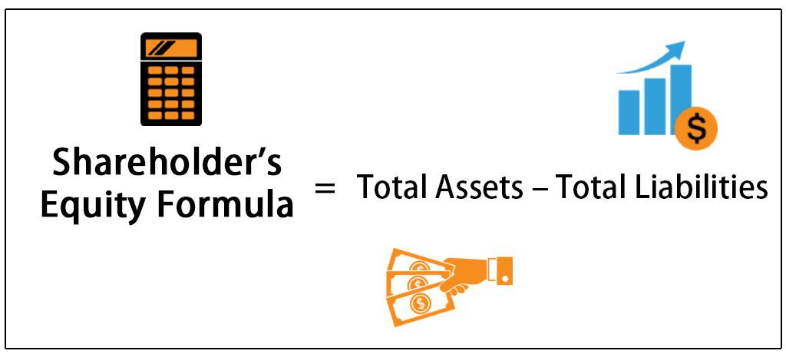

The integration of financial metrics into trading strategies has significantly transformed investment practices. As the financial markets grow increasingly complex, these metrics offer critical insights, allowing investors and analysts to make more informed decisions. Among these metrics, equity calculation stands as a foundational element for understanding a company's financial health. It provides a clear picture of what a company owns minus what it owes, ultimately presenting the net worth that belongs to shareholders. By subtracting total liabilities from total assets, shareholder equity offers a snapshot of a company's stability and operational efficiency.

Shareholder equity serves as a pivotal indicator for investors and analysts, providing a comprehensive view of the company’s financial standing. Positive shareholder equity signifies a strong financial position and the potential for future growth, whereas negative equity may be a warning sign of financial distress or insolvency. The components of shareholder equity—such as share capital, retained earnings, and treasury stock—are fundamental for calculating critical financial ratios, like the Debt-to-Equity Ratio (D/E) and Return on Equity (ROE).



Simultaneously, algorithmic trading has emerged as a revolutionary approach to leveraging financial data, offering a modern method for gaining a competitive advantage in the financial markets. It utilizes predefined criteria and financial metrics to automate trading decisions, maximizing the speed and efficiency of trade execution. By incorporating financial metrics like ROE and D/E into these algorithms, traders can enhance predictive accuracy, optimize portfolio management, and effectively manage risks.

This article examines the intersection of equity calculation, financial metrics, and algorithmic trading, exploring how these elements collectively contribute to advanced investment strategies and improved market outcomes. The integration of traditional financial analysis with contemporary algorithmic methods offers comprehensive insights, ultimately leading to superior financial performance and more strategic trading decisions.

## Table of Contents

## Understanding Shareholder Equity

Shareholder equity reflects the net worth of a company, serving as a fundamental measure of its financial stability. It is calculated by subtracting total liabilities from total assets. The formula for determining shareholder equity is as follows:

$$
\text{Shareholder Equity} = \text{Total Assets} - \text{Total Liabilities}
$$

This financial metric provides insights into a company's financial health, indicating its ability to meet debt obligations and manage its assets effectively. Positive shareholder equity suggests a sound financial position, indicating that a company possesses more assets than liabilities. Conversely, negative shareholder equity can be a warning sign of potential insolvency, highlighting an inverse situation where liabilities surpass assets.

The composition of shareholder equity includes several key elements:

- **Share Capital**: This refers to the money a company raises by issuing common or preferred stock. It represents initial capital provided by shareholders through their purchase of stock.

- **Retained Earnings**: These are the cumulative profits that a company retains after dividends are paid to shareholders. Retained earnings are reinvested in the business for growth or used to pay down debt.

- **Treasury Stock**: This is stock that the company has repurchased from shareholders, reducing the amount of outstanding stock in the market.

Shareholder equity informs several critical financial ratios, notably the Debt-to-Equity Ratio (D/E) and Return on Equity (ROE). The D/E ratio is a measure of a company's financial leverage calculated by dividing its total liabilities by shareholder equity. A lower D/E ratio generally indicates lower financial risk. 

$$
\text{D/E Ratio} = \frac{\text{Total Liabilities}}{\text{Shareholder Equity}}
$$

Return on Equity (ROE) assesses a company's ability to generate profits from its shareholders' investments, calculated by dividing net income by shareholder equity.

$$
\text{ROE} = \frac{\text{Net Income}}{\text{Shareholder Equity}}
$$

These ratios provide investors and analysts with insights into a company's financial efficiency and risk level, informing decisions about investment viability. The relationship between shareholder equity and these financial metrics underscores its significance in evaluating corporate health and performance.

## Equity Calculation Techniques

Equity Calculation Techniques involve determining a company’s shareholder equity by using a fundamental formula: 

$$
\text{Shareholder Equity} = \text{Total Assets} - \text{Total Liabilities}
$$

Categorizing assets and liabilities into current and non-current categories is a critical step for accurate calculation. Current assets include cash, accounts receivable, and inventory, which are expected to be converted into cash within a year. Non-current assets, such as property, plant, equipment, and intangible assets, provide long-term value. Similarly, liabilities are categorized into current liabilities, such as accounts payable and short-term debt, and non-current liabilities, including long-term debt and pension obligations.

Advanced techniques in equity calculation involve adjustments for intangible assets, contingent liabilities, and off-balance-sheet items. Intangible assets like patents, trademarks, and goodwill are essential for many companies and can significantly impact equity calculations. For an accurate equity assessment, estimations of their value are adjusted periodically. Contingent liabilities, potential obligations depending on future events, must also be considered. They require judgment to evaluate their probability and impact accurately.

Off-balance-sheet items include financial activities not directly reported in the balance sheet, like certain lease obligations or derivative instruments. Although not recorded as liabilities, they can influence a company’s financial health and need to be adjusted in calculating shareholder equity.

Recognizing and adjusting these advanced elements is crucial for providing a comprehensive view of a company’s financial position. This understanding aids in assessing operational efficiency and potential for investment. An investor or analyst who accounts for all these factors can obtain a clearer picture of a company’s stability and potential growth, thereby supporting more informed investment decisions. 

For those interested in automating this calculation, tools in Python can be utilized. Here is a simplified example:

```python
def calculate_shareholder_equity(total_assets, total_liabilities):
    return total_assets - total_liabilities

# Example with basic inputs
total_assets = 1000000  # Total assets in currency units
total_liabilities = 600000  # Total liabilities in currency units

shareholder_equity = calculate_shareholder_equity(total_assets, total_liabilities)
print(f"Shareholder Equity: {shareholder_equity}")
```

This code demonstrates the fundamental approach, but integrating more advanced calculations would require additional data inputs and adjustments within the algorithm to cater to intangible assets and other factors mentioned.

## The Role of Financial Metrics in Algorithmic Trading

Algorithmic trading has transformed financial markets by using technological innovations to automate trading decisions based on pre-determined rules and financial metrics. These metrics, including Return on Equity (ROE) and Debt-to-Equity Ratio (D/E), are crucial for assessing a company's profitability and risk profile, known to provide investors with better insights into market opportunities.

ROE, which is calculated by dividing net income by shareholder equity, offers insight into how effectively a company uses equity financing to generate profit. A higher ROE indicates efficient use of equity capital, signaling potential for robust investment returns. Formulaically, it is expressed as:

$$
\text{ROE} = \frac{\text{Net Income}}{\text{Shareholder Equity}}
$$

On the other hand, the D/E ratio provides insight into a company’s debt levels relative to its equity, indicating the financial leverage being employed. It is calculated as:

$$
\text{D/E} = \frac{\text{Total Liabilities}}{\text{Total Shareholder Equity}}
$$

A higher D/E ratio suggests a higher degree of financial risk, as the company is more reliant on borrowed money.

In [algorithmic trading](/wiki/algorithmic-trading) systems, these metrics and others are utilized not just for analysis, but for real-time decision-making and execution. By incorporating such metrics, algorithmic systems are capable of parsing through vast datasets efficiently and identifying trends, patterns, or anomalies that might indicate profitable trading opportunities. This capability is augmented by leveraging historical data for trend prediction and fine-tuning model strategies through [backtesting](/wiki/backtesting).

For instance, algorithms might be programmed to automatically execute trades when certain thresholds for ROE or D/E ratios are crossed, thus establishing filters to discern stocks worthy of attention. The synthesis of these financial metrics enables more precise predictions of stock movements, aiding in optimal trading execution.

Moreover, integrating these metrics effectively helps in managing trading risks. Algorithms can be designed to adjust positions under different risk measures, mitigating potential losses. This incorporation not only enables accurate predictive models but also helps in achieving balanced risk-reward outcomes, crucial for sustained trading profitability.

Algorithmic systems, through these metrics, thus empower traders to harness market data dynamically, leading to informed and rapid trading actions aligned with financial objectives.

## Practical Examples

### Practical Examples

The application of equity and financial metrics in trading strategies can be illustrated through both hypothetical and real-world examples, offering insights into their effective deployment in modern financial analysis and algorithmic trading.

#### Backtesting Trading Strategies

Backtesting is a pivotal process in developing robust trading models. By applying historical data, traders can evaluate the performance of their strategies before actual deployment. Shareholder equity plays a significant role in this evaluation, as it allows investors to assess a company's financial health retrospectively. Suppose a trading algorithm has been developed with a focus on companies with strong Return on Equity (ROE) and a favorable Debt-to-Equity (D/E) ratio. The backtesting phase would involve simulating trades based on historical equity data, comparing the outcomes against benchmark indexes or other investment strategies to validate the model's efficacy.

```python
import pandas as pd
import yfinance as yf  # For more datasets, visit: https://paperswithbacktest.com/datasets
from backtesting import Backtest, Strategy
from backtesting.lib import crossover

data = yf.download('AAPL', start='2015-01-01', end='2020-01-01')

# Example strategy using moving averages
class SmaCross(Strategy):
    def init(self):
        self.sma1 = self.I(pd.Series.rolling, self.data.Close, 10).mean()
        self.sma2 = self.I(pd.Series.rolling, self.data.Close, 20).mean()

    def next(self):
        if crossover(self.sma1, self.sma2):
            self.buy()
        elif crossover(self.sma2, self.sma1):
            self.sell()

bt = Backtest(data, SmaCross, cash=10000, commission=.002)
output = bt.run()
print(output.summary())
```

#### Incorporating Financial Metrics

Algorithmic frameworks often integrate specific financial metrics to refine trading decisions. For instance, a strategy targeting firms with high ROE and low D/E ratios can automate selections of investment-grade securities. These metrics guide the algorithm in distinguishing between potentially profitable investments and risk-laden alternatives.

#### Case Studies in High-Frequency Trading

Real-world case studies illustrate the advantages firms derive by using equity metrics within high-frequency trading ([HFT](/wiki/high-frequency-trading-strategies)). By incorporating real-time financial data, companies like Renaissance Technologies have successfully harnessed these metrics to perform microsecond trades with enhanced precision. These firms leverage complex algorithms that assess a range of financial indicators, enabling them to capture fleeting market inefficiencies.

Overall, these examples underscore the essential role financial metrics like equity play in developing, testing, and executing trading strategies. They highlight the importance of accurately interpreting shareholder equity and related indicators to achieve competitive advantages in increasingly algorithm-driven markets.

## Conclusion

Equity calculation and financial metrics play critical roles in enhancing investment decision-making and advancing algorithmic trading strategies. Understanding and effectively applying metrics such as Return on Equity (ROE) and the Debt-to-Equity ratio (D/E) are vital for improving the precision of investment assessments and enhancing risk management capabilities. These metrics provide valuable insights into a company’s profitability and financial stability, enabling investors and analysts to make more informed decisions.

The integration of traditional financial analysis with modern algorithmic approaches broadens the scope of market insights. By incorporating financial metrics into algorithmic trading systems, traders can automate complex decision-making processes, thereby improving the efficiency of trading strategies. The use of algorithms allows for rapid data analysis and trend prediction, optimizing trade execution in dynamic market conditions.

This synergy between conventional financial metrics and algorithmic strategies ultimately leads to better financial outcomes and well-informed trading strategies. With the ability to assess both qualitative and quantitative financial data, investors and traders can achieve a more comprehensive understanding of market dynamics, enhancing their ability to generate returns and manage risks effectively.

## References & Further Reading

Explore sources like Investopedia for detailed guides on shareholder equity and related financial metrics. Investopedia provides comprehensive resources on the calculation methods, significance, and impact of shareholder equity, explaining complex concepts in an accessible manner. This is crucial for those new to financial metrics or looking to solidify their understanding of fundamental accounting principles.

The Algorithmic Trading Library offers valuable insights into the use of equity data in trading strategies. It includes resources and tools designed to facilitate the integration of financial metrics into algorithmic models. By leveraging various libraries, traders can automate the process of analyzing shareholder equity and other financial metrics to optimize strategy development and execution.

Publications like "Advances in Financial Machine Learning" by Marcos López de Prado provide advanced perspectives on integrating financial data with trading models. This book investigates into the application of [machine learning](/wiki/machine-learning) techniques to enhance the analysis of financial metrics. It covers topics such as feature selection, backtesting, and the deployment of algorithms in trading environments, giving readers a robust framework for implementing machine learning strategies in finance.

Overall, these references collectively serve as a strong foundation for both novice and experienced traders interested in enhancing their understanding and execution of trading strategies through the application of financial metrics and algorithmic techniques.

