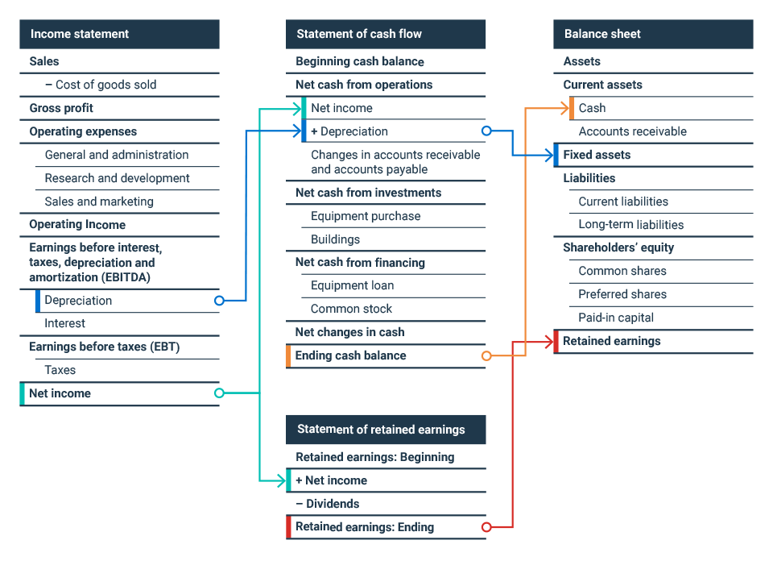

## Table of Contents

## What is shareholder equity?

Shareholder equity is the amount of money that would be left over for the owners of a company if all its assets were sold and all its debts were paid off. It's like figuring out what the shareholders, or owners, really own after everything is settled. You can find shareholder equity by taking the total assets of a company and subtracting its total liabilities. This number is important because it shows the net worth of the company from the shareholders' perspective.

Think of it this way: if a company had to close down and sell everything it owns, shareholder equity is what the shareholders would get after paying off all the company's bills. It's a key measure of a company's financial health and is often used by investors to see how much the company is really worth. A positive shareholder equity means the company has more assets than liabilities, which is a good sign. A negative shareholder equity, on the other hand, means the company owes more than it owns, which can be a warning sign for investors.

## What are net tangible assets?

Net tangible assets are the total value of a company's physical and financial assets minus its liabilities and intangible assets. Physical assets include things like buildings, machinery, and inventory. Financial assets could be cash or investments. Intangible assets are things you can't touch, like patents, trademarks, and goodwill. When you subtract the value of these intangibles and the company's debts from its total assets, you get the net tangible assets.

This number is important because it gives a clearer picture of what the company is really worth in terms of hard, sellable assets. Investors often look at net tangible assets to see if a company has enough value in its physical and financial assets to cover its debts. If the net tangible assets are positive, it means the company has more tangible value than it owes, which is a good sign. If it's negative, it might mean the company is relying heavily on intangible assets or has too much debt.

## How is shareholder equity calculated?

Shareholder equity is calculated by taking the total assets of a company and subtracting its total liabilities. It's a way to figure out what the owners or shareholders would be left with if the company sold everything and paid off all its debts. Total assets include everything the company owns, like cash, buildings, and inventory. Total liabilities are all the debts the company owes, like loans and bills.

This calculation gives you the net worth of the company from the shareholders' point of view. If the shareholder equity is positive, it means the company has more assets than liabilities, which is a good sign. If it's negative, it means the company owes more than it owns, which can be a warning sign for investors. It's an important number because it shows how much the company is really worth to its owners after all the bills are paid.

## How are net tangible assets calculated?

Net tangible assets are found by taking all of a company's assets and subtracting its liabilities and intangible assets. Assets are things the company owns, like cash, buildings, and inventory. Liabilities are the debts the company owes, like loans and bills. Intangible assets are things you can't touch, like patents, trademarks, and goodwill.

This calculation helps show what the company is worth in terms of hard, sellable stuff. If the net tangible assets are positive, it means the company has more value in things you can touch and sell than it owes in debts. This is a good sign for investors. If the number is negative, it might mean the company relies a lot on things you can't touch or has too much debt, which can be a warning sign.

## What are the main components of shareholder equity?

Shareholder equity is made up of a few key parts. The first part is the money that shareholders put into the company when they buy shares. This is called paid-in capital. It's the money that comes from selling stock to investors. The other big part is the company's earnings that haven't been paid out as dividends. These are called retained earnings. It's the profit the company keeps to grow or save for the future.

There's also another part called treasury stock, but it works a bit differently. Treasury stock is when the company buys back its own shares. This reduces the total shareholder equity because it's like taking money out of the company. So, shareholder equity is really about the money shareholders have put in, the profits the company has kept, and any shares the company has bought back.

## What types of assets are included in net tangible assets?

Net tangible assets include all the things a company owns that you can touch and sell. This means things like buildings, machines, cars, and inventory. It also includes money the company has in the bank and any investments it owns, like stocks or bonds. These are all considered tangible because they have a physical form or can be easily turned into cash.

Intangible assets, like patents, trademarks, and goodwill, are not included in net tangible assets. These are things you can't touch and are harder to sell or turn into cash. When figuring out net tangible assets, you take all the tangible assets and subtract any debts the company owes. This gives you a clear picture of what the company is really worth in terms of hard, sellable stuff.

## Why is it important to understand the difference between shareholder equity and net tangible assets?

Understanding the difference between shareholder equity and net tangible assets is key for anyone looking at a company's financial health. Shareholder equity tells you what the owners would get if the company sold everything and paid off all its debts. It's like figuring out the net worth of the company from the owners' point of view. This number includes everything the company owns, even things you can't touch like patents and goodwill. It's important because it shows how much the company is worth to its shareholders after all the bills are paid.

On the other hand, net tangible assets focus only on the stuff you can touch and sell, like buildings, machines, and cash. This number helps investors see the hard value of the company, without counting things like patents or trademarks. Knowing this difference helps investors and owners understand if the company's value comes from physical stuff or from less tangible things. This can be a big deal when deciding if a company is a good investment or not.

## How do shareholder equity and net tangible assets affect a company's financial health?

Shareholder equity is like figuring out what the owners would get if the company sold everything and paid off all its debts. It's a key number that shows the company's net worth from the owners' point of view. If shareholder equity is positive, it means the company has more assets than liabilities, which is a good sign for the company's financial health. A positive number means the company is worth more than what it owes. But if it's negative, it's a warning sign because it means the company owes more than it owns, which can be a problem for the company's financial health.

Net tangible assets focus on the hard, sellable stuff the company owns, like buildings, machines, and cash. This number helps investors see the real, physical value of the company, without counting things like patents or trademarks. If net tangible assets are positive, it's a good sign because it means the company has more value in things you can touch and sell than it owes in debts. But if it's negative, it might mean the company relies a lot on things you can't touch or has too much debt, which can be a warning sign for its financial health. Understanding both numbers helps give a full picture of how healthy the company's finances really are.

## Can shareholder equity be negative, and what does it signify?

Yes, shareholder equity can be negative. This happens when a company's total liabilities are more than its total assets. Imagine if a company sold everything it owns and still couldn't pay off all its debts. That's what negative shareholder equity means. It's like the company owes more money than it has, which is not a good sign.

When shareholder equity is negative, it can be a big warning sign for investors. It means the company is in a tough spot financially. If things don't improve, the company might have to borrow more money or even go out of business. Investors need to be careful because a negative shareholder equity shows the company is struggling to stay afloat.

## How do intangible assets impact the difference between shareholder equity and net tangible assets?

Intangible assets, like patents, trademarks, and goodwill, are things you can't touch. They're part of shareholder equity but not part of net tangible assets. When you figure out shareholder equity, you include everything the company owns, even these intangible things. This means shareholder equity gives a bigger picture of the company's worth, including stuff that might be hard to sell but still has value.

On the other hand, net tangible assets only count the stuff you can touch and sell, like buildings and machines. So, when you subtract intangible assets from the total assets to find net tangible assets, you get a smaller number. This number shows what the company is really worth in hard, sellable stuff. Knowing this difference helps investors see if the company's value comes more from physical things or from things you can't touch.

## What are some common financial ratios that use shareholder equity and net tangible assets?

Financial ratios help investors understand a company's health by comparing different numbers. One common ratio that uses shareholder equity is the return on equity (ROE). This ratio shows how well a company is using the money its shareholders have put in to make a profit. You find ROE by taking the company's net income and dividing it by its shareholder equity. A high ROE means the company is doing a good job making money for its owners.

Another ratio that uses net tangible assets is the price to tangible book value ratio. This ratio helps investors see if a company's stock price is a good deal compared to its hard, sellable assets. You find it by taking the stock price and dividing it by the net tangible assets per share. If the ratio is low, it might mean the stock is a good buy because the company has a lot of value in things you can touch and sell. Both ratios give different insights into a company's financial health and help investors make smarter choices.

## How do changes in accounting standards affect the reporting of shareholder equity and net tangible assets?

Changes in accounting standards can mess with how companies report their shareholder equity and net tangible assets. When the rules change, companies might have to value their assets and liabilities differently. For example, if a new rule says you have to count some intangible assets in a different way, it can make the shareholder equity number go up or down. This is because shareholder equity includes everything the company owns, even things you can't touch like patents and trademarks. So, if the rules for counting these things change, it can change the whole picture of what the company is worth to its owners.

Net tangible assets can also be affected by changes in accounting standards, but in a different way. Since net tangible assets only count the stuff you can touch and sell, like buildings and machines, changes in how you count these things can change the number. For example, if a new rule says you have to value your buildings differently, it can make the net tangible assets go up or down. This can be important for investors who want to know how much hard, sellable stuff the company has. So, keeping up with changes in accounting standards is important to understand how a company's financial health might be reported differently.

## What are Net Tangible Assets and How Can We Understand Them?

Net tangible assets (NTA) are a pivotal metric in assessing a company's true physical worth, calculated by subtracting both liabilities and intangible assets from a company’s total assets. The formula for calculating NTA is:

$$

\text{NTA} = \text{Total Assets} - \text{Liabilities} - \text{Intangible Assets} 
$$

### Components of Tangible and Intangible Assets

**Tangible Assets**: These are physical, measurable assets that a company owns. Common tangible assets include property, plant, equipment (PPE), inventory, and cash. For example, machinery, buildings, and office supplies all form part of a company's tangible asset base. Tangible assets are essential because they represent real resources that can generate revenue and are directly linked to operations.

**Intangible Assets**: Intangible assets lack physical substance but have value due to their use in business operations. These include goodwill, patents, trademarks, and copyrights. While intangible assets such as brand reputation and intellectual property are pivotal, they are often perceived as less reliable in value than tangible assets due to their less concrete nature.

### Significance

Understanding both tangible and intangible assets is crucial because it highlights what portion of a company's assets can be liquidated in times of financial distress. Tangible assets often offer more transparency and assurance to investors and creditors, as they can usually be appraised and sold if necessary. In contrast, intangible assets often have subjective valuations, which can fluctuate considerably.

### Contribution to Company Value

Net tangible assets provide a clear snapshot of a company’s underlying real value, emphasizing the importance of an organization's physical assets over its intangible elements. This metric is particularly valuable in scenarios where liquidation might occur, as it reveals what tangible value remains that can serve creditors and investors. By focusing on tangible assets, NTAs offer a conservative measure of a company's operational base, often used in financial assessments to gauge investment risk and valuation.

In essence, the calculation and understanding of net tangible assets equip stakeholders with an objective lens to evaluate a company’s financial solidity, ensuring decisions are grounded in the tangible resources at a company's disposal.

## What is Shareholder Equity: A Closer Look?

Shareholder equity, also known as stockholders' equity, represents the ownership interest held by shareholders in a corporation. It is calculated as the difference between the company's total assets and its total liabilities. The formula for shareholder equity can be expressed as:

$$
\text{Shareholder Equity} = \text{Total Assets} - \text{Total Liabilities}
$$

This metric is vital on a company's balance sheet as it reflects the net value available to shareholders if all assets were liquidated and all debts were paid. It provides insights into the financial health and stability of a business, serving as a barometer for investors to gauge long-term viability and profitability.

A critical component of shareholder equity is **retained earnings**, which are the cumulative net profits that a company has reinvested in the business rather than distributed as dividends to shareholders. Retained earnings demonstrate a company's capacity to generate surplus income and drive growth over time. They are calculated as:

$$
\text{Retained Earnings} = \text{Beginning Retained Earnings} + \text{Net Income} - \text{Dividends Paid}
$$

Another fundamental component is **common stock**, representing the equity ownership in a company. It is issued when a corporation sells shares to the public, generally on a stock exchange. The funds raised from issuing stock directly affect shareholder equity by increasing the capital available to the business. The effects of common stock on shareholder equity proceedings are typically summarized as:

$$
\text{Common Stock} = \text{Par Value of Shares} \times \text{Number of Shares Issued}
$$

The interplay of retained earnings and common stock with other components such as additional paid-in capital, treasury stock, and other comprehensive income completes the snapshot of a company’s fiscal position. Evaluating shareholder equity allows investors and analysts to comprehend how effectively a company utilizes its capital resources to generate growth and maintain operational efficiency.

By analyzing shareholder equity, stakeholders can assess financial strategies, identify trends over time, and inform investment decisions. A positive shareholder equity indicates a valuable company with more assets than liabilities, while negative shareholder equity suggests financial distress, where liabilities exceed assets. Understanding and monitoring these figures is crucial for investors seeking to ensure robustness and maximize returns from their investments.

## What are the differences between Net Tangible Assets and Shareholder Equity?

Net tangible assets (NTA) and shareholder equity are essential metrics for evaluating a company's financial health, each offering unique perspectives on its value. Despite both measuring aspects of a company's net worth, they have fundamental differences in their scope and application.

Net tangible assets focus exclusively on physical assets, subtracting both liabilities and intangible assets such as patents, trademarks, and goodwill. This calculation provides a clear view of the physical and, therefore, more liquid and measurable assets a company holds. The formula for net tangible assets is:

$$
\text{Net Tangible Assets (NTA)} = \text{Total Physical Assets} - \text{Liabilities} - \text{Intangible Assets}
$$

By excluding intangible elements, NTA gives investors insight into the baseline asset value that would remain if a company had to liquidate its physical assets to meet its obligations. This metric is particularly valuable for companies with substantial fixed assets, providing a grounded analysis of their worth, devoid of speculative factors.

In contrast, shareholder equity offers a broader picture, encompassing all asset types, tangible and intangible, minus liabilities. It represents the residual claim of shareholders if all debts were paid off. Shareholder equity comprises components like retained earnings, common stock, and additional paid-in capital. Its calculation is as follows:

$$
\text{Shareholder Equity} = \text{Total Assets} - \text{Total Liabilities}
$$

By including all asset types, shareholder equity reflects a more comprehensive understanding of a company's overall financial position. This metric accounts for the company's ability to generate future income through its intangible resources, presenting a holistic view of potential and existing value to investors.

A comparative analysis of NTA and shareholder equity highlights their distinct insights into a company's value. For instance, a company with significant intangible assets might show a lower NTA but a higher shareholder equity, indicating a strong market position driven by brand value or intellectual property. Conversely, a company with substantial physical holdings and minimal intangible values may exhibit high NTA, suggesting solid backing despite potentially lower shareholder equity if liabilities are high.

In summary, while net tangible assets provide a focused lens on a company's physical asset value, shareholder equity paints a broader picture that includes the added layer of intangible resources. Both metrics are crucial for investors, offering different insights that collectively contribute to a more nuanced assessment of a company's financial standing.

## What are some real-world applications demonstrated through case studies?

Practical examples of how financial metrics such as net tangible assets (NTA) and shareholder equity are applied can be explored through the balance sheets of notable companies like Amazon and Walmart. These metrics provide essential insights into the financial health and strategic decisions within these organizations.

### Amazon

Amazon's balance sheet reveals an intricate landscape of assets and liabilities that, when parsed, give insight into the company's financial strategies. For the fiscal year 2022, Amazon reported total assets of $410 billion and total liabilities of $277 billion. To compute Amazon's net tangible assets, we must subtract intangible assets, which include goodwill and other intellectual properties, from the total assets:

$$
\text{Net Tangible Assets (NTA)} = \text{Total Assets} - \text{Intangible Assets} - \text{Total Liabilities}
$$

Assuming intangible assets amount to approximately $40 billion, a rough calculation would produce:

$$
\text{NTA} = \$410 \, \text{billion} - \$40 \, \text{billion} - \$277 \, \text{billion} = \$93 \, \text{billion}
$$

On the other hand, shareholder equity is calculated by subtracting total liabilities from total assets, without distinguishing between tangible and intangible assets:

$$
\text{Shareholder Equity} = \text{Total Assets} - \text{Total Liabilities} = \$410 \, \text{billion} - \$277 \, \text{billion} = \$133 \, \text{billion}
$$

This data illustrates Amazon's strategy of leveraging its intangible assets while maintaining a strong equity position, an aspect that can influence investor confidence and valuation assessments.

### Walmart

Walmart, a retail behemoth, demonstrates a different financial profile. For the fiscal year 2022, its balance sheet shows total assets of $244 billion and total liabilities of $154 billion. Intangible assets are estimated at $20 billion. Utilizing these figures, Walmart's NTA can be calculated as follows:

$$
\text{NTA} = \$244 \, \text{billion} - \$20 \, \text{billion} - \$154 \, \text{billion} = \$70 \, \text{billion}
$$

Walmart's shareholder equity, derived in a similar manner to Amazon’s, would be:

$$
\text{Shareholder Equity} = \$244 \, \text{billion} - \$154 \, \text{billion} = \$90 \, \text{billion}
$$

Walmart's relatively lower intangible assets compared to Amazon suggest a financial strategy focused on physical asset accumulation and tangible value, which could appeal to conservative investors prioritizing predictability and stability.

### Influence on Investment Strategies

Both net tangible assets and shareholder equity play crucial roles in shaping investment strategies. Amazon’s significant intangible presence underlines its investment in technology and brand, appealing to growth-oriented investors. In contrast, Walmart’s solid tangible asset base provides security to risk-averse investors focusing on long-term stability.

In valuation, these metrics help assess risk profiles and potential growth. For instance, [algorithmic trading](/wiki/algorithmic-trading) systems may integrate these values to optimize trades based on predicted financial performance. As such, the accurate calculation and interpretation of NTA and shareholder equity help refine strategies, balancing growth potential against financial stability. 

Through these examples, the application of financial metrics illuminates how different economic models and asset distributions can influence investor decisions and stock value perceptions, ultimately shaping the companies' market positions.

## References & Further Reading

[1]: ["Financial Accounting: An Introduction"](https://archive.org/details/financialaccount0000weet) by Pauline Weetman

[2]: ["Principles of Corporate Finance"](https://en.wikipedia.org/wiki/Principles_of_Corporate_Finance) by Richard A. Brealey, Stewart C. Myers, and Franklin Allen

[3]: ["Security Analysis"](https://www.wallstreetmojo.com/security-analysis/) by Benjamin Graham and David Dodd

[4]: ["Algorithmic Trading and DMA: An introduction to direct access trading strategies"](https://archive.org/details/algorithmictradi0000john) by Barry Johnson

[5]: ["Understanding Financial Statements"](https://online.hbs.edu/blog/post/how-to-read-financial-statements) by Aileen Ormiston and Lyn M. Fraser