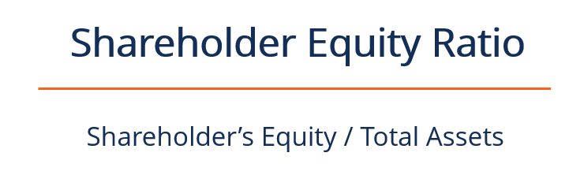

## Table of Contents

## What is shareholder equity?

Shareholder equity is the amount of money that would be left over if a company sold all its assets and paid off all its debts. It represents the net value of a company that belongs to its shareholders. Think of it as the company's total worth after settling all its financial obligations. This figure is important because it shows how much the shareholders actually own in the company.

To calculate shareholder equity, you start with the company's total assets, which include everything the company owns, like buildings, equipment, and cash. Then, you subtract the total liabilities, which are all the debts and obligations the company owes to others. The result is the shareholder equity. This number can be positive, meaning the company has more assets than liabilities, or negative, indicating more liabilities than assets. Shareholder equity is often reported on a company's balance sheet, giving investors a clear picture of the company's financial health.

## Why is the shareholder equity ratio important?

The shareholder equity ratio is important because it tells us how much of a company's assets are really owned by the people who own the company's stock, the shareholders. This ratio helps investors see if the company is financially strong. A higher ratio means the company has more of its own money to work with, which can be a good sign that it's not relying too much on borrowed money. This makes the company less risky for investors because it shows the company can handle its debts well.

Another reason the shareholder equity ratio matters is that it can show how well a company is using the money it gets from its shareholders. If the ratio is going up over time, it might mean the company is doing a good job growing its business with the money it has. On the other hand, if the ratio is going down, it could be a warning sign that the company might be struggling or taking on too much debt. This ratio helps investors make smarter choices about where to put their money by giving them a clear picture of the company's financial health.

## How do you calculate the shareholder equity ratio?

To calculate the shareholder equity ratio, you need to know two things: the total shareholder equity and the total assets of the company. Total shareholder equity is found by taking the company's total assets and subtracting its total liabilities. Total assets include everything the company owns, like buildings, equipment, and cash. Total liabilities are all the debts and obligations the company owes to others. Once you have these numbers, you can find the shareholder equity ratio by dividing the total shareholder equity by the total assets.

The formula for the shareholder equity ratio is simple: Shareholder Equity Ratio = Total Shareholder Equity / Total Assets. This ratio tells you what percentage of the company's assets are owned by the shareholders. For example, if a company has total assets of $100 million and total shareholder equity of $60 million, the shareholder equity ratio would be $60 million divided by $100 million, which equals 0.6 or 60%. This means 60% of the company's assets are owned by the shareholders, and the rest is financed by debt or other liabilities.

## What are the components of shareholder equity?

Shareholder equity is made up of several parts that together show how much the company is worth to its owners. The main part is the money that shareholders put into the company when they buy shares. This is called "contributed capital" or "paid-in capital." It includes the money from when the company first sold its shares and any extra money from new shares sold later.

Another big part of shareholder equity is the company's earnings that it keeps and doesn't pay out as dividends. This is called "retained earnings." Every year, if the company makes a profit and decides to keep some of it instead of giving it all to shareholders, that money adds to the retained earnings. Sometimes, if the company loses money, it can reduce the retained earnings.

There can also be other smaller parts of shareholder equity, like money from selling shares above their value, called "additional paid-in capital," or adjustments from changes in accounting rules, called "other comprehensive income." All these parts together make up the total shareholder equity, showing how much the company is really worth to its owners.

## Can you explain the formula for the shareholder equity ratio?

The formula for the shareholder equity ratio is easy to understand. You just take the total shareholder equity and divide it by the total assets of the company. Total shareholder equity is found by subtracting the company's total liabilities from its total assets. Total assets are everything the company owns, like buildings, equipment, and cash. Total liabilities are all the debts and obligations the company owes to others. So, when you divide the total shareholder equity by the total assets, you get the shareholder equity ratio.

This ratio tells you what percentage of the company's assets are owned by the shareholders. For example, if a company has total assets of $100 million and total shareholder equity of $60 million, the shareholder equity ratio would be $60 million divided by $100 million, which equals 0.6 or 60%. This means that 60% of the company's assets are owned by the shareholders, and the rest is financed by debt or other liabilities. It's a helpful number because it shows how financially strong the company is and how much it relies on its own money versus borrowed money.

## What does a high shareholder equity ratio indicate?

A high shareholder equity ratio means that a bigger part of the company's assets is owned by the people who hold the company's stock, the shareholders. When this ratio is high, it's a good sign that the company is not relying too much on borrowed money to run its business. This makes the company less risky for investors because it shows that the company has a strong financial base and can handle its debts well.

Seeing a high shareholder equity ratio can also tell investors that the company is using the money it gets from its shareholders wisely. If the ratio keeps going up over time, it might mean the company is doing a good job growing its business with the money it has. This can make the company more attractive to investors who are looking for a financially stable and growing business to put their money into.

## What does a low shareholder equity ratio suggest?

A low shareholder equity ratio means that a smaller part of the company's assets is owned by the shareholders. This can be a warning sign that the company is relying a lot on borrowed money to run its business. When a company has a lot of debt, it can be riskier for investors because the company might have trouble paying back what it owes. If the company can't pay its debts, it could face big problems, like going bankrupt.

Seeing a low shareholder equity ratio might also mean that the company is not using the money it gets from its shareholders very well. If the ratio keeps going down over time, it could be a sign that the company is struggling to grow or is losing money. This can make the company less attractive to investors who are looking for a stable and growing business to invest in. A low ratio can make investors worried about the company's future and might make them think twice before putting their money into it.

## How does the shareholder equity ratio differ from the debt-to-equity ratio?

The shareholder equity ratio and the debt-to-equity ratio are both ways to understand a company's financial health, but they look at it from different angles. The shareholder equity ratio tells you what part of the company's assets are owned by the shareholders. You find it by dividing the total shareholder equity by the total assets. A high shareholder equity ratio means the company relies more on its own money and less on borrowed money, which is a good sign for investors.

On the other hand, the debt-to-equity ratio focuses on how much debt the company has compared to the money from shareholders. You calculate it by dividing the company's total liabilities by its total shareholder equity. A high debt-to-equity ratio means the company is using a lot of borrowed money, which can be risky because it might struggle to pay back its debts. Both ratios help investors see if a company is financially strong, but they give different kinds of information about how the company is handling its money.

## What are common benchmarks for the shareholder equity ratio in different industries?

The shareholder equity ratio can vary a lot from one industry to another, so it's helpful to know what's normal for each one. In industries like technology or software, where companies often have a lot of cash and fewer physical assets, a high shareholder equity ratio is common. These companies might have ratios around 60% to 80%. This shows they rely more on their own money and less on borrowed money, which is a good sign for investors.

In industries like utilities or manufacturing, where companies need a lot of big, expensive equipment, the shareholder equity ratio might be lower. These companies might have ratios around 30% to 50%. This is because they often need to borrow money to buy the equipment they need to run their business. Even though the ratio is lower, it's still considered okay in these industries because everyone knows they need to use debt to grow.

## How can changes in the shareholder equity ratio affect a company's financial strategy?

Changes in the shareholder equity ratio can really change how a company plans its money moves. If the ratio goes up, it means the company is using more of its own money and less borrowed money. This can make the company feel more confident about taking on new projects or growing the business because it's not as worried about paying back big debts. The company might decide to invest more in new ideas or even buy back its own shares to make the shareholders happy. A higher ratio can also make it easier for the company to borrow money if it needs to, because lenders see it as less risky.

On the other hand, if the shareholder equity ratio goes down, it means the company is relying more on borrowed money. This can make the company more careful about its plans. It might decide to slow down on new projects or focus on paying off its debts instead of growing. The company might also look for ways to bring in more money from shareholders, like selling more shares. A lower ratio can make it harder to borrow money because lenders might see the company as riskier. So, the company needs to think carefully about how to balance its money to keep the business strong.

## What are the limitations of using the shareholder equity ratio as a financial metric?

The shareholder equity ratio can be a helpful tool, but it has some limits. One big limit is that it doesn't tell the whole story about a company's money. It only looks at how much of the company's assets are owned by shareholders, but it doesn't say anything about how well the company is making money or if it's spending too much. Also, the ratio can be different in different industries, so what's a good number for one company might not be good for another. This makes it hard to compare companies from different fields just by looking at this one number.

Another limit is that the shareholder equity ratio can be changed by things that don't really show how healthy the company is. For example, if a company sells a lot of new shares, its shareholder equity will go up, but that doesn't mean the company is doing better. It just means it got more money from shareholders. Also, the way a company values its assets and liabilities can affect the ratio. If a company uses different ways to figure out what its stuff is worth, the ratio can look different even if nothing else has changed. So, while the shareholder equity ratio is useful, it's important to look at other numbers too to get a full picture of a company's money situation.

## How can advanced statistical methods be applied to analyze trends in the shareholder equity ratio over time?

Advanced statistical methods can help us understand how the shareholder equity ratio changes over time by looking at patterns and making predictions. One way to do this is by using time series analysis. This method lets us see if the ratio is going up or down and if there are any regular patterns, like going up every year or going down every few years. We can also use something called regression analysis to see if other things, like how much the company is making or how much it's spending, affect the shareholder equity ratio. By looking at these other things, we can tell if changes in the ratio are because of the company's money moves or something else.

Another useful method is something called moving averages. This helps smooth out the ups and downs in the shareholder equity ratio so we can see the bigger picture more clearly. For example, if we use a 12-month moving average, we can see if the ratio is getting better or worse over the whole year instead of just looking at one month. We can also use something called [volatility](/wiki/volatility-trading-strategies) analysis to see how much the ratio jumps around. If the ratio is very jumpy, it might mean the company's money situation is not very stable. By using these advanced methods, we can get a better idea of what's really going on with the shareholder equity ratio and make smarter guesses about where it might go next.

## What is Understanding Shareholder Equity?

Shareholder equity, also referred to as stockholders' equity, represents the net assets attributable to shareholders after the company's liabilities have been settled. It is calculated by subtracting total liabilities from total assets, which provides a snapshot of the company's financial health at a given point in time:

$$
\text{Shareholder Equity} = \text{Total Assets} - \text{Total Liabilities}
$$

This calculation indicates the value that would be returned to shareholders if all of the company's assets were liquidated and all its debts were paid.

Shareholder equity is composed of several key elements. The primary components include share capital, retained earnings, and treasury stock. Share capital refers to the funds raised by issuing shares in exchange for cash or other consideration. Retained earnings represent the cumulative profits that have been reinvested in the business rather than distributed to shareholders as dividends. Treasury stock involves shares that have been bought back by the company, reducing the amount of outstanding stock on the market. Collectively, these components reflect the company's financial standing and influence its overall financial strategy.

Investors closely analyze shareholder equity to assess a company's valuation and long-term performance. A consistent increase in shareholder equity over time typically indicates a healthy, growing company, whereas a decrease might signal financial difficulties or mismanagement. Understanding shareholder equity allows investors to gauge the intrinsic value of a company and make informed decisions regarding stock purchases or sales. By providing insights into how effectively a company is managed, shareholder equity plays a critical role in investment strategy and risk assessment.

When integrated with other financial metrics, shareholder equity offers a comprehensive view of a company's economic position, making it an essential concept in financial analysis and investment decision-making.

## What is the Equity Ratio and How is it Calculated?

The equity ratio is a critical financial metric that measures the proportion of a company's total assets financed by shareholder equity. It provides valuable insights into the company’s financial leverage and risk exposure. Mathematically, the equity ratio is expressed as:

$$
\text{Equity Ratio} = \frac{\text{Total Shareholder Equity}}{\text{Total Assets}}
$$

This ratio helps in assessing the degree to which shareholders own the company's assets, as opposed to creditors. A higher equity ratio indicates that a larger portion of the company's assets is financed by equity rather than debt, suggesting a stronger financial footing and lower financial risk. It implies that the company is less dependent on borrowing, thus reducing interest obligations and exposure to financial distress during economic downturns.

Conversely, a lower equity ratio may indicate higher reliance on debt, signifying greater financial leverage. While this might boost returns on equity during favorable market conditions, it also increases risk, particularly if the company faces revenue shortfalls or increased borrowing costs.

In practical terms, the equity ratio can guide investment decisions and financial analysis. For instance, investors often look for companies with higher equity ratios to ensure stability, while those seeking potentially higher returns, albeit with increased risk, might consider firms with lower equity ratios. Understanding and calculating this ratio is fundamental for analyzing corporate financial structures and evaluating long-term viability.

## What is the Importance of Financial Metrics in Algorithmic Trading?

In the context of [algorithmic trading](/wiki/algorithmic-trading), financial metrics such as Return on Investment (ROI) and equity ratios are critical components for constructing and automating trading strategies. By utilizing these metrics, traders can develop sophisticated algorithms that predict market movements, optimize trade execution, and effectively manage risk. An understanding of shareholder equity, when integrated into algorithmic models, provides an additional layer of analysis to enhance decision-making processes.

Algorithmic trading systems rely heavily on quantitative analysis and data-driven techniques. The equity ratio, calculated as the ratio of total shareholder equity to total assets, helps quantify a company's financial leverage. This metric can signal the level of risk associated with investing in a company. A high equity ratio indicates greater financial stability, as it suggests that a company is less reliant on debt financing. For algorithmic traders, incorporating such insights can refine strategies by focusing on firms with favorable financial profiles.

The use of financial metrics in algorithmic trading is not limited to risk assessment. By employing metrics like ROI, traders aim to maximize the return on their investments relative to the initial cost. ROI is calculated using the following formula:

$$
\text{ROI} = \frac{\text{Net Profit}}{\text{Cost of Investment}} \times 100
$$

Incorporating these metrics allows traders to backtest their algorithms under various market conditions. Backtesting involves simulating a trading strategy using historical data to evaluate its performance. This step is crucial for identifying potential weaknesses in the strategy and providing opportunities to fine-tune parameters for better future results.

Algorithmic models, equipped with historical data and robust financial metrics, can optimize trade entry and [exit](/wiki/exit-strategy) points. They achieve this by analyzing trends and patterns that might not be immediately apparent through traditional analysis. For instance, leveraging moving averages in conjunction with financial ratios can enhance the timing of trades, thus improving profitability.

Furthermore, financial metrics facilitate risk management in algorithmic trading. By assessing a company's financial health through metrics like the equity ratio, traders can make informed decisions about position sizing and diversification, minimizing potential losses. This approach ensures that algorithms not only seek profit but also prioritize capital preservation.

In summary, the integration of financial metrics such as shareholder equity ratios and ROI into algorithmic trading models is indispensable. These metrics provide a comprehensive framework for evaluating and executing trades with greater precision, risk management capability, and profitability potential. As trading strategies become more complex, reliance on accurate financial data remains fundamental to achieving superior trading outcomes.

## References & Further Reading

[1]: Danielson, M. G., & Scott, J. A. (2006). Analysis and use of financial statements: A casebook. Cengage Learning.

[2]: ["Financial Intelligence, Revised Edition: A Manager's Guide to Knowing What the Numbers Really Mean"](https://www.amazon.com/Financial-Intelligence-Revised-Managers-Knowing/dp/1422144119) by Karen Berman and Joe Knight

[3]: ["Algorithmic Trading: Winning Strategies and Their Rationale"](https://books.google.com/books/about/Algorithmic_Trading.html?id=WAlFDwAAQBAJ) by Ernest P. Chan

[4]: ["The Essentials of Trading: From the Basics to Building a Winning Strategy"](https://www.amazon.com/Essentials-Trading-Building-Winning-Strategy/dp/047179063X) by John Forman

[5]: Fraser-Sampson, G. (2010). Private Equity as an Asset Class. Wiley Finance.