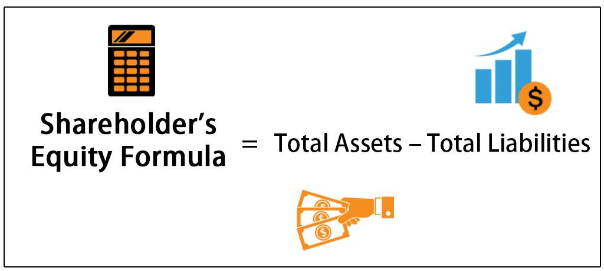

In today's rapidly evolving financial world, understanding key financial metrics is essential for investors and traders alike. These metrics provide critical insights into the financial health and operational effectiveness of companies, guiding investment strategies and trading decisions. Among these, the equity ratio and shareholder equity stand out as vital components in financial management and algorithmic trading.

The equity ratio evaluates a company's financial leverage and risk exposure by determining the proportion of total assets financed by shareholder equity. Its calculation is straightforward, involving the division of total shareholder equity by total assets:



$$
\text{Equity Ratio} = \frac{\text{Total Shareholder Equity}}{\text{Total Assets}}
$$

This ratio aids in assessing how much a firm relies on debt versus equity financing, with higher ratios suggesting greater financial stability and lower risk profiles.

Shareholder equity, on the other hand, represents the owners' residual interest in the company after liabilities are settled. It provides an essential view of a company's net worth and long-term viability, calculated as the difference between total assets and total liabilities. Key components of shareholder equity include share capital, retained earnings, and treasury stock, each reflecting distinct aspects of a company’s financial standing and performance.

Integrating these traditional financial analysis tools with modern algorithmic trading techniques enables a more data-driven approach to developing and executing trading strategies. Algorithmic trading utilizes such financial metrics to automate trading processes, optimizing investment decisions, and managing risks effectively. By leveraging equities metrics in combination with algorithmic frameworks, investors can derive analytical insights, refine trading strategies, and enhance decision-making accuracy, thus optimizing their market participation.

Incorporating equity calculations and financial metrics into trading strategies enhances market analysis and decision-making accuracy. As the complexities of financial markets continue to grow, understanding and utilizing these metrics provide investors and traders with a competitive edge, facilitating superior trading outcomes.

## Table of Contents

## Understanding Shareholder Equity

Shareholder equity, also referred to as stockholders' equity, represents the net assets attributable to shareholders after the company's liabilities have been settled. It is calculated by subtracting total liabilities from total assets, which provides a snapshot of the company's financial health at a given point in time:

$$
\text{Shareholder Equity} = \text{Total Assets} - \text{Total Liabilities}
$$

This calculation indicates the value that would be returned to shareholders if all of the company's assets were liquidated and all its debts were paid.

Shareholder equity is composed of several key elements. The primary components include share capital, retained earnings, and treasury stock. Share capital refers to the funds raised by issuing shares in exchange for cash or other consideration. Retained earnings represent the cumulative profits that have been reinvested in the business rather than distributed to shareholders as dividends. Treasury stock involves shares that have been bought back by the company, reducing the amount of outstanding stock on the market. Collectively, these components reflect the company's financial standing and influence its overall financial strategy.

Investors closely analyze shareholder equity to assess a company's valuation and long-term performance. A consistent increase in shareholder equity over time typically indicates a healthy, growing company, whereas a decrease might signal financial difficulties or mismanagement. Understanding shareholder equity allows investors to gauge the intrinsic value of a company and make informed decisions regarding stock purchases or sales. By providing insights into how effectively a company is managed, shareholder equity plays a critical role in investment strategy and risk assessment.

When integrated with other financial metrics, shareholder equity offers a comprehensive view of a company's economic position, making it an essential concept in financial analysis and investment decision-making.

## Equity Ratio and its Calculation

The equity ratio is a critical financial metric that measures the proportion of a company's total assets financed by shareholder equity. It provides valuable insights into the company’s financial leverage and risk exposure. Mathematically, the equity ratio is expressed as:

$$
\text{Equity Ratio} = \frac{\text{Total Shareholder Equity}}{\text{Total Assets}}
$$

This ratio helps in assessing the degree to which shareholders own the company's assets, as opposed to creditors. A higher equity ratio indicates that a larger portion of the company's assets is financed by equity rather than debt, suggesting a stronger financial footing and lower financial risk. It implies that the company is less dependent on borrowing, thus reducing interest obligations and exposure to financial distress during economic downturns.

Conversely, a lower equity ratio may indicate higher reliance on debt, signifying greater financial leverage. While this might boost returns on equity during favorable market conditions, it also increases risk, particularly if the company faces revenue shortfalls or increased borrowing costs.

In practical terms, the equity ratio can guide investment decisions and financial analysis. For instance, investors often look for companies with higher equity ratios to ensure stability, while those seeking potentially higher returns, albeit with increased risk, might consider firms with lower equity ratios. Understanding and calculating this ratio is fundamental for analyzing corporate financial structures and evaluating long-term viability.

## Importance of Financial Metrics in Algorithmic Trading

In the context of [algorithmic trading](/wiki/algorithmic-trading), financial metrics such as Return on Investment (ROI) and equity ratios are critical components for constructing and automating trading strategies. By utilizing these metrics, traders can develop sophisticated algorithms that predict market movements, optimize trade execution, and effectively manage risk. An understanding of shareholder equity, when integrated into algorithmic models, provides an additional layer of analysis to enhance decision-making processes.

Algorithmic trading systems rely heavily on quantitative analysis and data-driven techniques. The equity ratio, calculated as the ratio of total shareholder equity to total assets, helps quantify a company's financial leverage. This metric can signal the level of risk associated with investing in a company. A high equity ratio indicates greater financial stability, as it suggests that a company is less reliant on debt financing. For algorithmic traders, incorporating such insights can refine strategies by focusing on firms with favorable financial profiles.

The use of financial metrics in algorithmic trading is not limited to risk assessment. By employing metrics like ROI, traders aim to maximize the return on their investments relative to the initial cost. ROI is calculated using the following formula:

$$
\text{ROI} = \frac{\text{Net Profit}}{\text{Cost of Investment}} \times 100
$$

Incorporating these metrics allows traders to backtest their algorithms under various market conditions. Backtesting involves simulating a trading strategy using historical data to evaluate its performance. This step is crucial for identifying potential weaknesses in the strategy and providing opportunities to fine-tune parameters for better future results.

Algorithmic models, equipped with historical data and robust financial metrics, can optimize trade entry and [exit](/wiki/exit-strategy) points. They achieve this by analyzing trends and patterns that might not be immediately apparent through traditional analysis. For instance, leveraging moving averages in conjunction with financial ratios can enhance the timing of trades, thus improving profitability.

Furthermore, financial metrics facilitate risk management in algorithmic trading. By assessing a company's financial health through metrics like the equity ratio, traders can make informed decisions about position sizing and diversification, minimizing potential losses. This approach ensures that algorithms not only seek profit but also prioritize capital preservation.

In summary, the integration of financial metrics such as shareholder equity ratios and ROI into algorithmic trading models is indispensable. These metrics provide a comprehensive framework for evaluating and executing trades with greater precision, risk management capability, and profitability potential. As trading strategies become more complex, reliance on accurate financial data remains fundamental to achieving superior trading outcomes.

## Practical Examples and Case Studies

Real-world examples provide valuable insights into how equity metrics can enhance trading strategies for improved risk management and profitability. For instance, when trading assets, a company with a high equity ratio compared to its peers might indicate a more stable investment, reducing the risk of default and thus, offering a potentially safer avenue for capital allocation.

Consider the case of a high-frequency trading firm that integrated equity ratio analysis into its algorithmic trading platform. The firm identified that companies with equity ratios exceeding 60% had lower [volatility](/wiki/volatility-trading-strategies) and offered more stable returns. By filtering trades based on this threshold, the firm reduced its exposure to highly leveraged companies and optimized its portfolio for better risk-adjusted returns. This approach was not only beneficial in optimizing entry and exit points but also in maintaining a balanced risk profile across diverse market conditions.

Furthermore, [backtesting](/wiki/backtesting) these strategies using historical data revealed a consistent improvement in performance metrics such as Sharpe ratio and information ratio, which measure risk-adjusted returns. For example, by excluding companies with equity ratios below the identified threshold from their trading algorithms, the firm achieved a Sharpe ratio increase from 1.2 to 1.5 over a 5-year period. This statistical evidence underscores the tangible benefits of integrating equity metrics into trading systems.

In another example, consider a quantitative [hedge fund](/wiki/hedge-fund-trading-strategies) employing Python-based scripts to automate its trading strategies. By accessing financial databases and libraries like Pandas and NumPy, the fund calculated real-time equity ratios for a portfolio of stocks, enabling dynamic adjustments to its trading algorithms. This real-time analytical capability allowed the fund to swiftly react to market shifts, capitalizing on favorable equity conditions while minimizing exposure to financial downturns.

```python
import pandas as pd

# Sample data
data = {'Company': ['A', 'B', 'C'],
        'Total_Assets': [500, 1200, 800],
        'Total_Liabilities': [200, 500, 400]}
df = pd.DataFrame(data)

# Calculate Shareholder Equity
df['Shareholder_Equity'] = df['Total_Assets'] - df['Total_Liabilities']

# Calculate Equity Ratio
df['Equity_Ratio'] = df['Shareholder_Equity'] / df['Total_Assets']

# Filter companies with Equity Ratio above a threshold
threshold = 0.6
filtered_companies = df[df['Equity_Ratio'] > threshold]
```

Through such innovative applications of financial ratios in algorithmic trading, traders and investors can achieve a more data-driven approach, ensuring that their strategies not only leverage statistical prowess but also align with fundamental financial analysis. These case studies underscore the importance of combining traditional metrics with modern technological capabilities to enhance market outcomes.

## Conclusion

Incorporating equity calculation and financial metrics into trading strategies significantly enhances market analysis and decision-making accuracy. These metrics provide traders with in-depth insights into a company's financial health and risk exposure, enabling data-driven decisions to be made with greater confidence. As financial markets become more complex, leveraging advanced tools such as algorithmic trading systems that incorporate these financial indicators can offer a competitive edge, leading to superior trading outcomes. By understanding the interplay between traditional financial metrics like the equity ratio and modern algorithmic techniques, investors are better equipped to navigate volatile markets and execute successful investments while effectively managing risks. This comprehensive approach not only optimizes trading strategies but also ensures long-term profitability and sustainability in diverse market conditions.

## References & Further Reading

[1]: Danielson, M. G., & Scott, J. A. (2006). Analysis and use of financial statements: A casebook. Cengage Learning.

[2]: ["Financial Intelligence, Revised Edition: A Manager's Guide to Knowing What the Numbers Really Mean"](https://www.amazon.com/Financial-Intelligence-Revised-Managers-Knowing/dp/1422144119) by Karen Berman and Joe Knight

[3]: ["Algorithmic Trading: Winning Strategies and Their Rationale"](https://books.google.com/books/about/Algorithmic_Trading.html?id=WAlFDwAAQBAJ) by Ernest P. Chan

[4]: ["The Essentials of Trading: From the Basics to Building a Winning Strategy"](https://www.amazon.com/Essentials-Trading-Building-Winning-Strategy/dp/047179063X) by John Forman

[5]: Fraser-Sampson, G. (2010). Private Equity as an Asset Class. Wiley Finance.