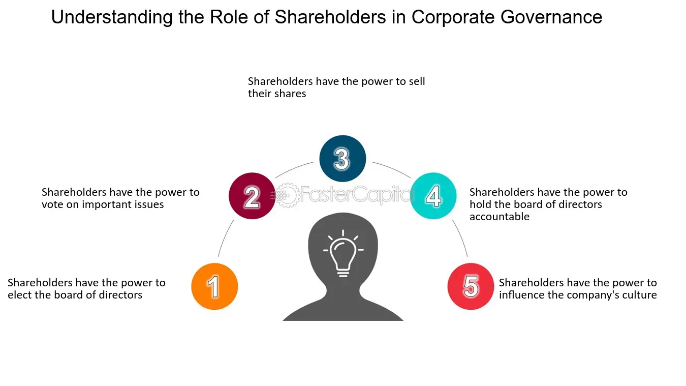

## Table of Contents

## What is corporate governance?

Corporate governance is the way a company is run and controlled. It involves the rules, processes, and laws that guide how a company operates and makes decisions. Good corporate governance helps make sure that a company is managed well, is honest, and works in the best interest of its shareholders and other important groups like employees, customers, and the community.

It includes things like choosing the right people for the board of directors, making sure they are doing their jobs properly, and having clear rules about how decisions are made. Corporate governance also involves making sure the company follows the law and is open about its actions and financial performance. This helps build trust with investors and other stakeholders, which is important for the long-term success of the company.

## Who are shareholders and what is their role in a company?

Shareholders are people or groups who own shares in a company. When you buy a share, you become a part-owner of the company. The more shares you own, the bigger your ownership is. Shareholders can be individuals, like you or me, or big organizations like pension funds or other companies.

The role of shareholders in a company is important. They have a say in big decisions, like choosing who sits on the board of directors. Shareholders also get to vote on important issues at meetings called shareholder meetings. Plus, if the company does well, shareholders might get some of the profits in the form of dividends. But if the company does badly, the value of their shares can go down, which means they could lose money.

## How do shareholders influence corporate governance?

Shareholders influence corporate governance mainly through their voting rights. When they own shares in a company, they get to vote on important things like who should be on the board of directors. The board makes big decisions for the company, so by choosing the right people, shareholders can help make sure the company is run well and in a way that looks after everyone's interests.

Shareholders also have a say in other big decisions, like changes to the company's rules or approving big deals. They can vote at meetings called shareholder meetings, where they can also ask questions and give their thoughts on how the company is doing. If shareholders are not happy with how the company is being run, they might vote against the current leaders or even sell their shares, which can send a strong message to the company to do better.

## What are the different types of shareholder activism?

Shareholder activism is when shareholders try to change how a company is run. There are a few common ways they do this. One way is through voting. Shareholders can vote for or against the board of directors or on big decisions at meetings. If they don't like what the company is doing, they might vote against the people in charge to try to get new leaders who will do things differently.

Another way is called "shareholder proposals." This is when shareholders suggest changes to the company's rules or practices. They put these ideas forward at shareholder meetings, and if enough other shareholders agree, the company might have to make the changes. It's a way for shareholders to push for things like better pay for workers, being kinder to the environment, or making the company more open about what it does.

Lastly, shareholders can use their voice through public pressure. They might talk to the media or use social media to tell everyone about the problems they see in the company. This can make the company's leaders feel pressure to fix things because they don't want bad publicity. Sometimes, shareholders work together in groups to make their voices louder and have a bigger impact on the company's decisions.

## What is the difference between institutional and individual shareholder influence?

Institutional shareholders are big groups like banks, insurance companies, or pension funds that own a lot of shares in a company. Because they own so many shares, they have a lot of power. They can influence the company by voting on important decisions and pushing for changes that they think will make the company better. For example, they might ask the company to be more open about its actions or to focus on being kinder to the environment. When big groups like this speak up, companies often listen because they don't want to lose their support.

On the other hand, individual shareholders are everyday people who own shares in a company. They usually don't own as many shares as big groups, so their influence is smaller. But if a lot of individual shareholders come together and agree on something, they can still make a difference. They might vote together at meetings or use social media to share their ideas and put pressure on the company. While it's harder for one person to make a big change, a group of people working together can have a strong voice.

## How do shareholders use voting rights to affect corporate governance?

Shareholders use their voting rights to affect how a company is run by choosing the board of directors. The board makes big decisions for the company, so if shareholders want to change how things are done, they can vote for new people to be on the board. This way, they can pick leaders who will do what they think is best for the company. Shareholders also vote on other important things, like big deals or changes to the company's rules. If enough shareholders agree on something, they can make it happen.

Sometimes, shareholders use their votes to show they are not happy with the company. If they think the company is doing something wrong, they might vote against the people in charge. This can send a message that the company needs to do better. When a lot of shareholders vote the same way, it can really make a difference. Even if one person doesn't have many shares, if a lot of people vote together, they can still change things.

## What are shareholder proposals and how do they impact corporate policies?

Shareholder proposals are suggestions that shareholders make about how a company should be run. They can be about anything from paying workers more fairly to being kinder to the environment. Shareholders write these proposals and then other shareholders vote on them at meetings. If a lot of people agree with the proposal, the company might have to do what the proposal says.

These proposals can really change how a company works. For example, if a lot of shareholders vote for a proposal to make the company more open about its actions, the company might start sharing more information with everyone. Or if shareholders want the company to focus on being greener, the company might change its rules to use less energy or make less waste. So, shareholder proposals give shareholders a way to push the company to do things differently and make it better for everyone.

## How can shareholders influence executive compensation and board composition?

Shareholders can influence executive compensation by voting on it at shareholder meetings. They get to decide if they think the pay for the top leaders, like the CEO, is fair. If shareholders think the pay is too high, they can vote against it. This can send a strong message to the company to change how much they pay their leaders. Sometimes, shareholders also make proposals about executive pay, asking for rules that make the pay more tied to how well the company is doing.

Shareholders also have a say in who sits on the board of directors. They vote for board members at meetings, and if they don't like the current board, they can vote for new people. This is important because the board makes big decisions for the company. By choosing the right people for the board, shareholders can make sure the company is run in a way that they think is best. If shareholders are not happy with the board, they can vote them out and bring in new leaders who will listen to what they want.

## What are the legal frameworks that support shareholder rights in corporate governance?

Shareholder rights in corporate governance are supported by different laws and rules that make sure shareholders have a say in how a company is run. In the United States, the main law is called the Securities Exchange Act of 1934. This law says that shareholders can vote on important things like who is on the board of directors and big company decisions. The law also makes sure that companies have to share important information with shareholders, so they can make good choices. Another important rule is the Dodd-Frank Act, which lets shareholders vote on how much the top leaders of a company should be paid.

In other countries, there are similar laws that help shareholders. For example, in the European Union, the Shareholder Rights Directive makes sure that shareholders can easily vote and have a say in company decisions. It also makes sure that companies treat all shareholders fairly and give them the information they need. These laws and rules around the world help make sure that shareholders can use their power to make companies better and more honest.

## How do shareholder engagements and dialogues shape corporate strategy?

Shareholder engagements and dialogues help shape a company's strategy by giving shareholders a chance to talk directly with the company's leaders. When shareholders meet with the board or top executives, they can share their thoughts and worries about what the company is doing. They might ask the company to focus on things like being kinder to the environment, treating workers better, or making more money for shareholders. These talks can lead to the company changing its plans to fit what shareholders want. For example, if shareholders are worried about climate change, the company might decide to use less energy or make less waste.

These dialogues also help build trust between shareholders and the company. When shareholders feel like the company is listening to them, they are more likely to keep supporting the company. This can make the company's leaders think more about what shareholders want when they are making big decisions. Over time, this back-and-forth can guide the company's strategy to be more in line with what its owners think is important. So, by talking with shareholders, companies can make better plans that help everyone.

## What are the challenges and limitations of shareholder influence on corporate governance?

One big challenge for shareholders trying to influence how a company is run is that they might not own enough shares to make a big difference. Big groups like banks or pension funds have a lot of shares and can have a strong say, but regular people who own just a few shares might find it hard to be heard. Also, even if shareholders vote for something, the company's leaders might not have to do it right away. It can take a long time to make changes, and sometimes the company might not listen at all.

Another limitation is that not all shareholders agree on what should happen. Some might want the company to focus on making more money, while others might care more about the environment or how workers are treated. This can make it hard to get enough people to agree on one thing. Plus, shareholders might not have all the information they need to make good decisions. Companies can be slow to share details, and sometimes the information they give out might be hard to understand. All these things can make it tough for shareholders to really change how a company is run.

## How does shareholder influence on corporate governance vary across different countries and industries?

Shareholder influence on how companies are run can be very different depending on where you are in the world. In countries like the United States and the United Kingdom, shareholders have a lot of power. They can vote on big things like who is on the board of directors and how much the top leaders should be paid. Laws like the Securities Exchange Act and the Dodd-Frank Act in the U.S. help make sure shareholders have a say. But in other places, like some countries in Europe and Asia, shareholders might not have as much power. Sometimes, the government or big families who own the company have more say in how things are done.

The kind of industry a company is in can also change how much influence shareholders have. In industries like tech and finance, shareholders often have a bigger voice because these companies need a lot of money from investors to grow. So, they listen more to what shareholders want. But in industries like energy or heavy manufacturing, the companies might be more focused on long-term plans and might not change things as quickly, even if shareholders ask them to. This can make it harder for shareholders to influence how these companies are run.

## References & Further Reading

[1]: Shleifer, A., & Vishny, R. W. (1997). ["A Survey of Corporate Governance."](https://onlinelibrary.wiley.com/doi/abs/10.1111/j.1540-6261.1997.tb04820.x) The Journal of Finance, 52(2), 737-783.

[2]: Jensen, M. C. (2001). ["Value Maximization, Stakeholder Theory, and the Corporate Objective Function."](https://www.jstor.org/stable/3857812) Journal of Applied Corporate Finance, 14(3), 8-21.

[3]: Gomber, P., Arndt, B., Lutat, M., & Uhle, T. (2011). ["High-Frequency Trading."](https://papers.ssrn.com/sol3/papers.cfm?abstract_id=1858626) SSRN Electronic Journal.

[4]: Fama, E. F., & Jensen, M. C. (1983). ["Separation of Ownership and Control."](https://www.semanticscholar.org/paper/Separation-of-Ownership-and-Control-Fama-Jensen/06d31f933d5c89ebc496ec49fa8e29384308bf91) Journal of Law and Economics, 26(2), 301-325.

[5]: O’Hara, M. (2015). ["High Frequency Trading and Its Impact on Markets."](https://rpc.cfainstitute.org/research/financial-analysts-journal/2014/high-frequency-trading-and-its-impact-on-markets) Financial Analysts Journal, 71(1), 18-27.

[6]: Blair, M. M. (1995). ["Ownership and Control: Rethinking Corporate Governance for the Twenty-First Century."](https://archive.org/details/ownershipcontrol0000blai) Brookings Institution Press.

[7]: MacKenzie, D. (2018). ["Algorithmic Trading and the Flash Crash."](https://www.sciencedirect.com/science/article/pii/S2214845013000082) Socio-Economic Review, 16(1), 1-38.