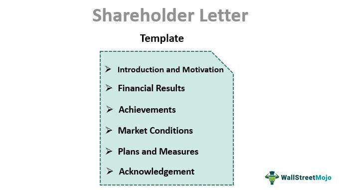

In today's fast-paced financial markets, effective corporate communication and investor relations are vital components of any successful business strategy. The dynamic nature of these markets necessitates a robust approach to how companies communicate with their investors, ensuring that they are kept informed and engaged. Shareholder letters, as a crucial instrument of corporate communication, serve as a bridge connecting company executives with their investors. These letters offer insights into a company's performance metrics and future strategic direction, thus playing a pivotal role in maintaining investor confidence.

The significance of shareholder letters has increased with the advent of algorithmic trading. This modern trading methodology, which relies on sophisticated algorithms to execute trades at high speed and volume, has fundamentally altered market dynamics. Consequently, the need for precise and timely communication has escalated, compelling companies to enhance their communication practices to meet the heightened expectations of investors influenced by algorithmic trading trends.

This article explores the critical facets of corporate communication in investor relations, focusing specifically on shareholder letters, their evolution, and their impact. It examines how the rise of algorithmic trading has reshaped the investor landscape and considers how companies can leverage these tools to build trust and transparency. By effectively utilizing shareholder letters, companies can not only fortify their relationship with current investors but also appeal to potential stakeholders, thereby ensuring sustainable growth and a competitive advantage in the contemporary financial environment.

## Table of Contents

## The Importance of Corporate Communication in Investor Relations

Corporate communication within investor relations plays a crucial role in maintaining transparency and building trust with investors. This aspect of corporate strategy ensures that stakeholders are consistently informed about company performance, strategic goals, and future prospects. Through various communication channels, such as press releases, investor meetings, and digital platforms, companies strive to deliver a coherent message that aligns with their strategic objectives.

Effective corporate communication not only enhances a company's reputation but also attracts investment by demonstrating reliability and foresight. A transparent communication strategy can help manage market perceptions, reducing uncertainty for investors and stakeholders. By providing accurate and timely information, companies can minimize speculation and misinformation, fostering a more stable investment environment.

Consistent messaging across different communication platforms is vital for reinforcing the company's strategic goals. This consistency ensures that all stakeholders, including institutional and individual investors, receive uniform information, thereby supporting informed decision-making. Furthermore, strong communication strategies help in mitigating the impacts of negative news or market rumors by providing clear contexts and explanations.

In conclusion, superior corporate communication skills are essential for nurturing investor relations, enhancing corporate reputation, and promoting trust. As companies continue to adapt to the fast-paced demands of modern financial markets, the importance of effective communication remains paramount.

## Role of Shareholder Letters in Corporate Communication

Shareholder letters are essential tools for corporate communication, serving as a direct link between company executives and shareholders. These letters offer a detailed overview of a company's performance, strategic direction, and operational insights, providing transparency that is crucial for maintaining investor confidence.

The primary purpose of a shareholder letter is to present a coherent narrative that encapsulates the company's mission, achievements, and challenges. By offering a clear and comprehensive view, executives build trust with investors, ensuring that corporate objectives are communicated effectively. This trust is foundational, as it can influence investment decisions, affect stock prices, and ultimately shape market sentiment.

A well-crafted shareholder letter does more than just report numbers. Although financial metrics are a significant component, the narrative accompanying these figures is equally important. Shareholders seek to understand the context behind the data—why a particular strategy was chosen, how external factors may have influenced performance, and what future actions the company plans to undertake. Providing this context helps stakeholders understand the rationale behind executive decisions and the potential impact on their investments.

Transparency is another critical element in shareholder letters. Companies are expected to present both successes and setbacks candidly. This honesty in communication reflects a company's integrity and commitment to its shareholders. By openly addressing challenges, companies can preemptively manage investor concerns, reducing uncertainty and fostering a more stable investment environment.

The strategic insight provided in shareholder letters also plays a significant role. By articulating the company's long-term vision and strategic initiatives, executives enable shareholders to align their expectations and investment strategies with the company's trajectory. This alignment is beneficial for both parties; shareholders make informed decisions, and companies secure a stable investor base.

In conclusion, shareholder letters are integral to corporate communication. They offer a platform for executive transparency and insight, strengthening investor confidence and fostering a positive market environment. By effectively utilizing shareholder letters, companies can enhance their reputation, build stronger investor relations, and support their strategic objectives.

## Understanding Algorithmic Trading

Algorithmic trading utilizes sophisticated computer algorithms to automate and optimize the process of stock trading, often executing trades at an incredible speed and [volume](/wiki/volume-trading-strategy) that surpass human capabilities. This form of trading capitalizes on mathematical models and statistical analyses to decide the timing, pricing, and execution of trades with minimal human intervention. The primary objective is to maximize returns by exploiting market inefficiencies and executing trades more efficiently than human traders.

The impact of [algorithmic trading](/wiki/algorithmic-trading) on financial markets is profound. It has transformed the trading landscape, introducing high-frequency trading ([HFT](/wiki/high-frequency-trading-strategies)) strategies that can manipulate market [liquidity](/wiki/liquidity-risk-premium), price discovery, and [volatility](/wiki/volatility-trading-strategies). These algorithms can process vast amounts of market data in fractions of a second, identifying patterns and trends that inform trading decisions. As a result, the velocity and volume of trades have increased, contributing to significant shifts in market dynamics.

For companies, understanding the mechanisms of algorithmic trading is crucial, as it necessitates a strategic adaptation in communication. The rapid information flow requires companies to disseminate accurate and timely disclosures to meet the expectations of these automated systems and their operators. Algorithmic traders often respond to specific data triggers embedded in financial reports, public statements, or even social media activity. Consequently, any miscommunication or delay in releasing financial data can lead to volatile stock price movements and misaligned market perceptions.

Furthermore, the proliferation of algorithmic trading has prompted regulators worldwide to establish frameworks ensuring fair and transparent markets, thus influencing corporate strategies. Companies need to be aware of regulations such as the European Union's Markets in Financial Instruments Directive (MiFID II) and the United States' Trade Reporting and Compliance Engine (TRACE), which regulate trading practices and mandate increased transparency.

In summary, algorithmic trading has reshaped how trades are executed, affecting market dynamics and challenging companies to refine their communication strategies accordingly. For businesses to engage effectively with modern investors, comprehending the implications of algorithmic trading is essential, requiring vigilance and adaptability in their investor relations approaches.

## Impact of Algorithmic Trading on Shareholder Communication

Algorithmic trading, a method utilizing computer programs to execute trades at rapid speeds, has transformed financial markets by increasing both their pace and complexity. This evolution necessitates a strategic overhaul in how companies communicate with their shareholders. The automation and speed inherent in algorithmic trading mean that even minor delays or inaccuracies in corporate disclosures can lead to significant market repercussions. For this reason, companies must prioritize the timely and precise release of information to cater to algorithm-driven investors who react quickly to market data.

To effectively navigate this landscape, understanding the specific requirements and behaviors of algorithmic traders is crucial. These traders often focus on quantitative data, processing news releases, earnings reports, and even shareholder letters to make immediate trading decisions. Consequently, companies should consider the format, accessibility, and clarity of their disclosures. Ensuring that communications are structured in a way that is easily digestible by algorithms can lead to more accurate market interpretations and enhance investor relations.

Moreover, adapting communication strategies to reflect the realities of algorithmic trading involves an emphasis on frequency and consistency. Traditional annual reports or quarterly disclosures may not suffice in an environment where trading algorithms make minute-by-minute decisions based on real-time data. To maintain optimal visibility, companies should explore more frequent updates through digital channels, utilizing real-time data analytics and advanced visualization tools.

These adaptations not only provide critical information necessary for algorithmic assessment but also strengthen a company's investor relations strategy by building trust and transparency. By aligning communications with the expectations and computational capabilities of algorithmic investors, companies can improve their market presence and foster a robust relationship with both human and algorithmic stakeholders.

## Crafting Effective Shareholder Letters

An effective shareholder letter embodies a blend of optimism and realism, providing a concise yet comprehensive overview of a company's position and strategic direction. This form of corporate communication serves as a narrative tool, offering insights into both achievements and challenges faced by the company. By maintaining a transparent and authentic tone, executives can create stronger connections with shareholders, fostering a sense of trust and confidence.

To craft an effective shareholder letter, it is essential to present strategic insights that align with the company's overarching goals. These insights should reflect a clear understanding of the market landscape, competitive positioning, and the company's response to dynamic environmental factors. Equally important is the inclusion of key financial metrics, which illustrate the company's performance across various dimensions. Metrics such as revenue growth, profit margins, EBITDA (Earnings Before Interest, Taxes, Depreciation, and Amortization), and return on investment (ROI) help shareholders assess the company's fiscal health and operational efficiency. For instance, the ROI can be calculated using the formula:

$$
\text{ROI} = \left(\frac{\text{Net Profit}}{\text{Investment Cost}}\right) \times 100
$$

Furthermore, a well-structured shareholder letter should outline the company's future growth plans. This can include potential expansions, innovation strategies, and market penetration efforts. By articulating these plans clearly, the letter can provide shareholders with a sense of direction and preparedness for future developments.

Incorporating storytelling elements within the shareholder letter is a powerful way to engage readers. By framing financial data and strategic insights within a narrative context, companies can make complex information more relatable and compelling. For example, detailing specific case studies or success stories that highlight how the company overcame challenges or seized opportunities can enhance the narrative quality of the letter. Such stories not only emphasize the human element of the business but also illustrate the company's resilience and adaptability.

Overall, a well-crafted shareholder letter, rooted in transparency and strategic insight, can significantly enhance investor relations. By balancing optimism with realism and weaving financial data into an engaging story, companies can communicate effectively with their shareholders, reinforcing trust and fostering long-term investment relationships.

## Legal and Regulatory Considerations

Shareholder communication, being an integral aspect of investor relations, is subject to rigorous legal and regulatory scrutiny to prevent misinformation and ensure transparency. Regulatory frameworks, such as the United States' Securities and Exchange Commission (SEC) regulations, the Sarbanes-Oxley Act, and the EU's Market Abuse Regulation (MAR), dictate specific disclosure requirements and guidelines that companies must adhere to. These regulations serve as a safeguard for investors, ensuring that they receive accurate and timely information necessary for informed decision-making.

Compliance with these regulations is not merely a legal obligation but a strategic necessity. It engenders trust between the company and its shareholders by demonstrating a commitment to transparency and accountability. Failure to comply can result in severe consequences, including legal penalties, reputational damage, and a loss of investor confidence. For instance, non-compliance with SEC regulations can lead to enforcement actions, including fines and restrictions on securities trading.

To navigate these regulatory requirements efficiently, companies often establish robust compliance programs. This involves continuous monitoring of regulatory changes, regular training for employees involved in shareholder communication, and the use of technology to ensure accurate and timely dissemination of information. By embedding compliance into their corporate culture, companies not only adhere to legal obligations but also position themselves as trustworthy entities in the eyes of investors.

Furthermore, the rise of digital communication tools has introduced additional regulatory considerations. The use of social media and other digital platforms in shareholder communication must align with existing legal standards to maintain compliance. This requires a thorough understanding of both the technological and regulatory landscapes to effectively manage and disseminate legally sound information.

In conclusion, adherence to legal and regulatory standards in shareholder communication is crucial for protecting both the company and its investors. By fostering a strong compliance framework and staying informed about regulatory developments, companies can maintain trust, avoid legal pitfalls, and cultivate a positive relationship with their shareholders.

## Leveraging Technology in Investor Relations

Digital platforms and technological advancements have transformed the landscape of investor relations by enhancing transparency and communication. These tools enable companies to connect with investors in more interactive and comprehensive ways, responding to an increasingly tech-savvy investor base.

Real-time analytics play a crucial role in this transformation. By processing vast amounts of data instantly, real-time analytics allow companies to monitor investor sentiment, trading patterns, and market dynamics. This rapid feedback loop provides corporates with insights that were previously inaccessible, enabling them to react proactively to investor concerns or market shifts. For instance, by tracking social media sentiment or transaction data, firms can identify emerging trends and adjust their communication strategies swiftly.

Virtual roadshows, another key innovation, have redefined the traditional approach to engaging investors. By leveraging video conferencing platforms, companies can present their financial results, strategic plans, or market insights to a global audience without geographical limitations. This democratization of investor access not only broadens the potential investor base but also reduces the logistical costs associated with physical roadshows. Virtual roadshows enhance inclusivity, as smaller investors who may have been excluded from physical events due to resource constraints can now attend these events virtually.

Interactive reporting formats offer a dynamic way for companies to present their financial and strategic information to investors. Digital annual reports, for example, can include interactive graphs, videos, and hyperlinks that provide a more engaging user experience. This interactivity allows investors to explore the data at their own pace and focus on areas of particular interest. Moreover, it facilitates a deeper understanding of the company’s performance metrics and strategic direction, potentially leading to more informed investment decisions.

Leveraging technology in investor relations is not merely about adapting to modern tools; it is about meeting the evolved expectations of investors who demand more transparency, immediacy, and engagement. As technology continues to evolve, companies are expected to integrate these digital tools into their investor relations strategies to maintain competitiveness and foster stronger relationships with their investor community. Traditional quarterly reports or press releases, though still relevant, must be complemented by these technological innovations to cater to the diverse needs of contemporary investors.

## Conclusion

Incorporating effective communication strategies in investor relations is essential for maintaining a successful corporate image. As algorithmic trading becomes increasingly prevalent, companies face the challenge of adapting their communication to meet the evolving needs of modern investors. Algorithmic trading's reliance on speed and precision amplifies the importance of timely, accurate, and strategic communication. Companies must ensure that their shareholder communications are clear and informative, with content that resonates both with human and algorithmic interpreters.

A well-crafted shareholder letter plays a pivotal role in this process, acting as a cornerstone of corporate communication. Such letters have the power to enhance investor relations by directly addressing shareholder concerns, clarifying the company's strategic direction, and transparently conveying both achievements and challenges. By building trust and demonstrating transparency, companies can create a positive perception among investors, which is crucial for sustaining engagement and securing investment.

Furthermore, maintaining a competitive edge in today's fast-paced markets requires companies to utilize technology effectively. Incorporating digital platforms and real-time analytics into investor relations can provide additional layers of engagement and comprehension, thus appealing to tech-savvy investors. Overall, companies that effectively combine traditional communication methods with modern technological tools and adapt to the demands of algorithmic trading are more likely to succeed in building lasting investor trust and maintaining a robust corporate image.

## References & Further Reading

[1]: Bergstra, J., Bardenet, R., Bengio, Y., & Kégl, B. (2011). ["Algorithms for Hyper-Parameter Optimization."](https://dl.acm.org/doi/10.5555/2986459.2986743) Advances in Neural Information Processing Systems 24.

[2]: ["Advances in Financial Machine Learning"](https://www.amazon.com/Advances-Financial-Machine-Learning-Marcos/dp/1119482089) by Marcos Lopez de Prado

[3]: ["Evidence-Based Technical Analysis: Applying the Scientific Method and Statistical Inference to Trading Signals"](https://www.amazon.com/Evidence-Based-Technical-Analysis-Scientific-Statistical/dp/0470008741) by David Aronson

[4]: ["Machine Learning for Algorithmic Trading"](https://github.com/stefan-jansen/machine-learning-for-trading) by Stefan Jansen

[5]: ["Quantitative Trading: How to Build Your Own Algorithmic Trading Business"](https://www.amazon.com/Quantitative-Trading-Build-Algorithmic-Business/dp/1119800064) by Ernest P. Chan