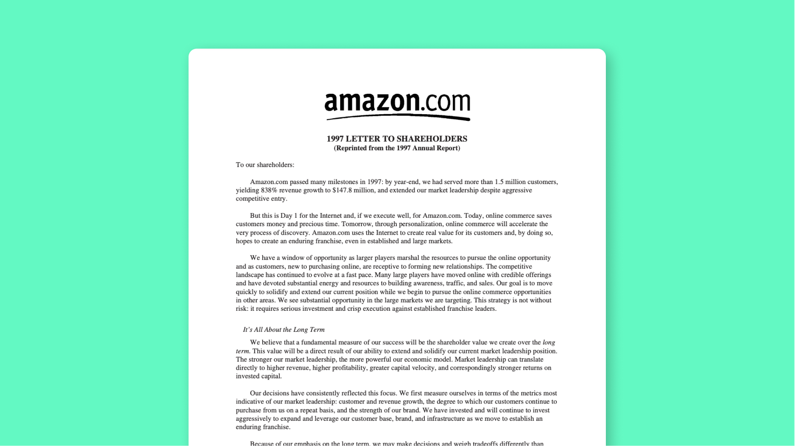

## Table of Contents

## What is a shareholder letter?

A shareholder letter is a message written by a company's top executives, usually the CEO or Chairman, to the people who own shares in the company. It's like a report card that tells shareholders how the company did over the past year, what challenges it faced, and what plans it has for the future. The letter is important because it helps shareholders understand the company's performance and feel more connected to it.

These letters are often included in the company's annual report, which is a detailed document that gives a full picture of the company's financial health. Shareholders look forward to these letters because they provide insights straight from the leaders of the company. The tone of the letter can be formal or friendly, but it always aims to be clear and honest about the company's situation and goals.

## Why are shareholder letters important?

Shareholder letters are important because they help people who own parts of a company understand how it's doing. These letters are written by the big bosses, like the CEO, and they tell shareholders about the good and bad things that happened in the past year. They also talk about what the company plans to do next. This helps shareholders feel more involved and connected to the company because they get to hear directly from the top.

These letters also give shareholders a clear picture of the company's money situation. They are usually part of the annual report, which is a big document that shows all the numbers and details about the company's finances. By reading the shareholder letter, owners can see if the company is doing well or if it needs to make changes. This information is crucial for shareholders because it helps them decide if they want to keep their shares or sell them.

## Who typically writes shareholder letters?

Shareholder letters are usually written by the big boss of the company, like the CEO or the Chairman. These are the people in charge who know the most about what's going on with the company. They write the letter to talk to the people who own parts of the company, called shareholders.

The CEO or Chairman uses the letter to explain how the company did over the past year. They talk about the good things that happened, the problems they faced, and what they plan to do next. This helps shareholders understand the company better and feel more connected to it.

## How often are shareholder letters released?

Shareholder letters are usually released once a year. This happens when the company makes its annual report, which is a big document that tells about the company's money situation and what happened during the year.

Sometimes, a company might also release a shareholder letter during other important times, like if there's a big change happening or if they want to share important news. But the main time is once a year, with the annual report.

## What are the key components of a shareholder letter?

A shareholder letter usually starts with a greeting and then talks about how the company did over the past year. The CEO or Chairman will share the big achievements and any challenges the company faced. They might talk about how much money the company made, or if they grew bigger, or if they started new projects. This part helps shareholders see the good and bad things that happened.

Next, the letter will talk about the future. The CEO or Chairman will explain what the company plans to do next. They might talk about new goals, new products, or changes they want to make. This part is important because it tells shareholders what to expect and how the company wants to grow. The letter ends with a thank you to the shareholders for their support and trust in the company.

Sometimes, the letter might also include a bit about the world around the company. This could be about the economy, new laws, or other big things that affect the business. This helps shareholders understand the bigger picture and why the company made certain choices.

## How does a shareholder letter function within corporate communication?

A shareholder letter is a big part of how a company talks to the people who own it. It's like a yearly update from the CEO or Chairman, telling shareholders about what happened in the past year. The letter talks about the good things the company did, like making more money or starting new projects, and also the challenges it faced. This helps shareholders understand the company better and feel more connected to it.

The letter also looks forward to the future. It tells shareholders about the company's plans and goals for the next year. This part is important because it shows what the company wants to do next and how it plans to grow. By sharing these plans, the company keeps shareholders informed and involved in its journey. Overall, the shareholder letter is a key way for the company to communicate openly and honestly with its owners.

## Can you provide examples of well-known shareholder letters?

One famous shareholder letter is written by Warren Buffett for Berkshire Hathaway. Every year, he writes a long letter that talks about how the company did and what he thinks about the world of business. He uses simple words and tells stories to explain big ideas. People love reading his letters because they learn a lot about investing and how to think about money.

Another well-known example is the shareholder letter from Jeff Bezos when he was the CEO of Amazon. His letters always talked about how Amazon was growing and trying new things. He would share his big ideas about what customers want and how the company could keep getting better. These letters helped people understand Amazon's plans and why they were doing things a certain way.

## What are the best practices for writing an effective shareholder letter?

Writing a good shareholder letter means being clear and honest. Start by saying hello and then talk about what happened in the past year. Share the good news like how much money the company made or new projects that started. Also, be open about any problems or challenges the company faced. This helps shareholders trust you because they see you're telling the whole story, not just the good parts.

Next, talk about the future. Explain what the company plans to do next and what goals it has. Use simple words to make sure everyone understands. It's also good to thank the shareholders for their support. This makes them feel important and part of the company's journey. Remember, the goal is to keep shareholders informed and connected, so always be clear and honest in your letter.

## How do shareholder letters impact investor relations?

Shareholder letters are very important for keeping a good relationship with investors. When the CEO or Chairman writes a letter, it helps investors feel like they are part of the company. The letter tells them about the good and bad things that happened in the past year. This makes investors trust the company more because they see that the leaders are being honest and open about everything.

The letter also talks about what the company plans to do next. This helps investors understand where the company is going and what to expect. By sharing these plans, the company shows that it values the investors' support and wants to keep them informed. This can make investors more likely to stay with the company and even invest more money in the future.

## What role do shareholder letters play in corporate governance?

Shareholder letters are important for good corporate governance. They help the people who own the company, called shareholders, understand what the company did in the past year and what it plans to do next. The CEO or Chairman writes the letter to explain the good things and the challenges the company faced. This openness helps shareholders trust the company more and feel like they are part of it.

These letters also show how the company is being run. By sharing the company's goals and plans, the leaders show that they are thinking about the future and trying to make the company better. This helps shareholders see that the company is being managed well and that their money is in good hands. Overall, shareholder letters are a key part of making sure the company is run in a fair and honest way.

## How have shareholder letters evolved over time?

Shareholder letters have changed a lot over the years. In the old days, they were very formal and just talked about the numbers and facts. They didn't share much about the company's plans or what was happening in the world. But now, these letters are different. They are more friendly and tell stories about the company's journey. They also talk about big ideas and what the company wants to do next. This change makes shareholders feel more connected to the company.

Another big change is that shareholder letters now talk about more than just money. They might discuss things like the environment, how the company treats its workers, or new laws that affect the business. This helps shareholders see the bigger picture and understand why the company makes certain choices. Overall, shareholder letters have become a way for companies to share their values and vision with the people who own them.

## What advanced strategies can be used to analyze the content of shareholder letters?

To understand shareholder letters better, you can use fancy computer programs to look at the words and sentences. These programs can count how often certain words are used, like "growth" or "challenge," to see what the company thinks is important. They can also check if the letter sounds happy or worried by looking at the feelings behind the words. This helps investors see if the company is feeling good or if it's facing tough times.

Another way to analyze shareholder letters is by looking at the stories and themes they talk about. You can read the letter to find out what big ideas the company is focusing on, like new technology or taking care of the environment. By comparing letters from different years, you can see if the company's goals are changing or staying the same. This helps investors understand the company's plans and how it's trying to grow.

## How can one craft effective shareholder letters?

An effective shareholder letter embodies a blend of optimism and realism, providing a concise yet comprehensive overview of a company's position and strategic direction. This form of corporate communication serves as a narrative tool, offering insights into both achievements and challenges faced by the company. By maintaining a transparent and authentic tone, executives can create stronger connections with shareholders, fostering a sense of trust and confidence.

To craft an effective shareholder letter, it is essential to present strategic insights that align with the company's overarching goals. These insights should reflect a clear understanding of the market landscape, competitive positioning, and the company's response to dynamic environmental factors. Equally important is the inclusion of key financial metrics, which illustrate the company's performance across various dimensions. Metrics such as revenue growth, profit margins, EBITDA (Earnings Before Interest, Taxes, Depreciation, and Amortization), and return on investment (ROI) help shareholders assess the company's fiscal health and operational efficiency. For instance, the ROI can be calculated using the formula:

$$
\text{ROI} = \left(\frac{\text{Net Profit}}{\text{Investment Cost}}\right) \times 100
$$

Furthermore, a well-structured shareholder letter should outline the company's future growth plans. This can include potential expansions, innovation strategies, and market penetration efforts. By articulating these plans clearly, the letter can provide shareholders with a sense of direction and preparedness for future developments.

Incorporating storytelling elements within the shareholder letter is a powerful way to engage readers. By framing financial data and strategic insights within a narrative context, companies can make complex information more relatable and compelling. For example, detailing specific case studies or success stories that highlight how the company overcame challenges or seized opportunities can enhance the narrative quality of the letter. Such stories not only emphasize the human element of the business but also illustrate the company's resilience and adaptability.

Overall, a well-crafted shareholder letter, rooted in transparency and strategic insight, can significantly enhance investor relations. By balancing optimism with realism and weaving financial data into an engaging story, companies can communicate effectively with their shareholders, reinforcing trust and fostering long-term investment relationships.

## References & Further Reading

[1]: Bergstra, J., Bardenet, R., Bengio, Y., & Kégl, B. (2011). ["Algorithms for Hyper-Parameter Optimization."](https://dl.acm.org/doi/10.5555/2986459.2986743) Advances in Neural Information Processing Systems 24.

[2]: ["Advances in Financial Machine Learning"](https://www.amazon.com/Advances-Financial-Machine-Learning-Marcos/dp/1119482089) by Marcos Lopez de Prado

[3]: ["Evidence-Based Technical Analysis: Applying the Scientific Method and Statistical Inference to Trading Signals"](https://www.amazon.com/Evidence-Based-Technical-Analysis-Scientific-Statistical/dp/0470008741) by David Aronson

[4]: ["Machine Learning for Algorithmic Trading"](https://github.com/stefan-jansen/machine-learning-for-trading) by Stefan Jansen

[5]: ["Quantitative Trading: How to Build Your Own Algorithmic Trading Business"](https://www.amazon.com/Quantitative-Trading-Build-Algorithmic-Business/dp/1119800064) by Ernest P. Chan