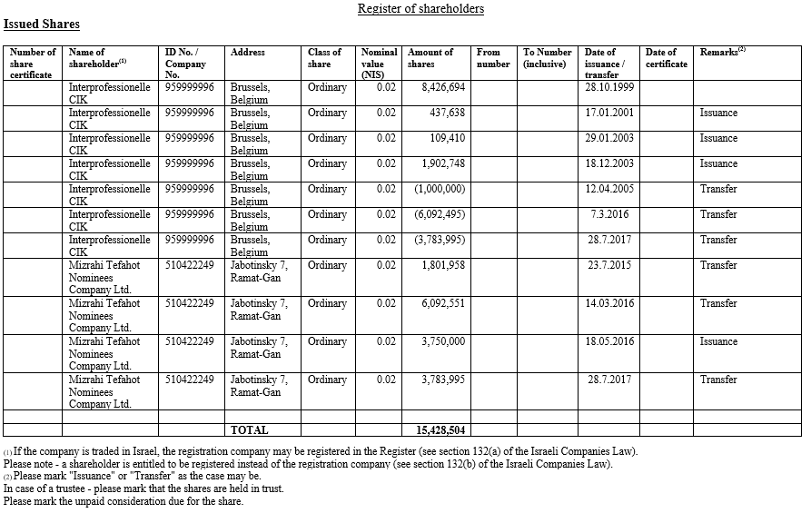

## Table of Contents

## What is a shareholder register?

A shareholder register is a list that keeps track of who owns shares in a company. It includes the names of the shareholders, how many shares they own, and other important details like their contact information. This register is very important because it helps the company know who its owners are and how to reach them.

The shareholder register is usually kept by the company itself or by a special service that helps manage these records. It's important for the register to be up-to-date so that the company can send out important information, like notices of meetings or dividend payments, to the right people. Keeping the register accurate also helps prevent any confusion or disagreements about who owns the shares.

## Why is a shareholder register important for a company?

A shareholder register is important for a company because it helps keep track of who owns the company. It lists all the people who have bought shares and how many shares they own. This is important because the company needs to know who its owners are. If the company wants to make decisions or send important information, it needs to know who to talk to.

The register also helps the company stay organized and fair. It makes sure that everyone who owns shares gets the information they need, like when meetings are happening or if they are getting money from the company. If the register is not kept up-to-date, it can cause problems and confusion. So, having a good shareholder register helps the company run smoothly and treat all its owners the same way.

## Who is responsible for maintaining the shareholder register?

The company itself usually keeps the shareholder register. They have someone in the company, like a secretary or someone in the legal or finance department, who makes sure the list is correct and up-to-date. This person adds new shareholders when someone buys shares and removes shareholders when someone sells their shares. They also update the list if someone's contact information changes.

Sometimes, a company might hire a special service to keep the shareholder register. These services are called transfer agents or registrars. They are experts at keeping track of who owns shares and making sure all the information is correct. This can be helpful for big companies that have a lot of shareholders, because it can be a lot of work to keep the register up-to-date by themselves.

## What information is typically included in a shareholder register?

A shareholder register usually has the names of all the people who own shares in the company. It also shows how many shares each person owns. This is important because it helps the company know who its owners are and how many shares they have.

The register also includes contact information for each shareholder, like their address, phone number, and email. This way, the company can send important messages and updates to the right people. Sometimes, the register might also have other details, like when someone bought their shares and if they have any special rights because of their shares.

## How often should a shareholder register be updated?

A shareholder register should be updated whenever there is a change in the ownership of shares. This means that if someone buys or sells shares, the register needs to be updated right away to reflect the new ownership. It's important to keep the register current so that the company always knows who its shareholders are and how many shares they own.

In addition to updating the register for changes in ownership, it should also be updated if a shareholder's contact information changes. This might happen if someone moves to a new address or gets a new phone number. Keeping the contact details up-to-date ensures that shareholders receive important communications from the company, like notices of meetings or dividend payments. Regular updates help the company stay organized and maintain good relationships with its shareholders.

## What are the legal requirements for maintaining a shareholder register?

The legal requirements for maintaining a shareholder register can vary by country, but there are some common rules that many places follow. Companies are usually required by law to keep an accurate and up-to-date shareholder register. This means they must record the names of all shareholders, the number of shares each person owns, and their contact information. The register must be updated whenever there is a change in ownership, like when someone buys or sells shares, or if a shareholder's contact details change.

In many places, the law also says that the shareholder register must be kept at the company's main office or another place that is easy to reach. The company must make the register available for shareholders and certain other people to look at if they ask. This helps make sure that the information is open and that everyone can check it if they need to. Not following these legal requirements can lead to problems for the company, like fines or legal trouble, so it's important to keep the register correctly.

## How can a company access or view their shareholder register?

A company can access or view their shareholder register by keeping it at their main office or a place that is easy to reach. Usually, someone in the company, like a secretary or someone in the legal or finance department, is in charge of the register. They can look at it whenever they need to check who owns shares or update the information.

If the company uses a special service, like a transfer agent or registrar, to keep the register, they can ask this service to give them the information. The service will have the register and can send it to the company or let them see it online. This way, the company can always know who their shareholders are and make sure the information is correct.

## What are the consequences of not maintaining an accurate shareholder register?

If a company does not keep its shareholder register accurate, it can face big problems. The company might get in trouble with the law because many places have rules that say companies must keep their shareholder register up-to-date. If the register is wrong, the company could get fined or have other legal issues. This can be bad for the company and make people trust it less.

Not having a correct shareholder register can also cause confusion and disagreements. If the register does not show who really owns the shares, it can be hard to know who should get important information like meeting notices or dividend payments. This can make shareholders unhappy and lead to fights about who owns what. Keeping the register right helps the company run smoothly and treat everyone fairly.

## How does the shareholder register affect corporate governance?

The shareholder register is very important for corporate governance because it helps the company know who its owners are. Good corporate governance means making sure the company is run in a fair and open way. The shareholder register helps with this by keeping track of who owns the shares and how many shares they have. This way, the company can make sure that everyone who owns shares gets to have a say in important decisions, like voting at meetings.

If the shareholder register is not kept right, it can cause problems with corporate governance. For example, if the register is wrong, some shareholders might not get the information they need to vote or make decisions. This can make the company less fair and open. Keeping the shareholder register correct and up-to-date helps the company follow the rules and make sure everyone is treated the same way.

## What role does technology play in managing shareholder registers?

Technology helps a lot when it comes to managing shareholder registers. It makes it easier and faster to keep track of who owns shares in a company. With special software and online systems, companies can quickly update the register whenever someone buys or sells shares. This means the information is always correct and up-to-date. It also helps companies keep all the important details, like names and contact information, in one place where they can easily find it.

Using technology also makes it easier for companies to share information with their shareholders. They can send emails or use online platforms to tell shareholders about meetings or dividend payments. This way, everyone gets the information they need quickly and without mistakes. Technology helps make the whole process smoother and more efficient, which is good for both the company and its shareholders.

## How can discrepancies in a shareholder register be resolved?

When there are mistakes in a shareholder register, the company needs to fix them quickly. They should check the register carefully to find where the mistake is. If someone says there is a problem, the company should look at their records and talk to the person who is worried. They might need to look at old documents or talk to the people who work with the register to figure out what went wrong.

Once they know what the mistake is, the company should fix it right away. They might need to change the number of shares someone owns or update their contact information. It's important to tell the shareholder about the change so they know it has been fixed. Keeping everyone happy and the information correct helps the company avoid bigger problems later.

## What are best practices for managing a shareholder register in a multinational corporation?

Managing a shareholder register in a multinational corporation can be tricky because the company has shareholders all over the world. The best way to handle this is by using special software that can keep track of shareholders in different countries. This software should be able to update the register quickly whenever someone buys or sells shares, no matter where they are. It's also important to make sure the software follows the rules of each country where the company has shareholders. This helps keep the register correct and up-to-date, so the company knows who its owners are and can send them important information.

Another important thing is to have a team that works together to manage the shareholder register. This team should include people who know the laws in different countries and can make sure the company follows them. They should also check the register regularly to make sure it's right and fix any mistakes quickly. Good communication with shareholders is key, so the company should use emails and online platforms to keep everyone informed. By doing these things, a multinational corporation can keep its shareholder register in good shape and make sure everyone is treated fairly.

## References & Further Reading

[1]: ["The Shareholder Register: Friend or Foe?"](https://corporatefinanceinstitute.com/resources/valuation/shareholder-register/) - Harvard Business Review

[2]: OECD. (2015). ["Principles of Corporate Governance."](https://www.oecd.org/en/publications/g20-oecd-principles-of-corporate-governance-2015_9789264236882-en.html)

[3]: Aldridge, I. (2013). ["High-Frequency Trading: A Practical Guide to Algorithmic Strategies and Trading Systems"](https://www.amazon.com/High-Frequency-Trading-Practical-Algorithmic-Strategies/dp/1118343506) - Wiley

[4]: Hasbrouck, J., & Saar, G. (2013). ["Low-Latency Trading."](https://www.sciencedirect.com/science/article/abs/pii/S1386418113000165) Journal of Financial Markets

[5]: Cartea, Á., Jaimungal, S., & Penalva, J. (2015). ["Algorithmic and High-Frequency Trading."](https://assets.cambridge.org/97811070/91146/frontmatter/9781107091146_frontmatter.pdf) - Cambridge University Press