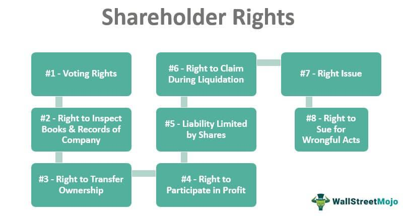

## Table of Contents

## What are shareholder rights?

Shareholder rights are the privileges and protections that come with owning shares in a company. When you buy shares, you become a part-owner of the company, and this gives you certain rights. These rights can include voting on important company decisions, like who should be on the board of directors, and getting a say in big changes, like if the company wants to merge with another company. Shareholders also have the right to receive information about the company's financial health and performance, which helps them make informed decisions about their investments.

Another important right is the ability to receive dividends, which are payments made by the company to its shareholders from its profits. If the company does well and makes money, shareholders can get a portion of those earnings. Additionally, shareholders have the right to sell their shares whenever they want, which gives them flexibility in managing their investments. If the company is not doing well or if shareholders are unhappy with how it's being run, they can also take legal action to protect their interests. These rights help ensure that companies are run fairly and that shareholders have a voice in the company's operations.

## Who qualifies as a shareholder?

A shareholder is anyone who owns shares in a company. You can become a shareholder by buying shares directly from the company when it issues new shares or by buying shares from someone else who already owns them. This can be done through a stock exchange or a broker. Even if you only own one share, you are still considered a shareholder.

There are different types of shareholders. Some people own shares directly, while others might own them indirectly through investment funds or retirement accounts. Companies can also have shareholders, like when one company buys shares in another company. No matter how you own the shares, as long as you have them, you are a shareholder and have the rights that come with it.

## What are the basic rights of shareholders?

Shareholders have some basic rights because they own part of a company. One important right is voting. Shareholders can vote on big decisions, like who should be on the company's board of directors or if the company should merge with another company. This gives shareholders a say in how the company is run. Another right is getting information. Shareholders can see the company's financial reports and other important documents. This helps them understand how the company is doing and make good choices about their shares.

Another key right is getting dividends. If the company makes a profit, it might share some of that money with shareholders as dividends. This is like getting a reward for owning part of the company. Shareholders also have the right to sell their shares whenever they want. This means they can choose to get their money back if they need it or if they think the company isn't doing well. If shareholders think the company is being run badly, they can even take legal action to protect their rights. These rights help make sure companies treat their shareholders fairly.

## How do shareholders exercise their voting rights?

Shareholders exercise their voting rights by participating in company meetings, usually called annual general meetings (AGMs). At these meetings, shareholders can vote on important issues like choosing the board of directors or approving big changes like mergers. Each shareholder usually gets one vote per share they own. They can vote in person at the meeting or send in their vote by mail or online if the company allows it. This way, even if they can't be there, they can still have a say.

Sometimes, shareholders can also vote on other important things throughout the year, not just at the AGM. These are called special meetings or proxy votes. If a shareholder can't attend a meeting, they can give someone else, called a proxy, the right to vote for them. The proxy will vote according to the shareholder's instructions. This system makes sure that all shareholders, no matter where they are, can have their voices heard in the company's decisions.

## What is a shareholder meeting and why is it important?

A shareholder meeting is a gathering where people who own shares in a company come together to talk about important things. These meetings can happen once a year, called an annual general meeting (AGM), or sometimes more often if there's something special to discuss. At these meetings, shareholders can vote on big decisions like who should be on the company's board of directors or if the company should merge with another company. They can also ask questions and get information about how the company is doing.

These meetings are important because they give shareholders a chance to have a say in how the company is run. Since shareholders own part of the company, it's fair that they get to vote on important choices. The meetings also help keep the company honest and open. By sharing information and letting shareholders ask questions, the company shows that it cares about its owners and wants to do things the right way. This helps build trust between the company and its shareholders.

## Can shareholders propose resolutions at meetings?

Yes, shareholders can propose resolutions at meetings. A resolution is a formal way for shareholders to suggest something they want the company to do or change. To propose a resolution, shareholders usually need to follow certain rules set by the company. For example, they might need to own a certain number of shares and give the company notice of their resolution before the meeting.

These resolutions can be about many things, like changing how the company is run or asking for more information about its business. If enough shareholders agree with the resolution, it can pass and the company has to follow it. This gives shareholders a powerful way to influence the company's decisions and make sure their voices are heard.

## What are preemptive rights and how do they benefit shareholders?

Preemptive rights are a special right that some shareholders have. It means that if a company wants to issue new shares, the current shareholders get the first chance to buy them. This helps them keep their ownership percentage in the company the same. For example, if you own 10% of a company and new shares are issued, you can buy enough of the new shares to still own 10% after the new shares are sold.

These rights are good for shareholders because they protect their stake in the company. Without preemptive rights, new shares could be sold to other people, and the original shareholders might end up owning a smaller piece of the company. By giving shareholders the first chance to buy new shares, preemptive rights help them keep control and avoid being diluted. This makes shareholders feel more secure about their investment in the company.

## How do dividend rights work and what affects them?

Dividend rights mean that if a company makes money, it might share some of that money with its shareholders. These payments are called dividends. Shareholders usually get dividends based on how many shares they own. If a company decides to pay dividends, it will tell shareholders how much they will get and when. Not all companies pay dividends, though. Some might choose to use their profits to grow the business instead of sharing them with shareholders.

Several things can affect dividend rights. First, the company's board of directors decides if and how much to pay in dividends. They look at the company's profits, how much money they need to keep for future plans, and what they think is best for the company and its shareholders. The type of shares can also make a difference. Some shares, called preferred shares, might get dividends before other shares, called common shares. Economic conditions can also play a role. If the economy is doing badly, a company might cut or skip dividends to save money. All these factors together decide if shareholders will get dividends and how much they will be.

## What legal protections do shareholders have against corporate mismanagement?

Shareholders have legal protections to help them if they think the company is being mismanaged. One big protection is the right to take legal action against the company or its leaders if they are doing something wrong. This can be done through a lawsuit called a derivative suit, where shareholders sue on behalf of the company to fix problems like fraud or breaking the law. Shareholders can also band together in what's called a class action lawsuit if many of them are affected by the same issue. These legal actions help make sure that the company's leaders are doing their job right and not hurting the company or its shareholders.

Another protection is the right to information. Shareholders can ask for and get important documents about the company's finances and operations. This helps them see if the company is being run well or if there are problems. If shareholders find something wrong, they can use this information to push for changes or to support their legal actions. These rights help keep companies honest and make sure that shareholders have a way to protect their investments if things go wrong.

## How can shareholders influence corporate governance?

Shareholders can influence how a company is run by using their voting rights. At meetings, they can vote on who should be on the board of directors. The board makes big decisions for the company, so choosing the right people is important. Shareholders can also vote on big changes like mergers or changes to the company's rules. If enough shareholders agree, they can make these changes happen. This gives shareholders a big say in how the company is managed.

Another way shareholders can influence the company is by proposing resolutions. If they see something they want to change, they can suggest it at a meeting. If other shareholders agree, the company has to follow the resolution. Shareholders can also talk to the company's leaders directly. By asking questions and sharing their thoughts, they can help guide the company's decisions. This way, shareholders can make sure the company is run in a way that they think is best.

## What are the differences between common and preferred shareholder rights?

Common and preferred shareholders both own parts of a company, but they have different rights. Common shareholders usually have the right to vote at meetings. They can choose the board of directors and vote on big changes like mergers. Common shareholders might also get dividends, but only if the company makes enough money and decides to share it. If the company goes out of business, common shareholders are last in line to get any money back, after everyone else is paid.

Preferred shareholders have some different rights. They usually don't get to vote at meetings, so they don't have a say in choosing the board or making big decisions. But, preferred shareholders often get dividends before common shareholders. These dividends are usually a set amount and are paid out regularly. If the company goes out of business, preferred shareholders get their money back before common shareholders, but after the company's debts are paid. This makes preferred shares a bit safer, but they don't give as much control over the company.

## How do international laws affect shareholder rights in multinational corporations?

International laws can change how shareholders in big companies that work in different countries are treated. These laws come from places like the United Nations, the European Union, or other groups that countries agree to follow. They can set rules about how companies should treat their shareholders, like making sure they get information or can vote on important things. For example, the European Union has rules that say companies must let shareholders vote at meetings, even if they can't be there in person. This helps make sure that shareholders from different countries have a fair say in how the company is run.

These international laws can also make it easier for shareholders to take legal action if they think the company is doing something wrong. If a company is based in one country but has shareholders in another, international laws can help those shareholders sue in their own country's courts. This is important because it means shareholders don't have to travel to another country to fight for their rights. Overall, international laws try to make sure that all shareholders, no matter where they live, are treated fairly and have the same basic rights in multinational companies.

## References & Further Reading

[1]: Hendershott, T., Jones, C. M., & Menkveld, A. J. (2011). ["Does Algorithmic Trading Improve Liquidity?"](https://onlinelibrary.wiley.com/doi/full/10.1111/j.1540-6261.2010.01624.x) Journal of Finance, 66(1), 1-33.

[2]: Bebchuk, L. A., & Weisbach, M. S. (2010). ["The State of Corporate Governance Research."](https://www.nber.org/papers/w15537) The Review of Financial Studies, 23(3), 939-961.

[3]: Financial Stability Board (2017). ["Review of the OTC Derivatives Market Reforms."](https://www.fsb.org/2017/06/review-of-otc-derivatives-market-reform-effectiveness-and-broader-effects-of-the-reforms/)

[4]: Gomber, P., Koch, J. A., & Siering, M. (2017). ["Digital Finance and FinTech: Current Research and Future Research Directions."](https://link.springer.com/article/10.1007/s11573-017-0852-x) Journal of Business Analytics, 1(1), 5-13.

[5]: OECD (2015). ["G20/OECD Principles of Corporate Governance."](https://www.oecd.org/en/publications/g20-oecd-principles-of-corporate-governance-2015_9789264236882-en.html)