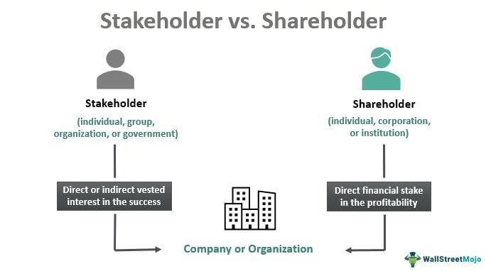

The financial world is undergoing a paradigm shift, driven by technological advancements such as algorithmic trading. This transformation has significant implications for corporate governance and the dynamic roles of shareholders and stakeholders. As companies navigated the complex landscape of global markets, understanding the distinct theories of shareholder versus stakeholder value becomes imperative in evaluating corporate governance models.

Algorithmic trading, characterized by the use of advanced algorithms to execute trades at unprecedented speeds and efficiency, is reshaping the financial markets. This evolution elevates the discourse on how corporations balance the expectations of shareholders, who traditionally prioritize financial returns, against the broader spectrum of stakeholder interests, which include social responsibility and ethical considerations.

Shareholder theory, which argues for maximizing returns to those who hold shares in the company, has dominated corporate governance for decades. However, the increasing advocacy for stakeholder theory highlights a shift towards addressing a wider array of interests, encompassing employees, customers, suppliers, and communities. This shift is not merely a matter of ethics but a strategic imperative for long-term sustainability.

This article examines the intricate relationship between corporate governance, shareholder and stakeholder value, and algorithmic trading. It seeks to unpack how these elements influence business operations and performance, ultimately contributing to sustainable corporate practices. By exploring these interactions, the discussion aims to provide insights into establishing governance structures that align with today's dynamic and ever-changing financial landscape.

## Table of Contents

## Corporate Governance: Shareholder vs. Stakeholder Models

Corporate governance is the framework of rules, relationships, systems, and processes within and by which authority is exercised and controlled in corporations. Central to this framework are the shareholder and stakeholder models, which serve as defining philosophies influencing a corporation's strategic direction, ethical operations, and overall accountability.

The shareholder model of corporate governance is primarily focused on maximizing shareholder value. This approach is grounded in the belief that the ultimate measure of a company's success is its ability to generate returns for its shareholders, who are considered the owners of the corporation. Decision-making processes within this model often prioritize share price appreciation, dividends, and ensuring efficient use of capital to achieve financial performance metrics. This model is supported by the assumption that when shareholders are satisfied by healthy financial returns, the broader economic landscape benefits from increased investment and economic growth.

Conversely, the stakeholder model of corporate governance broadens the scope of corporate responsibility. It argues that companies should serve the interests of all stakeholders, not just shareholders. These stakeholders include employees, customers, suppliers, communities, and even the environment. Under this framework, corporate decisions are evaluated not only on financial criteria but also on their social, environmental, and ethical impact. Stakeholder theory posits that addressing the needs and interests of various stakeholder groups can lead to more sustainable and ethical business operations, thereby fostering long-term success.

Both models have profound implications for corporate governance. The shareholder model's narrow focus on financial returns can, at times, lead to short-termism, where companies prioritize immediate financial gains over long-term strategic positioning and sustainability. This can manifest in cost-cutting measures, reduced capital investment, and other actions potentially detrimental to stakeholders other than shareholders.

In contrast, the stakeholder model encourages a more holistic view of corporate responsibilities. By incorporating a wider range of interests, companies are incentivized to engage in socially responsible practices, invest in employee welfare, and develop products and services that reflect broader social values. However, criticism of the stakeholder model often revolves around the difficulty in balancing conflicting interests, which may lead to decision paralysis or diluted accountability if the broader goals are not clearly articulated or prioritized.

In conclusion, the shareholder and stakeholder models represent two ends of a spectrum in corporate governance strategies. The ongoing debate between these models is continually shaped by market forces, regulatory changes, and evolving societal expectations. The choice between these frameworks—or a hybrid thereof—can significantly impact a company's operations, reputation, and long-term success.

## Understanding Shareholder Theory

Shareholder theory posits that a corporation's foremost responsibility is to its shareholders, prioritizing the maximization of shareholder value. This approach centers corporate decision-making around the appreciation of share prices, reflecting profits that directly benefit shareholders through dividends or increased stock valuation.

This theory, championed by economists like Milton Friedman, argues that the primary obligation of businesses is to use their resources and engage in activities designed to increase profits, provided they adhere to the basic rules of society, encapsulated by legal and ethical standards. Managers are thus viewed as [agents](/wiki/agents) of the shareholders, tasked with aligning their strategies and actions to serve shareholder interests.

In practice, shareholder theory typically guides decisions that prioritize short-term financial gains, often manifested through cost-cutting measures, restructuring, or strategic mergers and acquisitions. The emphasis on short-term metrics like quarterly earnings can drive firms to adopt aggressive growth tactics that bolster immediate stock performance but may lead to risks such as underinvestment in employee development, environmental sustainability, and community engagement.

Critics argue that shareholder theory's narrow focus on financial returns might undermine long-term business viability by neglecting broader social and environmental responsibilities. In an increasingly interconnected and transparent global economy, companies face growing pressures from diverse entities—including regulatory bodies, consumers, and investors themselves—to consider the implications of their operations on all stakeholders, not just shareholders. Such demands are evident in the rise of environmental, social, and governance ([ESG](/wiki/esg-investing)) investing, where investors assess companies based on their commitment to sustainable and ethical practices.

Thus, while shareholder theory traditionally served as the bedrock of corporate governance, its limitations in addressing the complexities of contemporary business environments have sparked debates and inspired alternative models that seek to balance financial performance with broader corporate responsibilities.

## Delving into Stakeholder Theory

Stakeholder theory is a pivotal concept in modern corporate governance, promoting the idea that businesses should balance the interests of all parties directly or indirectly affected by their operations. This includes not only shareholders but also employees, customers, suppliers, and the broader community and environment. This comprehensive approach expands corporate objectives beyond mere profit maximization to encompass social accountability and ethical considerations.

At the heart of stakeholder theory is the principle that companies should foster relationships and create value for all stakeholders, not just those with financial stakes in the company. This broader perspective encourages businesses to engage in practices that benefit a wide array of interests. By doing so, companies can build more trustful relationships, enhance their reputations, and potentially achieve long-term sustainability and success.

Stakeholder theory aligns closely with the notion of corporate social responsibility (CSR), which emphasizes that companies have obligations to society beyond generating profits. This includes addressing social and environmental concerns, often leading to practices such as sustainable resource management, equitable labor policies, and ethical sourcing.

One of the core advantages of stakeholder theory is its potential to guide companies toward sustainable business practices. By considering the impacts of business decisions on various stakeholder groups, businesses can implement strategies that mitigate risk, improve resource efficiency, and foster innovation. These strategies can lead to more resilient business models that can adapt to changing economic, social, and environmental conditions.

For instance, a company that prioritizes environmental sustainability may develop products with reduced ecological footprints, thus appealing to eco-conscious consumers and reducing waste. Simultaneously, by focusing on employee well-being and fair pay, a business can boost productivity, reduce turnover, and enhance its reputation as an employer of choice.

The sustainable practices encouraged by stakeholder theory also have long-term financial benefits. While initial investments in sustainable initiatives may be higher, they can lead to cost savings through reduced waste, improved energy efficiency, and stronger supply chain relationships. Furthermore, socially responsible companies often attract investors who are increasingly seeking ethical investment opportunities, thereby opening up new avenues for capital.

In summary, stakeholder theory presents a paradigm where businesses operate not solely as economic entities but as integral parts of a broader societal network. This approach advocates for a corporate framework that acknowledges and integrates the diverse interests of all stakeholders, fostering sustainable and ethical business practices that are more aligned with contemporary values and expectations.

## Algorithmic Trading: A Tool in Modern Corporate Governance

Algorithmic trading, utilizing computational power and complex mathematical models, represents a significant evolution in financial markets. It refers to the use of algorithms to make trading decisions based on pre-defined criteria. This form of trading enables financial firms to execute orders at speeds and frequencies that human traders cannot match, often resulting in improved efficiency and better timing of trades.

The integration of [algorithmic trading](/wiki/algorithmic-trading) into corporate strategy introduces several governance challenges and opportunities. From a governance perspective, algorithmic trading necessitates robust mechanisms to ensure transparency, accountability, and fairness in execution. These systems are designed to maximize shareholder value by optimizing trading efficiency, thus aligning with the principles of shareholder theory. However, the rapid execution and substantial volumes traded through algorithms can pose market risks, including increased [volatility](/wiki/volatility-trading-strategies) and potential systemic risks, challenging regulatory frameworks.

The opportunities presented by algorithmic trading within corporate governance frameworks are vast. These include enhanced decision-making capabilities, improved data analysis, and predictive modeling. Such capabilities allow corporations to capitalize on market trends more effectively, providing a competitive edge that aligns with both shareholder value maximization and broader stakeholder considerations. For example, stakeholders such as customers and employees can benefit indirectly through the company's increased profitability and market stability.

Despite these advantages, the reliance on algorithmic trading can result in potential ethical and regulatory dilemmas. The automation involved may lead to reduced human oversight, raising concerns over accountability. Moreover, the opacity of some algorithmic strategies can hinder transparency and create conflicts of interest if not properly managed. The threat of flash crashes or manipulation, as seen in several high-profile market events, underscores the importance of stringent governance controls and ethical considerations.

To address these challenges, many firms are adopting advanced risk management systems and incorporating ethical guidelines in the development and implementation of algorithms. Regulatory bodies are also evolving their frameworks to cope with the rapid advancements in trading technologies. This requires a balancing act between innovation and regulation to ensure that the benefits of algorithmic trading do not come at the expense of market integrity and stakeholder trust.

In conclusion, algorithmic trading presents a dual-edged sword for modern corporate governance. While it offers significant opportunities for enhancing trading efficiency and corporate strategy alignment, it also poses considerable challenges. These must be carefully navigated to safeguard against risks and ensure that governance practices remain robust and well-suited to the fast-evolving financial landscape.

## The Intersection of Corporate Governance and Algorithmic Trading

Corporate governance models play a crucial role in shaping how algorithmic trading strategies are implemented and managed within organizations. In both shareholder and stakeholder models, the deployment of algorithmic trading introduces unique challenges and opportunities, prompting firms to reassess their governance frameworks to accommodate technological advancements.

Algorithmic trading systems, recognized for their ability to execute large orders swiftly and at lower costs, present substantial influences on corporate governance. However, their implementation is fraught with regulatory and ethical implications that need careful consideration. Regulatory bodies impose stringent guidelines to ensure fair market play, transparency, and to mitigate systemic risks associated with high-frequency trading ([HFT](/wiki/high-frequency-trading-strategies)). For instance, the Securities and Exchange Commission (SEC) in the United States and the European Securities and Markets Authority (ESMA) in Europe have set comprehensive regulations to oversee algorithmic and HFT activities.

Within these governance frameworks, algorithmic trading strategies must align with ethical standards to preserve market integrity. Concerns such as market manipulation, potential violation of fiduciary duties, and the need for accountability in automated decision-making systems are paramount. These considerations compel corporate boards and governance structures to enhance oversight mechanisms and develop robust risk management strategies.

In shareholder-oriented governance models, the emphasis is predominantly on maximizing shareholder value, which may drive the adoption of algorithmic trading for its efficiency and profitability benefits. However, its integration requires balancing potential short-term gains against long-term stability and ethical considerations. As such, organizations might opt to add layers of scrutiny and real-time monitoring to ensure that algorithmic practices do not compromise market ethics or shareholder trust.

Conversely, stakeholder models, which advocate for balancing the interests of all business stakeholders, must consider the broader societal and ethical implications of algorithmic trading. These models require firms to evaluate how algorithmic strategies impact not only investors but also other entities such as employees, clients, and the wider community. This approach might lead to stricter internal guidelines and ethical standards governing the use of algorithmic trading, ensuring it aligns with corporate social responsibility goals.

As both models strive to control the influence of algorithmic trading, adaptive governance frameworks emerge as critical. Shareholder-focused firms might integrate risk mitigation measures tailored to optimize trading outcomes without jeopardizing shareholder interests. In contrast, stakeholder-oriented entities may implement governance adaptability through enhanced community engagement and transparent reporting practices to uphold societal trust and integrity.

Ultimately, the intersection of corporate governance and algorithmic trading necessitates ongoing dialogue and adaptation. Companies must continually review and refine their governance practices to ensure they are equipped to handle the fast-evolving technological landscape while maintaining compliance with regulatory and ethical standards. This dynamic interaction underscores the pivotal role of governance in harmonizing the benefits of algorithmic trading with long-term strategic and ethical corporate objectives.

## Corporate Social Responsibility and Governance

Corporate social responsibility (CSR) has become a critical component of modern corporate governance, significantly impacting how businesses are perceived and operate. As CSR gains importance, the stakeholder governance model, which emphasizes balancing the interests of all parties involved in a business, gains traction. Conversely, the shareholder governance model primarily focuses on maximizing returns for shareholders, but increasingly, it must also address CSR to maintain competitiveness and positive public perception.

The integration of CSR into corporate governance models can enhance company reputation, which is an essential asset in a market where consumer and investor awareness of ethical practices are paramount. Stakeholder governance models inherently align with CSR, as they prioritize social accountability alongside economic objectives. This approach can lead to sustainable business practices as companies consider the environmental and social impacts of their operations.

A compelling example of the successful integration of CSR into governance strategies is Unilever. The company has embedded sustainability into its business model through the Unilever Sustainable Living Plan, which sets ambitious environmental and social targets. This initiative aligns with the stakeholder model by addressing the needs of consumers, employees, suppliers, and the wider community. As a result, Unilever has strengthened its brand reputation and achieved financial success by appealing to a market increasingly concerned with environmental and social issues.

Another example is Patagonia, a company renowned for its commitment to environmental sustainability and social responsibility. Patagonia's governance strategy explicitly incorporates CSR, evidenced by its efforts to produce environmentally friendly products and its advocacy for environmental causes. By adopting a stakeholder governance model, Patagonia not only enhances its reputation but also attracts a loyal customer base that aligns with its values.

These examples demonstrate that integrating CSR into corporate governance is not only beneficial for a company’s reputation but also contributes to long-term success. The synergy between CSR and governance models fosters trust among stakeholders and can lead to improved financial performance. As CSR continues to influence corporate strategy, both shareholder and stakeholder governance models must adapt, with stakeholder models offering a more natural fit for incorporating comprehensive CSR practices.

## Future Trends in Corporate Governance

The landscape of corporate governance is poised to evolve significantly in the coming years, reflecting shifts in economic priorities and technological innovations. Two models, shareholder and stakeholder governance, are central to this evolution. 

**Shareholder Model**

The shareholder model traditionally emphasizes maximizing returns for investors. However, as technology advances, companies are recognizing the need to adapt this model. Algorithmic trading, for instance, allows firms to optimize investment strategies, impacting governance by emphasizing speed and precision in financial decision-making. These advancements necessitate new oversight mechanisms to manage associated risks, such as market volatility and ethical concerns about automated decision processes. Moreover, shareholders are becoming more concerned with sustainability and ethical practices, urging a reevaluation of the narrow focus on financial returns.

**Stakeholder Model**

Conversely, the stakeholder model, advocating for a balance among various parties connected to a business, is gaining traction. It aligns well with the increasing importance of corporate social responsibility (CSR) and environmental, social, and governance (ESG) criteria. The integration of advanced technologies, such as [artificial intelligence](/wiki/ai-artificial-intelligence) and big data analytics, enables more comprehensive stakeholder analysis, amplifying the capability of firms to meet diverse stakeholder needs. This model is expected to foster greater transparency and accountability, aligning corporate strategies more closely with societal goals.

**Impact of Technological Advancements**

Technological progress, particularly in algorithmic trading and data analysis, is reshaping corporate governance. As companies leverage these technologies, they face both opportunities and challenges. On one hand, these tools offer unprecedented efficiency and insight into market dynamics. On the other hand, they raise questions about data privacy, biases inherent in automated systems, and the ethical implications of machine-driven decision-making processes. Consequently, regulatory frameworks need to evolve to address these issues, ensuring that technological advancement does not undermine ethical and equitable corporate conduct.

**New Governance Models**

In response to emerging economic and social challenges, there is potential for developing hybrid governance models that incorporate elements of both shareholder and stakeholder approaches. Such models may prioritize long-term value creation that encompasses financial returns, social impact, and environmental stewardship. Companies are likely to adopt governance strategies that are adaptable and resilient, capable of navigating economic uncertainties, climate change, and shifting social expectations.

Future corporate governance trends will likely reflect a dynamic interplay between traditional profit-driven motives and the broader responsibilities businesses have towards society and the environment. This evolution demands a strategic integration of technological capabilities with an ethical framework that supports sustainable and inclusive economic growth.

## Conclusion

In examining the complexities of corporate governance, the independent influences of shareholder and stakeholder perspectives, alongside algorithmic trading, reveal a nuanced landscape. The shareholder theory emphasizes profit maximization for shareholders, often prioritizing financial returns as the primary corporate aim. However, this approach, while historically dominant, is increasingly scrutinized for its limitations in addressing broader societal and environmental concerns.

Conversely, stakeholder theory shifts the focus towards accommodating diverse interests, advocating for a balance that includes employees, customers, suppliers, and the community. This model supports sustainable and ethical business practices, emphasizing corporate social responsibility (CSR) and long-term value creation over immediate financial gains. As the significance of CSR continues to grow, businesses are increasingly recognizing the importance of integrating stakeholder values into their governance models.

The advent of algorithmic trading introduces both opportunities and challenges in this domain. On one hand, it offers enhanced efficiency and precision in trading operations, potentially increasing shareholder value. On the other, it brings forward governance challenges, such as ethical considerations and regulatory compliance, necessitating a reevaluation of existing frameworks to prevent market disruptions and ensure equitable practices.

Aligning corporate strategies with sustainable practices that effectively balance both shareholder and stakeholder interests is paramount for long-term success and ethical business conduct. This alignment requires ongoing dialogue and adaptation, ensuring that governance practices remain agile and relevant amidst technological advancements and evolving market conditions. The integration of robust governance models, embracing both shareholder and stakeholder principles, alongside a mindful deployment of algorithmic trading, can foster a resilient and responsible corporate environment, poised to address emerging economic and social challenges.

## References & Further Reading

[1]: Freeman, R. E. (2010). ["Strategic Management: A Stakeholder Approach."](https://research.monash.edu/en/publications/strategic-management-a-stakeholder-approach) Cambridge University Press.

[2]: Friedman, M. (1970). ["The Social Responsibility of Business is to Increase its Profits."](https://www.nytimes.com/1970/09/13/archives/a-friedman-doctrine-the-social-responsibility-of-business-is-to.html) The New York Times Magazine.

[3]: Jensen, M. C., & Meckling, W. H. (1976). ["Theory of the firm: Managerial behavior, agency costs, and ownership structure."](https://www.sciencedirect.com/science/article/pii/0304405X7690026X) Journal of Financial Economics, 3(4), 305-360.

[4]: Mallin, C. A. (2018). ["Corporate Governance."](https://books.google.com/books/about/Corporate_Governance.html?id=fLzmCwAAQBAJ) Oxford University Press.

[5]: Gomber, P., Arndt, B., Lutat, M., & Uhle, T. (2011). ["High-frequency trading."](https://papers.ssrn.com/sol3/papers.cfm?abstract_id=1858626) EconomiX Working Papers. 

[6]: Porter, M. E., & Kramer, M. R. (2011). ["Creating Shared Value."](https://www.hbs.edu/faculty/Pages/item.aspx?num=39071) Harvard Business Review, 89(1-2), 62-77.

[7]: Lopez de Prado, M. (2018). ["Advances in Financial Machine Learning."](https://www.amazon.com/Advances-Financial-Machine-Learning-Marcos/dp/1119482089) Wiley.

[8]: Jamali, D. (2008). ["A Stakeholder Approach to Corporate Social Responsibility: A Fresh Perspective into Theory and Practice."](https://link.springer.com/article/10.1007/s10551-007-9572-4) Journal of Business Ethics, 82(1), 213-231.