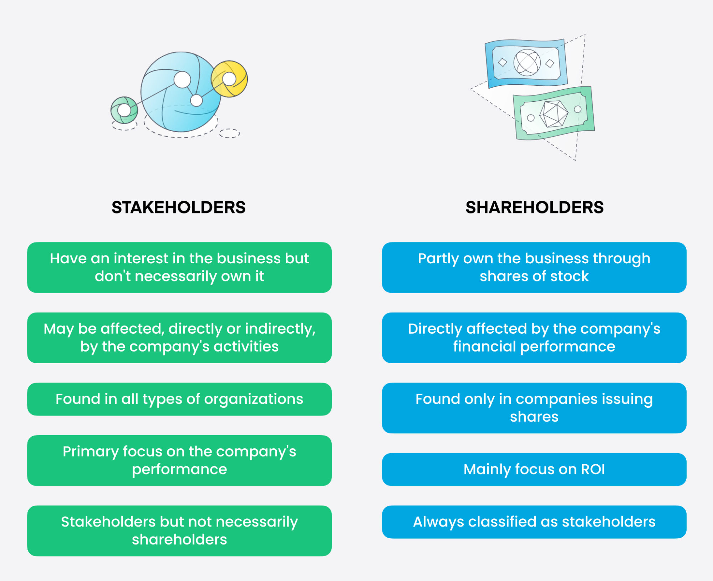

## Table of Contents

## What is a shareholder?

A shareholder is someone who owns shares in a company. When you buy shares, you become a part-owner of that company. The more shares you own, the bigger your ownership is. Shareholders can be individuals or other companies. They have a say in how the company is run, usually by voting at meetings.

Shareholders also get a part of the company's profits, called dividends. These are paid out regularly, like every three months or once a year. If the company does well, the value of the shares can go up, and shareholders can sell their shares for more money than they paid. But if the company does poorly, the share value can go down, and shareholders might lose money.

## What is a stakeholder?

A stakeholder is anyone who has an interest or concern in a company or project. This can include employees, customers, suppliers, and even the community where the company operates. Unlike shareholders, who own part of the company, stakeholders are affected by the company's actions but don't necessarily own any shares.

Stakeholders can influence and be influenced by the company's decisions. For example, employees want good working conditions and fair pay, while customers want good products and services. If a company makes decisions that harm the environment, the local community might be affected, making them stakeholders too. Companies often try to balance the needs of different stakeholders to keep everyone happy and the business running smoothly.

## How do shareholders and stakeholders differ in their interests?

Shareholders and stakeholders have different interests when it comes to a company. Shareholders are mainly focused on making money from their investment. They want the company to do well so the value of their shares goes up and they can get dividends. Their main goal is to see the company grow and be profitable because that's what will benefit them the most.

Stakeholders, on the other hand, have a broader range of interests. They care about how the company's actions affect them directly. For example, employees want good pay and a safe workplace, customers want good products and services, and the community wants the company to be a good neighbor and not harm the environment. Stakeholders might support decisions that help the company, but they also want their own needs and concerns to be considered.

These different interests can sometimes lead to conflicts. Shareholders might push for cost-cutting measures that boost profits, but these could harm employees or the community. Balancing these interests is important for a company to keep everyone happy and maintain a good reputation.

## What are the primary roles of shareholders in a company?

Shareholders are people who own part of a company because they bought its shares. Their main job is to help guide the company by voting at meetings. These meetings are called shareholder meetings, and at these meetings, shareholders can vote on important things like who should be on the company's board of directors. The board makes big decisions for the company, so choosing them is a big deal. Shareholders also vote on other big decisions, like if the company should merge with another company or if it should change its main business.

Another important role for shareholders is to keep an eye on how the company is doing. They do this by looking at reports the company gives them, which show how much money the company is making and what it's spending. If shareholders think the company is not doing well, they can use their votes to try to change things. Shareholders also care about getting money back from their investment. They get this money in two ways: the value of their shares might go up, so they can sell them for more than they paid, or the company might pay them dividends, which are like a share of the company's profits.

## How do stakeholders influence a company’s operations?

Stakeholders influence a company's operations by having a say in how the company makes decisions. They can do this by talking to the company, giving feedback, and even joining groups that work to change how the company does things. For example, employees might join a union to ask for better pay or safer work conditions. Customers can also influence the company by choosing to buy or not buy its products, which can push the company to make better things or change how it treats customers. If the company does something that hurts the environment, the community might protest or ask the government to make new rules, which can force the company to change its ways.

Stakeholders also have a big impact because companies want to keep them happy. A happy workforce can make the company run better and be more productive. Happy customers are more likely to keep buying the company's products and tell others to do the same. And if the community likes the company, it can help the company's reputation and make it easier to do business. So, companies often listen to what stakeholders want and try to meet their needs. This can mean making changes to how the company works, like improving safety, being more eco-friendly, or offering better customer service.

## Can someone be both a shareholder and a stakeholder?

Yes, someone can be both a shareholder and a stakeholder. A shareholder is someone who owns part of a company by buying its shares. They want the company to do well so their shares can grow in value and they can get dividends. A stakeholder, on the other hand, is anyone who is affected by the company's actions. This can include employees, customers, and the community. If someone owns shares in a company, they are a shareholder, but they can also be a stakeholder if they work for the company, buy its products, or live near its operations.

Being both a shareholder and a stakeholder means that person has different interests in the company. As a shareholder, they want the company to make more money so their investment grows. But as a stakeholder, they might also care about other things, like good working conditions if they're an employee, or a safe environment if they live nearby. Sometimes, these interests can be different, so the person might have to balance what's good for their shares with what's good for them as a stakeholder.

## What legal rights do shareholders have that stakeholders might not?

Shareholders have some special rights that stakeholders might not have. One big right is voting at shareholder meetings. Shareholders can vote on who should be on the company's board of directors and on big decisions like mergers or changes in the company's main business. This gives them a say in how the company is run. They also have the right to get information about the company, like financial reports, so they can see how well the company is doing.

Another important right for shareholders is the right to dividends. If the company makes money, it can choose to give some of that money back to shareholders as dividends. Shareholders also have the right to sell their shares if they want to. This means they can get their money back if they think the company isn't doing well or if they just want to invest in something else. Stakeholders, like employees or the community, don't have these rights because they don't own part of the company.

## How do companies balance the needs of shareholders and stakeholders?

Companies try to balance the needs of shareholders and stakeholders by listening to what everyone wants and making choices that help the company do well while also being fair to others. Shareholders want the company to make more money so their shares grow in value and they can get dividends. To meet their needs, companies might focus on making more profit, maybe by cutting costs or growing the business. But they have to be careful because cutting costs too much could hurt employees or the environment, which are important stakeholders.

Stakeholders like employees, customers, and the community also have needs. Employees want good pay and a safe place to work, customers want good products and service, and the community wants the company to be a good neighbor. Companies listen to these groups by talking to them, getting feedback, and sometimes changing how they do things. For example, they might improve safety rules, make their products better, or try to be more eco-friendly. By doing this, companies can keep everyone happy and keep their reputation good, which also helps the shareholders in the long run.

## What are the long-term impacts on a company focusing primarily on shareholders versus stakeholders?

If a company focuses mainly on shareholders, it might make a lot of money in the short term. They could cut costs by paying workers less or using cheaper materials, which makes more profit. This means shareholders get more dividends and their shares might go up in value. But over time, this can hurt the company. Workers might leave because they're not happy, and customers might stop buying if the products aren't good. The community might also get upset if the company harms the environment. This can lead to a bad reputation, and in the long run, the company might lose business and profits.

On the other hand, if a company focuses on stakeholders, it might take longer to see big profits. They might spend more on making sure workers are happy, products are good, and they're not hurting the environment. This can make shareholders a bit unhappy in the short term because there might be less money for dividends. But over time, this approach can be good for the company. Happy workers stay longer and work harder, loyal customers keep buying, and a good community relationship helps the company's reputation. In the long run, this can lead to steady growth and more stable profits, which is good for shareholders too.

## How do corporate governance practices differ in addressing shareholder and stakeholder interests?

Corporate governance practices focus on how a company is run and who makes the big decisions. When it comes to shareholders, corporate governance makes sure they have a say in big choices like who runs the company and how it grows. Shareholders get to vote at meetings, see financial reports, and sometimes get money back from the company's profits. The board of directors, who are often chosen by shareholders, work to make sure the company makes money, which is good for shareholders. But sometimes, this focus on making money can mean cutting costs in ways that might not be good for other people.

On the other hand, corporate governance also has to think about stakeholders like employees, customers, and the community. These groups don't own the company, but they are affected by what it does. Good corporate governance tries to balance everyone's needs. This might mean making sure workers have safe jobs and fair pay, that customers get good products, and that the company doesn't hurt the environment. Companies that care about stakeholders might spend more money on these things, which could mean less profit in the short term. But in the long run, taking care of stakeholders can help the company have a good reputation and keep growing steadily, which can also be good for shareholders.

## What are some examples of conflicts between shareholder and stakeholder interests?

One common conflict between shareholders and stakeholders happens when a company wants to cut costs to make more money for shareholders. For example, a company might decide to lay off workers or lower their pay to save money. This makes shareholders happy because it means more profit and bigger dividends. But it makes employees unhappy because they lose their jobs or earn less money. This can also hurt the company in the long run because unhappy workers might not work as hard or could leave, making it hard for the company to keep running well.

Another conflict can happen when a company decides to move its factory to a different country to save money. Shareholders might like this because it can make the company's products cheaper to make, leading to more profit. But the community where the factory was might be upset because people lose their jobs and the local economy gets hurt. Also, if the new factory harms the environment in the new country, the people there become unhappy stakeholders. Balancing these different needs is hard, but companies need to think about how their choices affect everyone involved.

## How do different theories like shareholder theory and stakeholder theory guide corporate strategy?

Shareholder theory says that a company's main job is to make money for its shareholders. This means the company should focus on making profits and growing the value of its shares. Shareholders own part of the company, so they want it to do well so they can get more money back. Companies following this theory might cut costs, like paying workers less or moving factories to cheaper places, to make more profit. The idea is that by focusing on shareholders, the company will do well in the long run. But this can sometimes hurt other people who are affected by the company, like employees or the community.

Stakeholder theory, on the other hand, says that a company should think about everyone who is affected by its actions, not just shareholders. This includes employees, customers, and the community. The goal is to make decisions that are fair to everyone, not just to make money. Companies following this theory might spend more money on making sure workers are happy, products are good, and they don't hurt the environment. This can mean less profit in the short term, but it can help the company have a good reputation and keep growing steadily. Balancing the needs of all stakeholders can be hard, but it can lead to a healthier company in the long run.

## References & Further Reading

[1]: Freeman, R. E. (2010). ["Strategic Management: A Stakeholder Approach."](https://research.monash.edu/en/publications/strategic-management-a-stakeholder-approach) Cambridge University Press.

[2]: Friedman, M. (1970). ["The Social Responsibility of Business is to Increase its Profits."](https://www.nytimes.com/1970/09/13/archives/a-friedman-doctrine-the-social-responsibility-of-business-is-to.html) The New York Times Magazine.

[3]: Jensen, M. C., & Meckling, W. H. (1976). ["Theory of the firm: Managerial behavior, agency costs, and ownership structure."](https://www.sciencedirect.com/science/article/pii/0304405X7690026X) Journal of Financial Economics, 3(4), 305-360.

[4]: Mallin, C. A. (2018). ["Corporate Governance."](https://books.google.com/books/about/Corporate_Governance.html?id=fLzmCwAAQBAJ) Oxford University Press.

[5]: Gomber, P., Arndt, B., Lutat, M., & Uhle, T. (2011). ["High-frequency trading."](https://papers.ssrn.com/sol3/papers.cfm?abstract_id=1858626) EconomiX Working Papers. 

[6]: Porter, M. E., & Kramer, M. R. (2011). ["Creating Shared Value."](https://www.hbs.edu/faculty/Pages/item.aspx?num=39071) Harvard Business Review, 89(1-2), 62-77.

[7]: Lopez de Prado, M. (2018). ["Advances in Financial Machine Learning."](https://www.amazon.com/Advances-Financial-Machine-Learning-Marcos/dp/1119482089) Wiley.

[8]: Jamali, D. (2008). ["A Stakeholder Approach to Corporate Social Responsibility: A Fresh Perspective into Theory and Practice."](https://link.springer.com/article/10.1007/s10551-007-9572-4) Journal of Business Ethics, 82(1), 213-231.