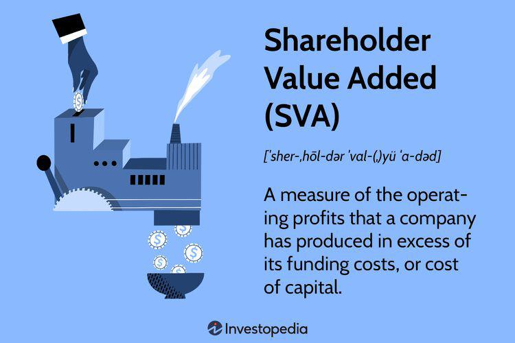

Shareholder Value Added (SVA) is a financial performance metric that measures the true value a company generates for its shareholders. This concept encompasses the idea that a company should generate returns above its cost of capital, thereby increasing the wealth of its shareholders. SVA is calculated by taking the difference between Net Operating Profit After Tax (NOPAT) and the capital charge (which is the cost of capital multiplied by the economic capital employed). SVA = NOPAT - (Cost of Capital × Economic Capital Employed).

The significance of SVA in financial analysis and decision-making lies in its ability to provide a clear indication of a company's ability to create value. Unlike traditional metrics such as net income or earnings before interest and taxes (EBIT), SVA specifically accounts for the cost of capital, offering a more comprehensive view of profitability. This makes it a critical tool for management when assessing performance, guiding decision-making processes that enhance shareholder wealth.



In algorithmic trading, the relevance of SVA becomes evident through its application in developing strategies that target value creation. Algorithmic trading, characterized by the use of automated and systematic processes to execute trades, can benefit from integrating SVA. By incorporating SVA metrics, trading algorithms can align with the long-term value creation goals of companies, ensuring that trading decisions are made with a focus on sustainable profitability rather than short-term gains. This integration allows traders and financial institutions to craft portfolios that are more robust and strategically sound.

SVA also plays a crucial role in evaluating company performance because it aligns economic performance with shareholder interests. It serves as an effective benchmark for assessing whether a company is generating sufficient returns to justify the cost of the capital employed. As a result, SVA helps investors and analysts discern between companies that truly deliver value and those that do not, leading to more informed investment choices and enhancing shareholder engagement.

## Table of Contents

## Understanding Shareholder Value Added (SVA)

Shareholder Value Added (SVA) is a financial performance metric that quantifies the value a company generates for its shareholders. It serves as an indicator of a firm's financial health and ability to create wealth beyond its base capital cost. SVA is particularly useful in determining whether a company is operating efficiently to enhance shareholder value.

### Components of Shareholder Value Added (SVA)

The core components of SVA include Net Operating Profit After Tax (NOPAT) and the Cost of Capital. 

1. **Net Operating Profit After Tax (NOPAT):** This represents the company's operating profit after adjusting for taxes. NOPAT is a measurement of profit that excludes financial and non-operating items such as interest expenses and non-recurring charges, making it a suitable measure of operating performance.

2. **Cost of Capital:** This is essentially the rate of return required by investors to compensate for the risk of investing in the company. It typically includes both the cost of equity and the cost of debt, weighted by their proportions in the company's capital structure.

### Calculation of Shareholder Value Added (SVA)

SVA is calculated by taking the NOPAT and subtracting the cost of capital. It is often expressed via the formula:

$$

\text{SVA} = \text{NOPAT} - (\text{Capital Employed} \times \text{WACC}) 
$$

Where:
- **NOPAT** is Net Operating Profit After Tax.
- **Capital Employed** is the total amount of capital used for the acquisition of profits, which can be estimated as total assets minus current liabilities.
- **WACC** stands for Weighted Average Cost of Capital, representing the average rate of return a company is expected to pay its shareholders and debt holders.

### Importance of SVA

SVA is significant for several reasons:
- **Profitability Measurement:** It allows companies to assess their ability to generate profits beyond the base cost of capital. A positive SVA indicates that the company is producing more returns than the cost of its capital, thereby creating additional shareholder value.
- **Performance Benchmarking:** SVA provides a consistent framework for comparing profitability across different periods and between peers within an industry, aiding investors and analysts in making informed decisions.
- **Alignment with Shareholder Interests:** By focusing on value creation from the perspective of shareholders, SVA aligns the strategic objectives of the corporation with the interests of its investors, promoting sustainable financial strategies.

Understanding and applying SVA is crucial for companies aiming to optimize their financial strategies and enhance shareholder wealth. The measure offers an unambiguous view of economic profit, which is increasingly favored by investors and corporate managers for its alignment with wealth maximization goals.

## SVA in Financial Analysis

Shareholder Value Added (SVA) is a pivotal metric in assessing corporate profitability by focusing on the excess value generated beyond the cost of capital. Unlike traditional financial metrics, SVA provides a comprehensive measure of a company’s financial performance by considering both profitability and the cost associated with generating that profit.

### Comparison between SVA and Traditional Financial Metrics

**Return on Investment (ROI)** and **Economic Value Added (EVA)** are conventional metrics that companies have used for financial performance assessment. ROI calculates the efficiency of an investment by dividing net profit by the initial investment cost. However, ROI does not consider the cost of capital and thus might overestimate a company’s profitability. 

Economic Value Added (EVA) is similar to SVA, as both measure financial performance based on residual wealth. While EVA calculates the value created in excess of the required return of the company's shareholders, SVA broadens this by directly tying performance to shareholder expectations through both market and investment performances. The SVA calculation therefore takes ROI a step further by introducing cost of capital as a critical [factor](/wiki/factor-investing), aligning with shareholder expectations.

### Benefits of Using SVA

SVA offers several benefits to investors and analysts. It aligns management goals with shareholder interests, emphasizing long-term value rather than short-term profit maximization. By incorporating cost of capital, it provides a more nuanced perspective of financial health, aiding in more informed decision-making regarding investments.

Moreover, SVA helps in identifying whether a company is creating or destroying value relative to its cost of capital, offering a clearer insight into financial discipline. This aspect makes it particularly valuable for comparative analysis across firms and industries, enhancing the predictive power regarding future performance.

### Challenges and Limitations

Despite its advantages, SVA is not without challenges. One primary limitation is its dependency on accurate estimation of the cost of capital, which can vary significantly across industries and economic cycles. Misestimation can lead to incorrect assessments of value creation or destruction.

Additionally, SVA might undervalue intangible assets such as brand reputation or intellectual property if not properly accounted for in the cost of capital calculations. Furthermore, it is less effective in rapidly changing industries where the cost of capital and profit potentials fluctuate frequently.

Overall, while SVA provides a robust framework for evaluating company performance through the lens of shareholder value, it requires careful consideration of underlying assumptions and economic context to maximize its applicability and accuracy.

## Algorithmic Trading and SVA

Algorithmic trading, an advanced method of executing trades using pre-programmed instructions, has significantly transformed financial markets by increasing the speed and efficiency of transactions. This approach reduces human error and allows for the analysis of vast datasets, enabling traders to make more informed decisions. As markets evolve, the integration of sophisticated financial metrics like Shareholder Value Added (SVA) into trading algorithms becomes increasingly vital.

Incorporating SVA metrics into trading algorithms enhances the ability to evaluate a company's true financial performance. SVA provides a measure of the economic value created in excess of capital costs, offering insights beyond traditional metrics. By using Net Operating Profit After Tax (NOPAT) in conjunction with the cost of capital, SVA highlights companies that genuinely add value, an essential factor for discerning traders in algorithmic strategies.

Algorithms utilizing SVA involve strategic entry and [exit](/wiki/exit-strategy) points based on company performance metrics. For instance, a trading algorithm can be programmed to purchase stocks of companies demonstrating a positive and increasing SVA over consecutive periods. This strategy capitalizes on the assumption that increasing shareholder value aligns with potential stock appreciation.

Python is often used to implement such strategies. A basic outline might involve:

```python
def calculate_sva(nopat, cost_of_capital):
    return nopat - cost_of_capital

def trading_strategy(data):
    buy_signals = []
    for company in data:
        sva = calculate_sva(company['nopat'], company['cost_of_capital'])
        if sva > 0 and sva > company['previous_sva']:
            buy_signals.append(company['ticker'])
    return buy_signals
```

In this example, the algorithm evaluates companies, selects those with positive and improving SVA, and suggests buying their stocks. This demonstrates a systematic method for leveraging SVA in trading.

Automation and technology complement SVA-driven strategies by providing tools for real-time data analysis and decision-making. Advanced [machine learning](/wiki/machine-learning) algorithms can refine cost predictions and performance forecasts, further enhancing SVA applications. Additionally, technologies such as Natural Language Processing (NLP) can extract sentiment and insights from financial news, offering supplemental data for SVA models.

In summary, the integration of SVA into [algorithmic trading](/wiki/algorithmic-trading) promises improved decision-making and market performance by focusing on genuine value creation metrics. This combination of financial acumen and technological advancement marks a frontier in trading strategies, offering a robust tool for achieving competitive edges in financial markets.

## Case Studies and Real-World Applications

Several companies have successfully implemented Shareholder Value Added (SVA) in their financial strategies, demonstrating its influence on stock performance and shareholder decisions. Notably, companies such as Coca-Cola, Siemens, and Unilever have effectively used SVA to drive strategic decisions and enhance shareholder value.

Coca-Cola has been at the forefront of adopting SVA as a core metric in its strategic planning. By continuously focusing on improving its Net Operating Profit After Tax (NOPAT) while managing its Cost of Capital, Coca-Cola has been able to generate substantial shareholder value. This approach has not only led to enhanced stock performance but also positively impacted the company's market valuation. Coca-Cola’s commitment to maximizing SVA has encouraged ongoing shareholder engagement and ensured sustainable growth.

Similarly, Siemens AG, a global technology powerhouse, has integrated SVA into its performance management and decision-making processes. By aligning its operations with SVA principles, Siemens evaluates each business unit’s contributions towards generating shareholder value. This has enabled Siemens to identify underperforming areas and allocate resources more efficiently, contributing to improved profitability and market competitiveness. Siemens' emphasis on SVA has also fostered transparency in corporate governance, resulting in increased trust among investors and stakeholders.

Unilever, a leading multinational consumer goods company, serves as another pertinent example. Unilever has embedded SVA within its corporate philosophy to promote long-term value creation. Through strategic initiatives focused on innovation and sustainable practices, Unilever has enhanced its NOPAT and effectively managed its capital costs. This has led to robust stock performance and significant market appreciation. The company’s strategic focus on SVA has been pivotal in influencing shareholder decisions, as investors increasingly favor businesses with sustainable growth trajectories.

Lessons from these companies highlight the importance of integrating SVA into corporate strategies for sustainable growth. These examples illustrate that focusing on SVA not only enhances financial performance but also aligns business operations with shareholder interests. Companies focusing on SVA have managed to maintain competitive advantages, optimize resource allocation, and strengthen investor confidence.

Moreover, SVA’s influence on shareholder decisions and market valuations is evident in its role as a benchmark for performance. As companies increasingly prioritize SVA, it becomes a vital criterion for investors in evaluating potential investments. Businesses that deliver positive SVA are perceived as being more capable of generating returns above their cost of capital, thus commanding higher market valuations.

In summary, real-world applications of SVA in companies like Coca-Cola, Siemens, and Unilever demonstrate its efficacy as a tool for enhancing shareholder value, driving sustainable growth, and positively influencing market perception.

## Conclusion: The Future of SVA in Finance

Shareholder Value Added (SVA) has emerged as a vital tool in financial analysis and trading, offering a comprehensive metric that aligns company performance with shareholder interests. By focusing on the excess returns generated over the cost of capital, SVA provides insights into a company's ability to create wealth for its shareholders. It serves as an effective measure for both corporate performance and investor decision-making, ensuring that companies pursue profitable ventures that exceed their capital obligations.

The integration of SVA into algorithmic trading represents a significant advancement in utilizing financial metrics to enhance trading strategies. By incorporating SVA, trading algorithms can assess the intrinsic value of companies more accurately and adjust trades to capitalize on undervalued or overvalued stocks. This dynamic approach can lead to the development of sophisticated algorithms capable of making informed trading decisions based on real-time financial data and SVA assessments. As technology continues to advance, it is likely that the precision and adaptability of these algorithms will improve, making SVA a standard component of algorithm-driven market activities.

Incorporating SVA into corporate governance strategies remains crucial for aligning managerial actions with shareholder interests. It ensures accountability and transparency, directing companies to emphasize long-term profitability and shareholder wealth. As firms continue to prioritize SVA, they foster environments where sustainable growth and shareholder engagement become key objectives. This alignment not only enhances market valuation but also encourages responsible corporate practices that benefit all stakeholders.

As financial markets evolve, the relevance of SVA in modern finance becomes increasingly evident. It acts as a bridge between financial performance assessment and strategic corporate governance, facilitating informed decision-making. Future developments in financial technology and data analytics are expected to further integrate SVA into daily trading and investment activities, offering enhanced tools for evaluating market opportunities.

In conclusion, SVA stands as a pivotal metric in the landscape of financial analysis and trading. Its application in algorithmic trading, corporate governance, and shareholder engagement underlines its significance in shaping the future of finance. By continuing to refine and adapt SVA methodologies, the financial industry can ensure more accurate and strategic evaluations, leading to improved market efficiencies and greater shareholder satisfaction.

## References & Further Reading

[1]: Rappaport, A. (1986). ["Creating Shareholder Value: The New Standard for Business Performance."](https://archive.org/details/creatingsharehol00rapp) The Free Press.

[2]: Stewart, G. B. (1991). ["The Quest for Value: A Guide for Senior Managers."](https://archive.org/details/questforvalueg00stew) Harper Business.

[3]: Damodaran, A. (2012). ["Investment Valuation: Tools and Techniques for Determining the Value of Any Asset."](https://books.google.com/books/about/Investment_Valuation.html?id=5SRHAAAAQBAJ) John Wiley & Sons.

[4]: Arnott, R. D., & Asness, C. S. (2003). ["Surprise! Higher Dividends = Higher Earnings Growth."](https://www.jstor.org/stable/4480452) Financial Analysts Journal, 59(1), 70-87.

[5]: Lopez de Prado, M. (2018). ["Advances in Financial Machine Learning."](https://www.amazon.com/Advances-Financial-Machine-Learning-Marcos/dp/1119482089) John Wiley & Sons.