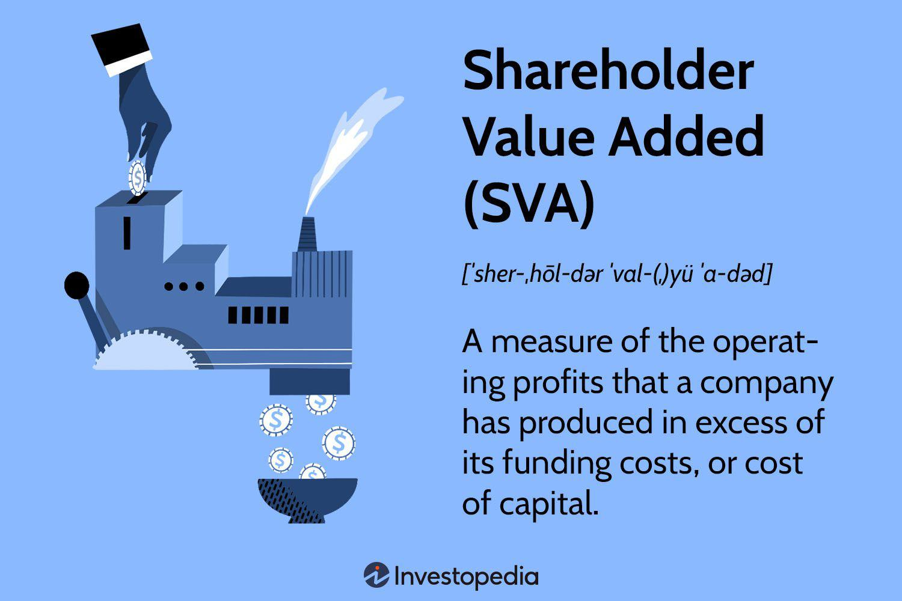

The concept of shareholder value has played a pivotal role in shaping financial strategy and corporate management for decades. Shareholder value refers to the worth delivered to shareholders as a result of an increase in stock prices, dividends, and improved financial performance metrics. The central goal of maximizing shareholder value has influenced various strategic decisions and operational approaches companies adopt. This article aims to explore the influence of various value maximization strategies, including algorithmic trading, on shareholder value.

Algorithmic trading, which utilizes advanced technological tools and complex mathematical models, has transformed the way trading and investment decisions are made. By executing trades at high speeds, algorithmic trading can significantly enhance financial returns, thereby contributing to improved shareholder value. Technological advancements have allowed companies to capitalize on market efficiencies, thus increasing their profitability and overall company value in the eyes of shareholders.



Understanding financial and technological strategies geared toward enhancing shareholder value is crucial for companies aiming to achieve long-term growth and profitability. These strategies encompass a blend of financial management practices, such as strategic capital allocation and dividend policies, and the use of innovative technologies to gain a competitive advantage. By effectively integrating these approaches, companies can align their operations and strategic objectives with shareholder interests, ensuring a focus on value maximization.

For businesses to thrive in competitive environments, recognizing how different elements work together is essential. This involves a comprehensive understanding of not only the strategic and technological avenues available but also the ability to adapt to evolving market conditions. Companies that can skillfully navigate these areas are better equipped to secure ongoing financial success and offer sustainable growth that aligns with shareholder expectations.

## Table of Contents

## Understanding Shareholder Value

Shareholder value is a fundamental concept in corporate finance and management, representing the wealth delivered to the owners of a corporation. This value is intrinsically connected to an increase in sales, earnings, and free cash flow, all of which contribute to the appreciation of the company's share price and its dividend-paying capacity. An increase in these financial metrics typically results in a higher share price, directly benefitting shareholders through capital gains and potential dividend payouts.

Mathematically, shareholder value can be depicted through the formula for a company's market value:

$$
\text{Market Value} = \text{Share Price} \times \text{Total Number of Outstanding Shares}
$$

This formula underscores the importance of share price in determining a company's value in the eyes of its shareholders. A rising share price indicates enhanced company performance, attracting more investors. Companies consistently focus on strategic decision-making to maximize shareholder value. This involves pursuing initiatives that foster profitability and growth over time, such as optimizing operational efficiency, expanding market share, and innovating product offerings.

The imperative to maximize shareholder value is anchored in its profound implications for a company's financial health. A strong correlation exists between a corporation's value-driven actions and its stability, access to capital, and competitive standing. A robust approach to increasing shareholder value not only satisfies existing investors but also enhances the company's appeal to prospective shareholders, thus facilitating [capital raising](/wiki/hedge-fund-capital-raising) efforts.

Efforts to increase shareholder value may involve strategic cost management, revenue growth strategies, asset utilization efficiency, and judicious capital allocation. The comprehensive understanding and effective management of these factors enable companies to strengthen their financial performance, which is reflected in heightened shareholder satisfaction and increased market capitalization.

Ultimately, maximizing shareholder value requires a harmonious blend of solid corporate governance, strategic foresight, and operational excellence. As such, it is a key objective for companies aiming to ensure their long-term growth, sustainability, and resilience in a competitive business environment.

## Determinants of Shareholder Value

Determinants of shareholder value encompass a range of factors that can profoundly impact a company's financial health and attractiveness to investors. These determinants can be categorized as internal and external influences.

**Internal Factors:**

1. **Management Decisions:** The strategic choices made by a company's management significantly affect shareholder value. This includes decisions related to investments, cost management, and capital allocation. Effective leadership can improve operational efficiency, drive innovation, and lead to sustainable growth.

2. **Operational Efficiency:** Companies that optimize their operations to reduce waste and maximize productivity can enhance their profitability. Key performance indicators (KPIs) can track efficiency improvements, highlighting areas for cost reductions and process enhancements.

3. **Strategic Initiatives:** Initiatives such as entering new markets, product diversification, or strategic partnerships can lead to increased revenue streams and market presence. Strategies should align with the company's goals and risk appetite to maximize potential benefits.

**External Factors:**

1. **Economic Conditions:** Macroeconomic indicators like GDP growth, inflation rates, and interest rates play crucial roles in shaping shareholder value. Positive economic environments can drive consumer spending and business investments, while downturns can lead to decreased demand and tightened margins.

2. **Market Trends:** Industry trends and consumer behavior shifts can affect a company's competitive position. Staying abreast of technological advancements and market dynamics allows companies to adapt their strategies to prevailing conditions, thus preserving or enhancing shareholder value.

3. **Regulatory Changes:** Legislative and regulatory environments can impose challenges or opportunities. Compliance with standards, navigating trade policies, or understanding tax implications helps companies mitigate risks and seize growth opportunities.

Analyzing these determinants through methods like SWOT analysis (Strengths, Weaknesses, Opportunities, Threats) or financial modeling can provide insights into potential impacts on shareholder value. Companies can harness this understanding to implement informed strategies aimed at maintaining or boosting valuation, ultimately ensuring their resilience and attractiveness in the marketplace.

## Strategies for Enhancing Shareholder Value

Companies seeking to enhance shareholder value employ a variety of financial and strategic maneuvers designed to align business performance with shareholder expectations. One foundational strategy involves optimizing capital allocation and implementing robust dividend policies. By meticulously managing capital, companies can ensure that resources are allocated efficiently to areas of high potential return. Effective dividend policies, on the other hand, can communicate financial health and stability to investors, thus enhancing shareholder confidence and value.

Growth strategies play a pivotal role in the enhancement of shareholder value. Companies often pursue organic expansion, which involves increasing revenues internally by enhancing sales efforts, launching new products, or expanding market reach. This strategy can result in sustainable growth, premised on the company's existing capabilities and market relationships. Strategic acquisitions are another avenue for growth. Through mergers and acquisitions, companies can rapidly gain market share, diversify their product lines, and leverage synergies with acquired businesses to drive profitability. These strategic decisions should be thoroughly evaluated to ensure alignment with long-term shareholder interests and financial health.

In addition to these growth-focused strategies, investment in innovation and technology is crucial. In today's fast-paced market, maintaining a competitive edge often hinges on the ability to innovate. Companies that invest in research and development can lead the field in cutting-edge products and services, thereby attracting and retaining customers while opening new revenue streams. Moreover, technology investments can enhance operational efficiency, reduce costs, and facilitate better decision-making through data analytics.

These strategic initiatives collectively support the alignment of business operations with shareholder interests. A judicious blend of capital management, growth strategies, and innovation investments ensures that a company's efforts are consistently directed towards maximizing shareholder value. This strategic alignment is integral to achieving long-term profitability and resilience in an ever-evolving market landscape.

## Algorithmic Trading and Shareholder Value

Algorithmic trading has become an integral part of modern financial markets, leveraging technology to execute trades with unmatched speed and efficiency. By employing complex algorithms, traders can analyze a vast array of market data to make informed decisions in fractions of a second. This capability is essential for maximizing financial returns and enhancing overall market efficiency, both of which contribute significantly to shareholder value.

The primary advantage of [algorithmic trading](/wiki/algorithmic-trading) is its ability to process and react to market information much faster than human traders. Algorithms can be designed to follow specific trading strategies, such as [trend following](/wiki/trend-following), mean reversion, or statistical [arbitrage](/wiki/arbitrage), and execute trades based on predefined criteria. This approach not only minimizes the emotional [factor](/wiki/factor-investing) inherent in human trading but also allows for the execution of high-frequency trading ([HFT](/wiki/high-frequency-trading-strategies)), which can lead to increased [liquidity](/wiki/liquidity-risk-premium) and reduced bid-ask spreads in the market.

From the perspective of a company's profitability, algorithmic trading can improve investment decision-making. By analyzing historical and real-time data, algorithms can identify profitable trading opportunities that align with the company's financial goals. This capability can result in higher returns on investments, ultimately enhancing the value delivered to shareholders. Furthermore, algorithmic trading strategies can be backtested using historical data to evaluate their effectiveness before deployment in live markets, thus mitigating risk and optimizing performance.

For instance, a simple algorithmic trading strategy in Python might involve implementing a moving average crossover strategy, a common technique where buy and sell signals are generated based on the crossover of short-term and long-term moving averages. Below is a basic implementation:

```python
import pandas as pd
import numpy as np

def moving_average_crossover(prices, short_window=40, long_window=100):
    signals = pd.DataFrame(index=prices.index)
    signals['price'] = prices
    signals['short_mavg'] = prices.rolling(window=short_window, min_periods=1).mean()
    signals['long_mavg'] = prices.rolling(window=long_window, min_periods=1).mean()

    # Generate signals
    signals['signal'] = 0.0
    signals['signal'][short_window:] = np.where(signals['short_mavg'][short_window:] 
                                                > signals['long_mavg'][short_window:], 1.0, 0.0)   
    signals['positions'] = signals['signal'].diff()
    return signals

# Sample usage
# Assume 'data' is a DataFrame with a 'Close' column for stock closing prices
# signals = moving_average_crossover(data['Close'])
```

Implementing such strategies facilitates informed investment decisions, which can robustly enhance a company's profitability. Companies that effectively use these trading technologies can maintain a competitive edge, ensuring steady growth and shareholder satisfaction.

Moreover, algorithmic trading contributes to market efficiency by increasing trading volumes and reducing transaction costs, which in turn can stabilize prices and improve market reliability. This environment is favorable for shareholders, as it reduces the likelihood of volatile market conditions negatively impacting their investments.

In conclusion, algorithmic trading stands as a powerful tool for enhancing shareholder value. By enabling faster, data-driven decision-making and increasing market efficiency, these trading strategies help companies achieve significant returns, bolster their profitability, and ensure a valuable proposition for their shareholders.

## The Role of Management in Value Maximization

Strategic management is integral to maximizing shareholder value as it ensures alignment between a company's goals and the interests of its shareholders. At the core of this alignment is the systematic and strategic making of decisions that influence the company's operational effectiveness, investment strategies, and risk management practices.

Operations management directly affects shareholder value through efficient resource allocation, cost management, and quality control. By optimizing operational processes, companies can reduce expenses and enhance output, leading to improved financial performance and subsequently increased shareholder value. For example, employing lean manufacturing principles can minimize waste and streamline processes, ultimately leading to higher profit margins which reflect positively on the company's share price.

Investment decisions are another crucial factor. Management must judiciously decide where and when to allocate capital to projects that promise the highest return relative to risk. A sound investment strategy encompasses both tangible and intangible assets, focusing on innovation, technological advancement, and market expansion. This ensures that resources are invested in projects that align with shareholder expectations of financial growth and stability.

Risk management is equally vital, as it safeguards shareholder value by protecting the company from potential financial, operational, and reputational threats. Strategic approaches to risk management involve identifying, assessing, and mitigating risks efficiently. This can include diversifying product lines, entering into hedging contracts to manage financial risk exposure, or maintaining a strong balance sheet ready to withstand economic downturns.

Aligning management incentives with company performance is pivotal to driving these strategies effectively. By tying executive compensation to performance metrics, such as stock ownership and performance-related pay, companies can better align management actions with shareholder interests. When management has a stake in the company's success through stock options or equity-based incentives, their actions are naturally aligned towards driving long-term value rather than focusing solely on short-term gains. 

This alignment is critical because it fosters a culture of accountability and long-term thinking, aimed at sustainable value creation. Management incentives must, therefore, be structured to reward both short-term achievements and long-term strategic accomplishments, ensuring an enduring enhancement of shareholder value.

## Balancing Long-term and Short-term Value

Balancing the pursuit of short-term profits with long-term sustainable growth is a critical challenge for companies aiming to maximize shareholder value. Short-term decisions, such as cost-cutting measures or aggressive sales strategies, can provide immediate boosts to financial performance. However, these actions should not compromise the company's ability to generate sustained profitability and growth in the future. A myopic focus on short-term gains might result in neglecting essential investments in areas such as research and development, employee training, and infrastructure, all of which are pivotal for long-term success.

To achieve a harmonious balance, companies must adopt a comprehensive approach that integrates both short-term and long-term value considerations. Stakeholder engagement is a fundamental component of this strategy. By actively involving shareholders, employees, customers, suppliers, and the community in the decision-making process, companies can align their operations with broader societal and economic goals, thus fostering a supportive environment for long-term growth.

Risk management also plays a crucial role in this balancing act. By identifying, analyzing, and mitigating potential risks, companies can safeguard against disruptions that may hinder long-term value creation. This involves not only financial risks but also operational, strategic, and reputational risks. Developing robust risk management frameworks allows companies to be proactive in their approach, ensuring that short-term actions support, rather than undermine, long-term objectives.

Incorporating flexible planning and a forward-thinking mindset enables companies to adapt to changing market conditions and evolving stakeholder expectations. This adaptability is critical, as the business landscape is often characterized by rapid technological advancements and shifting consumer preferences. By maintaining a dynamic equilibrium between short-term achievements and long-term strategies, companies enhance their resilience and secure their position for future success.

Ultimately, the effective balancing of short-term and long-term value not only satisfies immediate shareholder expectations but also secures sustainable growth trajectories, ensuring the company remains competitive and prosperous in an ever-changing business environment.

## Conclusion

Maximizing shareholder value is a complex goal that combines strategic, financial, and technological initiatives. The integration of these elements is essential for companies aiming to achieve and sustain growth and profitability. Effective strategies, including capital allocation, innovation investment, and market expansion, provide a framework for companies to align their operations with shareholder interests. The technological advances, especially in algorithmic trading, offer a competitive advantage by optimizing financial returns through enhanced market efficiency.

As markets continue to evolve, the ongoing enhancement of shareholder value necessitates adaptability and proactive management. Companies must remain vigilant and responsive to changes in economic conditions, regulatory landscapes, and technological advancements to maintain their competitive advantage. This requires a commitment to strategic management practices that ensure alignment between company goals and shareholder expectations, while also encouraging a culture of innovation and performance.

Ultimately, integrating strategic, financial, and technological components enables companies not only to survive but also to thrive in competitive environments. By pursuing a balanced approach that considers both short-term gains and long-term sustainability, firms can secure their financial health and deliver value to shareholders consistently. This comprehensive perspective on value maximization places companies in optimal positions to undertake opportunities and tackle challenges, thereby ensuring their longevity and success in ever-changing markets.

## References & Further Reading

[1]: Friedman, M. (1970). ["The Social Responsibility of Business is to Increase its Profits,"](https://www.nytimes.com/1970/09/13/archives/a-friedman-doctrine-the-social-responsibility-of-business-is-to.html) The New York Times Magazine.

[2]: "Financial Markets and Corporate Strategy" by David Hillier, Mark Grinblatt, and Sheridan Titman (Link to Book)

[3]: Thaler, R. H. (1980). ["Toward a Positive Theory of Consumer Choice,"](https://www.sciencedirect.com/science/article/pii/0167268180900517) Journal of Economic Behavior & Organization.

[4]: Jensen, M. C. (1986). ["Agency Costs of Free Cash Flow, Corporate Finance, and Takeovers,"](https://www.jstor.org/stable/1818789) American Economic Review, 76(2), 323-329.

[5]: "The Theory of Corporate Finance" by Jean Tirole (Link to Book)

[6]: Mendelson, H. (1987). ["Economics of Information and Electronic Markets,"](https://www.jstor.org/stable/pdf/2328369.pdf) Management Science, 33(9), 1060-1078.

[7]: Fama, E. F. (1970). ["Efficient Capital Markets: A Review of Theory and Empirical Work,"](https://www.jstor.org/stable/2325486) Journal of Finance.

[8]: Sharpe, W. F. (1964). ["Capital Asset Prices: A Theory of Market Equilibrium under Conditions of Risk,"](https://onlinelibrary.wiley.com/doi/full/10.1111/j.1540-6261.1964.tb02865.x) Journal of Finance, 19(3), 425-442.

[9]: Shleifer, A., & Vishny, R. W. (1997). ["A Survey of Corporate Governance,"](https://onlinelibrary.wiley.com/doi/abs/10.1111/j.1540-6261.1997.tb04820.x) Journal of Finance, 52(2), 737-783.