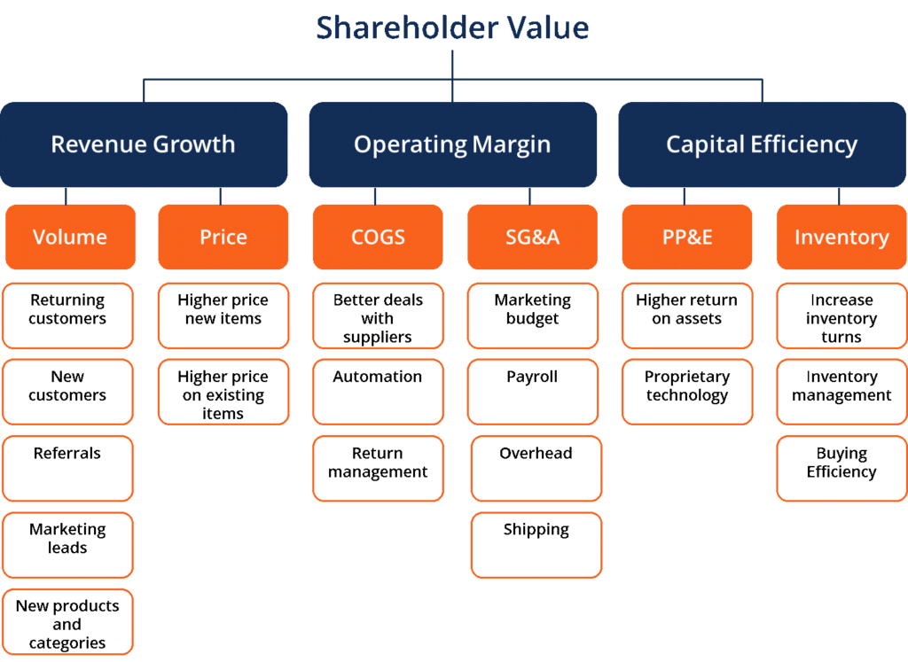

## Table of Contents

## What is shareholder value?

Shareholder value is the value that a company creates for its shareholders, who are the people that own parts of the company through stocks. When a company does well, it can increase the value of its stocks, which makes shareholders happy because their investments grow. Companies try to increase shareholder value by making more profits, growing their business, or giving money back to shareholders through dividends.

There are different ways companies can work on increasing shareholder value. They might focus on cutting costs to make more profit, or they might invest in new projects that could bring in more money in the future. Sometimes, companies buy back their own stocks, which can make each remaining stock worth more. The main goal is to make sure that the value of the company, and therefore the value of the stocks, goes up over time.

## Why is maximizing shareholder value important for a company?

Maximizing shareholder value is important for a company because it shows that the company is doing well and making money. When a company's stock price goes up, it means that the company is growing and making more profits. This makes shareholders happy because their investments are worth more. Happy shareholders are more likely to keep investing in the company, which gives the company more money to grow even more.

Also, when a company focuses on increasing shareholder value, it often has to make smart decisions about how to spend its money. This can mean finding ways to cut costs or investing in new projects that will make more money in the future. By doing these things, the company not only makes its shareholders richer but also becomes stronger and more successful in the long run.

## How is shareholder value measured?

Shareholder value is measured mainly by looking at the price of a company's stock. When the stock price goes up, it means the company is doing well and the value for shareholders is increasing. People often look at the total market value of a company, which is the stock price multiplied by the number of shares. This is called the market capitalization, and it shows how much the whole company is worth in the eyes of investors.

Another way to measure shareholder value is by looking at the dividends the company pays out. Dividends are payments the company gives to shareholders from its profits. If a company can keep paying good dividends, it shows that it is making money and sharing it with shareholders. Some people also look at other financial numbers like earnings per share, which tells you how much profit the company makes for each share of stock.

Overall, shareholder value is about how much money shareholders can get from their investment in the company. It's measured by the stock price, dividends, and other financial numbers that show how well the company is doing. When these numbers go up, it means the company is creating more value for its shareholders.

## What are the common strategies used to maximize shareholder value?

One common strategy to maximize shareholder value is to focus on increasing profits. Companies can do this by cutting costs, which means they spend less money to make their products or services. They might also try to sell more of what they make, either by finding new customers or by selling more to the customers they already have. When profits go up, the company can use that extra money to pay dividends to shareholders or to buy back its own stock, which can make each remaining share worth more.

Another strategy is to invest in growth. This means the company spends money on new projects or ideas that they think will bring in more money in the future. For example, they might start selling a new product or open up in a new country. If these new things work out, the company can grow bigger and make more money, which can make the stock price go up. This makes shareholders happy because their investment in the company becomes worth more.

Sometimes, companies also focus on improving how they manage their money. This can mean making sure they have enough cash to keep running smoothly, or it can mean borrowing money at a good rate to invest in new opportunities. By managing their money well, companies can make smart decisions that help them grow and make more profits, which in turn helps increase shareholder value.

## Can you explain the difference between short-term and long-term shareholder value maximization?

Short-term shareholder value maximization focuses on making quick profits and increasing the stock price right away. Companies might do things like cutting costs a lot, selling off parts of the business, or buying back their own stock to make the stock price go up fast. This can make shareholders happy in the short term because they see their investment grow quickly. But, these actions might not be good for the company in the long run. For example, cutting costs too much might mean the company can't grow or make new products, which could hurt it later.

Long-term shareholder value maximization is about making the company stronger and more successful over time. Instead of just focusing on quick profits, companies might invest in new projects, research, and development, or try to grow into new markets. These things might not make the stock price go up right away, but they can help the company make more money in the future. By thinking about the long term, the company can keep growing and making profits, which makes the stock price go up over time. This way, shareholders can see their investment grow steadily and become worth more in the long run.

## What role does corporate governance play in maximizing shareholder value?

Corporate governance is like the rules and ways a company is run. It helps make sure the company does things in a fair and open way, which can help increase shareholder value. Good corporate governance means having a strong board of directors who watch over the company and make sure it is doing what's best for shareholders. They make sure the company follows the law and treats everyone fairly. When shareholders see that a company is run well, they feel more confident in the company and are more likely to keep their money invested there, which can help the stock price go up.

Also, good corporate governance can help the company make better decisions. If the company has clear rules about how decisions are made and who gets to make them, it can avoid problems and make choices that help the company grow and make more money. This can mean investing in new projects or finding ways to save money. When the company makes smart decisions, it can make more profits, which makes shareholders happy because their investment grows. So, good corporate governance helps the company do well over time, which is good for shareholder value.

## How do dividends and stock buybacks impact shareholder value?

Dividends and stock buybacks are two ways companies can give money back to shareholders, and they can both impact shareholder value. Dividends are payments that companies make to shareholders from their profits. When a company pays a dividend, it gives shareholders a direct return on their investment. This can make shareholders happy because they get money without selling their stocks. If a company keeps paying good dividends, it can make the stock more attractive to investors, which can push the stock price up and increase shareholder value.

Stock buybacks are when a company buys its own stock from the market. When a company does this, it reduces the number of shares that are out there. With fewer shares, each remaining share becomes worth a bit more because the company's total value is spread over fewer pieces. This can make the stock price go up, which is good for shareholders because their investment becomes worth more. Also, if the company buys back its stock at a price lower than what it thinks the stock is really worth, it can be a smart way to use the company's money to increase shareholder value in the long run.

## What are the criticisms of the shareholder value maximization model?

Some people say that focusing too much on making shareholders happy can hurt other important things. For example, when companies try to make more money for shareholders, they might cut costs by laying off workers or paying them less. This can make life harder for employees and might not be fair. Also, companies might not spend money on things like protecting the environment or helping the community because those things don't make money right away. This can hurt the world around us and make people feel like the company doesn't care about anything but money.

Another problem is that trying to make shareholders happy quickly can lead to bad decisions. Companies might do things that make the stock price go up fast, but these things might not be good for the company in the long run. For example, they might borrow a lot of money to buy back their own stock, which can make the stock price go up right away but can also put the company in a lot of debt. This can make the company weaker and less able to grow in the future. So, while making shareholders happy is important, it's also important to think about other things like taking care of employees, the environment, and making smart decisions for the future.

## How does stakeholder theory contrast with shareholder value maximization?

Stakeholder theory says that a company should think about more than just making shareholders happy. It believes that companies should also care about other people who are affected by what the company does, like employees, customers, the community, and the environment. These are all called stakeholders. The idea is that if a company treats all these groups well, it can be successful in the long run. For example, if a company pays its workers fairly and treats them well, the workers will be happier and work harder, which can help the company make more money. Also, if a company helps the community and protects the environment, it can have a good reputation, which can attract more customers and make shareholders happy too.

On the other hand, shareholder value maximization focuses only on making money for shareholders. This means the company tries to do things that will make the stock price go up or pay out more dividends. While this can make shareholders happy in the short term, it might not be good for other stakeholders. For example, to make more profit, a company might cut costs by laying off workers or polluting the environment. This can hurt employees and the community, even if it makes shareholders richer. So, stakeholder theory says that companies should balance the needs of all stakeholders, not just focus on shareholders, to be truly successful and fair.

## What are some case studies of companies that successfully maximized shareholder value?

Apple is a good example of a company that has done a great job of making its shareholders happy. They did this by making products like the iPhone and iPad that a lot of people wanted to buy. Apple also made a lot of money from selling apps and services. They used this money to buy back their own stock, which made each share worth more. They also paid out dividends to shareholders. By focusing on making great products and using their profits wisely, Apple's stock price went up a lot, and shareholders saw their investments grow.

Another company that did well in making shareholders happy is Costco. Costco is known for selling things at low prices and treating its workers well. Even though they pay their employees more than other companies in their industry, Costco still makes a lot of profit. They do this by selling a lot of stuff and keeping costs low. Costco also pays dividends to its shareholders. By focusing on keeping customers and employees happy, Costco has been able to grow and make more money, which has made its stock price go up and increased shareholder value over time.

## How can a company balance shareholder value maximization with ethical considerations?

A company can balance making shareholders happy with doing the right thing by thinking about more than just money. They can do this by treating employees well, like paying them fairly and giving them good benefits. This makes employees want to work harder and stay with the company, which can help the company make more money in the long run. The company can also focus on being good to the environment, like using less energy or making products that are better for the planet. This can make the company look good to customers and investors who care about these things, which can help the stock price go up.

Another way is to be honest and open about what the company is doing. This means telling the truth about how the company is run and how it makes money. When shareholders and other people see that the company is doing things the right way, they are more likely to trust the company and keep investing in it. This trust can help the company grow and make more money, which is good for shareholders. By thinking about everyone who is affected by the company, not just shareholders, the company can make smart decisions that help it do well over time and still make shareholders happy.

## What advanced financial metrics should be used to assess and enhance shareholder value?

To assess and enhance shareholder value, companies often look at a few advanced financial metrics. One important metric is the Return on Equity (ROE), which shows how well a company is using the money shareholders have invested to make profits. A higher ROE means the company is doing a good job of turning shareholder money into more money. Another useful metric is Economic Value Added (EVA), which measures how much value a company creates after paying for the cost of the money it uses. If a company's EVA is positive, it means the company is making more money than it costs to run the business, which is good for shareholders.

Another metric to consider is the Price/Earnings (P/E) ratio, which compares the price of a company's stock to how much profit it makes. A higher P/E ratio can mean that investors think the company will grow a lot in the future, which can make the stock price go up. Companies can also look at the Free Cash Flow (FCF), which is the money left over after the company pays for everything it needs to keep running. Having a lot of free cash flow means the company can invest in new projects, pay dividends, or buy back its own stock, all of which can help increase shareholder value. By keeping an eye on these metrics, companies can make smart decisions to grow and make more money for shareholders.

## What is Understanding Shareholder Value?

Shareholder value is a fundamental concept in corporate finance and management, representing the wealth delivered to the owners of a corporation. This value is intrinsically connected to an increase in sales, earnings, and free cash flow, all of which contribute to the appreciation of the company's share price and its dividend-paying capacity. An increase in these financial metrics typically results in a higher share price, directly benefitting shareholders through capital gains and potential dividend payouts.

Mathematically, shareholder value can be depicted through the formula for a company's market value:

$$
\text{Market Value} = \text{Share Price} \times \text{Total Number of Outstanding Shares}
$$

This formula underscores the importance of share price in determining a company's value in the eyes of its shareholders. A rising share price indicates enhanced company performance, attracting more investors. Companies consistently focus on strategic decision-making to maximize shareholder value. This involves pursuing initiatives that foster profitability and growth over time, such as optimizing operational efficiency, expanding market share, and innovating product offerings.

The imperative to maximize shareholder value is anchored in its profound implications for a company's financial health. A strong correlation exists between a corporation's value-driven actions and its stability, access to capital, and competitive standing. A robust approach to increasing shareholder value not only satisfies existing investors but also enhances the company's appeal to prospective shareholders, thus facilitating [capital raising](/wiki/hedge-fund-capital-raising) efforts.

Efforts to increase shareholder value may involve strategic cost management, revenue growth strategies, asset utilization efficiency, and judicious capital allocation. The comprehensive understanding and effective management of these factors enable companies to strengthen their financial performance, which is reflected in heightened shareholder satisfaction and increased market capitalization.

Ultimately, maximizing shareholder value requires a harmonious blend of solid corporate governance, strategic foresight, and operational excellence. As such, it is a key objective for companies aiming to ensure their long-term growth, sustainability, and resilience in a competitive business environment.

## References & Further Reading

[1]: Friedman, M. (1970). ["The Social Responsibility of Business is to Increase its Profits,"](https://www.nytimes.com/1970/09/13/archives/a-friedman-doctrine-the-social-responsibility-of-business-is-to.html) The New York Times Magazine.

[2]: "Financial Markets and Corporate Strategy" by David Hillier, Mark Grinblatt, and Sheridan Titman (Link to Book)

[3]: Thaler, R. H. (1980). ["Toward a Positive Theory of Consumer Choice,"](https://www.sciencedirect.com/science/article/pii/0167268180900517) Journal of Economic Behavior & Organization.

[4]: Jensen, M. C. (1986). ["Agency Costs of Free Cash Flow, Corporate Finance, and Takeovers,"](https://www.jstor.org/stable/1818789) American Economic Review, 76(2), 323-329.

[5]: "The Theory of Corporate Finance" by Jean Tirole (Link to Book)

[6]: Mendelson, H. (1987). ["Economics of Information and Electronic Markets,"](https://www.jstor.org/stable/pdf/2328369.pdf) Management Science, 33(9), 1060-1078.

[7]: Fama, E. F. (1970). ["Efficient Capital Markets: A Review of Theory and Empirical Work,"](https://www.jstor.org/stable/2325486) Journal of Finance.

[8]: Sharpe, W. F. (1964). ["Capital Asset Prices: A Theory of Market Equilibrium under Conditions of Risk,"](https://onlinelibrary.wiley.com/doi/full/10.1111/j.1540-6261.1964.tb02865.x) Journal of Finance, 19(3), 425-442.

[9]: Shleifer, A., & Vishny, R. W. (1997). ["A Survey of Corporate Governance,"](https://onlinelibrary.wiley.com/doi/abs/10.1111/j.1540-6261.1997.tb04820.x) Journal of Finance, 52(2), 737-783.