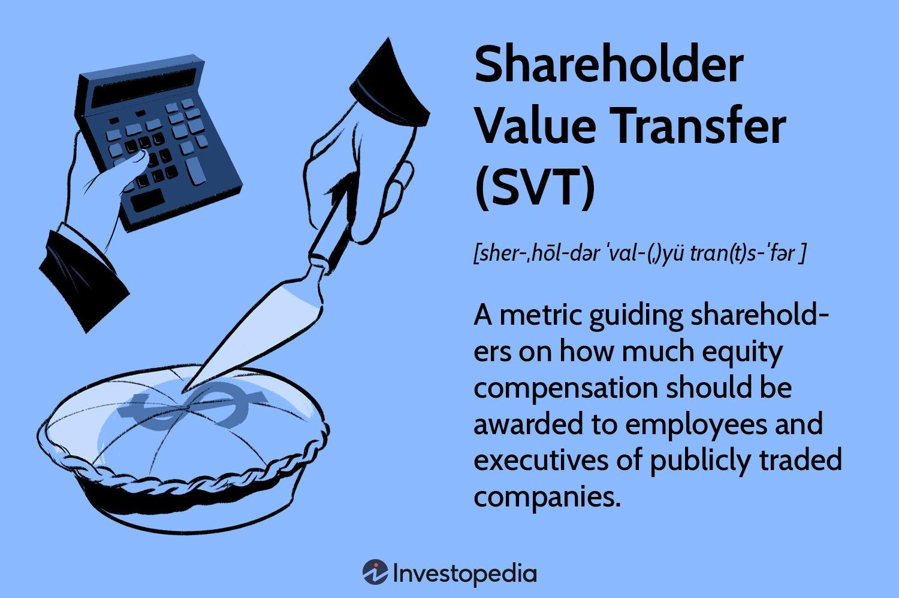

The modern corporate finance landscape is undergoing significant transformation due to technological advancements and changing market dynamics. These changes are influencing key elements such as Shareholder Value Transfer (SVT), shareholder value, and algorithmic trading. Each of these components plays a vital role in shaping corporate strategies and enhancing shareholder returns. 

Shareholder Value Transfer is a concept that refers to the redistribution of value among shareholders, typically impacted by corporate actions like mergers, acquisitions, and equity compensation plans. Calculating SVT accurately is crucial for understanding its implications on shareholder wealth, particularly in terms of dilution or value enhancement. Institutional Shareholder Services (ISS) plays an important role in setting the benchmarks and best practices for SVT calculations, ensuring transparency and fairness in the market.

Algorithmic trading, on the other hand, has revolutionized the way financial markets operate by automating trading strategies and execution processes. The use of advanced algorithms increases the speed and efficiency of trade executions, minimizing human error and leveraging data analysis to optimize outcomes. This technological integration not only enhances the liquidity and stability of markets but also impacts shareholder value by refining investment strategies and improving return potentials.

Transfer agents maintain shareholder records and facilitate seamless securities transfers, dividend distributions, proxy voting, and handling corporate actions such as mergers and acquisitions. Through ensuring regulatory compliance and maintaining market integrity, they establish a stable environment for shareholders and corporations alike. 

Understanding the interactions among these elements is crucial for stakeholders who aim to refine corporate strategies and advance shareholder returns. By adopting advanced technologies, corporations can improve data accuracy, reduce errors, and comply with regulatory frameworks more effectively. This strategic alignment is essential for maintaining a competitive edge in the fast-evolving financial services industry and achieving sustainable growth.

## Table of Contents

## Shareholder Value Transfer: Concepts and Calculations

Shareholder Value Transfer (SVT) is a pivotal concept in corporate finance, primarily concerning the distribution of value from shareholders to other stakeholders, often through mechanisms such as equity compensation plans. SVT is critical in assessing the extent to which shareholders' worth is affected over time, especially when companies issue additional equity to compensate executives and employees.

The calculation of SVT involves comparing the performance value transferred to employees through stock awards and options against the value created or diluted for existing shareholders. This is an essential measure, as it directly impacts shareholder equity and perceived value. Although different methodologies can assess SVT, a popular approach is a detailed analysis of the costs associated with equity compensation plans, the potential for dilution, and how these elements are offset by the anticipated value creation from incentivized employee performance.

A crucial player in determining industry standards for SVT is the Institutional Shareholder Services (ISS). ISS is well-regarded for its guidelines that influence corporate governance practices, particularly concerning compensation policies. Their benchmarks provide a framework for companies to align their compensation strategies with shareholder interests, ensuring that any transfer of value through equity compensation is justified by the performance and strategic goals achieved.

Equity compensation plans have significant implications on SVT. These plans can lead to shareholder dilution, where the ownership percentage of existing shareholders decreases as new shares are issued. The dilution results in reduced earnings per share and, potentially, a decline in the share price if the market perceives the dilution as unjustified. Therefore, well-designed compensation plans are crucial not only to align management incentives with shareholder objectives but also to ensure that any transfer of value results in net positive outcomes for shareholders.

Addressing the challenges posed by SVT means carefully balancing the benefits of equity incentives against the costs of shareholder dilution. This involves transparent reporting and communication with shareholders to justify the value transferred through these compensation mechanisms. Consequently, SVT serves as a vital tool in managing shareholder relations and ensuring that corporate strategies remain aligned with long-term value creation objectives.

## The Role of Transfer Agents in Corporate Finance

Transfer [agents](/wiki/agents) play a pivotal role in the infrastructure of corporate finance by managing and maintaining accurate shareholder records. Their primary function involves the efficient processing and facilitation of securities transfers. By maintaining these records, transfer agents ensure that the issuance, cancellation, and exchange of securities are accurately recorded, which is essential for both the company and its shareholders.

One of the key responsibilities of transfer agents is managing dividend distributions. They ensure that dividends are calculated correctly and distributed to eligible shareholders promptly. This process includes verifying shareholder entitlements and maintaining an accurate distribution schedule, which is critical for investor satisfaction and corporate reputation.

Transfer agents are also integral to the facilitation of proxy voting. They coordinate the distribution of proxy materials and ensure that shareholders can exercise their voting rights in corporate governance decisions. By doing so, transfer agents promote transparency and shareholder engagement in the company's decision-making processes.

Corporate actions such as mergers and acquisitions often require significant changes to shareholder records. Transfer agents manage these transitions by updating records and facilitating the smooth exchange of securities. This function helps mitigate risks associated with shareholder dilution and ensures that all regulatory requirements are met.

In addition to these operational functions, transfer agents contribute to market integrity by ensuring compliance with regulatory standards. They must adhere to local and international securities regulations, such as the Sarbanes-Oxley Act in the United States. This compliance is critical in upholding investor confidence and maintaining the overall stability of financial markets.

Transfer agents serve as a bridge between corporations and their shareholders, ensuring that transactions are executed with accuracy and efficiency. Their role in maintaining market integrity and facilitating corporate actions reinforces the trust that is essential for the smooth functioning of financial markets.

## Algorithmic Trading: Revolutionizing Shareholder Value

Algorithmic trading refers to the use of computer algorithms to automatically make trading decisions, submit orders, and manage portfolios. It has gained significant traction in financial markets due to its ability to execute trades at speeds and efficiencies unattainable by human traders. The prevalence of [algorithmic trading](/wiki/algorithmic-trading) has been fueled by advancements in technology and the growing complexity of financial markets.

At its core, algorithmic trading is driven by pre-programmed instructions that can [factor](/wiki/factor-investing) in variables such as price, timing, and [volume](/wiki/volume-trading-strategy). This approach enhances the speed of trade execution, a crucial factor in today's high-frequency trading environments. When considering Shareholder Value Transfer (SVT), which involves shifts in value among shareholders due to corporate activities like equity compensation plans, algorithmic trading can significantly impact how swiftly and accurately such transfers are reflected in market prices.

The strategic advantage of algorithmic trading in executing orders lies in its ability to process large volumes of data and execute trades at high speeds, thereby reducing the market impact and aligning with optimal price strategies. For instance, algorithms can be used to deploy strategies such as volume-weighted average price (VWAP) or time-weighted average price (TWAP) to minimize the effect on the market while maximizing execution efficiency.

However, the incorporation of algorithmic trading also presents several challenges, particularly for transfer agents responsible for maintaining accurate shareholder records and facilitating securities transfers. As trades occur increasingly faster, transfer agents must enhance their systems to ensure that post-trade processes such as settlement, record-keeping, and compliance with regulatory standards are not compromised.

Opportunities for transfer agents arise in the form of integrating innovative technologies like blockchain and [artificial intelligence](/wiki/ai-artificial-intelligence), which can streamline operations and enhance data accuracy. This integration can facilitate real-time updates to shareholder records, drastically reducing errors and ensuring compliance with regulations such as the Securities Exchange Act. These advancements enable transfer agents to adapt to the rapid developments in algorithmic trading, ensuring they contribute effectively to market integrity.

In conclusion, algorithmic trading is a transformative force in modern financial markets, revolutionizing trade execution and impacting shareholder value mechanisms like SVT. While it presents operational challenges for transfer agents, there are significant opportunities for these entities to leverage technological advancements to enhance their efficiency and compliance capabilities. The continued evolution of algorithmic trading paves the way for more sophisticated market interactions and demands strategic adaptations from all stakeholders involved.

## Enhancing Shareholder Value through Technological Integration

The integration of advanced technologies in financial operations is pivotal for enhancing shareholder value, particularly for transfer agents and traders. By leveraging technology, these financial intermediaries can optimize their operational efficiency, reduce errors, and ensure compliance with stringent regulatory frameworks.

Advanced technologies such as blockchain, artificial intelligence (AI), and [machine learning](/wiki/machine-learning) (ML) contribute significantly to improving data accuracy. Blockchain technology, for instance, offers a decentralized ledger system that ensures data integrity and transparency. By recording securities transfers and shareholder transactions on an immutable ledger, transfer agents can minimize discrepancies and fraudulent activities. Moreover, AI and ML algorithms analyze vast datasets to identify patterns and anomalies that may suggest errors or irregular activities, promoting accuracy and efficiency in data processing.

Error reduction is another critical benefit of technological integration. Automated systems reduce the dependency on manual processes, significantly lowering the risk of human error. For example, smart contracts, which are self-executing contracts with the terms directly written into code, automatically enforce the performance of corporate actions like dividend distributions and shareholder meetings. This automation ensures precision and timeliness, thus enhancing the quality of service provided to shareholders.

Compliance with regulatory frameworks is a paramount concern for financial entities. Technologies such as RegTech solutions employ AI-driven analytics to monitor transactions in real-time, identifying any activity that deviates from compliance standards. These solutions help transfer agents and traders adhere to the regulatory requirements set by governing bodies like the Securities and Exchange Commission (SEC) or the Financial Industry Regulatory Authority (FINRA), thereby contributing to market integrity and maintaining the trust of shareholders.

Technological investments are crucial for maintaining a competitive edge in the financial services industry. As markets evolve and new technologies emerge, firms that adopt these advancements position themselves better against competitors. Investment in technology not only streamlines operations but also enhances the ability to offer innovative services that meet the ever-changing demands of shareholders and investors.

In conclusion, integrating advanced technologies into financial operations is essential for transfer agents and traders aiming to enhance shareholder value. By improving data accuracy, reducing errors, and ensuring compliance, these technologies play a crucial role in facilitating efficient and reliable financial services. Such investments in technology are indispensable for financial entities to remain competitive and agile in a dynamic market environment.

## Conclusion: The Synergy of Corporate Finance Elements

In the rapidly evolving landscape of corporate finance, the integration of Shareholder Value Transfer (SVT), transfer agents, and algorithmic trading plays a pivotal role in shaping modern financial strategies. These elements collectively contribute to optimizing shareholder value and enhancing the efficiency of trading processes.

SVT serves as a critical measure in assessing how corporate decisions impact shareholder wealth. It provides a framework to evaluate equity compensation plans, shareholder dilution, and the distribution of value to shareholders. This metric is vital for stakeholders who aim to align corporate actions with the broader goal of maximizing shareholder returns. Institutional Shareholder Services (ISS) often sets benchmarks that guide companies in assessing their SVT, thus influencing corporate governance and strategic financial planning.

Transfer agents are integral in maintaining accurate shareholder records, facilitating the smooth transfer of securities, and ensuring the proper execution of corporate actions such as mergers and acquisitions. Their role extends to managing dividend distributions and providing support for proxy voting processes. By fulfilling these functions, transfer agents help maintain market integrity and ensure compliance with regulatory standards, thereby reinforcing investor confidence.

Algorithmic trading, characterized by its ability to execute trades with exceptional speed and precision, has revolutionized the trading environment. Its efficiency in processing large volumes of transactions impacts SVT significantly by potentially reducing transaction costs and improving [liquidity](/wiki/liquidity-risk-premium). However, it also presents challenges to transfer agents, who must adapt to maintaining accurate records at an accelerated pace while adhering to compliance requirements.

As technological advancements continue to reshape the corporate finance landscape, companies must embrace these changes to optimize operations and enhance shareholder value. Integrating advanced technologies such as blockchain and artificial intelligence can improve data accuracy, minimize errors, and ensure adherence to regulatory frameworks. These innovations not only help maintain a competitive edge but also align financial operations with broader corporate goals.

Looking ahead, future trends in corporate finance are likely to emphasize the strategic alignment of technology and financial operations. This alignment ensures that companies can respond swiftly to market dynamics and evolving stakeholder expectations. By prioritizing technological investments and operational synergies, businesses can position themselves to capitalize on opportunities and mitigate risks in an increasingly complex financial ecosystem.

## References & Further Reading

1. Brigham, E. F., & Houston, J. F. (2018). *Fundamentals of Financial Management*. Cengage Learning. This book provides a comprehensive overview of corporate finance principles, including detailed discussions on shareholder value and financial strategies.

2. Brealey, R. A., Myers, S. C., & Allen, F. (2020). *Principles of Corporate Finance*. McGraw-Hill Education. A key resource that covers the foundational aspects of corporate finance, offering insights into market dynamics, equity compensation, and shareholder value maximization.

3. "Algorithmic Trading: Next-Generation Trade Execution" (2021). Investopedia. [Investopedia Article on Algorithmic Trading](https://www.investopedia.com/terms/a/algorithmictrading.asp). This article explores the definition and impact of algorithmic trading in modern financial markets and its influence on trading efficiency.

4. Institutional Shareholder Services (ISS) Guidelines (2023). Available at [issgovernance.com](https://www.issgovernance.com/policy-gateway/). ISS provides guidelines that are instrumental in calculating Shareholder Value Transfer and evaluating equity compensation plans.

5. Securities Transfer Association (2022). *The Role and Responsibilities of Transfer Agents.* [Securities Transfer Association](https://www.stai.org/). This publication outlines the critical functions of transfer agents in managing shareholder records and ensuring compliance with regulatory standards.

6. Hull, J. (2018). *Options, Futures, and Other Derivatives*. Pearson. This book offers an in-depth analysis of derivatives markets, which are integral to understanding algorithmic trading and its impact on shareholder value.

7. "Technological Advances in Financial Services" (2022). Financial Times. [Financial Times Article on Technology in Finance](https://www.ft.com/content/tecnho6-8hs7-234j-tyu7-uy7sdfiuc). Discusses the role of technology in transforming financial operations, highlighting the importance of data accuracy and compliance.

8. CFA Institute. *Investment Foundations Program*. This program provides a solid foundation in investment management, including comprehensive coverage of financial instruments, market structures, and valuation methods pivotal for enhancing shareholder value.

9. Bodie, Z., Kane, A., & Marcus, A. J. (2019). *Investments*. McGraw-Hill Education. A detailed exploration of investment theories and practices, including the interplay between market forces and corporate finance strategies.

10. "The Future of Corporate Finance" (2023). Harvard Business Review. [HBR Article on Corporate Finance Trends](https://hbr.org/2023/01/the-future-of-corporate-finance). The article predicts future trends in corporate finance, emphasizing the strategic importance of integrating technology to enrich shareholder value and operational efficiency.

