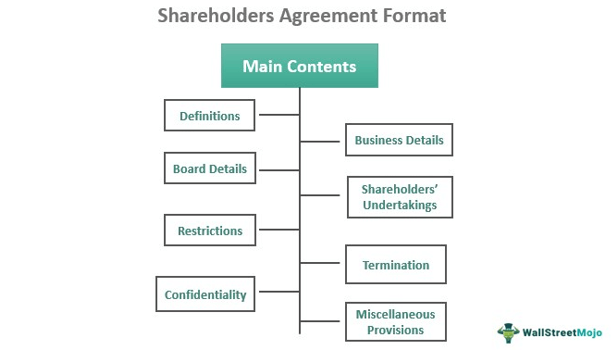

## Table of Contents

## What is a shareholders' agreement?

A shareholders' agreement is a contract between the owners of a company that outlines how the company should be run and how decisions should be made. It helps to prevent disagreements by setting clear rules about what shareholders can and cannot do. This agreement is important because it protects the rights of all shareholders, big or small, and makes sure everyone knows what to expect.

The agreement usually covers things like how shares can be bought or sold, how profits are shared, and how decisions are made at meetings. It can also include rules about what happens if a shareholder wants to leave the company or if someone wants to buy the company. By having these rules written down, shareholders can avoid conflicts and keep the business running smoothly.

## Why is a shareholders' agreement important for a company?

A shareholders' agreement is important for a company because it helps keep everything fair and clear for everyone who owns part of the business. It's like a set of rules that everyone agrees to follow. This agreement makes sure that all shareholders know what they can and cannot do, which helps prevent fights and misunderstandings. For example, it can say how decisions are made, how profits are split, and what happens if someone wants to sell their shares.

Having a shareholders' agreement also protects the company and its owners. If there's ever a disagreement or a big decision to make, the agreement gives a clear way to solve problems. This can be really helpful, especially if the company grows or if new shareholders join. It makes sure that the company can keep running smoothly, even when things change. So, a shareholders' agreement is a key tool for keeping the business strong and stable.

## What are the key sections typically included in a shareholders' agreement?

A shareholders' agreement usually has several important parts. One key section is about how shares can be bought and sold. This part can say who can buy shares, how much they have to pay, and what happens if someone wants to sell their shares. It might also include rules about what happens if a shareholder passes away or wants to leave the company. This helps keep the company stable and makes sure that shares don't end up in the wrong hands.

Another important section is about how decisions are made. This part can explain how votes are counted at meetings, what kinds of decisions need everyone's agreement, and who gets to be on the board of directors. It can also cover how often meetings should happen and what shareholders need to be told about. This helps everyone know their rights and makes sure the company is run fairly.

The agreement often includes sections about sharing profits and handling disagreements too. It can say how profits are split among shareholders and what happens if there's a conflict. This might include ways to solve problems without going to court, like using a mediator. By having these rules written down, shareholders can avoid fights and keep the business running smoothly.

## How does a shareholders' agreement differ from a company's articles of association?

A shareholders' agreement and a company's articles of association are both important documents, but they are used for different things. The articles of association are like the basic rules that every company has to follow. They are a public document that says how the company is set up, how shares work, and how meetings should be run. Every company has to have articles of association, and they are usually filed with the government.

On the other hand, a shareholders' agreement is a private contract between the shareholders. It goes into more detail about how the shareholders want to run the company and handle specific situations. This agreement can include rules about buying and selling shares, sharing profits, and solving disagreements. Because it's a private document, it can be changed more easily than the articles of association, which need a special vote to change.

In short, while the articles of association set out the basic structure and rules for all companies, the shareholders' agreement is more flexible and can be tailored to the specific needs and wishes of the shareholders. Both documents work together to help run the company smoothly, but they serve different purposes and have different levels of detail and flexibility.

## What is the purpose of the 'pre-emption rights' section in a shareholders' agreement?

The 'pre-emption rights' section in a shareholders' agreement is there to give existing shareholders the first chance to buy any shares that are going to be sold. This helps keep control of the company in the hands of the current owners. If a shareholder wants to sell their shares, they have to offer them to the other shareholders first, before selling them to someone outside the company. This way, the existing shareholders can decide if they want to buy the shares and keep their ownership percentage the same.

This section is important because it can stop the company from changing too much. If new people keep buying shares, the company might start to be run differently, which could be a problem for the original shareholders. By giving existing shareholders the first chance to buy, the pre-emption rights help keep the company stable and make sure that everyone knows who owns what. It's a way to protect the shareholders and the company's future.

## Can you explain the 'drag-along and tag-along rights' and their significance in a shareholders' agreement?

Drag-along and tag-along rights are important parts of a shareholders' agreement that help protect shareholders when the company is being sold. Drag-along rights let the majority shareholders force the minority shareholders to join in the sale of the company. This means if someone wants to buy the whole company, the majority shareholders can make sure everyone sells their shares, so the buyer can own all of it. This is helpful because it makes it easier to sell the company without having some shareholders hold things up.

Tag-along rights, on the other hand, protect the minority shareholders. If the majority shareholders are selling their shares to a buyer, tag-along rights let the minority shareholders join the sale and sell their shares too. This way, the minority shareholders can get the same price and terms as the majority shareholders. It's important because it stops the majority from selling their shares and leaving the minority with a new owner they might not want. Both rights help keep things fair and make sure everyone's interests are looked after when the company is sold.

## What should be considered when drafting the 'dispute resolution' section of a shareholders' agreement?

When drafting the 'dispute resolution' section of a shareholders' agreement, it's important to think about how to solve disagreements without going to court. This section should lay out clear steps for dealing with problems between shareholders. You might want to include using a mediator, someone who helps both sides talk and find a solution. It's also a good idea to say how long each step should take, so disagreements don't drag on and hurt the company.

Another thing to consider is what happens if the dispute resolution steps don't work. The agreement should say if the next step is to go to court or to use arbitration, where a neutral person makes a final decision. It's helpful to be clear about who pays for these steps and how the costs are shared. By planning ahead, you can make sure that even if shareholders disagree, the company can keep running smoothly and everyone knows what to expect.

## How can a shareholders' agreement protect minority shareholders?

A shareholders' agreement can protect minority shareholders by giving them specific rights and protections that help keep things fair. One way it does this is through tag-along rights. If the majority shareholders want to sell their shares, tag-along rights let the minority shareholders join the sale and get the same price and terms. This stops the majority from selling their shares and leaving the minority with a new owner they might not want. Another way is through pre-emption rights, which give existing shareholders the first chance to buy any shares that are going to be sold. This helps minority shareholders keep their ownership percentage the same and stops the company from changing too much.

The agreement can also include rules about how decisions are made, which can protect minority shareholders. For example, it might say that certain big decisions need a higher percentage of votes, so the minority has a say in important choices. The dispute resolution section can also help by setting clear steps for solving disagreements without going to court. This makes sure that even if there's a problem, the minority shareholders have a way to be heard and the company can keep running smoothly. By having these rules written down, a shareholders' agreement helps make sure that everyone's interests are looked after, even if they own a smaller part of the company.

## What are the implications of the 'non-compete clause' in a shareholders' agreement?

A non-compete clause in a shareholders' agreement stops shareholders from starting or working for a business that competes with the company. This clause is there to protect the company's secrets and keep it strong. If a shareholder leaves, they can't use what they know about the company to help a rival business. This helps make sure that the company stays safe and can keep growing without worrying about competition from inside.

The non-compete clause can also affect what shareholders can do while they are still part of the company. It might stop them from working on other projects that could take business away from the company. This can be good because it keeps everyone focused on making the company successful. But it can also be hard for shareholders because it limits what they can do outside of the company. So, it's important to make sure the clause is fair and clear so everyone knows what they can and can't do.

## How do 'voting rights and decision making' sections impact the governance of a company?

The 'voting rights and decision making' sections in a shareholders' agreement are very important for how a company is run. These sections explain how shareholders can vote on things like who gets to be on the board of directors, how to share profits, and big changes to the company. By setting clear rules, these sections help make sure that everyone knows how decisions are made. This can stop arguments and keep the company running smoothly. If the agreement says that some decisions need more votes, it can give smaller shareholders a chance to have a say in important choices.

Having these rules written down also helps keep things fair and clear for everyone. If there's ever a disagreement about how to do something, the shareholders can look at the agreement to see what to do. This can make it easier to solve problems without going to court. By making sure everyone knows their rights and how decisions are made, the 'voting rights and decision making' sections help the company stay strong and work well together.

## What legal considerations must be taken into account when amending a shareholders' agreement?

When you want to change a shareholders' agreement, you need to think about the law. First, you have to check if the agreement itself says how it can be changed. Most agreements have a section that explains what steps you need to take, like getting a certain number of votes from shareholders. You also need to make sure that any changes follow the laws of the place where the company is based. This might mean talking to a lawyer to make sure everything is done right.

Another thing to think about is how the changes might affect the company and the shareholders. If the changes are big, you might need to tell everyone about them and maybe even get their agreement. It's important to be clear and fair so that no one feels left out or unhappy. By taking these legal steps seriously, you can make sure that the changes to the shareholders' agreement are done the right way and help keep the company running smoothly.

## Can you provide a detailed example of a shareholders' agreement that includes all key sections?

Imagine a small tech company called TechGrow Inc., and its shareholders decide to create a shareholders' agreement to keep things fair and clear. The agreement starts with a section about how shares can be bought and sold. It says that if a shareholder wants to sell their shares, they have to offer them to the other shareholders first, thanks to the pre-emption rights. The agreement also includes a non-compete clause, which stops shareholders from starting or working for a business that competes with TechGrow Inc. This helps protect the company's secrets and keep it strong. The agreement also talks about how profits are shared, saying that profits will be divided based on how many shares each person owns.

The next part of the agreement is all about voting rights and decision making. It explains that shareholders get one vote for each share they own, and big decisions like changing the company's direction or selling the company need a special majority of votes. This gives even the smaller shareholders a chance to have a say in important choices. The agreement also has a section on dispute resolution, which says that if shareholders disagree, they should first try to solve the problem with a mediator. If that doesn't work, they can go to arbitration, where a neutral person makes a final decision. This helps keep disagreements from hurting the company. Finally, the agreement includes drag-along and tag-along rights to protect everyone if the company is sold. Drag-along rights let the majority shareholders force the minority to join the sale, while tag-along rights let minority shareholders join the sale and get the same price as the majority.

By having all these sections in the shareholders' agreement, TechGrow Inc. makes sure that everyone knows what to expect and how to handle different situations. This helps keep the company running smoothly and protects the rights of all shareholders, big or small.

## References & Further Reading

[1]: Mallin, Christine. ["Corporate Governance."](https://www.amazon.com/Corporate-Governance-6e-Christine-Mallin/dp/0198806760) Oxford University Press, 2018.

[2]: Bebchuk, Lucian A., and Michael S. Weisbach. ["The State of Corporate Governance Research."](https://www.nber.org/system/files/working_papers/w15537/w15537.pdf) Review of Financial Studies, 2010.

[3]: Lopez de Prado, Marcos. ["Advances in Financial Machine Learning."](https://www.amazon.com/Advances-Financial-Machine-Learning-Marcos/dp/1119482089) Wiley, 2018.

[4]: Chan, Ernest P. ["Quantitative Trading: How to Build Your Own Algorithmic Trading Business."](https://github.com/ftvision/quant_trading_echan_book) Wiley, 2009.

[5]: Davies, Paul L. ["Introduction to Company Law."](https://www.amazon.com/Introduction-Company-Law-Clarendon/dp/0199207763) Oxford University Press, 2010.

[6]: Hsieh, David A., Stephen F. Gray, and David M. Lucas. ["Evidence on the Behavior of Professional Traders: Algorithmic versus Human Trading."](https://superlogos.fandom.com/wiki/Disney%27s_Who_Framed_Roger_Rabbit_Credits) Journal of Financial and Quantitative Analysis, 1990.

[7]: Jansen, Stefan. ["Machine Learning for Algorithmic Trading."](https://github.com/stefan-jansen/machine-learning-for-trading) Packt Publishing, 2020.