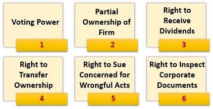

In today's fast-paced financial market, understanding the roles of investors, shareholders, and stockholders is crucial for anyone looking to venture into trading or finance. These roles form the backbone of financial systems, influencing decision-making processes and driving market trends. This article will explore the nuances distinguishing investors, shareholders, and stockholders, offering a clearer understanding of their respective significance.

The rapid evolution of technology has dramatically impacted investment strategies, leading to more sophisticated and efficient practices. Among these advancements, algorithmic trading, or algo trading, has emerged as a pivotal component of modern investment tactics. By using complex mathematical models and software, traders can execute transactions at lightning speed, reshaping the landscape of financial markets.



Grasping these concepts is essential for navigating the complexities of the stock market. As technological advances continue to intertwine with traditional investment approaches, mastering the balance between these elements becomes vital. Join us in examining the financial markets' intricacies and the synergy between conventional investing practices and cutting-edge technological developments. Understanding these dynamics will empower you to make well-informed, strategic investment decisions in an ever-evolving economic environment.

## Table of Contents

## Understanding Investors, Shareholders, and Stockholders

Investors, shareholders, and stockholders are key terms in the financial world, frequently used interchangeably, but each carries a distinct meaning and role within the investment ecosystem. An investor is broadly defined as any individual or entity that allocates capital with the expectation of future financial returns. This encompasses a diverse group, including individuals saving for retirement, venture capitalists, and institutional investors like pension funds and insurance companies. The returns sought by investors can come in various forms, such as interest, dividends, or potential capital appreciation.

On the other hand, shareholders and stockholders refer specifically to individuals or entities that own shares (or stock) in a corporation. These stakeholders have specific rights and responsibilities that differentiate them from the broader category of investors. Ownership of stock in a corporation typically confers the right to vote at shareholder meetings, where essential company decisions are made, and the right to receive dividends if the corporation decides to distribute profits.

The distinction between investors and shareholders is crucial in understanding market dynamics and investment strategies. While all shareholders are investors, not all investors are necessarily shareholders. For instance, a bond investor commits capital to debt securities, expecting regular interest payments, without obtaining ownership rights in the company.

The rights associated with being a shareholder can significantly influence corporate governance and investment outcomes. Shareholders have the power to impact management decisions, elect board members, and approve mergers and acquisitions through their voting rights. This influence can lead to changes in corporate strategies that may impact the company's financial performance and, consequently, the stock's value.

Moreover, the role of shareholders has evolved with advancements in technology and financial markets. The rise of proxy voting and electronic platforms has made it easier for shareholders to exercise their rights and engage with corporations on governance issues.

In summary, understanding the nuances between investors, shareholders, and stockholders is essential for anyone participating in financial markets. Recognizing these roles and how they can influence corporate actions and investment strategies is vital for making informed investment decisions and understanding the broader market environment.

## Types of Shareholders and Stockholders

Shareholders, the individuals or entities owning a stake in a corporation, are primarily categorized based on the type and quantity of their stock holdings: common shareholders and preferred shareholders. These categories define the rights, privileges, and obligations of the shareholders and significantly influence corporate governance and market dynamics.

### Common Shareholders

Common shareholders own common stock, which often includes voting rights, allowing them to participate in electing the board of directors and influencing key corporate policies. These shareholders hold the potential to receive dividends, which are profits distributed by the company. However, the board decides on the frequency and amount of these dividends. Importantly, common shareholders are the last to receive assets during company liquidation, after debt holders and preferred shareholders have been compensated. This position indicates a higher risk but is offset by potentially higher rewards through capital gains and dividends.

### Preferred Shareholders

Preferred shareholders possess preferred stock, characterized by customarily fixed dividend payments and priority over common shareholders for dividend distribution and asset claims during liquidation. Despite typically lacking voting rights, preferred shareholders enjoy more stability because the dividends are often predetermined and do not fluctuate based on company profits. This distinction offers them a lower-risk investment compared to common shareholders. In some corporations, preferred shareholders have rights that enable conversion to a specific number of common shares, integrating the potential for capital appreciation.

### Institutional Investors

Institutional investors, encompassing entities like mutual funds, pension funds, and insurance companies, often comprise significant shareholders with substantial influence over corporate governance due to their large [volume](/wiki/volume-trading-strategy) of stock ownership. Their involvement in the market can introduce stability and [liquidity](/wiki/liquidity-risk-premium) and sometimes sway company decisions owing to their collective voting power. Institutional investors bring a depth of analysis and resources, typically holding diversified portfolios, which can provide market steadiness even amid [volatility](/wiki/volatility-trading-strategies). Their participation extends beyond mere ownership, as they often engage with company management to ensure performance aligns with their investment goals and risk appetites.

### Impact on Corporate Governance and Market Dynamics

Different classes of shareholders contribute dynamically to corporate governance and market behavior. Common shareholders, with their variable dividends and voting rights, often influence corporate decisions aimed at boosting short-term stock performance. In contrast, preferred shareholders prioritize regular income and stability, impacting corporate policies on profit allocation. Institutional investors bring potent analytical capabilities and resources, sometimes guiding corporate strategies, governance structures, and regulatory compliance frameworks.

Such classifications frame the broader financial environment, where varied shareholder motives—ranging from immediate profit-sharing to long-term capital appreciation—interact, underpinning the complexities of market operations and corporate management. Understanding these shareholder categories thus equips one with insights into how corporate decisions are shaped and how market dynamics respond to shareholder actions.

## Algorithmic Trading: A Revolution in the Investment World

Algorithmic trading, also known as algo trading, represents a significant shift in the way financial markets operate today. By leveraging advanced computational algorithms, traders can automate the process of buying and selling securities, enhancing the speed and accuracy of transactions. This automation reduces the need for human intervention, effectively diminishing room for error and significantly lowering transaction costs. The increased efficiency brought about by algo trading allows traders to execute orders at speeds and volumes unimaginable in traditional trading settings.

Institutional investors, including hedge funds and asset management firms, primarily utilize [algorithmic trading](/wiki/algorithmic-trading) to handle large-scale stock transactions. By employing algorithms, these entities can manage and optimize extensive portfolios, ensuring that trades are executed at optimal prices with minimal market impact. Individual traders also benefit from algo trading by implementing sophisticated portfolio management strategies to maximize returns while mitigating risks.

Developing and implementing trading algorithms is a multi-faceted process that involves substantial expertise in quantitative analysis and programming. Algorithms must be designed to analyze market data, identify patterns, and execute pre-determined trading strategies under specific market conditions. For example, a simple moving average crossover strategy might be used, where an algorithm monitors two different moving averages of a stock's price and triggers buy or sell signals based on their relative positions.

```python
# Example of a simple moving average crossover strategy in Python
def moving_average(data, window_size):
    return data.rolling(window=window_size).mean()

def crossover_strategy(data, short_window, long_window):
    short_mavg = moving_average(data['Close'], short_window)
    long_mavg = moving_average(data['Close'], long_window)

    data['Signal'] = 0
    data['Signal'][short_window:] = np.where(short_mavg[short_window:] > long_mavg[short_window:], 1, 0)
    data['Positions'] = data['Signal'].diff()

    return data
```

The implications of algorithmic trading reach beyond execution speed and reduced costs. Its impact on market liquidity is profound, often leading to tighter bid-ask spreads and enhanced price discovery mechanisms. By providing continuous market participation, algorithms contribute to a more resilient and efficient market structure, allowing prices to reflect available information more accurately and promptly.

However, the rise of algorithmic trading has also influenced the behavior of stockholders and shareholders. As trading strategies become more sophisticated, market participants must adapt to a rapidly changing environment where traditional trading techniques may no longer suffice. The shift towards automation underscores the need for continuous innovation and adaptation in investment strategies, demanding that investors stay informed about technological advancements and their implications on market dynamics.

In conclusion, algorithmic trading exemplifies the transformative role of technology in modern finance, reshaping the investment landscape by enhancing operational efficiency and redefining competitive strategies. As this evolution continues, market participants will need to embrace such technologies to sustain their positions in the ever-evolving financial ecosystem.

## The Benefits and Risks of Algorithmic Trading

Algorithmic trading is a prominent force in modern financial markets, offering several advantages that appeal to both individual and institutional investors. Among its key benefits are higher accuracy and faster execution. Unlike traditional trading, which relies heavily on human judgement, algorithmic trading utilizes predefined criteria and computational algorithms to execute trades. This automation ensures that trades are carried out with precision and quickness, often capitalizing on brief opportunities that are imperceptible to human traders. Additionally, algorithmic trading can manage complex strategies involving multiple assets, while systematically processing vast amounts of market data in real-time.

However, algorithmic trading is not without its risks. Technical failures present a significant challenge, as they can lead to incorrect trades or cumulative systemic errors that may disrupt trading operations. Furthermore, the high-speed nature of algorithmic trading can contribute to market disruptions, often exemplified by phenomena such as flash crashes. These abrupt market movements can cause large price swings and lead to substantial losses, particularly if not contained or addressed quickly. Another risk is increased market volatility, as rapid executed trades can exacerbate price fluctuations.

The balance between the benefits and risks of algorithmic trading lies in the implementation of robust risk management practices. Investors must ensure they have fail-safes and redundancy systems to mitigate the impacts of technical failures. Strategies such as circuit breakers, which temporarily halt trading to curb extreme volatility, play a crucial role in maintaining market stability.

Real-world examples shed light on the potential outcomes of algorithmic trading. Successful implementations are evident in high-frequency trading firms, which leverage speed and efficiency for profit generation. Conversely, flawed scenarios have occurred, such as the infamous 2010 Flash Crash, attributed in part to algorithmic trading systems reacting to large-volume trades without sufficient checks against volatility.

Investors incorporating algorithmic strategies into their portfolios need to understand the interplay of these advantages and risks thoroughly. Continuous monitoring, testing of trading algorithms, and adopting adaptive learning systems can help circumnavigate unforeseen market scenarios. As technology and financial markets evolve, a nuanced comprehension of algorithmic trading dynamics is indispensable for optimizing its potential while safeguarding against adverse outcomes.

## How Technology is Shaping the Future of Investment

The rise of technology in finance, including [artificial intelligence](/wiki/ai-artificial-intelligence) (AI) and [machine learning](/wiki/machine-learning) (ML), is significantly transforming the investment landscape. These technological advancements allow for more sophisticated data analysis and predictive analytics, enhancing decision-making processes for both individual and institutional investors. AI and ML algorithms can process vast amounts of data at high speed, identifying patterns that may not be visible to human analysts. This capability enables investors to make more informed decisions based on comprehensive insights into market trends and potential investment opportunities.

One of the most notable emerging trends is the advent of robo-advisors, which are changing the role of traditional financial advisors. Robo-advisors utilize algorithms to manage investment portfolios, providing automated, low-cost, and accessible financial advice. They analyze market data, assess risk tolerance, and suggest investment strategies tailored to individual needs. As of recent years, robo-advisors have gained popularity due to their efficiency and affordability, making them an attractive option for tech-savvy investors looking for convenient financial management solutions.

The integration of technology is also redefining the competitive edge in investment. For institutional investors, technology-driven tools enable the execution of complex strategies with precision and speed. High-frequency trading ([HFT](/wiki/high-frequency-trading-strategies)), for example, leverages sophisticated algorithms to conduct trades at microsecond intervals, capitalizing on small price differentials. This method enhances liquidity and contributes to more efficient market dynamics.

Moreover, technological innovations such as blockchain and distributed ledger technology (DLT) offer new possibilities for investment transparency and security. These technologies provide a decentralized and immutable record of transactions, reducing the risk of fraud and increasing trust in financial systems. Smart contracts, powered by blockchain, automate and enforce contractual agreements, streamlining processes and minimizing costs.

In summary, technology is reshaping investment strategies by providing advanced analytical tools, automating financial services, and enhancing market operations. As these innovations continue to evolve, investors who adapt and leverage technological advancements will likely gain a competitive advantage, navigating the financial markets with increased agility and insight. Such transformations imply that the future of investment is poised to become more efficient, transparent, and accessible, offering unprecedented opportunities for growth and innovation.

## Conclusion

The synergy between investors, shareholders, stockholders, and algorithmic trading plays a pivotal role in shaping today’s financial ecosystem. Each group contributes uniquely to the dynamic environment of the financial markets. Investors provide the capital necessary for economic growth, whereas shareholders and stockholders have vested interests in corporate governance and fiscal performance, influencing strategic business decisions through voting rights and dividend entitlements.

Technological advancements, notably algorithmic trading, have revolutionized the financial landscape by providing tools that enhance precision and efficiency in trading activities. These algorithms, driven by complex mathematical models and vast amounts of data, automate trading processes, which can lead to increased market liquidity and optimal price discovery. However, despite its significant advantages, algorithmic trading also introduces risks such as technical glitches and heightened market volatility.

As technology accelerates, it brings forth both challenges and opportunities for future investment strategies. The integration of cutting-edge technologies like artificial intelligence and machine learning offers investors the ability to leverage sophisticated data analysis and predictive modeling, potentially transforming traditional investment approaches.

To maximize the benefits of these developments, investors, shareholders, and stockholders must remain informed and adaptable. Understanding the nuances of their roles and the implications of technological innovations is crucial for sustaining competitive advantage and ensuring success in the ever-evolving financial landscape. In this era of rapid change, knowledge becomes an invaluable asset, empowering these stakeholders to navigate the complexities of modern finance with confidence and foresight.

## References & Further Reading

[1]: Bergstra, J., Bardenet, R., Bengio, Y., & Kégl, B. (2011). ["Algorithms for Hyper-Parameter Optimization."](https://dl.acm.org/doi/10.5555/2986459.2986743) Advances in Neural Information Processing Systems 24.

[2]: ["Advances in Financial Machine Learning"](https://www.amazon.com/Advances-Financial-Machine-Learning-Marcos/dp/1119482089) by Marcos Lopez de Prado

[3]: ["Evidence-Based Technical Analysis: Applying the Scientific Method and Statistical Inference to Trading Signals"](https://www.amazon.com/Evidence-Based-Technical-Analysis-Scientific-Statistical/dp/0470008741) by David Aronson

[4]: ["Machine Learning for Algorithmic Trading"](https://github.com/stefan-jansen/machine-learning-for-trading) by Stefan Jansen

[5]: ["Quantitative Trading: How to Build Your Own Algorithmic Trading Business"](https://www.amazon.com/Quantitative-Trading-Build-Algorithmic-Business/dp/1119800064) by Ernest P. Chan