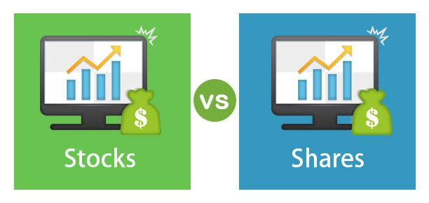

In today's fast-paced financial landscape, investing in stocks has become more accessible than ever. Technological advancements have transformed traditional stock trading, particularly through the rise of algorithmic trading. Algorithmic trading utilizes advanced algorithms and vast data sets to execute trades with precision, minimizing human error. This article focuses on the integration of individual stock investments with the cutting-edge world of algorithmic trading.

Stocks represent shares of ownership in publicly traded companies, providing shareholders with potential financial benefits such as dividends and capital appreciation. As the stock market becomes increasingly dynamic, investors seek methods to enhance their investment strategies—algorithmic trading offers one such approach. Initially the domain of institutional investors, algorithmic trading has gradually become available to retail investors, thereby democratizing access to sophisticated trading strategies.

By exploring fundamental concepts of stock market shares alongside the transformative role of algo trading, investors can gain insights into new strategies that enhance portfolio performance. Whether you are an experienced investor or new to the financial markets, understanding these dual aspects of stock investment can provide a significant advantage. Emphasizing both human insight and algorithmic precision, the blend offers a potent strategy for navigating today's financial markets.

## Table of Contents

## Understanding Stock Investments

Stocks, commonly referred to as equities, signify ownership interests in corporations. When individuals invest in stocks, they're essentially purchasing shares, which represent a claim on a company's assets and earnings. Shareholders, especially those with substantial shares, often have voting rights in key company decisions, such as electing board members or approving major corporate policies.

Investing in stocks holds the potential for significant financial growth, driven by two primary avenues: dividends and capital appreciation. Dividends are periodic payments made to shareholders out of a company's profits. They offer a direct income stream from stock investments. On the other hand, capital appreciation occurs when the price of a stock increases over time, allowing investors to sell their shares at a profit.

There are various types of stocks, each presenting unique benefits and risks. Common stocks are the most prevalent, offering voting rights and variable dividends, albeit with higher volatility. Preferred stocks, while more stable, typically provide no voting rights but offer fixed dividends, often making them akin to bonds.

For beginners, gaining an understanding of stock exchanges and brokerages is crucial. Stock exchanges, like the New York Stock Exchange (NYSE) or NASDAQ, serve as platforms where shares are bought and sold. Brokerages facilitate these transactions, offering tools and services to help investors execute trades. Understanding the process of buying and selling stocks, including the role of market orders, limit orders, and stop orders, is vital for navigating these exchanges effectively.

Risk management plays an indispensable role in successful stock investing. One of the most effective risk mitigation strategies is diversification. By spreading investments across a wide array of stocks or other asset classes, investors can reduce the risk of a substantial loss resulting from the poor performance of a single investment. This concept is often captured by the adage, "Don't put all your eggs in one basket."

In conclusion, investing in stocks requires an understanding of the basic mechanics of stock transactions and the nature of equities. By being well-versed in these fundamentals and employing risk management techniques such as diversification, investors can enhance their financial growth prospects while mitigating potential risks.

## The Rise of Algorithmic Trading

Algorithmic trading, commonly referred to as algo trading, employs computer programs to execute trades automatically based on pre-determined criteria. This method leverages advanced algorithms, which process vast data sets to optimize trading decisions. By doing so, algo trading minimizes the pitfalls of human error and emotional biases that typically accompany manual trading.

Initially confined to institutional investors due to the high cost and complexity of the required infrastructure, [algorithmic trading](/wiki/algorithmic-trading) has become increasingly accessible to retail investors. This democratization is largely attributed to the advancements in technology and the reduction in costs, enabling retail traders to compete alongside large institutions. As a result, the playing field has become more level, offering individual investors opportunities previously available only to major financial institutions.

The capabilities of algorithmic trading systems are further enhanced by integrating [machine learning](/wiki/machine-learning) and [artificial intelligence](/wiki/ai-artificial-intelligence). These technologies bring about innovations such as anomaly detection, pattern recognition, and predictive analytics, which provide traders with sophisticated tools to anticipate market movements. Machine learning models can adapt to new data, continuously improving their predictions and trade execution efficiency.

Despite its numerous benefits, algorithmic trading is not without its challenges. One of the primary requirements is a robust technological infrastructure to ensure the swift processing of trades and data analysis. This need for sophisticated systems can be a significant barrier for individual investors who lack the resources to maintain such infrastructure. Additionally, understanding the inherent risks associated with algo trading is crucial. These include the potential for technical malfunctions, model failures, and market risks amplified by the rapid execution of a large number of trades.

In summary, while algorithmic trading offers promising advantages, particularly in terms of speed and precision, it requires careful consideration and management of its technological and risk-related challenges. As this domain continues to evolve, staying informed and equipped with the necessary resources will be critical for investors looking to effectively harness the power of algorithmic trading strategies.

## Integrating Algorithmic Trading with Stock Investments

Algorithmic trading presents a significant advantage for investors looking to optimize their stock investment strategies by leveraging computational power to analyze and act on large datasets with precision. It allows for the identification of patterns and trends that would be challenging to discern through manual analysis. This capability enhances the accuracy of forecasting potential stock performance, providing investors with valuable insights for making informed decisions.

High-frequency trading ([HFT](/wiki/high-frequency-trading-strategies)) represents one of the most well-known applications of algorithmic trading, where algorithms perform a large number of trades in fractions of a second to capitalize on minute price differences. This strategy relies heavily on speed and the ability to access and process market data in real-time.

Another common strategy utilized within algorithmic trading is [arbitrage](/wiki/arbitrage), in which algorithms detect price discrepancies of the same asset across different markets or platforms and execute trades to profit from these differences. This requires the algorithms to process vast amounts of data quickly and efficiently, ensuring that trades are executed while the price difference still exists.

Trend-following is another strategy where algorithms are designed to identify and follow the direction of market trends. These algorithms analyze historical price data to predict future movements and establish positions that align with the anticipated trend direction. This method typically involves statistical techniques such as moving averages or [momentum](/wiki/momentum) indicators.

For investors eager to integrate algorithmic trading into their portfolio management, the choice of trading platforms is critical. These platforms vary widely in terms of features, ease of use, and cost. Key features to consider include the ability to backtest strategies using historical data, real-time data access, and customization capabilities that allow for the tailoring of algorithms to a specific trading style or market condition.

Successful implementation of algorithmic trading also requires continuous analysis and adaptation. Market conditions can change rapidly, and algorithms must be fine-tuned to respond to new data or adjusted to correct for any potential predictive inaccuracies. This ongoing process often involves machine learning techniques, where models are trained and retrained with new data to improve their predictive power.

In conclusion, integrating algorithmic trading with stock investments enables investors to harness the power of technology, optimize execution speed, and enhance predictive accuracy. However, this requires careful platform selection, strategy development, and constant refinement to adapt to an ever-changing financial environment.

## The Future of Stock Investments and Algorithmic Trading

As technology continues to progress, both stock investments and algorithmic trading are set for significant transformation. One of the pivotal advancements influencing this change is blockchain technology. Blockchain's secure and transparent nature presents opportunities to revolutionize the way stocks are traded and managed. Through blockchain, stock transactions could benefit from enhanced security and reduced settlement times, making trading more efficient and accessible. Decentralized Finance (DeFi) platforms further extend this potential, offering new ways for individuals to engage with financial markets without relying on traditional intermediaries.

Meanwhile, regulatory scrutiny of algorithmic trading is on the rise. As these strategies become more prevalent, regulators are increasingly concerned about their potential to disrupt markets. High-frequency trading, a subset of algorithmic trading, has faced criticism for contributing to market [volatility](/wiki/volatility-trading-strategies). In response, tighter regulations may emerge, impacting how algorithmic strategies are developed and applied. 

The merging of technology and finance is ushering in an era of personalized, data-driven investment experiences. Investors now have access to sophisticated tools that allow for comprehensive analysis, forecasting, and execution of trades. Machine learning algorithms can sift through vast datasets to identify trends and insights that were previously unattainable. As a result, investment strategies can be tailored to individual preferences and risk tolerances, enhancing decision-making processes and outcomes.

For investors keen on using algorithmic trading, staying informed about technological advancements and industry trends is crucial. Emerging technologies such as quantum computing and advanced artificial intelligence could further reshape trading dynamics. Engaging with ongoing educational resources and participating in financial technology forums can help investors keep pace with these innovations, ensuring they leverage the opportunities while managing associated risks effectively. 

In conclusion, the future of stock investments and algorithmic trading is marked by technological integration that promises increased efficiency and customization. Keeping abreast of regulatory changes, embracing emerging technologies, and fostering an adaptive investment mindset will be key for those looking to capitalize on the evolving landscape.

## Conclusion

The fusion of stock investments and algorithmic trading presents modern investors with exciting opportunities. These technologies can significantly enhance investment strategies, offering increased efficiency and profitability. However, the learning curve remains steep, requiring investors to invest time in mastering the tools and understanding the market dynamics.

To successfully leverage these technologies, investors must grasp the fundamentals of both stock investing and algorithmic trading. Keeping abreast of new developments in technology and financial markets is critical for adapting to this ever-evolving landscape. This involves not only understanding current trends but also anticipating future shifts that may arise from innovations like artificial intelligence and machine learning. 

Ultimately, the synergy between human insights and algorithmic precision creates a robust approach to investing. While algorithms excel in processing vast amounts of data and executing trades at optimal times, human judgment remains vital in interpreting nuanced market signals and making strategic decisions. By harmonizing these two elements, investors can optimize their portfolios and enhance their competitive edge in the stock market.

Investors are encouraged to explore the potential of algorithmic trading while maintaining sound financial principles and risk management strategies. Understanding the associated risks and setting clear investment goals are essential components for success. By doing so, investors can navigate the complexities of modern investing and harness the full potential of the convergence between stock investments and algorithmic trading.

## References & Further Reading

[1]: Aarvik, J. (2019). ["Algorithmic Trading: Winning Strategies and Their Rationale"](https://resources.caih.jhu.edu/textbook-solutions/publication/download/Algorithmic_Trading_Winning_Strategies_And_Their_Rationale.pdf) by Ernest P. Chan.

[2]: De Prado, M. L. (2018). ["Advances in Financial Machine Learning"](https://www.amazon.com/Advances-Financial-Machine-Learning-Marcos/dp/1119482089) Wiley.

[3]: Jansen, S. (2020). ["Machine Learning for Algorithmic Trading"](https://github.com/stefan-jansen/machine-learning-for-trading) Packt Publishing.

[4]: Narang, R. K. (2013). ["Inside the Black Box: A Simple Guide to Quantitative and High Frequency Trading"](https://onlinelibrary.wiley.com/doi/book/10.1002/9781118662717) Wiley.

[5]: Aronson, D. R. (2006). ["Evidence-Based Technical Analysis: Applying the Scientific Method and Statistical Inference to Trading Signals"](https://www.amazon.com/Evidence-Based-Technical-Analysis-Scientific-Statistical/dp/0470008741) Wiley.

[6]: Chan, E. (2009). ["Quantitative Trading: How to Build Your Own Algorithmic Trading Business"](https://github.com/ftvision/quant_trading_echan_book) Wiley.

[7]: Campbell, J. Y., Lo, A. W., & MacKinlay, A. C. (1996). ["The Econometrics of Financial Markets"](https://press.princeton.edu/books/hardcover/9780691043012/the-econometrics-of-financial-markets) Princeton University Press.