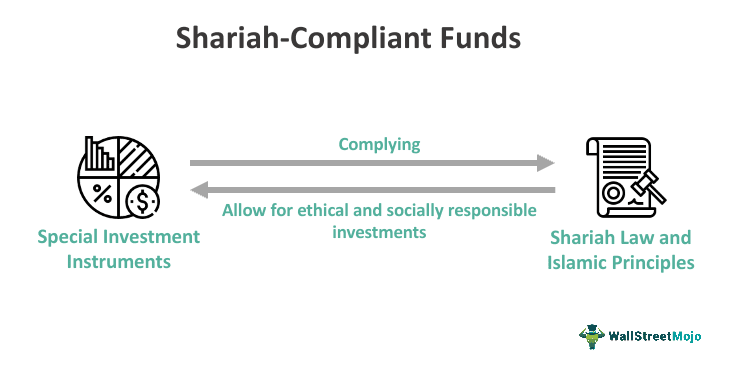

The rise of Shariah-compliant investment funds is significantly reshaping Islamic finance, offering both unique opportunities and distinct challenges. These funds strictly adhere to Islamic law (Shariah), which interdicts earning interest (riba) and prohibits investments in certain sectors like alcohol, gambling, and pork production. This adherence ensures that investments are not only profitable but also ethically responsible, aligning with broader principles of socially responsible investing.

The current financial landscape sees an integration of time-honored Islamic principles with cutting-edge technology, most notably algorithmic trading. Algorithmic trading employs complex mathematical models and speedy computations to make investment decisions, thereby enhancing the efficiency of executing trades. This modernization brings the dual advantage of ensuring compliance with ethical standards and optimizing performance.



Algorithmic trading in Shariah-compliant funds serves as a potent tool to uphold ethical mandates while driving competitive financial returns. Enhanced by technology, these funds can analyze vast amounts of financial data at lightning speed, identifying permissible investment avenues that align with the ethical codes of Islam. The capability to screen non-compliant sectors swiftly ensures the portfolio remains within the standards set by Shariah law, thus mitigating the risk associated with manual processes.

This synergy between Islamic finance and modern technology not only fortifies the credibility and attractiveness of Shariah-compliant investment funds but also presents a scalable model for ethical investing globally. As the financial industry continues to evolve, the adoption of algorithmic trading strategies within Islamic finance could become a cornerstone for sustainable and ethical financial growth.

## Table of Contents

## Understanding Shariah-Compliant Investments

Shariah-compliant investments are financial products that adhere strictly to Islamic law, or Shariah, which provides a framework for conducting business in an ethical and socially responsible manner. Under Shariah law, certain practices are explicitly prohibited, shaping the structure and function of these investments.

One of the primary prohibitions is on riba, or interest, which is seen as exploitive and unjust. Instead of earning interest, profits in Shariah-compliant investments are often made through equity participation where risk and profit are shared among parties. This ensures that wealth is generated through genuine trade and business activity rather than mere capital on capital.

Moreover, Shariah law prohibits investment in industries considered harmful or unethical. This includes sectors such as alcohol, gambling, pornography, and tobacco, which are viewed as detrimental to individuals and society at large. Consequently, Shariah-compliant investments are a subset of socially responsible investing, sharing a focus on ethical business practices and sustainability.

Within this framework, several models facilitate the structure of Shariah-compliant investments:

1. **Musharakah (Partnership)**: This model operates on a partnership basis where all parties contribute capital and share profits and losses at an agreed ratio. Musharakah encourages risk-sharing, partnership, and collective decision-making, aligning with the Islamic tenet of mutual cooperation.

2. **Mudarabah (Profit-sharing)**: In a Mudarabah arrangement, one party provides the capital, while the other offers expertise and management skills. Profits are shared according to a pre-determined ratio, but losses are borne only by the capital provider. This model emphasizes shared risk and reward based on actual business outcomes rather than predefined interest payments.

These investment models contribute to the ethical foundation of Shariah finance by promoting fairness, transparency, and mutual benefit among participants. By focusing on equitable practices, Shariah-compliant investments aim to create a balanced approach that aligns with both ethical standards and financial objectives. This dual focus encourages the development of financial products that not only fulfill religious criteria but also appeal to the wider market attracted by ethical investment opportunities.

## The Role of Islamic Finance

Islamic finance has experienced significant growth, propelled by a rising global demand for ethical investments. This growth is a testament to the strong alignment between Shariah principles and socially responsible investing (SRI). At its core, Shariah finance promotes fairness, risk-sharing, and the avoidance of investments in sectors considered harmful, such as alcohol, gambling, and conventional banking, which typically involve interest (riba). These principles resonate with the broader objectives of SRI, which include ethical business practices, environmental responsibility, and social equity.

Shariah finance operates on a model that emphasizes joint venture and profit-and-loss sharing agreements, evident in financing structures like Musharakah and Mudarabah. Musharakah involves a partnership wherein all partners share profits and losses proportionately, supporting the principle of fairness and risk distribution. On the other hand, Mudarabah is a form of investment partnership where the investor provides capital to an entrepreneur or a manager, who then manages the venture. Profits are shared as per a pre-agreed ratio, while losses are borne by the investor, except in cases of negligence or misconduct by the manager. These models not only ensure ethical wealth distribution but also foster a collaborative environment for business endeavors.

Innovative financial products are increasingly being developed within Islamic finance to cater to a diverse investor base that includes both Muslim and non-Muslim individuals interested in ethical investments. The creation of Sukuk, often referred to as Islamic bonds, provides a Shariah-compliant alternative to conventional bonds, enabling investors to finance projects while complying with Islamic law. Takaful, an Islamic insurance concept based on mutual assistance, offers another innovative solution for risk management, diverging from conventional insurance practices by emphasizing community solidarity and shared responsibility.

Moreover, Islamic finance's principles and products appeal to a broader audience by addressing the growing demand for ethical finance options. As financial consciousness rises globally, more investors are seeking investment avenues that align with their values, further bolstering the growth of this sector. Financial institutions and fintech companies are developing advanced solutions to meet these needs, integrating fintech innovations with Islamic finance to offer personalized and ethical investment opportunities.

In summary, the role of Islamic finance is increasingly pivotal in the financial landscape, not only accommodating religious mandates but also responding to a universal call for ethical investment standards. Its focus on fairness, risk-sharing, and non-harmful investments positions it as a cornerstone of responsible investing, attracting a global demographic of conscientious investors.

## Algorithmic Trading in Shariah Finance

Algorithmic trading leverages computational algorithms to automate financial decision-making, aiming to enhance speed and efficiency in managing investment portfolios. In the context of Shariah-compliant investing, the development and implementation of these algorithms necessitate adherence to Islamic law, which imposes specific ethical and financial constraints. These constraints arise from prohibitions on interest (riba), speculative transactions (gharar), and investments in certain sectors, such as alcohol, gambling, and pork-related businesses. Consequently, the design of algorithms for Shariah finance involves a sophisticated process of filtering non-permissible investments while optimizing for ethical compliance and financial performance.

At the core of Shariah finance, compliance algorithms often employ a screening process that involves both quantitative financial metrics and qualitative ethical criteria. For instance, a typical Shariah-compliant algorithm will initially screen stocks based on financial ratios to ensure companies do not have excessive leverage or derive significant income from interest. This can be implemented using financial statement analysis functions in Python to calculate key metrics like debt-to-equity ratio and interest income percentage. 

```python
# Example of a basic screening function in Python
def is_shariah_compliant(debt_equity_ratio, interest_income_percent):
    if debt_equity_ratio > 0.33:  # As per some Shariah standards
        return False
    if interest_income_percent > 5:  # Maximum permissible limit
        return False
    return True
```

In addition to financial screening, Shariah algorithms require integration with databases that categorize businesses based on their industry activities. Advanced algorithms use natural language processing (NLP) and [machine learning](/wiki/machine-learning) techniques to analyze news, financial disclosures, and other data sources to ensure that investments align with Islamic ethical guidelines. These technologies enable the ongoing assessment of investment permissibility, adapting dynamically to new information and regulatory changes.

Financial institutions are increasingly integrating these advanced algorithmic solutions to maintain Shariah compliance while optimizing for investment growth. The dynamic nature of [algorithmic trading](/wiki/algorithmic-trading) allows for rapid adjustments to market conditions, potentially offering a significant advantage in investment management. Nevertheless, ensuring strict adherence to Shariah principles remains a priority, necessitating continuous collaboration with Shariah scholars and advisory boards to validate the compliance framework.

Overall, algorithmic trading in Shariah finance offers a promising avenue for aligning technological advancements with ethical investment principles, promoting both innovation and adherence to religious guidelines in financial markets.

## Shariah-Compliant Robo-Advisors

Robo-advisors have emerged as a transformative tool in the arena of financial advisory services, providing automated, algorithm-driven portfolio management that is tailored to fit the principles of Shariah law. These digital platforms offer a seamless and accessible way for investors to engage in ethical finance by adhering strictly to Islamic legal principles. Shariah-compliant robo-advisors cater especially to tech-savvy young Muslim investors, who are increasingly seeking investment avenues that align with their religious and ethical beliefs, while also valuing speed and convenience.

The primary function of these robo-advisors is to construct and manage investment portfolios that are consistent with Shariah guidelines. This involves screening potential investment opportunities to ensure that they do not include industries or financial practices that are prohibited under Islamic law, such as alcohol production, gambling, and interest-based financial activities (riba). The algorithms underpinning these robo-advisors are crafted to evaluate companies based on both quantitative financial metrics and qualitative Shariah compliance criteria.

For example, a typical Shariah-compliant robo-advisor would employ a two-tiered screening process. The first stage involves sector-based screening, which excludes non-permissible industries. The second stage requires a financial ratio analysis, where certain thresholds—such as a maximum acceptable level of debt—are applied to ensure adherence to Shariah principles. The use of algorithms facilitates these screening processes by efficiently parsing through vast volumes of market data to filter out non-compliant stocks.

The algorithms can be exemplarily implemented in Python, involving the integration of financial data APIs and Shariah compliance criteria:

```python
import pandas as pd

# Sample function to filter non-compliant investments
def shariah_compliance_check(df):
    # Excluding sectors: Gambling, Alcohol
    compliant_sectors = df[~df['sector'].isin(['Gambling', 'Alcohol'])]

    # Financial screening: Example - debt ratio must be less than 33%
    compliant_financials = compliant_sectors[compliant_sectors['debt_to_assets'] < 0.33]

    return compliant_financials

# Example DataFrame setup:
data = {'company': ['A', 'B', 'C'],
        'sector': ['Tech', 'Gambling', 'Alcohol'],
        'debt_to_assets': [0.20, 0.45, 0.25]}

df = pd.DataFrame(data)
compliant_investments = shariah_compliance_check(df)
print(compliant_investments)
```

In employing such technology, robo-advisors enable real-time, data-driven adjustments to investment portfolios, maintaining compliance while optimizing for returns. Their accessibility through smartphone applications further enhances their appeal, providing an intuitive interface for users to engage with their investments, track performance, and adjust their preferences as needed.

Overall, Shariah-compliant robo-advisors represent a confluence of finance and technology that satisfies the growing demand for ethical investment vehicles. They not only uphold the religious values of their users but also democratize access to sophisticated investment strategies, ensuring that ethical considerations do not compromise financial sophistication and potential returns.

## Opportunities and Challenges

The demand for Shariah-compliant investments has been experiencing significant growth, particularly among younger investors who prioritize ethical finance. This trend is often attributed to a heightened awareness of ethical considerations and a desire to align personal values with investment choices. For many investors, adhering to Shariah principles represents not only a commitment to religious obligations but also a conscious choice for sustainable and ethical financial practices.

However, the expansion of Shariah-compliant investments is not without its challenges. One major obstacle is the diverse interpretations of Shariah law across different jurisdictions. Islamic law is not monolithic, and varying interpretations can complicate the standardization of Shariah-compliant financial products. This lack of uniformity can lead to inconsistencies in the implementation and acceptance of Shariah standards globally, often requiring financial institutions to navigate complex regulatory environments to ensure compliance.

Another challenge is the regulatory landscape, which varies significantly between regions. The absence of a cohesive global framework for Shariah finance means that investors and financial institutions must often contend with the local regulatory requirements unique to each market. This fragmentation can hinder the scalability of Shariah-compliant investment solutions and limit their accessibility to a broader audience.

Despite these challenges, fintech innovations provide a promising solution by enabling the customization of investment products to meet specific ethical and religious criteria. Advances in technology have made it possible to create sophisticated tools that facilitate compliance with Shariah principles. For instance, algorithmic trading systems and robo-advisors can be designed to automatically filter out non-compliant investments, ensuring adherence to Islamic guidelines. This technological advantage not only enhances the efficiency of managing Shariah-compliant portfolios but also broadens their appeal by offering greater transparency and control to investors.

In summary, while the growth of Shariah-compliant investments presents certain challenges, particularly concerning diverse legal interpretations and regulatory inconsistencies, fintech developments offer significant opportunities. By leveraging technology, the Islamic finance industry can enhance the alignment of investment products with ethical and religious values, ultimately fostering a more inclusive and dynamic market.

## Conclusion

The integration of Shariah principles with fintech innovations is fundamentally transforming the landscape of Islamic finance. By incorporating algorithmic trading and robo-advisors, financial institutions are able to offer efficient and Shariah-compliant investment solutions that meet the needs of modern investors. Algorithmic trading facilitates rapid and precise decision-making processes by leveraging complex algorithms to identify and execute trades that comply with Islamic laws. These algorithms can systematically exclude non-permissible investments such as those involving interest (riba) or companies engaged in gambling or alcohol production.

Robo-advisors extend this capability by offering automated portfolio management, making it more accessible to tech-savvy investors who seek both convenience and adherence to ethical principles. These platforms can be particularly advantageous for younger demographics interested in sustainable investing, as they combine the ethical tenets of Islam with the innovative approach of fintech solutions.

However, the successful integration of these technologies requires rigorous adherence to Shariah guidelines, ensuring that all automated processes align with religious tenets. This involves the design and implementation of algorithms that incorporate Shariah screening criteria, ensuring that investments are not only efficient but also ethically viable.

By leveraging the advancements in financial technology, Shariah-compliant investment solutions present the potential for long-term sustainable growth within the financial markets. This confluence of tradition and technology offers a promising framework for ethical financial practices, benefiting both Muslim and non-Muslim investors who prioritize ethical and sustainable investment standards. As this sector continues to evolve, it remains essential for financial institutions to maintain robust systems for compliance, turning technological acumen into a tool for ethical financial management and growth.

## References & Further Reading

[1]: El-Gamal, M. A. (2006). ["Islamic Finance: Law, Economics, and Practice."](https://archive.org/details/islamicfinancela0000elga) Cambridge University Press.

[2]: Iqbal, M., & Mirakhor, A. (2011). ["An Introduction to Islamic Finance: Theory and Practice."](https://onlinelibrary.wiley.com/doi/book/10.1002/9781118390474) John Wiley & Sons.

[3]: Moosa, I. A. (2021). ["The Economics of Islamic Banking and Finance."](https://www.semanticscholar.org/paper/Financialization-and-income-inequality%3A-An-extreme-Khatatbeh-Moosa/9ac6c66a4cb8c3389170c258599a8c041d3e8417) Springer.

[4]: "Algorithmic Trading: A Comprehensive Beginner's Guide to Learn and Understand Algorithmic Trading" by Saad G. Yaseen.

[5]: Usmani, M. T. (2002). ["An Introduction to Islamic Finance."](https://archive.org/details/AnIntroductionToIslamicFinanceByShaykhMuftiTaqiUsmani) Kluwer Law International.