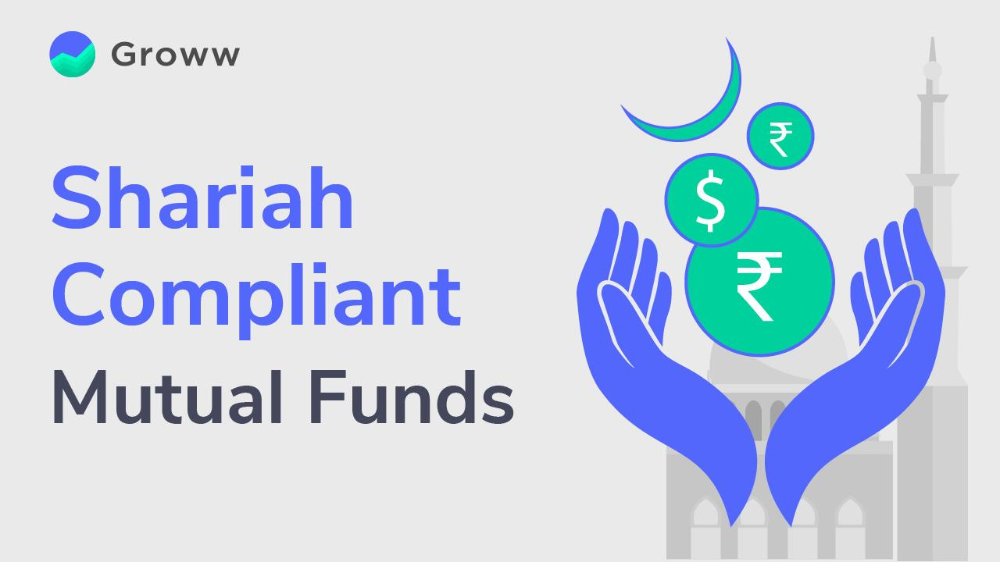

## Table of Contents

## What are Shariah-compliant investment funds?

Shariah-compliant investment funds are a type of investment that follows the rules of Islamic law, or Shariah. These funds avoid investing in businesses that are considered harmful or unethical according to Islamic principles. This means they do not invest in companies involved in activities like alcohol, gambling, pork, or tobacco. Instead, they focus on companies that provide useful products and services, and they must also avoid excessive debt and interest, which is not allowed in Islam.

These funds are popular among Muslim investors who want their investments to align with their religious beliefs. However, they are also attractive to non-Muslim investors who are interested in ethical investing. Shariah-compliant funds often have a board of Islamic scholars who ensure that all investments meet Shariah standards. This oversight helps maintain the integrity of the fund and ensures that it adheres to Islamic ethical guidelines.

## What are the basic principles of Shariah law that apply to investments?

Shariah law has some basic rules for investments. One big rule is that you can't earn or pay interest, which is called "riba" in Islam. This means Shariah-compliant investments avoid things like bonds or savings accounts that give interest. Instead, they focus on sharing profits and losses in a fair way. Another rule is that investments should not be in businesses that are harmful or go against Islamic values. This includes staying away from companies involved in alcohol, gambling, pork, and tobacco.

Another important principle is that investments should be transparent and fair. This means all deals should be clear and honest, with no hidden fees or tricks. Shariah also encourages investments that help the community and the environment. So, Shariah-compliant funds often look for companies that do good things for people and the planet. Overall, these rules help make sure that investments follow Islamic ethics and values.

## How do Shariah-compliant funds differ from conventional investment funds?

Shariah-compliant funds and conventional investment funds are different in some big ways. The main difference is that Shariah-compliant funds follow Islamic law, which means they can't invest in companies that deal with things like alcohol, gambling, pork, or tobacco. They also can't earn or pay interest, so they avoid investments like bonds or savings accounts. Instead, they focus on sharing profits and losses in a fair way. This makes sure that the investments are ethical and follow Islamic values.

On the other hand, conventional funds don't have these restrictions. They can invest in any company, even if it's involved in activities that go against Islamic principles. They can also use interest-based investments, which are a big part of many traditional funds. Because of these differences, Shariah-compliant funds often have a board of Islamic scholars who check that all investments follow Shariah rules. This helps make sure the funds stay true to Islamic ethics and values, which is not a concern for conventional funds.

## What types of investments are prohibited in Shariah-compliant funds?

Shariah-compliant funds have rules about what they can't invest in. They can't put money into companies that make or sell things like alcohol, pork, or tobacco. They also avoid businesses involved in gambling or anything that goes against Islamic values. This means they won't invest in companies that do harm or are not ethical.

Another big rule is that Shariah-compliant funds can't earn or pay interest. This means they stay away from investments like bonds or savings accounts that give interest. Instead, they focus on sharing profits and losses in a fair way. This helps make sure the investments follow Islamic principles and are ethical.

## What is the role of a Shariah board in managing these funds?

A Shariah board is a group of Islamic scholars who help manage Shariah-compliant funds. Their main job is to make sure that all the investments the fund makes follow Islamic law. They check each investment to see if it meets Shariah rules, like not investing in companies that deal with alcohol, gambling, pork, or tobacco. They also make sure the fund doesn't earn or pay interest, which is not allowed in Islam.

The Shariah board also gives advice and guidance to the fund managers. They help make sure that the fund stays true to Islamic ethics and values. This means they might review the fund's activities regularly and give their approval or suggest changes if needed. Having a Shariah board helps give investors confidence that their money is being managed in a way that follows their religious beliefs.

## How are profits and losses distributed in Shariah-compliant funds?

In Shariah-compliant funds, profits and losses are shared in a fair way between the investors and the fund managers. This is different from conventional funds where profits might be based on interest. Instead, Shariah funds use methods like "Mudarabah" where the fund manager (Mudarib) gets a share of the profit for their work, and the rest goes to the investors. If there are losses, the investors bear them, but the fund manager only loses their time and effort, not their money.

This way of sharing profits and losses follows Islamic principles of fairness and risk-sharing. It means everyone involved in the fund has a stake in its success or failure. This approach encourages ethical investing and helps make sure that the fund's activities are in line with Islamic values. By sharing both the good and the bad, Shariah-compliant funds aim to create a more just and transparent investment environment.

## What are the screening processes used to ensure Shariah compliance?

To make sure investments follow Shariah rules, funds use a screening process. This process checks if a company's business activities are okay according to Islamic law. They look at what the company does and avoid those involved in things like alcohol, gambling, pork, or tobacco. If a company makes too much money from these activities, it's not allowed in the fund. The screening also checks if the company has too much debt, because Shariah doesn't allow too much borrowing or paying interest.

After checking the business activities, the screening process looks at the company's financials. They make sure the company doesn't have too much money coming from interest or other non-Shariah-compliant sources. There are specific rules about how much of a company's income can come from these sources before it's not considered Shariah-compliant. This helps keep the investments ethical and in line with Islamic values. The whole screening process is overseen by a Shariah board to make sure everything follows the rules.

## How do Shariah-compliant funds handle interest and debt?

Shariah-compliant funds can't earn or pay interest, which is called "riba" in Islam. This means they don't invest in things like bonds or savings accounts that give interest. Instead, they focus on sharing profits and losses in a fair way. If a company they want to invest in has too much debt, they won't invest in it. This is because Shariah doesn't allow too much borrowing or paying interest.

To make sure they follow these rules, Shariah-compliant funds use a screening process. They check the financials of companies to see if they have too much money coming from interest or other non-Shariah-compliant sources. If a company makes too much money from these sources, the fund won't invest in it. This helps keep the investments ethical and in line with Islamic values. A Shariah board oversees this process to make sure everything follows the rules.

## What are the performance metrics and benchmarks used for Shariah-compliant funds?

Shariah-compliant funds use some special ways to check how well they are doing. They look at things like how much money they make over time, which is called returns. They also compare their performance to other Shariah-compliant funds or to special indexes that follow Islamic rules. These indexes help see if the fund is doing better or worse than others like it. Sometimes, they also look at how much risk they are taking to make that money, to make sure they are not being too risky.

To keep track of how well they are doing, Shariah-compliant funds often use benchmarks like the Dow Jones Islamic Market Index or the MSCI Islamic Index. These benchmarks are made up of companies that follow Shariah rules, so they are a good way to see if the fund is doing well compared to other similar investments. By using these benchmarks, investors can see if their fund is keeping up with or beating the market, which helps them decide if they are happy with their investment.

## How can investors globally access Shariah-compliant investment opportunities?

Investors around the world can access Shariah-compliant investment opportunities through various ways. One common way is by using online investment platforms that offer Shariah-compliant funds. These platforms make it easy for anyone, no matter where they live, to invest in funds that follow Islamic rules. Another way is through banks and financial institutions that offer Shariah-compliant products. These banks often have special departments or services that focus on Islamic finance, making it easier for investors to find and invest in Shariah-compliant options.

Investors can also work with financial advisors who specialize in Islamic finance. These advisors can help find the right Shariah-compliant investments that match the investor's goals and values. Additionally, many countries have stock exchanges that list Shariah-compliant companies and funds, which investors can buy directly. By using these different methods, investors from all over the world can participate in Shariah-compliant investing and make sure their money is used in ways that align with their beliefs.

## What are the challenges and risks associated with managing Shariah-compliant funds?

Managing Shariah-compliant funds comes with some challenges and risks. One big challenge is making sure all investments follow Islamic rules. This means the fund managers have to do a lot of work to check each company and make sure it's okay according to Shariah. They need to avoid companies that deal with things like alcohol, gambling, pork, or tobacco. They also need to make sure the company doesn't have too much debt or earn too much money from interest. All of this takes a lot of time and effort, and it can be hard to find enough good investments that meet all these rules.

Another risk is that Shariah-compliant funds might not perform as well as other funds. Because they can't invest in certain types of companies or use interest-based investments, they might miss out on some good opportunities. This can make it harder for them to make as much money as other funds. Also, the rules for Shariah-compliant funds can change, and this can affect how the fund is managed. If the rules change, the fund might need to sell some investments and buy new ones, which can be risky and might affect the fund's performance.

## What future trends and innovations are expected in the field of Shariah-compliant investments?

In the future, Shariah-compliant investments are expected to grow a lot. More people around the world are interested in ethical and sustainable investing, and Shariah-compliant funds fit well with these ideas. As more people learn about these funds, they will become more popular. Technology will also play a big role. Online platforms and apps will make it easier for people to find and invest in Shariah-compliant funds. These platforms will use smart technology to check if investments follow Islamic rules, making the process faster and more accurate.

Another trend is that Shariah-compliant funds will start to focus more on things like green energy and social impact. These funds will invest in companies that help the environment and make a positive difference in the world. This will attract even more investors who care about these issues. Also, new financial products, like Shariah-compliant cryptocurrencies, might become more common. These innovations will help Shariah-compliant investments keep up with the changing world and meet the needs of more investors.

## References & Further Reading

[1]: El-Gamal, M. A. (2006). ["Islamic Finance: Law, Economics, and Practice."](https://archive.org/details/islamicfinancela0000elga) Cambridge University Press.

[2]: Iqbal, M., & Mirakhor, A. (2011). ["An Introduction to Islamic Finance: Theory and Practice."](https://onlinelibrary.wiley.com/doi/book/10.1002/9781118390474) John Wiley & Sons.

[3]: Moosa, I. A. (2021). ["The Economics of Islamic Banking and Finance."](https://www.semanticscholar.org/paper/Financialization-and-income-inequality%3A-An-extreme-Khatatbeh-Moosa/9ac6c66a4cb8c3389170c258599a8c041d3e8417) Springer.

[4]: "Algorithmic Trading: A Comprehensive Beginner's Guide to Learn and Understand Algorithmic Trading" by Saad G. Yaseen.

[5]: Usmani, M. T. (2002). ["An Introduction to Islamic Finance."](https://archive.org/details/AnIntroductionToIslamicFinanceByShaykhMuftiTaqiUsmani) Kluwer Law International.