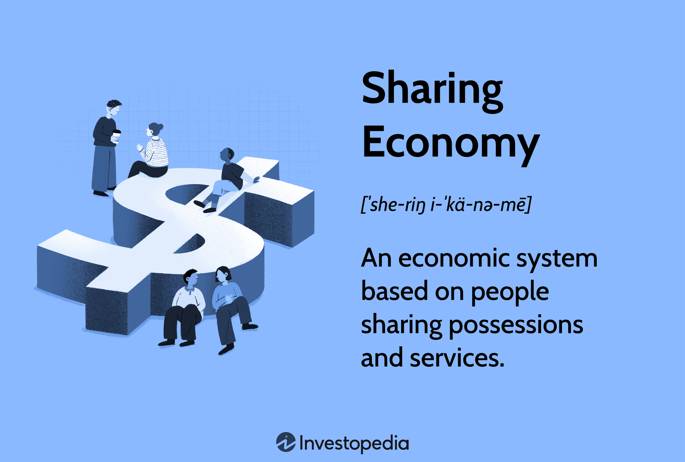

The sharing economy represents a paradigm shift in traditional economic models, creating innovative avenues for individuals to access goods and services without the necessity of ownership. This model is exemplified by platforms such as Uber and Airbnb, which have transformed ride-sharing and short-term rentals, thereby providing greater efficiency and accessibility for users. By leveraging digital platforms, the sharing economy enhances resource utilization, broadening consumer access to diverse services and products.

In recent years, the sharing economy has been further transformed by the introduction of algorithmic trading. This technology employs sophisticated algorithms to automate trading processes, thus enhancing decision-making and risk management in financial markets. The integration of algorithmic trading into the sharing economy has provided substantial benefits, chiefly by optimizing resource allocation and improving market efficiency. The rapid analysis and execution capabilities of algorithmic systems are instrumental in adapting to fluctuating market conditions, thereby fostering a more dynamic and responsive sharing economy.



This article explores the intersection of advanced technologies and evolving economic models within the sharing economy. It specifically focuses on the pivotal role that algorithmic trading plays in enhancing the sharing economy's efficiency and extending its reach. By marrying technology with collaborative economic practices, the sharing economy continues to redefine access to goods and services, presenting new opportunities for growth and innovation.

## Table of Contents

## Understanding the Sharing Economy

The sharing economy represents a shift towards collaborative consumption, emphasizing access over ownership. This model disrupts traditional business structures by enabling individuals to exchange goods and services directly with one another through digital platforms. Platforms such as Airbnb and Uber are illustrative of this trend, where users can rent out their homes or offer rides, respectively, thus facilitating peer-to-peer exchanges. This system enhances resource utilization by allowing assets, which might otherwise be under-used, to be leveraged efficiently, thereby reducing costs for consumers and maximizing economic value.

The rapid expansion of the sharing economy is driven by globalization and digitalization. With the proliferation of the internet and smart technologies, connectivity has increased, reducing barriers to entry and expanding market reach. The ease of access and real-time information flow empower consumers and providers alike to engage in transactions more fluidly and transparently.

Several industries have been transformed due to the sharing economy's influence. In transportation, companies like Uber and Lyft have challenged traditional taxi services, offering more flexible and often cheaper alternatives. In hospitality, Airbnb disrupts the hotel industry by providing more personalized and diverse lodging options. The financial sector is not exempt; platforms like LendingClub facilitate peer-to-peer lending, offering consumers alternatives to traditional bank loans with potentially lower interest rates.

Overall, the sharing economy encourages a more efficient allocation of resources and fosters innovation through competitive markets. It challenges existing regulatory frameworks and necessitates new policies to ensure fair competition and consumer protection while unlocking new economic opportunities and redefining societal consumption patterns.

## Evolution of Economic Models in the Sharing Economy

Traditional economic models have undergone significant transformations to align with the sharing economy's innovative practices. Historically, economic systems were dominated by centralized entities which controlled the production, distribution, and consumption of goods and services. However, recent trends indicate a significant shift towards decentralized networks, characterized by more open and participatory frameworks.

Decentralization is at the heart of this evolution, where platforms enable individuals to both produce and consume goods and services. This shift is evident in companies like Airbnb and Uber which facilitate peer-to-peer interactions, bypassing traditional centralized models. The decentralized approach maximizes resource utilization, as assets such as vehicles and properties are more efficiently employed when shared among users. This model not only reduces waste but also lowers costs for consumers.

Collaborative consumption models are integral to the sharing economy, encouraging users to participate as equal stakeholders. They foster a community-driven environment where ownership is replaced by access and sharing. This participation paradigm is crucial for enhancing resource usage, sustainability, and minimizing environmental impacts, aligning with circular economy principles.

Emerging technologies such as blockchain and smart contracts are pivotal in this evolution. Blockchain ensures transparency and security in transactions, reducing the reliance on centralized authorities. It offers a decentralized ledger system, which facilitates trust among users by providing immutable records of all transactions. For instance, blockchain can be used in a sharing platform to track asset usage and ownership efficiently. 

Smart contracts, self-executing contracts with the terms directly written into code, enable automated and trustless agreements between parties. They eliminate intermediaries, reducing costs and improving transaction efficiency. A Python example to illustrate a simple smart contract concept could be:

```python
def smart_contract_agreement(party1, party2, terms):
    if terms_met(terms, party1, party2):
        execute_contract(party1, party2)
    else:
        raise Exception("Terms not met for contract execution.")

def terms_met(terms, party1, party2):
    return all(condition in party1 for condition in terms) and all(condition in party2 for condition in terms)

def execute_contract(party1, party2):
    print(f"Contract executed between {party1['name']} and {party2['name']}")

party1 = {'name': 'Alice', 'agreed_terms': ['term1', 'term2']}
party2 = {'name': 'Bob', 'agreed_terms': ['term1', 'term2']}
terms = ['term1', 'term2']

smart_contract_agreement(party1, party2, terms)
```

In this code, the function `smart_contract_agreement` checks if both parties meet the agreed terms before executing the contract, simplifying traditional contract processes.

These advancements in economic models signify a move towards more flexible, efficient, and equitable systems in the sharing economy. The integration of decentralized networks and emerging technologies not only enhances operational efficiencies but also provides a robust framework for future growth and innovation in the sharing economy.

## The Rise of Algorithmic Trading in Economic Models

Algorithmic trading, commonly referred to as algo-trading, stands as a hallmark of modern financial markets, leveraging intricate algorithms to automate trading activities. These algorithms, often designed to evaluate an array of variables such as time, price, and [volume](/wiki/volume-trading-strategy), enable traders to execute orders at speeds and frequencies that are impossible for a human trader. The precision and rapid execution offered by [algorithmic trading](/wiki/algorithmic-trading) provide significant advantages in decision-making processes and risk management.

A key benefit of algo-trading is its ability to process vast datasets swiftly, which facilitates informed decision-making. By rapidly analyzing market data, algorithmic systems can recognize patterns and predict market movements with a high degree of accuracy. This capability not only optimizes timing in trade execution but also minimizes potential risks by implementing controlled trading strategies. For instance, algorithmic systems can exploit [arbitrage](/wiki/arbitrage) opportunities where price discrepancies exist across different markets or exchanges.

The integration of algorithmic trading into broader economic models is pivotal for optimizing resource allocation across the sharing economy. As shared services encompass a variety of sectors, ranging from transportation to real estate, the efficient allocation of resources is paramount. Algorithmic trading systems facilitate this by leveraging real-time data analytics to anticipate demand surges and adjust service provisions accordingly, thus enhancing overall market efficiency.

Moreover, algorithmic trading technologies contribute significantly to the fluidity and adaptability of the market dynamics within the sharing economy. By executing trades based on predefined criteria, these technologies reduce human errors and emotional biases inherent in manual trading processes. This ensures a more stable and efficient marketplace, capable of rapidly adapting to market shifts and consumer demands.

In conclusion, the rise of algorithmic trading represents a transformative advancement in economic models. By harnessing the power of sophisticated algorithms and data analytics, algorithmic trading not only enhances market efficiency but also plays a crucial role in the dynamic environment of the sharing economy. This synergistic relationship underscores the continuous evolution of modern economic practices, paving the way for innovative solutions and improved resource management.

## Synergy Between Sharing Economy and Algorithmic Trading

Algorithmic trading has become increasingly intertwined with the operations of the sharing economy, offering a range of benefits that enhance efficiency and create new opportunities for innovation. By leveraging data-driven insights, algorithmic trading plays a crucial role in refining the operations of sharing platforms, leading to substantial improvements in both pricing models and service delivery.

Enhanced predictive analytics, driven by sophisticated algorithms, allow sharing platforms to forecast demand with greater accuracy. This improved foresight enables platforms to dynamically adjust pricing models based on real-time market conditions, optimizing revenue and providing consumers with prices reflective of current demand levels. For example, ride-sharing services like Uber can employ these algorithms to adjust fares during peak times or unforeseen events, ensuring a balance between supply and demand.

Another significant advantage brought by automation is the reduction of transaction costs across sharing services. In traditional economic models, transaction costs can be a barrier to scalability and efficiency. However, algorithmic trading systems, through automation, minimize these costs by streamlining processes such as order execution and settlement. This efficiency is particularly beneficial for platforms that handle large volumes of microtransactions, facilitating seamless scalability and making these services more accessible to a broader audience.

Data security is another area where algorithmic trading contributes significantly to the sharing economy. The integration of cryptographic techniques inherent in algorithmic systems ensures that data transactions remain secure, protecting sensitive information from unauthorized access. This level of security is paramount in maintaining trust with users and ensuring compliance with increasingly stringent data protection regulations.

In synergy with the sharing economy, algorithmic trading promotes the development of innovative business practices and opens new economic opportunities. By harnessing the computational power of algorithms, sharing platforms can venture into previously untapped markets or optimize existing operations, leading to the creation of entirely new service models. This collaboration between algorithmic trading and the sharing economy not only enhances current offerings but also catalyzes the emergence of novel economic structures that increase market fluidity and adaptability.

Overall, the integration of algorithmic trading with the sharing economy creates a dynamic sector characterized by enhanced operational efficiency, improved security, and significant potential for innovation. As these two fields continue to evolve, their synergy is expected to further transform economic practices and redefine the ways in which goods and services are shared and consumed globally.

## Challenges and Opportunities Ahead

The sharing economy, while offering numerous benefits, also presents several challenges that need addressing. One of the most significant challenges is regulatory compliance. As sharing platforms like Uber and Airbnb disrupt traditional industries, regulatory frameworks struggle to keep pace with their rapid growth and unique business models. This incongruence often leads to conflicts with local laws and regulations, causing legal and operational hurdles for these platforms. Moreover, market saturation is becoming increasingly evident as new entrants continuously emerge, creating intense competition and driving the need for differentiation and innovation within the sector.

Algorithmic trading, when integrated into the sharing economy, adds another layer of complexity. While it offers increased efficiency and precision, it also raises issues related to transparency and ethical considerations. Automated systems can sometimes act as black boxes, making it difficult for users and regulators to understand decision-making processes. These transparency challenges are compounded by ethical concerns regarding the fairness of algorithms, which may inadvertently perpetuate biases or prioritize profit over equitable access.

Despite these challenges, the sharing economy provides vast opportunities for innovation, particularly in developing more robust and inclusive economic models. By leveraging advanced technologies, there is potential to enhance service delivery, optimize resource allocation, and create more personalized consumer experiences. Emphasis on innovative pricing models and dynamic resource management can help platforms distinguish themselves in a crowded market.

Additionally, privacy concerns remain a significant hurdle. As sharing systems rely heavily on user data to function efficiently, ensuring data security and privacy becomes paramount. Robust measures must be developed to protect sensitive information and build trust among users. Equitable access is another critical [factor](/wiki/factor-investing); efforts should be made to ensure that the benefits of the sharing economy are broadly accessible across different socio-economic groups. Addressing these concerns will contribute to the sustained growth and acceptance of the sharing economy.

The future of the sharing economy and algorithmic trading is promising, with ongoing technological advancements anticipated to drive further development. Innovations in blockchain and [artificial intelligence](/wiki/ai-artificial-intelligence) can enhance transparency, security, and efficiency, creating more resilient economic systems. By addressing current challenges and embracing these opportunities, stakeholders can guide the evolution of the sharing economy toward a more sustainable and equitable future.

## Conclusion

The evolution of the sharing economy is strongly intertwined with advancements in both economic models and technologies, with algorithmic trading playing a pivotal role in optimizing and transforming its practices. Algorithmic trading allows for faster and more precise decision-making by automating trading processes using complex algorithms. This optimization is particularly beneficial in the sharing economy where dynamic pricing, efficient resource allocation, and predictive analytics are critical.

Engaging with these tools offers the opportunity to develop more sustainable and efficient economic systems. By incorporating algorithmic insights, sharing platforms can enhance their service delivery, optimize pricing strategies, and improve resource management, thereby increasing their operational efficiency and scalability. As these technologies continue to evolve, so too will their applications in refining the sharing economy's processes and capabilities.

A collaborative approach involving various stakeholders, including technology developers, platform operators, regulators, and users, is essential for harnessing the full potential of these advancements. Collaboration can address challenges such as privacy concerns, ethical considerations, and regulatory compliance, ensuring that the evolution of the sharing economy is both inclusive and equitable.

The future trajectory of the sharing economy will undoubtedly be shaped by innovative strategies and a strong commitment to adapting to the ever-changing technological landscape. Continued innovation in economic models and computational technologies will provide new opportunities for growth and efficiency, reinforcing the transformative nature of the sharing economy in modern society.

## References & Further Reading

[1]: Sundararajan, A. (2016). ["The Sharing Economy: The End of Employment and the Rise of Crowd-Based Capitalism."](https://www.jstor.org/stable/j.ctt1c2cqh3)

[2]: Schor, J. B. (2014). ["Debating the Sharing Economy."](https://greattransition.org/publication/debating-the-sharing-economy) Great Transition Initiative.

[3]: Botsman, R., & Rogers, R. (2010). ["What's Mine Is Yours: The Rise of Collaborative Consumption."](https://books.google.com/books/about/What_s_Mine_Is_Yours.html?id=LiC2foFeXQYC)

[4]: Gansky, L. (2010). ["The Mesh: Why the Future of Business is Sharing."](https://archive.org/details/isbn_2740294115391)

[5]: Narayanan, A., Bonneau, J., Felten, E., Miller, A., & Goldfeder, S. (2016). ["Bitcoin and Cryptocurrency Technologies."](https://press.princeton.edu/books/hardcover/9780691171692/bitcoin-and-cryptocurrency-technologies) Princeton University Press.

[6]: O'Reilly, T. (2017). ["WTF?: What's the Future and Why It's Up to Us."](https://www.oreilly.com/tim/wtf-book.html) 

[7]: Cramer, J., & Krueger, A. B. (2016). ["Disruptive Change in the Taxi Business: The Case of Uber."](https://www.aeaweb.org/articles?id=10.1257/aer.p20161002) Journal of Economic Perspectives.