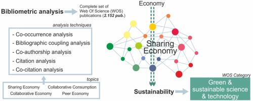

## Table of Contents

## What is the sharing economy?

The sharing economy is a system where people share things they own with others, often using the internet to connect. Instead of buying something new, people can rent or borrow items from others. This can include things like cars, bikes, or even spare rooms in a house. It's all about using what we already have more efficiently and saving money.

One of the main reasons the sharing economy has grown is because of technology. Apps and websites make it easy for people to find and share things with each other. Companies like Airbnb and Uber are big examples of this. They help people share their homes and cars with others who need them. This not only helps people save money but also helps the environment by reducing the need for new products.

The sharing economy can be good for both the people who share and the people who use the shared items. Owners can make extra money from things they aren't using all the time. Users can save money by not having to buy expensive items they only need sometimes. However, there are also challenges, like making sure everyone follows the rules and stays safe.

## What are some common examples of sharing economy businesses?

Some common examples of sharing economy businesses are Airbnb and Uber. Airbnb lets people rent out their homes or spare rooms to travelers. This way, people can make money from their empty spaces, and travelers can find cheaper places to stay. Uber, on the other hand, lets people use their own cars to give rides to others. This helps people earn extra money with their cars, and riders can get a ride easily without needing to own a car.

Another example is Turo, which is like Airbnb but for cars. People can rent out their cars to others who need a vehicle for a short time. This is helpful for people who don't want to buy a car but need one occasionally. TaskRabbit is another sharing economy business where people can hire others to do small tasks, like cleaning or moving furniture. This helps people who need help with chores and gives others a chance to earn money by doing these tasks.

These businesses show how the sharing economy works by letting people share what they have with others. This can save money and help the environment by using resources more efficiently. However, it's important for these businesses to make sure everyone follows the rules and stays safe.

## How does the sharing economy work?

The sharing economy works by letting people share things they own with others. Instead of buying something new, people can rent or borrow items from others who aren't using them all the time. This is done through apps and websites that connect people who have things to share with people who need them. For example, if you have a car that you don't use every day, you can list it on a platform like Turo, and someone who needs a car for a day can rent it from you. This helps both the owner, who can make some extra money, and the renter, who doesn't have to buy a car.

The sharing economy helps people save money and use resources more efficiently. Instead of everyone buying their own things, people can share what they already have. This is good for the environment because it means fewer new products need to be made. Companies like Airbnb and Uber are big examples of this. Airbnb lets people rent out their homes or spare rooms to travelers, and Uber lets people use their cars to give rides to others. These businesses make it easy for people to share what they have and help each other out.

## What are the benefits of the sharing economy for consumers?

The sharing economy helps consumers save money. Instead of buying things they only need sometimes, like a car or a power tool, people can rent or borrow them from others. This can be much cheaper than buying something new. For example, if you need a car for a weekend trip, you can rent one from someone on Turo instead of spending a lot of money on a new car. This way, you only pay for what you need, when you need it.

Another benefit is that the sharing economy gives consumers more choices. There are lots of different things you can rent or borrow, from homes and cars to bikes and even clothes. This means you can find exactly what you need, when you need it. Plus, using apps and websites to connect with others makes it easy to find and share things. This can make life more convenient and help you try new experiences without spending a lot of money.

## What are the benefits of the sharing economy for providers?

The sharing economy helps providers make extra money. If you have something you're not using all the time, like a spare room or a car, you can share it with others and get paid for it. For example, if you list your car on Turo, people who need a car can rent it from you. This way, you can earn money from something that would just be sitting around otherwise. It's a great way to turn your unused things into extra cash.

Another benefit for providers is that they can meet new people and be part of a community. When you share your things with others, you get to interact with different people. This can be fun and rewarding. Plus, being a provider in the sharing economy can make you feel good because you're helping others save money and use resources more efficiently. It's a win-win situation where you help others while also helping yourself.

## What are the main criticisms of the sharing economy?

One big criticism of the sharing economy is that it can make it hard for regular workers. Companies like Uber and Airbnb often treat their providers as independent contractors instead of employees. This means they don't get benefits like health insurance or paid time off. It can also make it tough for them to make a steady income because they might not always have work. This can be a problem for people who rely on these jobs to make a living.

Another criticism is about safety and trust. When people share their things with strangers, there's a risk that something could go wrong. For example, someone renting your car might damage it, or a guest in your home might not respect your space. Even though these companies have rules and ways to check people's backgrounds, things can still happen. It can be hard to make sure everyone follows the rules and stays safe.

## How does the sharing economy impact traditional industries?

The sharing economy can change how traditional industries work. For example, hotels might find it harder to make money because people can stay in someone's home through Airbnb. This means hotels have to compete with regular people who can offer cheaper places to stay. Taxi companies also feel the impact because Uber and Lyft let people use their own cars to give rides. This can make it harder for taxi drivers to find customers and make a living.

But the sharing economy can also help traditional industries in some ways. For example, car rental companies might see new customers who want to rent a car for a short time. These customers might not have rented a car before because they didn't need it for long. Also, the sharing economy can make people think about what they really need to own. This can lead to new ideas and ways of doing business in traditional industries.

## What are the regulatory challenges faced by the sharing economy?

The sharing economy faces many regulatory challenges. One big problem is that these new businesses don't fit into the old rules. For example, Airbnb hosts are not like hotels, and Uber drivers are not like taxi drivers. This makes it hard for governments to know how to regulate them. Some cities have rules about where and how people can rent out their homes, and these rules might not work well for Airbnb. The same goes for ride-sharing services like Uber, which can be different from traditional taxi services.

Another challenge is making sure everyone is safe. When people share things with strangers, there's a risk that something could go wrong. Governments want to make sure that users and providers are protected. This means they might need to check backgrounds or make sure that cars and homes meet certain safety standards. But figuring out the right rules can be hard, and different places might have different ideas about what's best. This can make it tricky for sharing economy businesses to know what rules they need to follow in different areas.

## How has the sharing economy evolved over time?

The sharing economy started growing a lot because of the internet and smartphones. Around 2008, people began using websites and apps to share things like cars and homes. Airbnb and Uber are big examples of this. They made it easy for people to rent out their stuff to others. At first, it was all about saving money and using things more efficiently. People liked it because they could make extra money from things they weren't using all the time.

Over time, the sharing economy has changed a lot. It's not just about sharing cars and homes anymore. Now, you can share almost anything, from bikes to clothes to tools. More and more businesses have popped up to help people share all kinds of things. But as it grew, the sharing economy also faced more challenges. Governments started making new rules to keep people safe and make sure everyone follows the law. Even with these challenges, the sharing economy keeps growing and changing, helping people save money and use resources better.

## What are the future trends and predictions for the sharing economy?

The sharing economy is likely to keep growing and changing in the future. More people will use it because it helps them save money and use things more efficiently. We might see new kinds of sharing businesses pop up, like sharing clothes or tools. Technology will keep making it easier for people to share things with each other. Apps and websites will get better at connecting people and making sure everything goes smoothly. This could mean more people will try sharing things they own, and more people will use shared services instead of buying new stuff.

One big trend could be more focus on sustainability. People are starting to care more about the environment, and the sharing economy can help by reducing waste and using resources better. For example, instead of everyone buying their own car, more people might share cars, which means fewer cars need to be made. Governments might also make new rules to help the sharing economy grow in a safe and fair way. This could make it easier for sharing businesses to work in different places. Overall, the sharing economy will keep finding new ways to help people and the planet.

## What role does technology play in the growth of the sharing economy?

Technology is really important for the sharing economy to grow. It's like the glue that holds everything together. With the internet and smartphones, people can easily find and share things with each other. Apps and websites make it simple to list what you have to share and find what you need. For example, if you want to rent a car, you can use an app like Turo to find someone nearby who is willing to share theirs. This makes the whole process quick and easy, which is why more and more people are using sharing economy services.

Technology also helps keep things safe and fair. Companies use technology to check people's backgrounds and make sure they follow the rules. This helps build trust between people who are sharing things. Plus, technology can help solve problems if something goes wrong. For example, if a guest damages a host's home on Airbnb, the app can help them sort it out. As technology keeps getting better, it will make the sharing economy even easier to use and more people will join in.

## How can the sharing economy be more sustainable and equitable?

The sharing economy can be more sustainable by focusing on reducing waste and using resources better. Instead of everyone buying their own things, like cars or tools, people can share them. This means fewer new products need to be made, which is good for the environment. Companies can also use technology to help people find and share things more easily. For example, apps can show people the closest shared car or bike, so they don't need to drive their own. By encouraging people to share more, the sharing economy can help save resources and lower pollution.

To make the sharing economy more equitable, it's important to make sure everyone can join in and benefit. This means making the rules fair for both people who share things and people who use them. Companies should treat their providers well, like giving them benefits and a steady income if they need it. Governments can help too, by making laws that support the sharing economy and protect everyone involved. By working together, we can make sure the sharing economy is fair and helps everyone, not just a few people.

## References & Further Reading

[1]: Sundararajan, A. (2016). ["The Sharing Economy: The End of Employment and the Rise of Crowd-Based Capitalism."](https://www.jstor.org/stable/j.ctt1c2cqh3)

[2]: Schor, J. B. (2014). ["Debating the Sharing Economy."](https://greattransition.org/publication/debating-the-sharing-economy) Great Transition Initiative.

[3]: Botsman, R., & Rogers, R. (2010). ["What's Mine Is Yours: The Rise of Collaborative Consumption."](https://books.google.com/books/about/What_s_Mine_Is_Yours.html?id=LiC2foFeXQYC)

[4]: Gansky, L. (2010). ["The Mesh: Why the Future of Business is Sharing."](https://archive.org/details/isbn_2740294115391)

[5]: Narayanan, A., Bonneau, J., Felten, E., Miller, A., & Goldfeder, S. (2016). ["Bitcoin and Cryptocurrency Technologies."](https://press.princeton.edu/books/hardcover/9780691171692/bitcoin-and-cryptocurrency-technologies) Princeton University Press.

[6]: O'Reilly, T. (2017). ["WTF?: What's the Future and Why It's Up to Us."](https://www.oreilly.com/tim/wtf-book.html) 

[7]: Cramer, J., & Krueger, A. B. (2016). ["Disruptive Change in the Taxi Business: The Case of Uber."](https://www.aeaweb.org/articles?id=10.1257/aer.p20161002) Journal of Economic Perspectives.