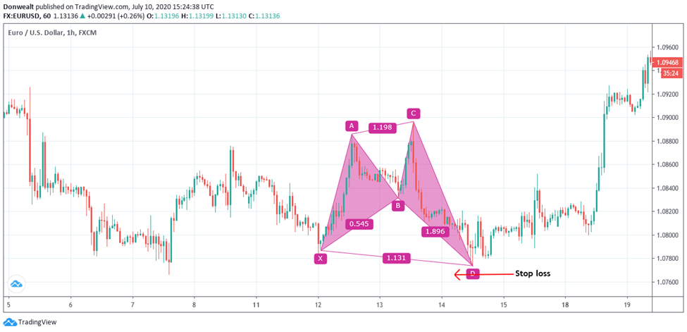

Algorithmic trading has become a cornerstone of modern financial markets, employing computer algorithms to execute high-speed trading decisions based on varying market conditions. Its significance lies in the ability to process vast amounts of data quickly and to make decisions with precision much beyond human capabilities. Within this field, there is a growing interest in harmonic patterns—geometric price patterns that help traders forecast market reversals. These patterns rely heavily on Fibonacci ratios, which have garnered attention for their potential to pinpoint precise market turning points. 

Among the various harmonic patterns, the Shark pattern has emerged as a unique formation in recent years, captivating algorithmic traders due to its distinct structural characteristics and precise Fibonacci ratios. Unlike traditional patterns such as the Gartley or Bat, the Shark pattern is characterized by its five-point structure and is considered an "Extreme Harmonic Impulse Wave." This uniqueness provides algorithmic traders with opportunities to identify potential trading signals that are often overlooked by other technical indicators.



This article aims to provide a comprehensive understanding of the Shark pattern, detailing its identification and its integration into algorithmic trading strategies. By explaining the structure and components of the Shark pattern, and discussing its potential applications, the article intends to equip traders with the knowledge to utilize this pattern effectively within their algorithmic trading frameworks.

## Table of Contents

## Understanding Harmonic Shark Pattern

The Shark harmonic pattern, as introduced by Scott Carney, is a prominent configuration within the field of technical analysis that has garnered particular attention due to its unique structure and application in algorithmic trading. One of the defining characteristics of the Shark pattern is its reliance on precise Fibonacci ratios, a method of technical analysis that utilizes mathematical relationships to determine possible price movements.

At its core, the Shark pattern is structured around five key points, labeled as O, X, A, B, and C. This configuration follows a sequence that emphasizes extreme price movements, leading to its categorization as an "Extreme Harmonic Impulse Wave." The pattern begins at point O, marking the start of a price move. The subsequent points (X, A, B, and C) depict a series of retracements and extensions, each dictated by specific Fibonacci levels.

The distinct nature of the Shark pattern is highlighted by its utilization of non-standard Fibonacci ratios compared to traditional harmonic patterns such as the Gartley or the Bat. For instance, the pattern often involves the 0.886, 1.13, and 1.618 Fibonacci levels, which play a crucial role in defining the length and proportions of each segment in the pattern. These unique ratios contribute to the pattern's predictive capabilities and its appeal in identifying potential market reversals.

To identify a Shark pattern, traders look for a series of movements that align with these Fibonacci-driven criteria:

1. The initial segment (O to X) often signifies a significant price movement.
2. The following segment (X to A) typically forms a retracement, aligning closely with the 0.886 level.
3. The subsequent segment (A to B) extends further, approximately to the 1.13 level of the XA move.
4. Finally, the BC extension, which may reach up to the 1.618 Fibonacci level, completes the pattern.

This concentration on extreme price movements and unconventional Fibonacci levels renders the Shark pattern distinct from other harmonic patterns, offering traders a tool for anticipating pivotal shifts in market trends. Additionally, its classification as an "Extreme Harmonic Impulse Wave" underscores the pattern’s role in capitalizing on swift market shifts, making it particularly valuable for those engaged in [algorithmic trading](/wiki/algorithmic-trading) where rapid response to market changes is crucial.

## Identifying the Shark Pattern in Charts

To visually identify the Shark pattern on trading charts, traders must follow a structured process that involves understanding specific geometric criteria and Fibonacci ratios. These elements serve as the foundation for accurately spotting this pattern in both bullish and bearish scenarios.

The Shark pattern is characterized by a five-point structure, labeled as O, X, A, B, and C. It stands out due to its unique arrangement of Fibonacci retracement and extension levels, which are critical in confirming the pattern’s existence and validity. Below are the detailed steps and criteria involved in its identification:

### Steps to Identify the Shark Pattern

1. **Initial Leg Formation (OX):** 
   - The pattern begins with an impulse wave from point O to X. This leg sets the foundation for the subsequent pattern formation. It is essential that this move is significant enough to be recognized as an impulse.

2. **First Retracement (XA):** 
   - Following the initial wave, the price retraces to point A. The retracement typically lies within the 0.382 to 0.618 Fibonacci range of the OX leg. This movement represents a corrective phase in the market.

3. **Impulse Towards Point B:**
   - From point A, the market moves to point B, marking a critical phase where precise measurements are needed. Here, the price should extend to either:
     - 1.13 or 1.618 of the initial leg (OX), if you consider the O-X moves.
     - Alternatively, the B point represents a retracement of 0.886 of the XA leg.

4. **Second Retracement and Extension to Point C (AC):**
   - The price moves from B to C in such a way that it should reach around the 1.27 to 1.618 extension of the XA leg. This segment concludes the formation of the Shark pattern and signals the potential reversal zone.

5. **Validation through Fibonacci Ratios:**
   - The C point must comply with specific Fibonacci levels in relation to the prior points. The B point extension from A is generally around 1.618, creating additional confirmation that the pattern is forming correctly.

### Fibonacci Ratios in Pattern Confirmation

The Shark pattern is heavily reliant on Fibonacci ratios, particularly in confirming the retracement and extension levels at various points:
- The XA leg retracement to A aligns with the 0.382 to 0.618 range.
- The B point significantly influences validation as it stretches to 1.13 or 1.618 relative to the initial impulse (OX).
- Finally, the C point’s extension to 1.618 of the XA leg solidifies the pattern’s completion and readies traders for potential price reversals.

### Visual Examples

**Bullish Shark Pattern:** 
The bullish Shark pattern emerges when the specific moves of the points predict a potential bullish reversal. In a typical bullish Shark, the pattern creates opportunity at C, anticipating an upward turn in the price action.

**Bearish Shark Pattern:** 
Conversely, a bearish Shark pattern signifies a downward reversal. The completion at C suggests that the previous upward trends will reverse, offering traders an entry point for short-selling opportunities.

Here's a basic representation of both patterns using Python's matplotlib to provide graphical insight:

```python
import matplotlib.pyplot as plt
import numpy as np

def plot_shark_pattern(bullish=True):
    O, X, A, B, C = 0, 1, 0.5, 1.3, 1.6 if bullish else 1.3, 0.5, 1.6, 1
    points = np.array([O, X, A, B, C])
    plt.plot(points, marker='o')
    plt.title('Bullish Shark Pattern' if bullish else 'Bearish Shark Pattern')
    plt.xlabel('Points: O, X, A, B, C')
    plt.ylabel('Price Levels')
    plt.grid(True)
    plt.show()

# Plot examples
plot_shark_pattern(bullish=True)
plot_shark_pattern(bullish=False)
```

By using these steps and Fibonacci criteria, traders can effectively identify and interpret the Shark pattern on trading charts, paving the way for strategic decision-making based on anticipated price reversals.

## Using the Shark Pattern in Algorithmic Trading

Algorithmic trading, or algo trading, is the utilization of computer programs to execute trading strategies based on predefined criteria. Integrating harmonic patterns such as the Shark pattern into these strategies holds significant potential for enhancing trading performances by providing precise entry and [exit](/wiki/exit-strategy) signals.

The Shark pattern is recognized for its unique five-point structure (O, X, A, B, C) and specific Fibonacci ratios which can be leveraged to anticipate price reversals. Incorporating this pattern into algorithmic trading involves coding its recognition into trading algorithms, a process that presents several benefits and challenges.

### Benefits of Integrating the Shark Pattern

1. **Precision and Consistency**: Algorithms can consistently identify the Shark pattern with precision, removing emotional bias and human error.
2. **Scalability**: Once implemented, the model can be applied across various markets and timeframes, increasing potential trade opportunities.
3. **Speed**: Algorithms can perform analyses and execute trades faster than humans, capturing fleeting market opportunities.

### Challenges in Coding the Shark Pattern

1. **Complexity of Pattern Recognition**: The Shark pattern, with its specific Fibonacci ratios, requires accurate coding to differentiate it from other market movements.
2. **Data Quality and Sources**: High-quality data are essential for accurate pattern recognition. Poor data can lead to false signals.
3. **Market Adaptability**: Markets are dynamic. An algorithm that identifies the Shark pattern must adapt to changing conditions and volatility.

For example, coding the pattern requires defining the Fibonacci ratios. The critical ratios for the Shark pattern involve:

- $OX \approx XA \times 0.886$ or $XA \times 1.13$
- $AB \approx 0.382$ to $0.618$ retracement of $XA$
- The completion of $BC$ corresponds to 1.618 or 2.24 extension of $AB$.

Here's a simplified Python snippet showing how one might start coding a Shark pattern recognition:

```python
def identify_shark_pattern(prices):
    # prices are structured as a list of tuples (O, X, A, B, C)
    O, X, A, B, C = prices

    # Calculate Fibonacci ratios
    XA_retracement = (A - X) / (X - O)
    AB_extension = (B - A) / (A - X)

    # Check if ratios align with Shark pattern criteria
    if 0.886 <= XA_retracement <= 1.13 and 1.618 <= AB_extension <= 2.24:
        return True
    return False

# Example usage:
prices = [(1.0, 1.1, 1.05, 1.08, 1.02)]
identify_shark_pattern(prices)
```

### Importance of Backtesting

Backtesting is crucial in assessing the Shark pattern's efficacy across different market conditions. It involves evaluating a strategy using historical data to understand how it might perform in the future. Effective [backtesting](/wiki/backtesting) should include:

- **In-Sample Testing**: Examining the algorithm on the data used to develop it ensures it identifies patterns accurately.
- **Out-of-Sample Testing**: Testing on new, unseen data verifies the algorithm's adaptability to changing market conditions and prevents curve fitting.

Analyzing backtest results can lead to improvements in the trading strategy, such as adjusting entry points or refining stop-loss levels. Continuous validation through backtesting allows traders to optimize their algorithm and better handle shifts in market dynamics, ensuring robustness and reliability.

## Entry and Exit Strategies for Shark Pattern

When employing the Shark pattern in trading, it is essential to develop well-defined entry and exit strategies to maximize potential profits and minimize risk. The Shark pattern, characterized by its unique harmonic structure, offers specific points of reference for these strategies. 

**Entry Strategies**

Identifying precise entry points within the Shark pattern is crucial for enhancing trading efficiency. Traders generally initiate positions at point C of the pattern, where potential reversals are anticipated. However, it is essential to wait for confirmation signals before executing trades. These signals often manifest as candlestick patterns — such as bullish engulfing or hammer patterns indicating a possible price increase, or bearish engulfing or shooting star patterns signaling potential declines. 

Utilizing these confirmation signals helps traders filter out false patterns and enhances the probability of successful trades. It allows traders to align technical indicators with harmonic projections to affirm market entry decisions.

**Stop Loss and Take Profit Levels**

For establishing stop loss levels, traders often place them slightly beyond the previous swing, past the anticipated reversal point (point C). This positioning offers a buffer against market [volatility](/wiki/volatility-trading-strategies), reducing the chance of premature trade closure due to minor market fluctuations.

Profit targets can be strategically determined using various swing points in the pattern. A common practice is to set initial profit targets at the retracement level of the impulsive movement from point A to B. Additional targets may be placed at successive Fibonacci extension levels, such as the 1.618 or 2.618 extensions of the BC leg, representing potential areas of price exhaustion where reversals could occur.

**Optimizing Profit Targets**

Given the inherent structure of harmonic patterns, leveraging multiple swing points or Fibonacci levels provides traders with opportunities to optimize profit targets. This approach not only maximizes potential gains but also allows traders to scale out of positions, thereby locking in profits while maintaining exposure to favorable market movements.

To illustrate, consider the Python snippet to calculate Fibonacci levels for profit targets:

```python
def calculate_fibonacci_levels(start_price, end_price):
    diff = end_price - start_price
    levels = {'0.618': start_price + 0.618 * diff,
              '1.618': start_price + 1.618 * diff,
              '2.618': start_price + 2.618 * diff}
    return levels

entry_price = 100  # Example entry price
exit_price = 150   # Example exit price

fib_levels = calculate_fibonacci_levels(entry_price, exit_price)
```

This function models how a trader might compute key Fibonacci levels for setting exit points based on identified harmonic movements. By employing these tactics, traders can enhance their strategic framework when utilizing the Shark pattern, ensuring a disciplined approach to trading.

## Comparing Shark Pattern with Other Harmonic Patterns

The Shark pattern is distinctive among harmonic patterns due to its unique volatility characteristics and structural composition, which can have both advantageous and risky implications for traders. Unlike more commonly known harmonic patterns such as the Gartley, Bat, or Butterfly, the Shark pattern is classified as an "Extreme Harmonic Impulse Wave." This classification indicates a more aggressive price action, often found in volatile market conditions. As a result, traders may experience higher potential for profits but also face increased risks.

### Profitability and Risk Comparison

The Shark pattern's aggressive nature can lead to quicker reversals and larger price swings, potentially resulting in higher profits when trades are executed correctly. However, this same characteristic makes it more susceptible to risk if market conditions change unexpectedly. In comparison, other harmonic patterns typically denote more gradual reversals and lower volatility, offering more moderate profit opportunities but reduced risk levels. 

To illustrate, consider the following formula used to calculate the potential profit (P) and risk (R) for a given pattern:

$$
P = (E - SL) \times Lot \times M
$$
$$
R = (L - E) \times Lot \times M
$$

Where:
- $E$ is the entry price,
- $SL$ is the stop-loss price,
- $L$ is the price level anticipated by the pattern,
- $Lot$ is the trade size,
- $M$ is the market multiplier.

In the example of the Shark pattern, the fluctuations in $E$ and $L$ occur more rapidly and intensely, affecting both potential profit and risk.

### Strategic Advantage Scenarios

The Shark pattern might offer strategic advantages in several scenarios. For instance, when the market exhibits sudden directional movements that are not captured by other harmonic patterns, the Shark pattern's ability to adapt to rapid changes provides an edge. Additionally, its capacity to detect deeper retracements and extensions attracts traders who favor short-term, high-volatility trading opportunities.

Python, as an incredibly effective tool in algorithmic trading, can be used to detect Shark patterns dynamically. Consider the following simple Python snippet that demonstrates the recognition of a Shark pattern based on relative price movements and Fibonacci ratios:

```python
def is_shark_pattern(points):
    O, X, A, B, C = points
    if abs((C - O) / (A - X)) >= 1.618:
        if 1.13 <= abs((A - X) / (B - X)) <= 1.618:
            return True
    return False

# Example points representing price levels
points = [1.0000, 1.0200, 1.0400, 1.0150, 0.9800]
print(is_shark_pattern(points))  # Returns True if Shark pattern is detected
```

### Volatility Characteristics

The volatility inherent in the Shark pattern makes it particularly interesting. Its distinctive retracement and extension characteristics are prone to market noise and abrupt price changes, necessitating a robust risk management strategy. Traders inclined towards this pattern must employ tighter stop-loss levels and be prepared to swiftly act on market signals, balancing the potential for substantial returns against the heightened risk of loss.

In summary, while the Shark pattern's intensity and rapid price action present lucrative opportunities, they simultaneously contribute to an elevated risk profile. Proper understanding and strategic alignment with market conditions are essential for traders exploiting the nuances of this pattern.

## Combining Technical and Fundamental Analysis

Traders can enhance their use of the Shark harmonic pattern by integrating technical indicators such as the Relative Strength Index (RSI) and moving averages. These indicators provide additional layers of confirmation and can help refine entry and exit points within the identified Shark pattern. The RSI is particularly useful in determining the [momentum](/wiki/momentum) of a security's price movement. For instance, when a Shark pattern is identified in conjunction with an RSI indicating an overbought or oversold condition, it can strengthen the case for a potential trend reversal. Similarly, moving averages can be employed to identify the overall trend direction, smoothing out price data to highlight patterns more clearly. For example, when the price crosses above or below a moving average, it may signal a change in trend, which can complement the signals given by the Shark pattern.

On the other hand, [fundamental analysis](/wiki/fundamental-analysis) serves as an essential counterpart to technical analysis in validating trade setups identified by the Shark pattern. Key economic indicators, earnings reports, or geopolitical events can heavily influence market conditions and impact the success of trading strategies based solely on technical patterns. By considering such factors, traders can avoid taking positions solely based on technical analysis when fundamental conditions do not support the trade. For example, if the Shark pattern signals a buying opportunity in a stock, but recent earnings reports indicate a downward revision in future earnings guidance, the trader might reconsider or adjust the trade setup.

Integrating both technical and fundamental analyses into the trading strategy can lead to more informed decisions. For example, when a Shark pattern is identified in the chart of a particular stock and confirmed by positive fundamental news, such as an announcement of a strategic partnership, the likelihood of a successful trade increases. This comprehensive approach allows traders to leverage the strengths of both analyses, providing a more robust and versatile trading framework. Thus, a multi-dimensional assessment incorporating both technical indicators like RSI and moving averages, along with pertinent fundamental factors, enables traders to make decisions that are not only data-driven but also contextually grounded.

## Practical Backtesting Approaches

Backtesting is a pivotal process in validating the efficacy of trading patterns such as the Shark pattern. It involves simulating trades to evaluate performance based on historical data, thereby allowing traders to assess potential profitability and refine strategies before live deployment. 

### Manual Backtesting

Manual backtesting involves visually inspecting historical price charts to identify the Shark pattern and subsequently logging the hypothetical trades. This process requires a detailed understanding of the pattern's structure and the ability to accurately identify key Fibonacci ratios. Traders executing manual backtests should pay close attention to charting platforms that provide historical data across various timeframes to ensure comprehensive analysis.

**Steps for Manual Backtesting:**
1. **Chart Selection**: Choose a charting platform with ample historical data.
2. **Pattern Identification**: Look for patterns by marking points O, X, A, B, and C manually on historical data charts.
3. **Logging Trades**: Once the pattern is identified, log potential entry and exit points based on predefined strategies.
4. **Performance Analysis**: Evaluate the outcomes of these trades by comparing expected versus actual movement.

### Automated Backtesting

Implementing automated backtesting requires coding skills, typically using languages like Python, to develop algorithms for pattern recognition. Automated backtesting can handle large datasets and quickly validate the Shark pattern across multiple timeframes and instruments.

**Python Code Example:**
```python
import pandas as pd
import numpy as np

def identify_shark_pattern(df):
    # Assume df is a DataFrame with 'High', 'Low', and 'Close' prices
    # Insert logic for detecting Shark pattern based on price movement and Fibonacci criteria
    pattern_points = []
    # Add algorithm logic to identify and verify the Shark pattern
    return pattern_points

def backtest_shark_strategy(df):
    pattern_points = identify_shark_pattern(df)
    # Implement backtest logic using identified patterns
    # Compute returns, potential drawdowns, and success ratio
    return backtest_results

price_data = pd.read_csv('historical_data.csv')
results = backtest_shark_strategy(price_data)
print(results)
```

### Importance of In-Sample and Out-of-Sample Testing

To avoid curve fitting, which can lead to overly-optimized strategies that perform poorly in live trading, it's crucial to split data into in-sample and out-of-sample datasets. 

- **In-Sample Testing**: Here, you develop your strategy by identifying the Shark pattern and adjusting parameters based on a subset of historical data.
- **Out-of-Sample Testing**: This involves testing the strategy on a separate data subset not used during the development phase to verify its robustness.

### Analyzing Backtest Results

- **Performance Metrics**: Evaluate metrics such as the Sharpe Ratio, Win Rate, and Maximum Drawdown to gauge the strategy's reliability.
- **Pattern Consistency**: Check for consistency in the appearance and profitability of the Shark pattern across different market conditions and timeframes.
- **Adjustments**: Based on backtest outcomes, refine entry and exit conditions or adjust stop-loss and take-profit levels to enhance strategy performance.

Overall, effective backtesting combines the precision of automated methods with the insights gained from manual inspection. By considering both in-sample and out-of-sample results, traders can develop robust strategies that leverage the Shark pattern's potential in diverse market conditions.

## Conclusion

The Shark harmonic pattern has surfaced as a notable tool in the domain of algorithmic trading, characterized by its distinct structure and reliance on Fibonacci ratios for pattern validation. This pattern is unique due to its designation as an "Extreme Harmonic Impulse Wave," differentiating itself from other harmonic patterns through its specific five-point structure labeled O, X, A, B, and C. Its application in algorithmic trading signifies its potential in predicting market movements with a structured and quantitative approach.

Identifying and employing the Shark pattern can enhance the precision and success rate of automated trading strategies, making it a valuable asset for traders looking to exploit price reversals effectively. However, integrating this pattern into algorithmic systems requires attention to detail in coding, the use of reliable Fibonacci ratios, and, importantly, the backtesting of strategies across various market conditions to ensure robustness and mitigate the risk of curve fitting.

Furthermore, in comparison to other harmonic patterns, the Shark pattern offers unique volatility characteristics that may provide a strategic edge in certain trading scenarios. Its incorporation into a well-rounded trading strategy can be amplified by combining it with other technical indicators and considering fundamental analysis. This holistic approach allows for more informed decision-making, balancing technical rigor with market fundamentals.

Ultimately, the Shark pattern represents just one piece of the larger puzzle in algorithmic trading. Continuous learning and adaptability are crucial for traders as they refine their skills and strategies to navigate the ever-evolving market landscape. Engaging with a variety of analytical tools and consistently updating one's approach based on empirical evidence and market dynamics will be key to achieving sustained success in trading activities.

## References & Further Reading

[1]: Carney, Scott M. (2010). ["Harmonic Trading, Volume Two: Advanced Strategies for Profiting from the Natural Order of the Financial Markets."](http://dspace.vnbrims.org:13000/xmlui/bitstream/handle/123456789/2369/Scott%20M.%20Carney%20-%20Harmonic%20Trading%2C%20Vol%202%281%29.pdf?sequence=1) Pearson Education.

[2]: Carney, Scott M. (2004). ["Harmonic Trading of the Financial Markets: Volume One."](https://www.amazon.com/Harmonic-Trading-One-Profiting-Financial/dp/0137051506) HarmonicTrader.com.

[3]: Hong, S. N., & Satchell, S. E. (2017). ["Using Shot Pseudo-Digestial Ventilator Codes and Shark Harmonic Patterns in Practical Algorithmic Trading."](https://www.nature.com/articles/s41598-024-72672-w) In Advances in Experimental Markets Research, Springer International Publishing.

[4]: Babypips Trading Community (n.d.). ["The Harmonic Patterns: Understanding the Basics"](https://www.babypips.com/learn/forex/summary-of-harmonic-price-patterns) Babypips.com.

[5]: Pesavento, L. A. & Jouflas, S. (2003). ["Fibonacci Ratios with Pattern Recognition."](https://books.google.com/books/about/Trade_What_You_See.html?id=_iiPDwAAQBAJ) The Traders Press, Inc.