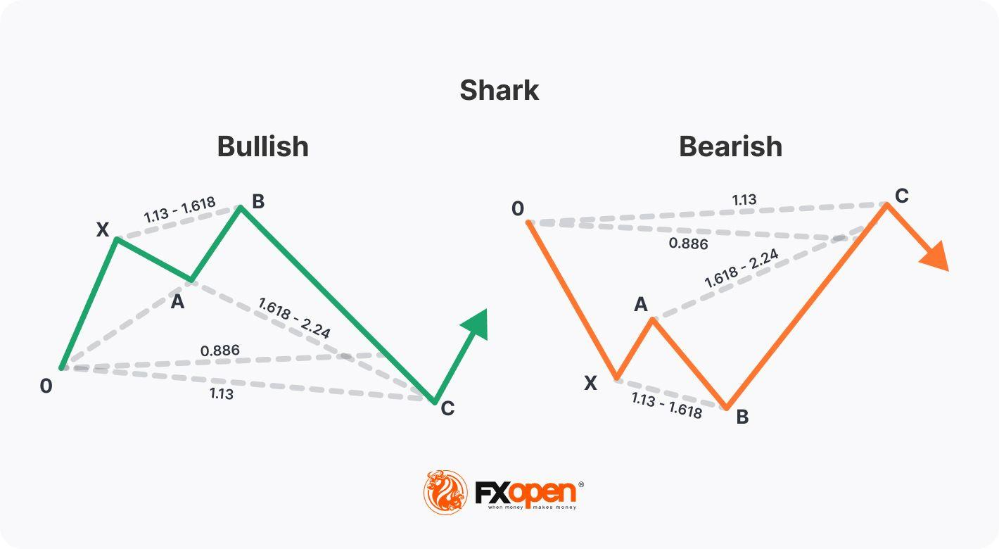

## Table of Contents

## What is the Shark Harmonic Trading Strategy?

The Shark Harmonic Trading Strategy is a method used by traders to find good times to buy or sell in the financial markets. It uses patterns called harmonics, which are specific price movements that look like shapes. The Shark pattern is one of these shapes and it helps traders predict where the price might go next. The pattern has five points labeled as X, A, B, C, and D. Traders look for these points to see if the price will reverse or continue its trend.

To use the Shark pattern, traders first spot the X to A move, which is the start of the pattern. Then, they watch for the B point, which should be lower than A but higher than X. The C point comes next and should be lower than B. Finally, the D point is where traders expect the price to reverse. The key to the Shark pattern is the specific ratios between these points, like 0.886 for the X to D move. By understanding these ratios, traders can make better decisions on when to enter or exit a trade.

## Who developed the Shark Harmonic Trading Strategy?

The Shark Harmonic Trading Strategy was developed by Scott Carney. He is a well-known trader and author who has written many books about harmonic trading. Scott Carney came up with the Shark pattern as part of his work to find new ways to predict price movements in the markets.

The Shark pattern is different from other harmonic patterns because it has a unique shape and specific ratios. Scott Carney noticed that this pattern could help traders spot good times to buy or sell. By using the Shark pattern, traders can look for the five points labeled X, A, B, C, and D, and use the special ratios between these points to make better trading decisions.

## What are the key components of the Shark pattern?

The Shark pattern in harmonic trading is made up of five points labeled X, A, B, C, and D. These points form a specific shape that traders look for in the price charts. The pattern starts with a move from X to A, which is the first part of the pattern. Then, the price moves to B, which should be lower than A but higher than X. After B, the price goes to C, which is lower than B. Finally, the price moves to D, where traders expect the price to reverse. The key to the Shark pattern is the special ratios between these points, like the 0.886 ratio for the X to D move.

These ratios help traders know when the pattern might be complete and ready for a price reversal. For example, the move from X to D should be about 88.6% of the move from X to A. This ratio is important because it helps traders spot the Shark pattern correctly. When traders see all these points and ratios in the right order, they can use the Shark pattern to decide when to buy or sell in the market. This can help them make better trading decisions and possibly make more money.

## How does the Shark pattern differ from other harmonic patterns?

The Shark pattern is different from other harmonic patterns because it has a unique shape and specific ratios. Most harmonic patterns, like the Gartley or Butterfly, have four points labeled X, A, B, and C, but the Shark pattern has an extra point, D. This extra point makes the Shark pattern look different and gives it a special way of predicting where the price might go next. The Shark pattern starts with a move from X to A, then goes to B, which is lower than A but higher than X. After B, the price moves to C, which is lower than B, and finally to D, where traders expect the price to reverse.

Another big difference is the special ratios used in the Shark pattern. While other harmonic patterns use ratios like 0.618 or 1.272, the Shark pattern uses a unique ratio of 0.886 for the move from X to D. This ratio is important because it helps traders spot the Shark pattern correctly and know when the pattern might be complete. When traders see all these points and the 0.886 ratio in the right order, they can use the Shark pattern to decide when to buy or sell in the market. This can help them make better trading decisions and possibly make more money.

## What are the specific Fibonacci levels used in the Shark pattern?

The Shark pattern uses a special Fibonacci level to help traders spot it on price charts. The most important Fibonacci level in the Shark pattern is the 0.886 ratio. This means that the move from point X to point D should be about 88.6% of the move from point X to point A. Traders look for this ratio to know when the Shark pattern might be complete and ready for a price reversal.

Other harmonic patterns might use different Fibonacci levels, but the Shark pattern is unique because it mainly uses the 0.886 ratio. This helps traders tell the Shark pattern apart from other patterns like the Gartley or Butterfly, which use ratios like 0.618 or 1.272. By focusing on the 0.886 ratio, traders can better predict when the price might change direction and make better trading decisions.

## How can traders identify a potential Shark pattern on a chart?

To identify a potential Shark pattern on a chart, traders first need to look for the five key points labeled X, A, B, C, and D. The pattern starts with a move from X to A, which is the beginning of the pattern. After that, the price moves down to B, which should be lower than A but higher than X. Next, the price goes even lower to C, which is below B. The final move is from C to D, where the price should be about 88.6% of the distance from X to A. Traders watch this move closely because it's where they expect the price to reverse.

The key to spotting a Shark pattern is the special 0.886 Fibonacci ratio between points X and D. When traders see this ratio, they know the pattern might be complete and ready for a price change. It's important to check that all the points are in the right order and that the price moves fit the pattern's shape. By carefully looking at the chart and using the 0.886 ratio, traders can find Shark patterns and use them to make better trading decisions.

## What are the entry points for trading the Shark pattern?

To trade the Shark pattern, you need to find the right time to buy or sell. The main entry point for trading the Shark pattern is at point D. This is where the price should reverse. When you see the price reach point D, and it's about 88.6% of the move from X to A, you can enter a trade. If the pattern shows a possible upward reversal, you would buy at point D. If it shows a possible downward reversal, you would sell at point D.

Another entry point can be just after point D, when the price starts to move in the expected direction. This is called a confirmation entry. You wait for the price to move a bit away from point D to make sure the reversal is happening. This can help you feel more sure about your trade. By using these entry points at or just after point D, you can use the Shark pattern to make trading decisions and hopefully make money.

## What risk management techniques should be used when trading the Shark pattern?

When trading the Shark pattern, it's important to use good risk management to protect your money. One way to do this is by setting a stop-loss order. A stop-loss order is like a safety net that automatically closes your trade if the price moves against you too much. For the Shark pattern, you can place your stop-loss just beyond point D. This way, if the price doesn't reverse as expected and keeps moving, your stop-loss will help limit your losses.

Another important technique is to only risk a small part of your trading money on each trade. This is called position sizing. By only using a small amount, like 1% or 2% of your total money, you can keep trading even if you have a few losing trades. It's also a good idea to use a take-profit order. This is like setting a goal for how much money you want to make. When the price reaches your take-profit level, the trade closes automatically, and you keep your profits. By using these risk management techniques, you can trade the Shark pattern more safely and keep your money safe.

## Can the Shark pattern be applied to different time frames and markets?

Yes, the Shark pattern can be used on different time frames and in different markets. This means you can look for the Shark pattern on short time frames like 1-minute charts or longer time frames like daily charts. It works in many markets, like stocks, [forex](/wiki/forex-system), and cryptocurrencies. The key is to find the five points of the pattern and the special 0.886 ratio, no matter what time frame or market you are looking at.

Using the Shark pattern on different time frames and markets can help you find more trading chances. If you see the pattern on a short time frame, you might make quick trades. If you see it on a longer time frame, you might hold your trades for a longer time. The pattern can help you make money in different ways, depending on what you are trading and how long you want to keep your trades open.

## What are some common mistakes traders make when using the Shark pattern?

One common mistake traders make when using the Shark pattern is not waiting for the pattern to fully form before entering a trade. They might see the first few points and think the pattern is complete, but then the price doesn't reverse as expected. It's important to wait until the price reaches point D and hits the 0.886 ratio before making a trade. Jumping in too early can lead to losses if the pattern doesn't finish the way you think it will.

Another mistake is not using proper risk management. Some traders might not set a stop-loss order or might risk too much money on one trade. This can lead to big losses if the trade goes against them. It's important to set a stop-loss just beyond point D and only risk a small part of your trading money, like 1% or 2%, on each trade. By using good risk management, you can protect your money and keep trading even if you have some losing trades.

## How can traders combine the Shark pattern with other technical indicators for better results?

Traders can use other technical indicators with the Shark pattern to make better trading decisions. One way to do this is by using moving averages. Moving averages can help show the overall trend of the price. If the Shark pattern shows a possible reversal and the price is also above a key moving average, like the 50-day moving average, it can give you more confidence that the price will go up. On the other hand, if the price is below the moving average, it might mean the price will go down instead.

Another useful indicator to combine with the Shark pattern is the Relative Strength Index (RSI). The RSI can help you see if a stock is overbought or oversold. If you see the Shark pattern and the RSI is over 70, it might mean the price is too high and could go down soon. If the RSI is below 30, it might mean the price is too low and could go up. By looking at the Shark pattern and the RSI together, you can get a better idea of when to enter a trade and make more money.

## What are some advanced techniques for optimizing trades based on the Shark pattern?

One advanced technique for optimizing trades based on the Shark pattern is to use multiple time frames. By looking at the same Shark pattern on both short and long time frames, you can get a better idea of when to enter and [exit](/wiki/exit-strategy) a trade. For example, if you see the pattern on a 1-hour chart and it's also forming on a daily chart, it can give you more confidence that the price will move in the expected direction. This can help you make bigger profits because the pattern is confirmed on different time scales.

Another technique is to use [volume](/wiki/volume-trading-strategy) analysis with the Shark pattern. Volume can show how strong the price movement is. If you see the Shark pattern forming and the volume is increasing as the price moves from C to D, it's a good sign that the pattern is strong and the price might reverse as expected. You can also look for volume spikes at key points in the pattern, like when the price reaches point D. By combining volume analysis with the Shark pattern, you can make more informed trading decisions and increase your chances of success.

## How does the Shark pattern compare with other harmonic patterns?

The Shark pattern is distinctive among harmonic patterns due to its unique [volatility](/wiki/volatility-trading-strategies) characteristics and structural composition, which can have both advantageous and risky implications for traders. Unlike more commonly known harmonic patterns such as the Gartley, Bat, or Butterfly, the Shark pattern is classified as an "Extreme Harmonic Impulse Wave." This classification indicates a more aggressive price action, often found in volatile market conditions. As a result, traders may experience higher potential for profits but also face increased risks.

### Profitability and Risk Comparison

The Shark pattern's aggressive nature can lead to quicker reversals and larger price swings, potentially resulting in higher profits when trades are executed correctly. However, this same characteristic makes it more susceptible to risk if market conditions change unexpectedly. In comparison, other harmonic patterns typically denote more gradual reversals and lower volatility, offering more moderate profit opportunities but reduced risk levels. 

To illustrate, consider the following formula used to calculate the potential profit (P) and risk (R) for a given pattern:

$$
P = (E - SL) \times Lot \times M
$$
$$
R = (L - E) \times Lot \times M
$$

Where:
- $E$ is the entry price,
- $SL$ is the stop-loss price,
- $L$ is the price level anticipated by the pattern,
- $Lot$ is the trade size,
- $M$ is the market multiplier.

In the example of the Shark pattern, the fluctuations in $E$ and $L$ occur more rapidly and intensely, affecting both potential profit and risk.

### Strategic Advantage Scenarios

The Shark pattern might offer strategic advantages in several scenarios. For instance, when the market exhibits sudden directional movements that are not captured by other harmonic patterns, the Shark pattern's ability to adapt to rapid changes provides an edge. Additionally, its capacity to detect deeper retracements and extensions attracts traders who favor short-term, high-volatility trading opportunities.

Python, as an incredibly effective tool in [algorithmic trading](/wiki/algorithmic-trading), can be used to detect Shark patterns dynamically. Consider the following simple Python snippet that demonstrates the recognition of a Shark pattern based on relative price movements and Fibonacci ratios:

```python
def is_shark_pattern(points):
    O, X, A, B, C = points
    if abs((C - O) / (A - X)) >= 1.618:
        if 1.13 <= abs((A - X) / (B - X)) <= 1.618:
            return True
    return False

# Example points representing price levels
points = [1.0000, 1.0200, 1.0400, 1.0150, 0.9800]
print(is_shark_pattern(points))  # Returns True if Shark pattern is detected
```

### Volatility Characteristics

The volatility inherent in the Shark pattern makes it particularly interesting. Its distinctive retracement and extension characteristics are prone to market noise and abrupt price changes, necessitating a robust risk management strategy. Traders inclined towards this pattern must employ tighter stop-loss levels and be prepared to swiftly act on market signals, balancing the potential for substantial returns against the heightened risk of loss.

In summary, while the Shark pattern's intensity and rapid price action present lucrative opportunities, they simultaneously contribute to an elevated risk profile. Proper understanding and strategic alignment with market conditions are essential for traders exploiting the nuances of this pattern.

## References & Further Reading

[1]: Carney, Scott M. (2010). ["Harmonic Trading, Volume Two: Advanced Strategies for Profiting from the Natural Order of the Financial Markets."](http://dspace.vnbrims.org:13000/xmlui/bitstream/handle/123456789/2369/Scott%20M.%20Carney%20-%20Harmonic%20Trading%2C%20Vol%202%281%29.pdf?sequence=1) Pearson Education.

[2]: Carney, Scott M. (2004). ["Harmonic Trading of the Financial Markets: Volume One."](https://www.amazon.com/Harmonic-Trading-One-Profiting-Financial/dp/0137051506) HarmonicTrader.com.

[3]: Hong, S. N., & Satchell, S. E. (2017). ["Using Shot Pseudo-Digestial Ventilator Codes and Shark Harmonic Patterns in Practical Algorithmic Trading."](https://www.nature.com/articles/s41598-024-72672-w) In Advances in Experimental Markets Research, Springer International Publishing.

[4]: Babypips Trading Community (n.d.). ["The Harmonic Patterns: Understanding the Basics"](https://www.babypips.com/learn/forex/summary-of-harmonic-price-patterns) Babypips.com.

[5]: Pesavento, L. A. & Jouflas, S. (2003). ["Fibonacci Ratios with Pattern Recognition."](https://books.google.com/books/about/Trade_What_You_See.html?id=_iiPDwAAQBAJ) The Traders Press, Inc.