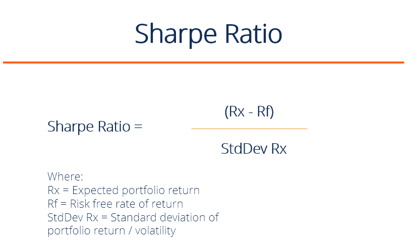

## Table of Contents

## What is the Sharpe Ratio?

The Sharpe Ratio is a way to measure how good an investment is compared to how risky it is. It was created by a man named William F. Sharpe. The ratio looks at the extra return you get from an investment above a safe investment like a bank account, and then it divides that by how much the investment's value goes up and down. A higher Sharpe Ratio means the investment is giving you more return for the risk you're taking.

You can use the Sharpe Ratio to compare different investments. If one investment has a higher Sharpe Ratio than another, it means it's doing a better job of giving you returns without too much risk. But remember, the Sharpe Ratio is just one tool. It doesn't tell you everything about an investment, so it's good to look at other things too before deciding where to put your money.

## Who developed the Sharpe Ratio and when?

The Sharpe Ratio was developed by a man named William F. Sharpe. He came up with this idea in 1966. William F. Sharpe is a famous economist who won a Nobel Prize for his work in understanding how investments work.

The Sharpe Ratio is a simple way to see if an investment is worth the risk. It helps people figure out if they are getting enough extra return for the ups and downs of their investment. Since 1966, many investors have used the Sharpe Ratio to make better choices about where to put their money.

## What is the formula for calculating the Sharpe Ratio?

The Sharpe Ratio is calculated by taking the difference between the return of an investment and the risk-free rate, and then dividing that difference by the standard deviation of the investment's returns. The risk-free rate is usually the return you would get from a very safe investment, like a U.S. Treasury bond. The standard deviation measures how much the investment's returns go up and down over time.

In simple terms, the formula looks like this: Sharpe Ratio = (Return of the Investment - Risk-Free Rate) / Standard Deviation of the Investment's Returns. A higher Sharpe Ratio means the investment is giving you more return for the risk you're taking. If the Sharpe Ratio is positive, it means the investment is doing better than the risk-free rate. If it's negative, it's doing worse.

## What does the Sharpe Ratio measure?

The Sharpe Ratio measures how well an investment is doing compared to how risky it is. It helps you see if the extra return you're getting from an investment is worth the ups and downs you have to deal with. The ratio looks at the difference between the return of your investment and the return of a very safe investment, like a bank account or a U.S. Treasury bond. This difference is called the "excess return." The Sharpe Ratio then divides this excess return by how much the investment's value goes up and down, which is called the "standard deviation."

A higher Sharpe Ratio means the investment is giving you more return for the risk you're taking. If the Sharpe Ratio is positive, it means your investment is doing better than the safe investment. If it's negative, it's doing worse. The Sharpe Ratio is a handy tool for comparing different investments. It can help you decide if one investment is a better choice than another because it's giving you more return for the same amount of risk. But remember, it's just one tool. It's good to look at other things too before making a decision about where to put your money.

## How is the risk-free rate used in the Sharpe Ratio?

The risk-free rate is a big part of the Sharpe Ratio. It's the return you get from a super safe investment, like a U.S. Treasury bond. In the Sharpe Ratio, we take the return of the investment you're looking at and subtract this risk-free rate. This difference is called the "excess return." It shows how much more you're getting from your investment compared to just putting your money in a safe place.

The Sharpe Ratio then divides this excess return by how much the investment's value goes up and down, which we call the standard deviation. This helps us see if the extra return is worth the risk. If the Sharpe Ratio is high, it means you're getting a lot of extra return for the risk you're taking. If it's low or negative, it means the extra return might not be worth it. So, the risk-free rate is important because it helps us figure out if the investment is really doing better than just keeping your money safe.

## What is considered a good Sharpe Ratio?

A good Sharpe Ratio is usually considered to be anything above 1. This means that for every unit of risk you're taking, you're getting more than one unit of return above the risk-free rate. If an investment has a Sharpe Ratio of 1 or higher, it's doing a good job of giving you extra return for the risk you're taking. But what's "good" can depend on what you're comparing it to. For example, if you're looking at stock market investments, a Sharpe Ratio of 1 might be pretty good. But if you're looking at other kinds of investments, like bonds, a Sharpe Ratio of 0.5 might be considered good.

It's also important to remember that the Sharpe Ratio is just one tool. It doesn't tell you everything about an investment. Sometimes, an investment might have a high Sharpe Ratio because it's been doing really well recently, but that doesn't mean it will keep doing well in the future. So, it's a good idea to look at other things too, like how the investment has done over a long time, and what the risks are. The Sharpe Ratio can help you compare different investments and make better choices, but it's not the only thing you should look at.

## How can the Sharpe Ratio be used in investment decisions?

The Sharpe Ratio is a helpful tool for making investment decisions because it shows you how much return you're getting for the risk you're taking. It does this by comparing the return of your investment to a safe investment like a bank account or a U.S. Treasury bond. If the Sharpe Ratio is high, it means you're getting a lot of extra return for the risk. This can help you decide if an investment is worth it. For example, if you're looking at two investments and one has a higher Sharpe Ratio, it might be a better choice because it's giving you more return for the same amount of risk.

But the Sharpe Ratio is just one part of the puzzle. It's important to look at other things too before making a decision. For instance, you should think about how the investment has done over a long time, not just recently. You also need to consider other risks that the Sharpe Ratio might not show, like the chance that the company could go bankrupt or that the market could change. By using the Sharpe Ratio along with other information, you can make smarter choices about where to put your money. It's like using a map and a compass together to find your way – both are helpful, but you need both to be sure you're going in the right direction.

## What are the limitations of the Sharpe Ratio?

The Sharpe Ratio is a useful tool, but it has some limitations. One big problem is that it assumes returns are normally distributed, which means they follow a bell-shaped curve. But in real life, investment returns can be all over the place and not follow this pattern. This can make the Sharpe Ratio less accurate because it doesn't account for big surprises or sudden drops in value. Also, the Sharpe Ratio only looks at the total risk, not the good kind of risk that can come from the ups and downs of the market. This means it might not give you the full picture of how risky an investment really is.

Another limitation is that the Sharpe Ratio uses the risk-free rate, which can change over time. If the risk-free rate goes up or down, it can affect the Sharpe Ratio and make it hard to compare investments from different times. Plus, the Sharpe Ratio doesn't tell you anything about how an investment might do in the future. Just because an investment had a high Sharpe Ratio in the past doesn't mean it will keep doing well. So, while the Sharpe Ratio can help you understand how much return you're getting for the risk you're taking, it's important to use it along with other tools and not rely on it alone.

## How does the Sharpe Ratio differ from the Sortino Ratio?

The Sharpe Ratio and the Sortino Ratio are both used to measure how good an investment is compared to how risky it is, but they look at risk in different ways. The Sharpe Ratio looks at all the ups and downs of an investment, no matter if they're good or bad. It uses something called the standard deviation to measure this. On the other hand, the Sortino Ratio only cares about the bad ups and downs, or what we call downside risk. It uses something called the downside deviation to measure this. This means the Sortino Ratio is more focused on the risk of losing money, which some people think is more important.

Because the Sharpe Ratio and the Sortino Ratio measure risk differently, they can give you different ideas about how good an investment is. If an investment has a lot of ups and downs but most of them are good, it might look better with the Sortino Ratio than with the Sharpe Ratio. The Sortino Ratio might be a better choice if you're really worried about losing money and want to focus on that. But if you want to look at all the risk, both the good and the bad, the Sharpe Ratio might be more helpful. Both ratios can be useful, but they give you different pieces of information, so it's good to think about what kind of risk matters most to you.

## Can the Sharpe Ratio be applied to any type of investment?

The Sharpe Ratio can be used for many types of investments, like stocks, bonds, mutual funds, and even whole portfolios. It helps you see if the extra return you're getting from an investment is worth the risk you're taking. But it works best for investments where you can easily measure the returns and the risk, like ones that are traded a lot and have clear prices.

However, the Sharpe Ratio might not be as useful for some other types of investments. For example, if you're investing in real estate or a small business, it can be hard to figure out the returns and the risk because they don't have clear prices every day. Also, the Sharpe Ratio assumes that the returns follow a certain pattern, which isn't always true for all investments. So, while the Sharpe Ratio is a helpful tool for many investments, it's not perfect for everything.

## How do you interpret negative Sharpe Ratios?

A negative Sharpe Ratio means that the investment is not doing as well as a safe investment, like a bank account or a U.S. Treasury bond. When you see a negative Sharpe Ratio, it tells you that the investment is losing money, or not making enough money to cover the risk you're taking. In other words, you're getting less return than you would from a safe investment, even after you think about the ups and downs of the investment.

It's important to understand that a negative Sharpe Ratio is a warning sign. It means you might want to think twice before putting your money into that investment. But remember, the Sharpe Ratio is just one tool. It doesn't tell you everything about an investment. So, if you see a negative Sharpe Ratio, it's a good idea to look at other things too, like how the investment has done over a long time and what other risks there might be.

## What are some advanced uses of the Sharpe Ratio in portfolio management?

In portfolio management, the Sharpe Ratio can be used to compare different portfolios to see which one is doing a better job of giving you more return for the risk you're taking. If you're managing a bunch of different investments, you can use the Sharpe Ratio to figure out if one way of putting your money together is better than another. For example, you might have one portfolio that's mostly stocks and another that's a mix of stocks and bonds. By looking at their Sharpe Ratios, you can decide which mix is giving you the best return for the risk.

Another advanced use of the Sharpe Ratio is in something called performance attribution. This is where you try to figure out what parts of your portfolio are helping or hurting your overall performance. By breaking down the Sharpe Ratio for different parts of your portfolio, you can see which investments are pulling their weight and which ones might need to be changed. This can help you make smarter choices about where to put your money in the future, so you can keep improving your portfolio's performance.

## What is the Sharpe Ratio and how can it be understood?

The Sharpe Ratio is a fundamental metric in finance, created by Nobel laureate William F. Sharpe to assess the risk-adjusted return of an investment. This ratio provides insights into how well the return of an asset compensates the investor for the risk taken. The Sharpe Ratio is calculated with the following formula:

$$
\text{Sharpe Ratio} = \frac{R_p - R_f}{\sigma_p}
$$

where $R_p$ is the return of the portfolio, $R_f$ is the risk-free rate of return, and $\sigma_p$ is the standard deviation of the portfolio's excess return. 

To break it down, $R_p - R_f$ represents the excess return of the portfolio over the risk-free rate. This excess return is divided by the standard deviation $\sigma_p$, which measures the [volatility](/wiki/volatility-trading-strategies) or total risk of the portfolio's performance. The resulting Sharpe Ratio thus gives a single value to compare the attractiveness of different investments or portfolios on a risk-adjusted basis. 

A higher Sharpe Ratio indicates more attractive risk-adjusted returns, as it implies that for each unit of risk undertaken, a higher level of excess return is achieved. This makes the Sharpe Ratio an essential tool for investors when comparing various investment avenues, such as mutual funds or diversified portfolios. 

The origin of the Sharpe Ratio dates back to the 1960s when William Sharpe introduced it as a part of the Capital Asset Pricing Model (CAPM) framework. It has since gained widespread acceptance for its utility in simplifying the complex task of performance evaluation across different investment classes. With the ability to normalize the returns, the Sharpe Ratio allows financial analysts and investors to make more informed decisions when balancing risk and potential gains.

The significance of the Sharpe Ratio is amplified in evaluating investment performance, particularly as it helps disentangle the impact of risk from the observed returns. By factoring in the risk assumed to achieve those returns, the Sharpe Ratio allows investors to identify which investments are genuinely outperforming, rather than merely appearing advantageous due to higher risk exposure.

## What are the processes involved in Calculation and Interpretation?

The Sharpe Ratio is a fundamental tool for evaluating the risk-adjusted returns of an investment. Its calculation provides insights into how well an investment compensates for the risk taken. The formula for the Sharpe Ratio is:

$$
\text{Sharpe Ratio} = \frac{(R_p - R_f)}{\sigma}
$$

Where:
- $R_p$ is the return of the portfolio.
- $R_f$ is the risk-free rate of return.
- $\sigma$ is the standard deviation of the portfolio's excess return.

**Understanding the Components**

1. **Portfolio Returns ($R_p$)**
   Portfolio returns represent the total earnings generated by an investment portfolio over a specified period. These returns can include interest, dividends, and capital gains. A higher portfolio return could potentially increase the Sharpe Ratio if the risk associated with it is not proportionally higher.

2. **Risk-Free Rate ($R_f$)**
   The risk-free rate of return is usually derived from government-issued securities like U.S. Treasury bills, which are considered free of default risk. The choice of risk-free rate is crucial, as it provides the baseline against which the portfolio's performance is measured. Typically, the rate reflects the investment horizon; for example, a three-month Treasury bill rate might be used for short-term investments.

3. **Standard Deviation ($\sigma$)**
   This component measures the volatility or risk of the portfolio’s excess returns. A higher standard deviation indicates greater variability in returns, which could reduce the Sharpe Ratio for a given level of excess return. It reflects the investment’s historical risk, emphasizing the trade-off between risk and return.

**Benchmark Inclusion and Risk-Free Rate Selection**

Selecting an appropriate benchmark for calculations ensures that the evaluation of performance is relevant to the investment's specific context. This involves choosing a risk-free rate that aligns with the investment's time horizon and ensures comparability across different investment strategies.

Investment time periods significantly impact the Sharpe Ratio’s reliability. A longer period might smooth out short-term volatility and provide a more accurate assessment of risk-adjusted performance. Conversely, shorter periods might be more susceptible to anomalies and market noise.

**Examples and Interpretation**

Consider two portfolios, A and B, with differing returns and risks. Portfolio A returns 10% annually with a standard deviation of 8%, while Portfolio B returns 12% with a standard deviation of 10%. Assuming a risk-free rate of 2%, the Sharpe Ratios are calculated as follows:

For Portfolio A:
$$
\text{Sharpe Ratio}_A = \frac{(10\% - 2\%)}{8\%} = 1.0
$$

For Portfolio B:
$$
\text{Sharpe Ratio}_B = \frac{(12\% - 2\%)}{10\%} = 1.0
$$

Both portfolios exhibit the same Sharpe Ratio, indicating similar risk-adjusted returns despite different risk-return profiles. This emphasizes the Sharpe Ratio's utility in comparing investments on equal ground, allowing investors to gauge which portfolio offers better returns for the level of risk incurred. Ultimately, selecting investments with a higher Sharpe Ratio suggests superior risk-adjusted performance, thereby aiding in the effective allocation of resources.

## What is the Sharpe Ratio in Algorithmic Trading?

Algorithmic trading, a method that utilizes automated systems for executing trades, requires robust assessment tools for risk and performance evaluation. The Sharpe Ratio is pivotal among these tools, as it offers insights into the risk-adjusted returns of trading strategies. 

Algo traders employ the Sharpe Ratio to enhance decision-making in several key areas. First, it aids in evaluating trading strategies by comparing their risk-adjusted performances. A strategy with a higher Sharpe Ratio is typically more attractive because it indicates higher returns for each unit of risk. For example, if Strategy A has a Sharpe Ratio of 1.5 and Strategy B has a Sharpe Ratio of 0.8, Strategy A would generally be preferred.

To calculate the Sharpe Ratio, traders use the formula:

$$
\text{Sharpe Ratio} = \frac{E[R_p] - R_f}{\sigma_p}
$$

where $E[R_p]$ is the expected return of the portfolio, $R_f$ is the risk-free rate, and $\sigma_p$ is the standard deviation of the portfolio's excess return. This formula helps quantify how well the trader's strategy compensates for the risk involved.

In addition to the traditional Sharpe Ratio, algorithmic traders may also explore variations like the Sortino and Treynor Ratios. The Sortino Ratio adjusts for downside risk by focusing only on negative volatility, thus providing a more nuanced view when losses are of particular concern. It is calculated as:

$$
\text{Sortino Ratio} = \frac{E[R_p] - R_f}{\sigma_d}
$$

where $\sigma_d$ represents the downside deviation, emphasizing the differentiation between harmful volatility and overall volatility. On the other hand, the Treynor Ratio measures returns relative to systematic risk, which is often more relevant to traders looking at equities:

$$
\text{Treynor Ratio} = \frac{E[R_p] - R_f}{\beta_p}
$$

where $\beta_p$ is the beta of the portfolio, indicating its sensitivity to market swings.

Algorithmic trading strategies can be optimized for a higher Sharpe Ratio by adjusting various factors such as leverage, trade frequency, and asset selection. For instance, reducing excessive leverage can lead to more stable returns, thus increasing the Sharpe Ratio. Moreover, adjusting the frequency of trades to minimize transaction costs and model overfitting enhances the risk-return profile.

Consider a Python-based [backtesting](/wiki/backtesting) strategy that seeks to maximize the Sharpe Ratio:

```python
from quantlib import Portfolio, Backtest

# Define portfolio and backtesting parameters
portfolio = Portfolio(['AAPL', 'MSFT'])
backtest = Backtest(portfolio, start_date='2020-01-01', end_date='2023-01-01')

# Run backtest and compute Sharpe Ratio
performance_metrics = backtest.run()
sharpe_ratio = performance_metrics['Sharpe Ratio']

print(f'Sharpe Ratio: {sharpe_ratio}')
```

This code snippet demonstrates how traders can integrate the Sharpe Ratio into their backtesting frameworks to assess the risk-adjusted performance of their strategies. Through continuous analysis and adjustment, algorithmic traders can refine their strategies to maintain a higher Sharpe Ratio, signaling superior performance.

## References & Further Reading

[1]: Sharpe, W. F. (1966). ["Mutual Fund Performance."](https://www.jstor.org/stable/2351741) Journal of Business, 39(1), 119-138.

[2]: Sharpe, W. F. (1994). ["The Sharpe Ratio."](https://web.stanford.edu/~wfsharpe/art/sr/SR.htm) Journal of Portfolio Management, 21(1), 49-58.

[3]: Fabozzi, F. J., Gupta, F., & Markowitz, H. M. (2002). ["The Legacy of Modern Portfolio Theory."](https://www.semanticscholar.org/paper/The-Legacy-of-Modern-Portfolio-Theory-Fabozzi-Gupta/6619eebc6957d7c101112a041942c4df61783616) The Journal of Investing, 11(3), 7-22.

[4]: ["Quantitative Finance: An Object-Oriented Approach in C++"](https://www.taylorfrancis.com/books/mono/10.1201/9781315365435/quantitative-finance-dilip-madan-dempster-erik-schlogl) by Robert R. Reitano

[5]: Lhabitant, F. S. (2004). ["Hedge Funds: Quantitative Insights."](https://www.wiley.com/en-us/Hedge+Funds%3A+Quantitative+Insights-p-9780470687772) John Wiley & Sons.

[6]: Asness, C. S., Krail, R. J., & Liew, J. M. (2001). ["Do Hedge Funds Hedge?"](https://papers.ssrn.com/sol3/papers.cfm?abstract_id=252810) Journal of Portfolio Management, 28(1), 6-19.

[7]: Alexander, C. (2001). ["Market Models: A Guide to Financial Data Analysis."](https://www.casact.org/sites/default/files/old/marketmodels.pdf) John Wiley & Sons.