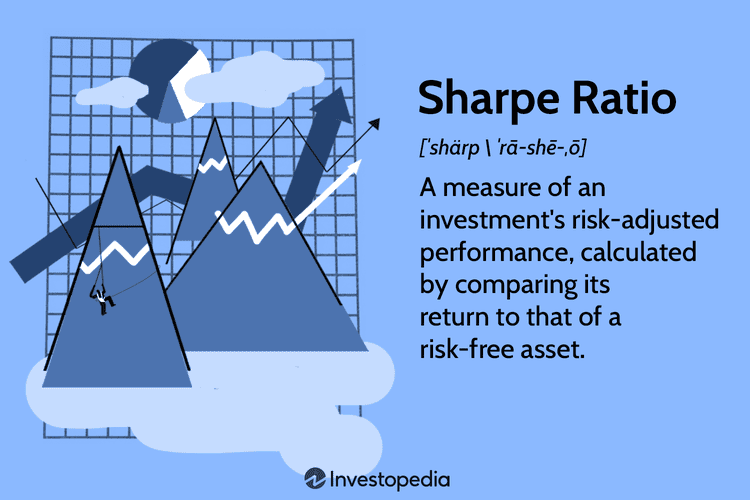

Investing in financial markets represents a fundamental challenge of balancing the pursuit of returns with the management of associated risks. In navigating this complex landscape, the Sharpe Ratio emerges as a vital tool for investors, serving to evaluate the risk-adjusted return on their portfolios. Introduced by William F. Sharpe, the Sharpe Ratio quantifies how well the return of an asset compensates the investor for the risk taken, thus providing a clearer perspective on investment performance beyond raw returns.

Algorithmic trading has been transformative in the investment world, allowing traders to process vast amounts of financial data and execute trades at speeds and efficiencies beyond human capability. At the heart of these algorithmic systems are financial metrics and statistical models that facilitate informed decision-making in real-time market environments. The Sharpe Ratio is a crucial component of these algorithms, aiding in the optimization of trading strategies that aim to maximize returns while minimizing risk.



This article aims to explore the role of the Sharpe Ratio within investment analysis and algorithmic trading. We will discuss how this metric assists investors and traders in crafting robust strategies that remain adaptable to financial market fluctuations. By understanding the practical applications and limitations of the Sharpe Ratio, investors can better align their strategies with their risk tolerance and investment goals, ensuring a more disciplined and systematic approach to portfolio management.

## Table of Contents

## Understanding the Sharpe Ratio

The Sharpe Ratio is a metric devised to assess the risk-adjusted return of an investment portfolio. This measure was introduced by William F. Sharpe, a Nobel laureate in Economics, and has become a pivotal tool for investors when evaluating the performance of their investments relative to their risk. The fundamental concept behind the Sharpe Ratio is to examine not just the returns generated by a portfolio, but how much risk was taken to achieve those returns.

The formula for computing the Sharpe Ratio is:

$$
\text{Sharpe Ratio} = \frac{R_p - R_f}{\sigma_p}
$$

where:
- $R_p$ represents the return of the portfolio,
- $R_f$ denotes the risk-free rate of return, typically associated with government bonds,
- $\sigma_p$ indicates the standard deviation of the portfolio's excess return.

A key insight provided by the Sharpe Ratio is its ability to rank portfolios or funds with similar returns by considering the risk involved. A higher Sharpe Ratio signifies superior risk-adjusted returns, with thresholds of 1.0, 2.0, and 3.0 commonly interpreted as acceptable, very good, and excellent, respectively. This makes the Sharpe Ratio a widely-used benchmark for gauging investment performance.

However, the use of Sharpe Ratio is not without challenges. One significant limitation stems from its sensitivity to non-normal distributions of asset returns. Many financial return series are not normally distributed, exhibiting skewness or kurtosis, leading to potential misinterpretations of risk. This is because the Sharpe Ratio treats all deviations from the mean equally, without distinguishing between upside [volatility](/wiki/volatility-trading-strategies) (profits) and downside volatility (losses). Moreover, leveraging or other strategies that produce high returns with amplified risks can generate a misleadingly high Sharpe Ratio.

In practice, while the Sharpe Ratio remains a fundamental tool for understanding the trade-offs between risk and return, investors should be cautious and consider this metric alongside other financial tools to achieve a more comprehensive assessment of an investment's performance.

## Calculating the Sharpe Ratio: Formula and Example

The Sharpe Ratio is a crucial metric for investors, expressed by the formula:

$$
\text{Sharpe Ratio} = \frac{(R_p - R_f)}{\sigma_p}
$$

Where:
- $R_p$ is the return of the portfolio.
- $R_f$ is the risk-free rate.
- $\sigma_p$ is the standard deviation of the portfolio's returns.

To illustrate, consider a mutual fund with an expected yearly return of 25%, a risk-free rate of 2.7%, and a standard deviation of 20%. Applying the Sharpe Ratio formula:

$$
\text{Sharpe Ratio} = \frac{(0.25 - 0.027)}{0.20} = 1.11
$$

This indicates a favorable risk-adjusted return as any ratio above 1.0 is deemed acceptable. 

Annualizing the Sharpe Ratio is another important step. This is necessary to ensure comparability across different investment horizons. To annualize a daily Sharpe Ratio, multiply it by the square root of the number of trading days in a year (typically 252 for stock markets):

If the daily Sharpe Ratio is calculated as:

$$
\text{Annualized Sharpe Ratio} = \text{Daily Sharpe Ratio} \times \sqrt{252}
$$

Consistency in data is vital when calculating the Sharpe Ratio over varying time frames. If monthly returns are used, ensure that the risk-free rate and standard deviation are also on a monthly basis. This approach allows for a consistent and reliable analysis of performance metrics across diverse investment strategies and periods.

## Applications in Algorithmic Trading

Algorithmic trading, a method that uses complex algorithms to make fast, automated trading decisions, heavily relies on quantitative measures like the Sharpe Ratio to improve strategy effectiveness. The Sharpe Ratio's role in this context is pivotal as it helps traders evaluate and refine trading strategies by focusing on risk-adjusted returns.

Backtesting, a critical component in developing a robust [algorithmic trading](/wiki/algorithmic-trading) strategy, involves simulating a trading strategy using historical data to assess how it would have performed. Here, the Sharpe Ratio serves as a key metric, providing insights into the risk-adjusted returns over time. For instance, when a trading algorithm is backtested, the Sharpe Ratio can indicate not only the profitability but also the volatility of returns, helping identify strategies that offer the best reward per unit of risk.

Intraday traders, who execute trades within the same trading day, find the Sharpe Ratio particularly useful at the trade level. By calculating the Sharpe Ratio for individual trades or small batches of trades, traders can gauge the performance of their strategies in real-time. This continuous assessment allows for timely adjustments and the optimization of risk management strategies.

Quantitative funds, or quant funds, often target a Sharpe Ratio greater than 2.0, indicative of excellent risk-adjusted performance. Achieving and sustaining such a high ratio necessitates the use of complex financial models and sophisticated algorithmic techniques. Quant funds use the Sharpe Ratio as a benchmark for strategy performance, enabling them to filter out sub-optimal strategies that do not meet their performance criteria. The constant pursuit of maintaining a high Sharpe Ratio drives innovation and rigorous empirical analysis within these funds.

In practical terms, Python offers tools such as libraries like NumPy and pandas, which can automate the calculation of the Sharpe Ratio in algorithmic trading systems. By integrating these calculations directly into trading algorithms, traders can automatically monitor the Sharpe Ratio, making real-time adjustments to trading parameters as necessary.

Overall, the Sharpe Ratio is a fundamental metric in algorithmic trading, guiding traders and funds toward optimal risk-adjusted strategies and performance.

## Sharpe Ratio Variations and Alternatives

The Modified Sharpe Ratio, Sortino Ratio, and Treynor Ratio serve as valuable alternatives to the traditional Sharpe Ratio by addressing certain limitations, particularly regarding the treatment of risk and volatility.

The **Sortino Ratio** refines the Sharpe Ratio by considering only downside volatility, thereby concentrating on negative returns which might adversely affect an investor's portfolio. This provides a more accurate measure of an investment's risk-adjusted return. The formula for the Sortino Ratio is:

$$
\text{Sortino Ratio} = \frac{\text{Return of the Portfolio} - \text{Risk-Free Rate}}{\text{Downside Deviation}}
$$

This formula excludes the standard deviation of positive returns, thus catering specifically to how an investment performs when it underachieves or, essentially, loses value.

The **Treynor Ratio** shifts focus from total volatility to systematic risk, addressing another shortcoming of the Sharpe Ratio. It is particularly useful for diversified portfolios by measuring returns in relation to beta, which gauges an investment's sensitivity to market movements. The formula for the Treynor Ratio is:

$$
\text{Treynor Ratio} = \frac{\text{Return of the Portfolio} - \text{Risk-Free Rate}}{\beta}
$$

where beta ($\beta$) is calculated as:

$$
\beta = \frac{\text{Covariance}(\text{Portfolio Return}, \text{Market Return})}{\text{Variance}(\text{Market Return})}
$$

This ratio assumes that unsystematic risk has been diversified away, allowing investors to align their expectations with market volatility.

The **Modified Sharpe Ratio** incorporates adjustments for skewness and kurtosis, allowing the calculation to account for non-normal return distributions. This modification is essential because financial returns often exhibit heavy tails and asymmetry, which the standard Sharpe Ratio does not appropriately measure.

Incorporating these variations into investment analysis provides investors with a more nuanced understanding of risk-adjusted returns, adapting evaluation metrics to better suit different market conditions and portfolio characteristics. This comprehensive toolkit enables more tailored strategy assessments and effective risk management, contributing to sound investment decisions.

## Practical Insights and Implementation

Excel and Python have emerged as powerful tools for automating the calculation of the Sharpe Ratio, allowing investors to perform real-time analysis efficiently. Using Excel, investors can set up formulas within spreadsheets to dynamically compute the Sharpe Ratio as inputs change. For instance, in Excel, the formula `=(Portfolio_Return - Risk_Free_Rate) / STDEV.P(Portfolio_Returns)` can be utilized, where `STDEV.P` calculates the standard deviation. This approach facilitates accessible and straightforward calculations but is limited when dealing with large datasets or requiring more complex analyses.

Python offers a more flexible and scalable alternative, particularly suited for large datasets and integrated algorithmic strategies. Libraries such as pandas and numpy can be employed to streamline the process. Below is a basic Python example demonstrating how to calculate the Sharpe Ratio:

```python
import numpy as np
import pandas as pd

# Assuming 'returns' is a pandas Series of portfolio returns
returns = pd.Series([0.05, 0.02, 0.03, 0.07, -0.01]) # Example data
risk_free_rate = 0.027 # Risk-free rate

# Calculate excess returns and Sharpe Ratio
excess_returns = returns - risk_free_rate
sharpe_ratio = excess_returns.mean() / excess_returns.std()

print(f'Sharpe Ratio: {sharpe_ratio}')
```

This script calculates the Sharpe Ratio by first determining the excess returns and then dividing their mean by the standard deviation. Such automation enhances the ability to make rapid, informed decisions based on current market conditions.

Optimizing the Sharpe Ratio necessitates meticulous attention to risk management and cost minimization. Strategies should minimize transaction costs, tax impacts, and other expenses that can erode returns. Portfolio diversification is another tactical approach, as it can reduce unsystematic risk, thereby potentially improving the Sharpe Ratio.

Regularly revisiting and adjusting benchmarks is crucial to ensure that the Sharpe Ratio remains aligned with market shifts and evolving investment strategies. This involves recalibrating expected return targets and risk assessments to reflect current economic conditions and asset performance trends. By updating models and assumptions regularly, investors can maintain a relevant and robust risk-return profile.

Adopting a disciplined approach to managing and monitoring the Sharpe Ratio, alongside employing tools like Excel and Python, can significantly enhance an investor's ability to navigate complex financial markets effectively.

## Limitations and Misconceptions

The Sharpe Ratio, while widely regarded as an essential tool for assessing risk-adjusted returns, has its set of limitations and can be subject to several misconceptions. One of the primary limitations of the Sharpe Ratio is its inability to differentiate between upside and downside volatility. In its computation, the formula treats all forms of volatility as undesirable. This can be misleading because, in reality, investors are often more concerned about downside volatility, which represents financial losses, rather than upside volatility, which is associated with gains. The formula for the Sharpe Ratio is:

$$
\text{Sharpe Ratio} = \frac{\text{Return of the Portfolio} - \text{Risk-Free Rate}}{\text{Standard Deviation of the Portfolio Returns}}
$$

Another important misconception is that a high Sharpe Ratio does not guarantee consistency or reliability across various market conditions. The ratio is a retrospective analysis that assumes past performance and volatility can reliably predict future outcomes. This assumption may not hold in volatile or unstable markets where the historical data used in the Sharpe Ratio calculation becomes less relevant. 

Furthermore, a misleadingly high Sharpe Ratio can result from strategies that may be overly reliant on specific market conditions, such as low volatility periods, or those that utilize leverage to enhance returns. Strategies sensitive to extreme tail events, like significant market downturns or rare black swan events, can also yield deceptively high Sharpe Ratios. These events are typically not captured well by traditional volatility measures, making the ratio potentially skewed or overly optimistic. 

As investing in financial markets involves various risk factors and uncertainties, it is important to consider these limitations and misconceptions when using the Sharpe Ratio. Complementing it with other measures of risk and performance, such as the Sortino Ratio, which accounts for downside risk, or scenario analysis can provide a more holistic perspective on investment performance.

## Conclusion

The Sharpe Ratio remains an indispensable metric in the financial analysis sphere for assessing risk-adjusted returns. By providing a standardized measure, it enables investors and algorithmic traders to refine and enhance their trading strategies. The ratio's ability to quantify the return per unit of risk makes it instrumental in portfolio management, assisting in the comparison of potential investments with differing risk levels.

Despite its limitations, such as treating all volatility equally and its susceptibility to misinterpretation during non-normal market conditions or extreme tail events, the Sharpe Ratio, together with its variations like the Sortino and Treynor Ratios, offers critical insights into portfolio performance. These alternatives address some of the Sharpe Ratio's shortcomings by focusing more on downside risk or systematic risk, presenting a more nuanced picture of investment performance.

For a successful investment strategy, quantitative metrics such as the Sharpe Ratio must be combined with qualitative insights. This holistic approach acknowledges the complexities of financial markets, where absolute numerical assessments might miss the broader economic, geopolitical, or behavioral factors impacting market dynamics. By integrating both quantitative and qualitative analyses, investors and algorithmic traders can make more informed decisions, leveraging the full spectrum of available data to optimize their portfolios and adapt to evolving market landscapes.

## References & Further Reading

[1]: Sharpe, William F. (1994). ["The Sharpe Ratio."](https://web.stanford.edu/~wfsharpe/art/sr/SR.htm) The Journal of Portfolio Management.

[2]: Sortino, Frank A. & Van Der Meer, Robert. (1991). ["Downside Risk."](https://www.pm-research.com/content/iijpormgmt/17/4/27) The Journal of Portfolio Management.

[3]: Marcos López de Prado. (2018). ["Advances in Financial Machine Learning."](https://www.amazon.com/Advances-Financial-Machine-Learning-Marcos/dp/1119482089) Wiley.

[4]: Jansen, Stefan. (2018). ["Machine Learning for Algorithmic Trading."](https://github.com/stefan-jansen/machine-learning-for-trading) Packt Publishing.

[5]: Chan, Ernest P. (2009). ["Quantitative Trading: How to Build Your Own Algorithmic Trading Business."](https://github.com/ftvision/quant_trading_echan_book) Wiley.