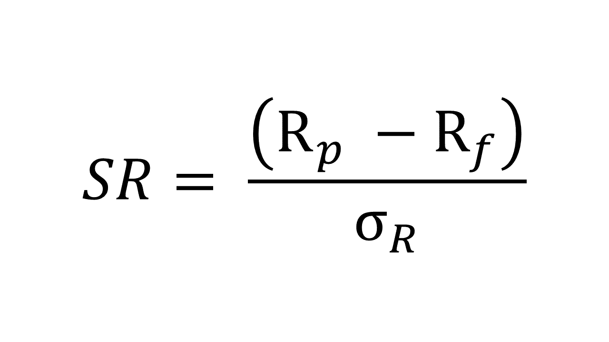

## Table of Contents

## What is the Sharpe Ratio and why is it important in finance?

The Sharpe Ratio is a way to measure how well an investment is doing compared to the risk it takes. It was created by a man named William F. Sharpe. The ratio looks at the return of an investment and subtracts the risk-free rate, like what you might get from a savings account. Then, it divides that number by the standard deviation of the investment's returns, which shows how much the returns go up and down. A higher Sharpe Ratio means the investment is doing a better job of earning more money for the amount of risk it takes.

The Sharpe Ratio is important in finance because it helps people decide if an investment is worth the risk. If two investments have the same return, but one has a higher Sharpe Ratio, it means that investment is giving you more return for each unit of risk. This helps investors pick the best investments from a bunch of choices. It's a useful tool for anyone who wants to understand if they are getting a good deal on their investments, whether they are managing their own money or working with a financial advisor.

## How is the Sharpe Ratio calculated?

The Sharpe Ratio is calculated by taking the average return of an investment and subtracting the risk-free rate from it. The risk-free rate is what you would earn from a very safe investment, like a government bond. After you subtract the risk-free rate, you divide that number by the standard deviation of the investment's returns. The standard deviation tells you how much the returns of the investment go up and down over time. A higher Sharpe Ratio means the investment is doing well for the amount of risk it takes.

For example, if an investment gives you an average return of 8% a year, and the risk-free rate is 2%, you would subtract 2% from 8% to get 6%. If the standard deviation of the investment's returns is 10%, you would then divide 6% by 10% to get a Sharpe Ratio of 0.6. This number helps you see if the investment is worth the risk. A positive Sharpe Ratio means the investment is doing better than a risk-free investment, and a higher number means it's doing even better for the risk taken.

## What does a Sharpe Ratio of 1, 2, or 3 indicate about an investment's performance?

A Sharpe Ratio of 1 means that for every unit of risk you take, you are getting one unit of return above what you would get from a safe investment. This is considered pretty good. It shows that the investment is doing a decent job of earning extra money for the risk you're taking. Many investors look for a Sharpe Ratio of at least 1 because it means the investment is beating a risk-free option by a good amount for the risk involved.

If an investment has a Sharpe Ratio of 2, it's doing even better. This means you're getting two units of return for every unit of risk. A Sharpe Ratio of 2 is really strong and shows that the investment is doing a great job of managing risk while earning high returns. Not many investments can keep a Sharpe Ratio this high over a long time, so it's something special when you see it.

A Sharpe Ratio of 3 is rare and amazing. It means you're getting three units of return for every unit of risk. This is a sign of an outstanding investment that's doing a fantastic job of earning money while keeping risk low. Very few investments can achieve and maintain a Sharpe Ratio this high, so it's a sign of top performance.

## Can the Sharpe Ratio be negative? What does it signify?

Yes, the Sharpe Ratio can be negative. A negative Sharpe Ratio means that the investment is doing worse than a risk-free investment. It's losing money or not making enough money to cover the risk you're taking. If you see a negative Sharpe Ratio, it's a sign that the investment might not be a good choice because you could do better just putting your money in a safe place like a savings account.

A negative Sharpe Ratio can happen if the average return of the investment is less than the risk-free rate. For example, if the risk-free rate is 2% and the investment's average return is 1%, after subtracting the risk-free rate, you get -1%. If you then divide that by the standard deviation of the investment's returns, you'll end up with a negative Sharpe Ratio. This tells you that the investment is not worth the risk because it's not even beating the safe, risk-free option.

## How does the Sharpe Ratio help in comparing different investments?

The Sharpe Ratio helps in comparing different investments by showing how much return you get for the risk you take. It's like a score that tells you if an investment is doing a good job at making money compared to how risky it is. If you have two investments and one has a higher Sharpe Ratio, it means that investment is giving you more bang for your buck in terms of risk. So, you can use the Sharpe Ratio to pick the best investment out of a bunch of choices.

For example, if Investment A has a Sharpe Ratio of 1.5 and Investment B has a Sharpe Ratio of 0.8, you can see that Investment A is doing better for the amount of risk it takes. Even if both investments have the same return, the one with the higher Sharpe Ratio is the better choice because it's handling risk better. This makes it easier for you to decide where to put your money, especially if you're trying to make smart choices about your investments.

## What are the limitations of using the Sharpe Ratio?

The Sharpe Ratio has some problems that you should know about. It assumes that the returns of an investment follow a normal pattern, but in real life, investments can have big surprises that don't fit this pattern. This can make the Sharpe Ratio less useful because it doesn't show how risky those big surprises can be. Also, the Sharpe Ratio only looks at the total risk of an investment, not the kind of risk. Some risks might be okay for you because they come from places you're comfortable with, but the Sharpe Ratio treats all risks the same.

Another issue with the Sharpe Ratio is that it depends a lot on the risk-free rate you use. If the risk-free rate changes, the Sharpe Ratio can change too, even if the investment itself hasn't changed at all. This can make it hard to compare investments over time or between different countries where the risk-free rates might be different. So, while the Sharpe Ratio is a helpful tool, it's important to use it along with other ways of looking at investments to get the full picture.

## How does the risk-free rate affect the Sharpe Ratio?

The risk-free rate is a big part of the Sharpe Ratio because it's what you subtract from the return of an investment. If the risk-free rate goes up, the Sharpe Ratio goes down. This is because the investment's return above the risk-free rate gets smaller. On the other hand, if the risk-free rate goes down, the Sharpe Ratio goes up because the investment's return above the risk-free rate gets bigger. So, changes in the risk-free rate can make the Sharpe Ratio change, even if the investment itself hasn't changed.

This can be tricky when you're trying to compare investments over time or in different places. If the risk-free rate in one country is different from another, it can make the Sharpe Ratios look different, even if the investments are doing the same thing. That's why it's important to think about the risk-free rate when you're using the Sharpe Ratio to decide which investments are best.

## What is the difference between the Sharpe Ratio and the Sortino Ratio?

The Sharpe Ratio and the Sortino Ratio are both used to see how well an investment is doing compared to the risk it takes. The Sharpe Ratio looks at the total risk, which is all the ups and downs of the investment. It subtracts the risk-free rate from the average return and then divides by the standard deviation of all the returns. The Sortino Ratio is a bit different. It only cares about the bad risk, which is when the investment goes down. It subtracts the risk-free rate from the average return too, but then it divides by the standard deviation of just the bad returns, called downside deviation.

This difference means the Sortino Ratio can be more helpful if you're worried more about losses than about all kinds of risk. The Sharpe Ratio might make an investment look worse if it has a lot of ups and downs, even if those ups are good for you. The Sortino Ratio ignores those good ups and only looks at the downs, so it might show a better picture if the investment has some big gains but also some losses. Both ratios help you see if an investment is worth the risk, but they focus on different parts of that risk.

## How can the Sharpe Ratio be used in portfolio optimization?

The Sharpe Ratio can help you make your investment portfolio better by showing you which investments are doing well for the risk they take. When you're picking investments for your portfolio, you want to get the most return for the least risk. The Sharpe Ratio helps you do that by giving each investment a score. If you see that one investment has a higher Sharpe Ratio than another, it means that investment is giving you more return for each unit of risk. So, you can use the Sharpe Ratio to choose the best investments to put in your portfolio.

When you're trying to make your portfolio better, you can also use the Sharpe Ratio to see how changing your investments might help. For example, if you add a new investment with a high Sharpe Ratio, it could make your whole portfolio's Sharpe Ratio go up. This means your portfolio is now doing a better job of earning money for the risk it's taking. By looking at the Sharpe Ratios of different investments, you can keep adjusting your portfolio to make it as good as it can be.

## What are some common misconceptions about the Sharpe Ratio?

One common mistake people make about the Sharpe Ratio is thinking it's the only thing they need to look at when choosing investments. The Sharpe Ratio is a helpful tool, but it doesn't tell the whole story. It looks at how much return you get for the risk you take, but it doesn't say anything about other important stuff like how easy it is to buy or sell the investment, how the investment fits with your other investments, or how much you might lose if things go really bad. So, it's important to use the Sharpe Ratio along with other ways of looking at investments.

Another misconception is that a higher Sharpe Ratio always means a better investment. While a higher Sharpe Ratio usually means an investment is doing a good job of earning money for the risk it takes, it's not perfect. The Sharpe Ratio assumes that the ups and downs of an investment follow a normal pattern, but real life can be different. Sometimes, investments can have big surprises that the Sharpe Ratio doesn't show well. Also, the Sharpe Ratio can change just because the risk-free rate changes, even if the investment itself hasn't changed. So, a high Sharpe Ratio is good, but it's not the only thing to think about.

## How does the time period of returns data impact the Sharpe Ratio?

The time period of returns data can really change the Sharpe Ratio. If you look at the returns over a short time, like a few months, the Sharpe Ratio might be different than if you look at the returns over a longer time, like several years. This is because short-term returns can be all over the place, and the Sharpe Ratio might not show the true risk and return of the investment. Over a longer time, you get a better picture of how the investment usually does, so the Sharpe Ratio is more reliable.

It's also important to think about how the risk-free rate might change over time. If you use a different risk-free rate for different time periods, the Sharpe Ratio will change too, even if the investment itself hasn't changed. That's why it's a good idea to use the same time period and risk-free rate when you're comparing different investments. This way, you can be sure you're getting a fair comparison and making the best choices for your money.

## What advanced statistical techniques can be used to improve the accuracy of the Sharpe Ratio?

One way to make the Sharpe Ratio more accurate is by using something called bootstrapping. Bootstrapping is a way to take a lot of little samples from your data and use them to see how reliable your Sharpe Ratio is. Instead of just looking at the whole set of returns, you take many smaller samples and calculate the Sharpe Ratio for each one. This helps you see if the Sharpe Ratio you got from your whole set of data is just a fluke or if it's really a good measure of how well the investment is doing. It's like double-checking your work to make sure you're getting the right answer.

Another technique is to use something called the Cornish-Fisher expansion. This helps you deal with the problem that the Sharpe Ratio assumes returns follow a normal pattern, which they often don't. The Cornish-Fisher expansion lets you adjust the Sharpe Ratio to account for those big surprises that can happen in real life. By using this, you can get a Sharpe Ratio that's more accurate because it takes into account the chance of those big ups and downs. Both of these methods help you get a better, more reliable Sharpe Ratio that you can trust when making choices about your investments.

## What is the Sharpe Ratio and how can it be understood?

The Sharpe Ratio, introduced by William F. Sharpe in 1966, is a fundamental measure widely used in finance to assess the risk-adjusted return of an investment. Essentially, the Sharpe Ratio seeks to evaluate how much excess return an investor receives for the additional [volatility](/wiki/volatility-trading-strategies) endured by holding a riskier asset. This makes it particularly valuable for comparing the performance of different trading strategies or investment portfolios.

The formula for calculating the Sharpe Ratio is:

$$
S = \frac{E[R_a - R_b]}{\sigma}
$$

where:
- $E[R_a - R_b]$ is the expected return of the asset or strategy minus the risk-free rate, which represents the excess return.
- $\sigma$ represents the standard deviation of the excess return, indicating the volatility or total risk of the investment.

In practical terms, a higher Sharpe Ratio indicates a more favorable risk-adjusted performance. This is because the numerator of the ratio, which represents the excess return, is larger relative to the denominator, which represents the risk. Consequently, investors prefer investments with a higher Sharpe Ratio, as these are considered to be more efficient in terms of return per unit of risk.

While the Sharpe Ratio is invaluable in assessing risk-adjusted returns, it is crucial to apply it correctly within the context of [algorithmic trading](/wiki/algorithmic-trading). Its utility extends beyond individual assets to portfolios, where a more diversified asset mix can potentially yield a higher Sharpe Ratio by optimizing risk and return dynamics.

The choice of the risk-free rate, often represented by treasury securities or other low-risk financial instruments, significantly influences the calculation and interpretation of the Sharpe Ratio. For accurate analysis, it is essential to use a risk-free rate that reflects the timeframe of the investment or trading strategy under evaluation.

Overall, understanding and correctly applying the Sharpe Ratio can empower investors and traders to make informed decisions by quantifying and thus better managing the balance between risk and return.

## How do you calculate the Sharpe Ratio?

The Sharpe Ratio is a well-regarded measure employed in finance to evaluate the risk-adjusted return of an investment or trading strategy. Its formula is stated as:

$$
S = \frac{E[R_a - R_b]}{\text{StdDev}(R_a - R_b)}
$$

where $E[R_a - R_b]$ represents the expected excess return of the asset or strategy over a risk-free rate, and $\text{StdDev}(R_a - R_b)$ is the standard deviation of the excess returns. This ratio contributes by offering insights into the performance of an investment by comparing returns to associated risks.

Annualizing the Sharpe Ratio is essential for making comparisons across strategies or assets with different return periods. The annualized version takes trading frequency into account, commonly using 252 as the standard number of trading days in a year:

$$
\text{Annualized Sharpe Ratio} = \text{Daily Sharpe Ratio} \times \sqrt{252}
$$

This adjustment enables traders and analysts to maintain consistency in their performance evaluations over time and between various contexts.

To illustrate the calculation of the Sharpe Ratio in a practical setting, Python can be utilized with historical market data. The example below demonstrates a simple calculation of the Sharpe Ratio using Python:

```python
import numpy as np
import pandas as pd

# Assuming df is a DataFrame with a column 'Returns' for daily return data
risk_free_rate = 0.01  # Example risk-free rate

# Calculate excess returns by subtracting the daily risk-free rate from daily returns
df['Excess_Returns'] = df['Returns'] - risk_free_rate / 252

# Calculate the mean and standard deviation of the excess returns
mean_excess_return = df['Excess_Returns'].mean()
std_excess_return = df['Excess_Returns'].std()

# Calculate the daily Sharpe Ratio
daily_sharpe_ratio = mean_excess_return / std_excess_return

# Annualize the Sharpe Ratio
annualized_sharpe_ratio = daily_sharpe_ratio * np.sqrt(252)

print("Annualized Sharpe Ratio:", annualized_sharpe_ratio)
```

This code snippet assumes you are working with a Pandas DataFrame where daily returns are recorded. The Sharpe Ratio helps investors by offering a quantitative metric to evaluate and compare the attractiveness of various investment strategies after adjusting for risk. Employing this in algorithmic trading facilitates informed decision-making, yet it is essential to acknowledge that the Sharpe Ratio, like other metrics, should not be used in isolation.

## What are some practical usages and examples?

In algorithmic trading, the Sharpe Ratio is a pivotal metric employed to evaluate the performance of trading strategies by measuring the excess return per unit of risk. By employing this ratio, traders can discern whether their strategies provide sufficient returns relative to the risk undertaken.

**Long-Only Strategies:**

A long-only strategy involves buying securities with the expectation that their prices will increase. The Sharpe Ratio is particularly useful in such contexts to ascertain if the returns generated are justifiable given the risks. For instance, consider an algorithm designed to execute trades based on [momentum](/wiki/momentum) indicators. If this algorithm achieves an average annual return of 8% with a risk-free rate of 2% and a standard deviation of 10%, the Sharpe Ratio can be calculated as:

$$
S = \frac{0.08 - 0.02}{0.10} = 0.6
$$

A Sharpe Ratio of 0.6 suggests a moderate risk-adjusted return, indicating potential room for optimization in strategy design.

**Market-Neutral Strategies:**

Market-neutral strategies, designed to minimize exposure to market risk by taking long positions in undervalued securities and short positions in overvalued ones, rely heavily on the Sharpe Ratio for evaluation. Suppose a market-neutral algorithm yields an annual return of 5% with a volatility of 4%. Using the same risk-free rate of 2%, the Sharpe Ratio would be:

$$
S = \frac{0.05 - 0.02}{0.04} = 0.75
$$

A higher Sharpe Ratio compared to the long-only strategy illustrates improved risk-adjusted performance, benefiting from lower exposure to market swings.

**Trade-Off Considerations:**

Developing algorithmic trading strategies inherently involves certain trade-offs. A critical consideration is between risk and return. While a higher Sharpe Ratio indicates better risk-adjusted returns, it often requires strategies to balance potential gains against achievable levels of volatility. Traders may need to set objectives aligned with their risk tolerance. For instance, opting for slightly lower returns for reduced exposure to extreme market events could be advantageous.

Another vital consideration is strategy diversification. Incorporating multiple strategies can smoothen returns and potentially enhance the overall Sharpe Ratio of a portfolio. Backtesting across different market conditions is essential to ensure robustness, allowing strategies to be fine-tuned and reducing reliance on historical data, which may not predict future performance accurately.

In practice, these considerations are addressed through continuous optimization, including adjusting strategy parameters, incorporating hedging techniques, and leveraging [machine learning](/wiki/machine-learning) algorithms to recognize and adapt to market patterns efficiently. These efforts aim to improve the Sharpe Ratio, contributing to more sustainable and resilient trading strategies.

## References & Further Reading

[1]: Sharpe, W. F. (1966). ["Mutual Fund Performance."](http://www.stat.ucla.edu/~nchristo/statistics_c183_c283/sharpe__mutual_fund_performance.pdf) Journal of Business, 39(1), 119-138.

[2]: Sharpe, W. F. (1994). ["The Sharpe Ratio."](https://web.stanford.edu/~wfsharpe/art/sr/SR.htm) The Journal of Portfolio Management, 21(1), 49-58.

[3]: Fabozzi, F. J., & Markowitz, H. M. (2002). ["The Theory and Practice of Investment Management: Asset Allocation, Valuation, Portfolio Construction, and Strategies."](https://onlinelibrary.wiley.com/doi/book/10.1002/9781118267028) Wiley.

[4]: ["Quantitative Equity Investing: Techniques and Strategies"](https://www.wiley.com/en-us/Quantitative+Equity+Investing%3A+Techniques+and+Strategies-p-9780470617526) by Frank J. Fabozzi, Sergio M. Focardi, and Caroline Jonas

[5]: ["Practical Portfolio Performance Measurement and Attribution"](https://onlinelibrary.wiley.com/doi/book/10.1002/9781119206309) by Carl R. Bacon

[6]: Alexander, C. (2008). ["Market Risk Analysis, Quantitative Methods in Finance."](https://www.wiley.com/en-us/Market+Risk+Analysis%2C+Volume+I%2C+Quantitative+Methods+in+Finance-p-9780470998007) John Wiley & Sons.

[7]: Asness, C. S., Krail, R. J., & Liew, J. M. (2001). ["Do Hedge Funds Hedge?"](https://papers.ssrn.com/sol3/papers.cfm?abstract_id=252810) The Journal of Portfolio Management, 28(1), 6-19.

[8]: Lo, A. W. (2002). ["The Statistics of Sharpe Ratios."](https://www.jstor.org/stable/4480405) Financial Analysts Journal, 58(4), 36-52.