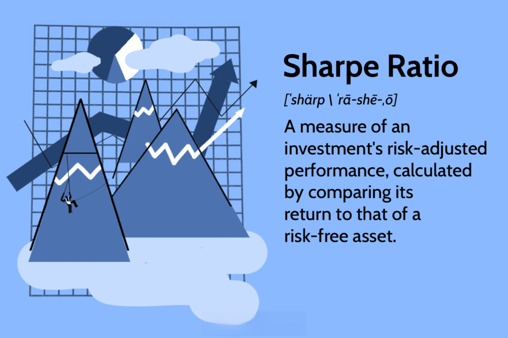

Algorithmic trading has transformed financial markets by enabling rapid and complex decision-making processes to maximize returns. However, in pursuit of high annualized returns, traders often grapple with significant risks that can jeopardize long-term success. Understanding these risks is crucial for developing sustainable trading strategies. 

One fundamental tool in assessing the balance between risk and return is the Sharpe Ratio, a metric introduced by Nobel laureate William F. Sharpe. This ratio evaluates performance by calculating the excess return of an asset over the risk-free rate, adjusted for the volatility of the asset's returns. Mathematically, it is expressed as:



$$
\text{Sharpe Ratio} = \frac{E[R] - R_f}{\sigma}
$$

where $E[R]$ is the expected return of the portfolio, $R_f$ is the risk-free rate, and $\sigma$ is the standard deviation of the portfolio’s returns. A higher Sharpe Ratio indicates a more favorable risk-adjusted return, offering a clearer picture of how much return is being generated for each unit of risk taken.

In algorithmic trading, strategies often comprise multiple assets, complex derivatives, and high-frequency transactions, each carrying unique risk exposures. The Sharpe Ratio becomes an essential metric for evaluating these strategies by comparing potential returns against the inherent risks. Through this lens, traders can identify which algorithms are not just profitable but also efficient in their use of risk capital.

This article examines how the Sharpe Ratio functions as a pivotal tool in algorithmic trading strategy evaluation, guiding traders towards achieving a well-balanced and informed investment approach.

## Table of Contents

## Understanding the Sharpe Ratio

The Sharpe Ratio, conceived by economist William F. Sharpe, is a pivotal metric in finance that quantifies risk-adjusted returns of an asset or a trading strategy. The ratio is defined as the difference between the average return of the asset and the risk-free rate, divided by the standard deviation of the asset's excess return. The formula is expressed as follows:

$$
\text{Sharpe Ratio} = \frac{E[R_a - R_f]}{\sigma_a}
$$

where $E[R_a - R_f]$ is the expected excess return of the asset over the risk-free rate, and $\sigma_a$ is the standard deviation of the asset's excess return.

The objective of the Sharpe Ratio is to understand how much return an investor is receiving per unit of risk. A higher Sharpe Ratio indicates that the investor is obtaining more excess return per unit of risk undertaken. This makes it a valuable tool for assessing the performance of an asset or a portfolio when considering the risk associated with those returns.

The selection of the risk-free rate is crucial in calculating the Sharpe Ratio, typically represented by the yield on a government treasury bill or bond, as it provides a benchmark for what could be earned with virtually zero risk. By subtracting this risk-free return from the average asset return, the Sharpe Ratio emphasizes the additional risk attributable to the asset or strategy itself.

In practice, a Sharpe Ratio greater than 1 is generally considered good, indicating that the returns are favored over the corresponding risk. However, interpretations can vary based on market conditions and specific asset classes. Despite its widespread application, reliance on standard deviation assumes normal distribution of returns, which may not always hold true in financial markets. Therefore, understanding these nuances is crucial for effective application of the Sharpe Ratio in evaluating and refining trading strategies.

## Significance in Algorithmic Trading

Algorithmic trading involves executing orders using automated pre-programmed trading instructions, often based on factors such as timing, price, and [volume](/wiki/volume-trading-strategy). These strategies frequently expose traders to multifaceted risks, underscoring the necessity for rigorous evaluation metrics to ensure optimal performance. Among these metrics, the Sharpe Ratio is integral, providing traders with a robust tool for measuring risk-adjusted returns and facilitating informed decision-making.

The Sharpe Ratio serves as a critical differentiator by allowing traders to measure the returns of an investment strategy against the level of risk it entails. This capability is particularly beneficial in [algorithmic trading](/wiki/algorithmic-trading), where strategies might yield similar returns but possess different risk profiles. By employing the Sharpe Ratio, traders can evaluate which strategy delivers more return per unit of risk, thus enabling them to select the most efficient approach.

Mathematically, the Sharpe Ratio $S$ is computed as follows:

$$
S = \frac{R_a - R_f}{\sigma}
$$

where $R_a$ is the asset's return, $R_f$ is the risk-free rate of return, and $\sigma$ is the standard deviation of the asset's excess return. This formula provides a single, standardized measure of risk-adjusted performance, crucial for comparisons between various algorithmic strategies.

By leveraging the Sharpe Ratio, algorithmic traders can better identify strategies that correctly balance risk and reward, promoting more efficient capital allocation. The ability to discern the best risk-adjusted strategies not only helps in maximizing returns but also in minimizing potential financial losses by avoiding high-risk, low-reward investments.

Furthermore, varying trading strategies might exhibit similar absolute returns, yet their risk profiles could differ significantly. The Sharpe Ratio's capability to quantify these differences aids traders in determining the superior strategy based on efficiency rather than just raw returns. Consequently, it plays a pivotal role in the development and evaluation of algorithmic trading strategies, enhancing both the precision and effectiveness of decision-making processes in financial markets.

## Calculation of the Sharpe Ratio

The Sharpe Ratio is a widely-used measure in finance that quantifies the risk-adjusted return of an asset or a trading strategy. It is defined by the formula:

$$
\text{Sharpe Ratio} = \frac{R_a - R_f}{\sigma_a}
$$

where:
- $R_a$ is the average return of the asset.
- $R_f$ is the risk-free rate, typically represented by the yield on government bonds, which serves as a standard for minimal risk investment.
- $\sigma_a$ is the standard deviation of the asset's returns, representing the total risk associated with the asset.

The numerator of the formula, $R_a - R_f$, is known as the excess return. It represents the return of the asset over the risk-free rate, acting as an indicator of the compensation received over the time value of money and compared to a theoretically riskless investment. The denominator, $\sigma_a$, quantifies the [volatility](/wiki/volatility-trading-strategies) or total risk of the asset's returns, thus providing insight into how consistent the returns have been over a specified period.

Annualization of the Sharpe Ratio involves adjusting the calculated Sharpe Ratio to reflect an annualized perspective. This is performed by scaling it by the square root of the number of periods in a year. For example, if daily returns are considered, assuming 252 trading days in a year, the annualized Sharpe Ratio ($\text{Sharpe Ratio}_{\text{annual}}$) can be expressed as:

$$
\text{Sharpe Ratio}_{\text{annual}} = \text{Sharpe Ratio} \times \sqrt{252}
$$

Similarly, for monthly returns in a calendar year:

$$
\text{Sharpe Ratio}_{\text{annual}} = \text{Sharpe Ratio} \times \sqrt{12}
$$

This method of annualization is crucial for comparing investment performances on a consistent temporal scale, especially when assets or strategies generate returns at different frequencies. By adopting a standardized annual scale, traders and investors can make more informed comparisons and decisions regarding the allocation of portfolios with potentially diverse risk profiles.

## Choosing the Right Benchmark

Choosing the right benchmark for calculating the Sharpe Ratio is of paramount importance as it forms the basis for assessing excess returns. The benchmark selection fundamentally impacts how a strategy's performance is evaluated in terms of risk-adjusted returns.

The Sharpe Ratio is defined as:

$$
\text{Sharpe Ratio} = \frac{R_p - R_f}{\sigma_p}
$$

Where:
- $R_p$ is the expected portfolio return.
- $R_f$ is the risk-free rate.
- $\sigma_p$ is the standard deviation of the portfolio's excess return.

In this formula, the risk-free rate ($R_f$) is crucial, as it sets the baseline against which portfolio returns are compared. It reflects the return expected from an investment with zero risk, typically derived from government bonds like U.S. Treasury bills, considered the safest investment. Choosing an appropriate $R_f$ ensures that the Sharpe Ratio accurately represents the trade-off between additional return and risk.

Additionally, the benchmark encompasses the broader market or specific sector performance metrics that align closely with the strategy being evaluated. For example, if a strategy involves U.S. equities, using the S&P 500 index as a benchmark is common. The goal is to ensure that the benchmark reflects similar risk characteristics to the strategy under consideration.

Selecting an inappropriate benchmark can lead to skewed performance metrics. For instance, using a high-risk equity index as a benchmark for a low-risk bond portfolio may misrepresent the risk-adjusted performance of the bond strategy. Thus, the benchmark should match the investment's risk profile and investment horizon.

Moreover, aligning the benchmark with the investment's time horizon is critical. Short-term strategies may require a different benchmark than long-term investments, potentially incorporating adjustments for variations in economic cycles and volatility patterns.

In conclusion, while the choice of benchmark might seem straightforward, it requires careful consideration of the strategy’s objectives, risk characteristics, and the economic environment in which it operates. This careful selection ultimately ensures that the Sharpe Ratio provides a meaningful measure of a strategy's risk-adjusted performance.

## Limitations of the Sharpe Ratio

The Sharpe Ratio, a widely used measure for risk-adjusted returns in finance, is not without its limitations. A primary concern is its dependence on historical data, which assumes that past performance can provide reliable predictions for future returns. This reliance can be problematic, especially in rapidly changing market conditions where historical data may not accurately reflect potential future risks and returns.

Furthermore, the Sharpe Ratio presupposes that asset returns follow a normal distribution. This assumption means it might not effectively capture tail risks or extreme market events, which can have a disproportionate impact on investment outcomes. Tail risks refer to the probability of rare and severe market events, often lying outside the normal distribution's standard confidence intervals, thus rendering traditional statistical measures less effective.

In addition to statistical assumptions, the Sharpe Ratio does not inherently account for transaction costs, which can significantly erode net returns, particularly in high-frequency trading environments. Without including these costs, the risk-return profile might appear more favorable than it truly is. Adjusting for these costs is essential for a realistic assessment of strategy performance.

Leverage is another [factor](/wiki/factor-investing) that requires careful consideration. The use of leverage can amplify both returns and risks, potentially distorting the Sharpe Ratio. An unadjusted Sharpe Ratio might suggest a more favorable outcome because it does not reflect the higher risk associated with leverage. Proper adjustments must be made to account for this amplification effect, ensuring a true comparison of risk-adjusted returns across different strategies.

These limitations highlight the importance of using the Sharpe Ratio in conjunction with other performance metrics and qualitative analysis for a more comprehensive evaluation of algorithmic trading strategies. By acknowledging and adjusting for these factors, traders can better understand the true risk-return dynamics of their investments.

## Practical Applications and Examples

Calculating the Sharpe Ratio in Python offers a practical approach to assess the risk-adjusted performance of trading strategies using real-world stock price data. The Sharpe Ratio is calculated using the formula:

$$
\text{Sharpe Ratio} = \frac{R_p - R_f}{\sigma_p}
$$

Where:
- $R_p$ is the average return of the portfolio,
- $R_f$ is the risk-free rate,
- $\sigma_p$ is the standard deviation of the portfolio’s excess return.

In Python, libraries such as `pandas`, `numpy`, and `scipy` can streamline this calculation. A basic implementation involves downloading stock price data, computing daily returns, and applying the formula mentioned above:

```python
import pandas as pd
import numpy as np
import yfinance as yf

# Download stock price data
stock_data = yf.download('AAPL', start='2020-01-01', end='2021-01-01')
stock_data['daily_return'] = stock_data['Adj Close'].pct_change()

# Parameters
risk_free_rate = 0.01  # Example risk-free rate
trading_days = 252  # Number of trading days in a year

# Calculate mean excess return and standard deviation
mean_excess_return = stock_data['daily_return'].mean() - (risk_free_rate / trading_days)
std_dev = stock_data['daily_return'].std()

# Sharpe Ratio Calculation
sharpe_ratio = (mean_excess_return / std_dev) * np.sqrt(trading_days)

print("Sharpe Ratio:", sharpe_ratio)
```

This example demonstrates a market-neutral strategy, emphasizes the relative returns, and normalizes the annualized difference between the strategy returns and the risk-free rate. While examining different strategies, Sharpe Ratios can vary significantly, offering insights into the efficiency of risk-adjusted returns. 

For instance, a strategy focusing solely on high-growth tech stocks might exhibit a high Sharpe Ratio, showcasing efficient risk management despite potential volatility. Conversely, a strategy involving diversified equities may display a lower Sharpe Ratio due to lesser volatility but with reduced excess returns.

This real-world application of the Sharpe Ratio exemplifies how algorithmic traders can evaluate various strategies. By analyzing the Sharpe Ratio across multiple approaches, traders can make informed decisions, optimizing for maximum risk-adjusted returns. Such analyses underscore the importance of employing robust methodologies in risk assessment and strategy improvement in algorithmic trading.

## Enhancing Strategy Performance Using the Sharpe Ratio

Improving the Sharpe Ratio of a trading strategy involves meticulous optimization and consideration of various factors influencing risk-adjusted returns. A primary method to enhance the Sharpe Ratio is the optimization of strategy parameters. This involves calibrating model inputs to fine-tune a strategy's performance, focusing on maximizing excess returns while minimizing volatility. Employing [backtesting](/wiki/backtesting) with historical data can help identify the optimal parameter set that increases the Sharpe Ratio.

Reducing transaction costs is another effective approach. High transaction costs can erode returns, decreasing the Sharpe Ratio. Strategies to minimize these costs include using a broker with low commission fees, optimizing order execution timing, and employing advanced trading algorithms that reduce slippage and market impact.

Incorporating additional performance metrics alongside the Sharpe Ratio can provide a well-rounded evaluation of a strategy. Metrics such as the Sortino Ratio, which considers downside risk, can complement the Sharpe Ratio by offering a nuanced view of risk-adjusted returns. The Sortino Ratio is calculated as:

$$
\text{Sortino Ratio} = \frac{R_p - R_f}{\sigma_d}
$$

where $R_p$ is the portfolio return, $R_f$ is the risk-free rate, and $\sigma_d$ is the standard deviation of downside returns. By considering both traditional volatility and downside risk, traders can achieve a more comprehensive analysis.

In practice, combining the Sharpe Ratio with other metrics, optimizing parameters, and managing cost components effectively contribute to robust strategy performance and improve the overall investor appeal. Such measures enable traders to better balance the trade-offs between risk and return, leading to more consistent and high-performing trading strategies.

## Comparing Sharpe Ratio with Other Performance Metrics

The Sharpe Ratio's significance in assessing risk-adjusted returns is widely acknowledged, but it's helpful to compare it with other performance metrics to gain a deeper understanding of its unique characteristics and limitations. Each metric offers distinct focal points and insights, enhancing the comprehensive evaluation of trading strategies.

The Sortino Ratio refines the Sharpe Ratio by considering only the downside deviation, which addresses one of the primary criticisms of the Sharpe Ratio—its symmetric treatment of risk. Traditional standard deviation considers both positive and negative volatility equally. However, investors are usually more concerned with downside risks. The Sortino Ratio is calculated as:

$$
\text{Sortino Ratio} = \frac{R_p - R_f}{\sigma_d}
$$

where $R_p$ is the portfolio return, $R_f$ is the risk-free rate, and $\sigma_d$ is the downside deviation. This focus on negative volatility provides a more nuanced analysis of risk by highlighting underperformance risks rather than overall volatility.

The Treynor Ratio, another risk-adjusted performance measure, contrasts with the Sharpe Ratio by using beta—reflecting market risk—as the denominator instead of standard deviation. The formula is:

$$
\text{Treynor Ratio} = \frac{R_p - R_f}{\beta_p}
$$

where $\beta_p$ measures the sensitivity of the portfolio to market movements. This metric is particularly valuable in evaluating portfolios in the context of broader market risk, making it especially useful for investors seeking insights into systematic risk exposure.

Jensen's Alpha further supplements performance evaluation by measuring absolute performance through comparison with the Capital Asset Pricing Model (CAPM). It assesses whether a portfolio's returns surpass the expected returns based on its beta, given the market return. Its formula is:

$$
\alpha = R_p - [R_f + \beta_p \times (R_m - R_f)]
$$

where $R_m$ is the market return. A positive alpha indicates outperformance relative to CAPM predictions, signifying superior stock-picking capabilities or effective investment management.

These metrics collectively contribute to comprehensive risk-adjusted performance analysis, each addressing specific aspects of risk and return. The Sharpe Ratio provides a general view, the Sortino Ratio focuses on downside risk, the Treynor Ratio emphasizes market risk, and Jensen's Alpha considers manager skill. Employing multiple metrics allows for a well-rounded understanding of a strategy’s efficacy, enabling more informed investment decisions. Each metric's unique insights should be considered in conjunction with others to capture the multifaceted nature of financial risk and return dynamics.

## Conclusion

The Sharpe Ratio remains a cornerstone metric in algorithmic trading for assessing risk-adjusted returns. It provides a succinct summary, combining an asset's returns with the risk incurred, making it a popular choice among traders for evaluating strategy performance. However, relying solely on the Sharpe Ratio can be misleading, as it primarily focuses on the mean and standard deviation of returns, which may not fully capture complex risk dynamics.

While the Sharpe Ratio offers valuable insights, it should be complemented with other performance metrics such as the Sortino Ratio, which accounts for downside risk, and Jensen's Alpha, which measures returns relative to a management benchmark. Incorporating these additional measurements allows traders to obtain a more comprehensive view of a strategy's performance.

Moreover, qualitative analysis is crucial in understanding the broader context within which these metrics operate. Market conditions, economic factors, and the trader's own risk tolerance play pivotal roles in shaping the effectiveness of an algorithmic strategy.

Developing a robust trading strategy involves balancing risk, return, and the complexities of the market landscape. By employing a multi-metric approach and considering qualitative elements, traders can better navigate the intricacies of market dynamics, leading to more informed investment decisions and potentially more stable and sustainable returns.

## References & Further Reading

[1]: Sharpe, W. F. (1966). ["Mutual Fund Performance."](https://www.jstor.org/stable/pdf/2351448.pdf) Journal of Business, 39(1), Part 2: Supplement on Security Prices, 119-138.

[2]: Sharpe, W. F. (1994). ["The Sharpe Ratio."](https://web.stanford.edu/~wfsharpe/art/sr/SR.htm) Journal of Portfolio Management, 21(1), 49-58.

[3]: Fabozzi, F. J., Gupta, F., & Markowitz, H. M. (2002). ["The Legacy of Modern Portfolio Theory."](https://www.semanticscholar.org/paper/The-Legacy-of-Modern-Portfolio-Theory-Fabozzi-Gupta/6619eebc6957d7c101112a041942c4df61783616) CFA Institute, Financial Analysts Journal, 58(4), 4-9.

[4]: Bhansali, V. (2011). ["Beyond the Sharpe Ratio."](https://www.pm-research.com/content/iijinvest/20/1/137.full.pdf) Journal of Investment Management, 9(4), 35-52.

[5]: "Algorithmic and High-Frequency Trading" by Álvaro Cartea, Sebastian Jaimungal, and José Penalva

[6]: "The Mathematics of Financial Derivatives: A Student Introduction" by Paul Wilmott, Sam Howison, and Jeff Dewynne

[7]: Pojarliev, M., & Levich, R. M. (2008). ["Do Professional Currency Managers Beat the Benchmark?"](https://www.nber.org/system/files/working_papers/w13714/w13714.pdf) Financial Analysts Journal, 64(5), 18-29.