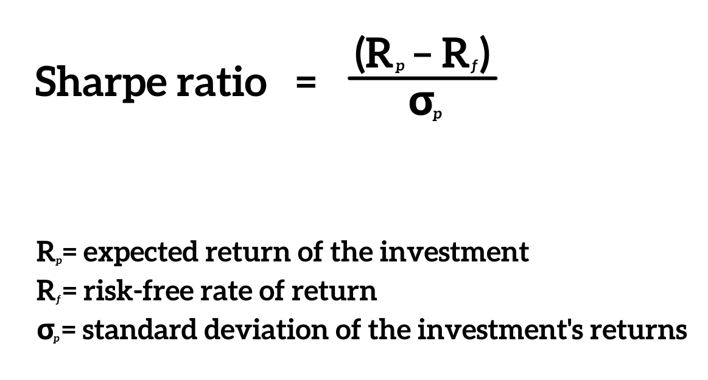

Algorithmic trading has significantly transformed financial markets by enabling automated and efficient decision-making processes. This advancement leverages sophisticated algorithms to analyze vast amounts of data, identify trading opportunities, and execute trades with minimal human intervention. Algorithmic trading aims for high annualized returns, yet understanding the associated risks is crucial for the sustainability and resilience of trading strategies. One of the primary metrics for assessing these risks is the Sharpe Ratio, an essential tool introduced by Nobel Laureate William F. Sharpe.

The Sharpe Ratio is a fundamental measure that quantifies risk-adjusted returns, providing insights into the balance between risk and return in trading strategies. By evaluating the excess return generated relative to its risk, the Sharpe Ratio empowers traders to make more informed investment decisions. It calculates the difference between the average return of a portfolio and the risk-free rate, divided by the standard deviation of the portfolio's excess return. Mathematically, it is expressed as:



$$

\text{Sharpe Ratio} = \frac{\bar{R_a} - R_f}{\sigma_a} 
$$

where $\bar{R_a}$ is the average return of the asset, $R_f$ is the risk-free rate, and $\sigma_a$ is the standard deviation of the asset’s excess return. This measure is pivotal in algorithmic trading strategy evaluation as it aides in listing strategies according to their risk-adjusted returns, thus guiding prudent and strategic capital allocation decisions, reducing exposure to excessive risk, and promoting long-term strategy sustainability. As trading strategies become increasingly complex and data-driven, the Sharpe Ratio remains indispensable for traders seeking to optimize performance in volatile and competitive markets.

## Table of Contents

## Understanding the Sharpe Ratio

The Sharpe Ratio is a vital metric in quantifying the risk-adjusted returns of an asset or trading strategy. It is defined mathematically as:

$$
\text{Sharpe Ratio} = \frac{\bar{R} - R_f}{\sigma}
$$

where $\bar{R}$ represents the average return of the asset, $R_f$ denotes the risk-free rate, and $\sigma$ is the standard deviation of the excess returns, which are the returns above the risk-free rate.

This metric essentially provides investors with insight into how much extra return they are achieving for each unit of risk they undertake. A higher Sharpe Ratio indicates more attractive risk-adjusted returns, suggesting that the asset or strategy is effectively balancing the relationship between risk and return.

To utilize the Sharpe Ratio effectively, it is crucial to understand the underlying calculations and assumptions it relies on. One of the key assumptions is the use of historical data to estimate expected returns and risk, which presumes that past performance can inform future outcomes. Additionally, the Sharpe Ratio often assumes that returns are normally distributed, simplifying the representation of risk through a single standard deviation metric. However, this assumption may not always hold true, particularly in financial markets which often exhibit skewness and kurtosis.

In practical applications, accurate estimation of the risk-free rate is imperative, as it serves as the benchmark return that investors could achieve without taking any risk. This is commonly represented by the yield on short-term government securities. Finally, a comprehensive grasp of how [volatility](/wiki/volatility-trading-strategies) is computed allows for more precise measurement of the standard deviation of excess returns, reinforcing the reliability of the Sharpe Ratio as a tool for assessing risk-adjusted performance.

## Significance in Algorithmic Trading

Algorithmic trading relies heavily on quantifiable metrics to evaluate and optimize trading strategies. Among these metrics, the Sharpe Ratio stands out for its utility in distinguishing between strategies with similar returns but differing risk profiles. This metric offers traders a quantitative measure to assess which strategies yield higher returns relative to the amount of risk undertaken, thus fostering more informed decision-making.

The core significance of the Sharpe Ratio in [algorithmic trading](/wiki/algorithmic-trading) lies in its ability to provide a risk-adjusted return measure. It enables traders to compare the performance of multiple strategies on a normalized scale. Suppose two trading strategies exhibit similar annual returns. Without considering risk, a trader might mistakenly view them as equally effective. However, if one strategy incurs higher volatility, it inherently carries more risk, which could lead to substantial losses under adverse market conditions. The Sharpe Ratio illuminates this disparity by integrating risk into the evaluation process, presenting a clear picture of which strategy offers more return per unit of risk.

Moreover, employing the Sharpe Ratio can guide traders in effectuating more efficient capital allocation. By investing in strategies with superior risk-adjusted returns, traders can potentially enhance their investment outcomes, minimizing potential financial losses. This effectiveness in capital allocation not only maximizes returns but also fortifies the portfolio against market volatility.

In practical algorithmic trading frameworks, the Sharpe Ratio serves as a cornerstone for risk management. Strategies with high Sharpe Ratios are typically favored, as they suggest a more balanced approach to reward and volatility. Consequently, the Sharpe Ratio aids in constructing robust and resilient trading systems capable of withstanding tumultuous market environments while still pursuing profitable opportunities.

In summary, the Sharpe Ratio's ability to quantify risk-adjusted returns makes it an indispensable tool in algorithmic trading. It facilitates the assessment of strategy effectiveness, optimal capital allocation, and comprehensive risk management, thereby enabling traders to make strategic decisions grounded in quantitative analysis.

## Calculation of the Sharpe Ratio

The calculation of the Sharpe Ratio is a fundamental process in evaluating the risk-adjusted returns of an investment strategy. To compute the Sharpe Ratio, three main components must be determined: the asset's average return, the risk-free rate of return, and the standard deviation of excess returns. 

The Sharpe Ratio formula is expressed as:

$$
\text{Sharpe Ratio} = \frac{E[R_a - R_f]}{\sigma_a}
$$

where $E[R_a - R_f]$ is the expected excess return over the risk-free rate, and $\sigma_a$ represents the standard deviation of the asset's excess returns. It provides an insight into the reward received per unit of risk taken.

The annualization of the Sharpe Ratio is a critical step, allowing for consistent comparison between strategies with different frequencies of returns. This is achieved by scaling the Sharpe Ratio using the relationship:

$$
\text{Annualized Sharpe Ratio} = \text{Sharpe Ratio} \times \sqrt{N}
$$

Here, $N$ is the number of return periods within a year. For instance, if daily returns are used, $N$ would be 252, representing the typical number of trading days in a year. This annualization ensures that investors can make meaningful comparisons between strategies with differing temporal horizons, thus maintaining consistency in risk-adjusted performance assessment. 

By accurately calculating and annualizing the Sharpe Ratio, traders and analysts can better evaluate and compare the efficiency and robustness of various trading strategies under consideration.

## Choosing the Right Benchmark

Selecting an appropriate benchmark for calculating the Sharpe Ratio is essential for accurately assessing excess returns. The benchmark serves as a comparative standard that reflects similar risk characteristics to the strategy being evaluated. By aligning the risk profile of the benchmark with that of the trading strategy, investors can ensure that the Sharpe Ratio provides a meaningful measure of risk-adjusted performance.

When choosing a benchmark, it is important to select one that captures the relevant market or segment where the strategy operates. For example, a strategy focused on U.S. large-cap equities might use the S&P 500 index as its benchmark, whereas a strategy centered on emerging market stocks might select the MSCI Emerging Markets index. This alignment ensures that the calculated excess returns accurately reflect the additional risk undertaken by the strategy compared to the market standard.

Additionally, the selection of the risk-free rate is a key component in calculating the Sharpe Ratio. The risk-free rate represents the return on an investment with zero risk, typically associated with short-term government securities such as U.S. Treasury bills. Choosing the correct risk-free rate is crucial, as it serves as the baseline for determining excess returns. A mismatch between the risk-free rate and the investment horizon of the strategy can lead to skewed evaluations, emphasizing the importance of consistency in temporal assumptions.

By ensuring that both the market benchmark and the risk-free rate are appropriately matched to the strategy being evaluated, traders can enhance the accuracy of the Sharpe Ratio. This fosters a more reliable assessment of risk-adjusted performance, aiding in the effective comparison and selection of trading strategies.

## Limitations of the Sharpe Ratio

The Sharpe Ratio is a widely used metric for assessing the risk-adjusted returns of an investment or trading strategy. However, it has notable limitations that traders must consider for comprehensive strategy evaluation and effective risk management.

One major limitation of the Sharpe Ratio is its reliance on historical data. Historical data may not always provide an accurate representation of future performance due to market anomalies, regime changes, or unexpected global events, which can lead to incorrect risk-return assessments. This dependence on past data also assumes that future returns will replicate historical patterns, which is not guaranteed.

Another critical assumption of the Sharpe Ratio is the normal distribution of returns. The metric presupposes that asset returns follow a symmetrical distribution, which often does not hold true in practice. Financial markets can exhibit skewness or kurtosis, particularly during periods of volatility or financial crisis, leading to substantial deviations from normality. This assumption could result in misleading interpretations of risk if extreme events or outliers disproportionately affect the return distribution.

Furthermore, the Sharpe Ratio does not inherently account for transaction costs, which are an integral part of modern trading, especially in high-frequency environments. Frequent buying and selling can significantly affect net returns, thereby distorting the actual performance of a strategy when not considered in the Sharpe Ratio calculation. Similarly, leverage can amplify both returns and risks. The Sharpe Ratio, in its basic form, does not adjust for leverage effects, which can lead to misjudgments regarding the true riskiness of a leveraged strategy.

Given these limitations, it is crucial for traders and analysts to [factor](/wiki/factor-investing) in additional considerations when employing the Sharpe Ratio. An understanding of its constraints allows for the application of complementary metrics and qualitative assessments that provide a more robust evaluation of an investment strategy’s performance.

## Practical Applications and Examples

Calculating the Sharpe Ratio can be efficiently performed using Python, leveraging libraries such as Pandas and NumPy for data manipulation and numerical computations. This process enables the analysis of stock data to derive essential insights into risk-adjusted performance.

### Calculating the Sharpe Ratio with Python

To compute the Sharpe Ratio, it is necessary to gather historical price data for an asset, calculate its returns, and compare these returns to a risk-free rate. Below is a concise example illustrating this process:

```python
import pandas as pd
import numpy as np

# Load historical data
data = pd.read_csv('stock_data.csv', parse_dates=True, index_col='Date')

# Calculate daily returns
daily_returns = data['Close'].pct_change()

# Assume a constant risk-free rate (e.g., 2% annualized)
risk_free_rate = 0.02

# Calculate excess returns
excess_returns = daily_returns - (risk_free_rate / 252)  # 252 trading days in a year

# Calculate average of excess returns
average_excess_return = excess_returns.mean()

# Determine the standard deviation of excess returns
std_excess_return = excess_returns.std()

# Calculate the Sharpe Ratio
sharpe_ratio = (average_excess_return / std_excess_return) * np.sqrt(252)

print(f'Sharpe Ratio: {sharpe_ratio}')
```

### Example Insights into Strategy Performance

With the Sharpe Ratio calculated, traders gain valuable insights into how effectively a strategy is operating on a risk-adjusted basis. For instance, a strategy with a high Sharpe Ratio indicates that the strategy is achieving a higher return per unit of risk, thereby providing better compensation for the risk assumed.

### Strategy Comparison

By evaluating different strategies through their respective Sharpe Ratios, traders can ascertain which strategies offer superior risk-adjusted returns. For example, consider two algorithmic trading strategies: Strategy A and Strategy B. If Strategy A has a Sharpe Ratio of 1.5 and Strategy B has a Sharpe Ratio of 1.2, Strategy A would be preferred provided all else is equal, as it provides higher returns per unit of risk undertaken.

### Optimization for Maximum Returns

Moreover, using the Sharpe Ratio enables the optimization of strategy parameters to enhance performance further. Adjusting factors such as target asset allocations, and managing transaction costs can lead to improved Sharpe Ratios, thereby increasing the likelihood of consistent and higher returns.

In conclusion, the practical application of the Sharpe Ratio in Python affords traders a robust method to evaluate and optimize their trading strategies, ensuring that risk and return are well-balanced and aligned with investment goals.

## Enhancing Strategy Performance Using the Sharpe Ratio

Improving the Sharpe Ratio is essential for enhancing the performance of algorithmic trading strategies. This enhancement can be achieved through the optimization of strategy parameters and a reduction in transaction costs. By fine-tuning these variables, traders can increase the efficiency of their strategies, thereby maximizing risk-adjusted returns.

To deepen the evaluation of trading strategies, it is beneficial to incorporate additional performance metrics alongside the Sharpe Ratio. While the Sharpe Ratio remains a fundamental tool for understanding risk-adjusted returns, it does not account for all dimensions of performance. For instance, the Sortino Ratio can be used to focus specifically on downside risk, thereby providing a more targeted view of negative volatility. On the other hand, metrics such as the Treynor Ratio and Jensen’s Alpha introduce assessments of market risk and excess returns in relation to the Capital Asset Pricing Model (CAPM), respectively. These supplementary metrics help to create a rounded understanding of a strategy's performance.

Furthermore, integrating multiple performance metrics supports traders in striking a balance between risk and potential returns. By evaluating various aspects of financial performance, traders can make informed adjustments to their strategies that accommodate market conditions and investor expectations. As a result, this balanced approach contributes to the development of more consistent and resilient trading strategies that perform well across diverse market scenarios.

Utilizing computational tools such as Python can facilitate these evaluations and optimizations. For instance, libraries like pandas and numpy are useful for handling complex datasets and computing financial metrics. Here is a basic example of calculating the Sharpe Ratio in Python:

```python
import numpy as np

# Sample return and risk-free rate data
returns = np.array([0.05, 0.02, 0.04, -0.02, 0.03])
risk_free_rate = 0.01

# Calculating the average excess return
excess_returns = returns - risk_free_rate
average_excess_return = np.mean(excess_returns)

# Calculating the standard deviation of excess returns
std_dev_excess_returns = np.std(excess_returns)

# Calculating the Sharpe Ratio
sharpe_ratio = average_excess_return / std_dev_excess_returns
print("Sharpe Ratio:", sharpe_ratio)
```

This code allows traders to efficiently evaluate the Sharpe Ratio for a given set of returns, thus enabling precise adjustments to strategy parameters for optimal performance. By adopting such practices, traders ensure that their strategies remain responsive and profitable, maintaining a competitive edge in algorithmic trading environments.

## Comparing Sharpe Ratio with Other Performance Metrics

The Sharpe Ratio is a popular metric used to evaluate the risk-adjusted returns of a trading strategy by considering both its returns and the corresponding volatility. However, it treats both upward and downward volatility equally, which can be a limitation when the focus is primarily on minimizing the downside risk. This limitation is addressed by the Sortino Ratio. The Sortino Ratio improves upon the Sharpe Ratio by replacing total volatility with downside deviation, which is a more desirable measure when investors are concerned primarily with negative returns. The formula for the Sortino Ratio is:

$$
\text{Sortino Ratio} = \frac{R_a - R_f}{\sigma_d}
$$

where $R_a$ is the average asset return, $R_f$ is the risk-free rate, and $\sigma_d$ is the standard deviation of downside returns. By focusing on downside deviation, the Sortino Ratio provides a clearer picture when evaluating strategies that might incur asymmetric risks.

Another metric of interest is the Treynor Ratio, which measures returns above the risk-free rate per unit of market risk, as captured by beta ($\beta$). This ratio is particularly useful for diversified portfolios where specific risk has been minimized. The Treynor Ratio is calculated as:

$$
\text{Treynor Ratio} = \frac{R_a - R_f}{\beta}
$$

Here, beta represents the sensitivity of the asset’s returns to market movements, and the ratio provides insights into how well the strategy has compensated investors for taking on market risk.

Jensen's Alpha, on the other hand, measures the excess returns of a portfolio relative to the expected returns predicted by the Capital Asset Pricing Model (CAPM). This performance metric allows investors to understand whether a strategy is offering returns that are superior to what could be expected based solely on its level of systematic risk. Jensen's Alpha is calculated as:

$$
\alpha = R_a - [R_f + \beta \times (R_m - R_f)]
$$

where $R_m$ denotes the market return. A positive alpha indicates that the strategy outperformed the expected return, while a negative alpha suggests underperformance.

Utilizing these diverse metrics—Sortino Ratio for downside risk, Treynor Ratio for market risk, and Jensen’s Alpha for excess return—enables traders to gain a well-rounded understanding of strategy performance. Each metric addresses different facets of risk and return, and their combined use facilitates a more comprehensive evaluation, fostering informed decision-making in strategy optimization and risk management.

## Conclusion

The Sharpe Ratio remains a cornerstone metric in evaluating risk-adjusted returns within algorithmic trading. It quantifies how much excess return an investor receives for the additional volatility endured, offering a clear perspective on the efficiency of a trading strategy in relation to its risk. Although the Sharpe Ratio provides significant insight, relying solely on it could result in an incomplete assessment of a strategy's performance. This is primarily because it does not account for the asymmetrical nature of risk or specific trading nuances such as leverage and transaction costs.

Therefore, it is prudent to complement the Sharpe Ratio with other performance metrics. For instance, the Sortino Ratio, which only considers downside risk, offers a more nuanced perspective by focusing on negative volatility. Similarly, integrating metrics such as the Treynor Ratio and Jensen's Alpha, which consider market risk and expected returns based on the Capital Asset Pricing Model (CAPM), can deliver a comprehensive understanding when evaluating strategies. 

Employing a multi-metric approach not only strengthens the robustness of the strategy evaluation but also enhances the decision-making process, enabling traders to pursue informed investments that effectively balance potential returns with their associated risks. Additionally, incorporating qualitative analysis along with quantitative metrics ensures a more rounded and effective strategy assessment, fostering consistent and resilient trading outcomes.

## References & Further Reading

To further understand the development and application of the Sharpe Ratio in evaluating risk-adjusted returns, several foundational works and contemporary resources are recommended. 

1. **William F. Sharpe's Original Work**: The Sharpe Ratio, originally termed the "reward-to-variability ratio," was introduced by William F. Sharpe in his seminal paper "The Sharpe Ratio" (Sharpe, 1994). This paper elaborates on the statistical relationship between risk and return, which serves as a cornerstone for evaluating investment performance.

2. **Portfolio Theory and Capital Markets by William F. Sharpe**: This book provides comprehensive insights into modern portfolio theory, offering foundational knowledge crucial for comprehending risk-adjusted performance metrics like the Sharpe Ratio.

3. **"Principles of Corporate Finance" by Richard A. Brealey, Stewart C. Myers, and Franklin Allen**: This widely referenced book includes expanded discussions on performance metrics and investment risks, including the Sharpe Ratio.

4. **"Quantitative Equity Portfolio Management" by Ludwig B. Chincarini and Daehwan Kim**: It gives practical insights into applying quantitative methods in finance, with sections dedicated to understanding and using metrics like the Sharpe Ratio in portfolio management.

5. **Further Reading on Advanced Topics in Algorithmic Trading**:
    - "Algorithmic Trading: Winning Strategies and Their Rationale" by Ernie Chan explores advanced algorithmic strategies and performance evaluation metrics.
    - "Advances in Financial Machine Learning" by Marcos López de Prado includes discussions on machine learning applications in finance, which enrich the trader's understanding of risk and returns.
    - "Python for Finance" by Yves Hilpisch provides practical examples on using Python for financial analysis, useful for implementing the Sharpe Ratio among other metrics.

These resources serve as a comprehensive guide for anyone looking to deepen their knowledge of the Sharpe Ratio and explore its applications in algorithmic trading and financial analysis.