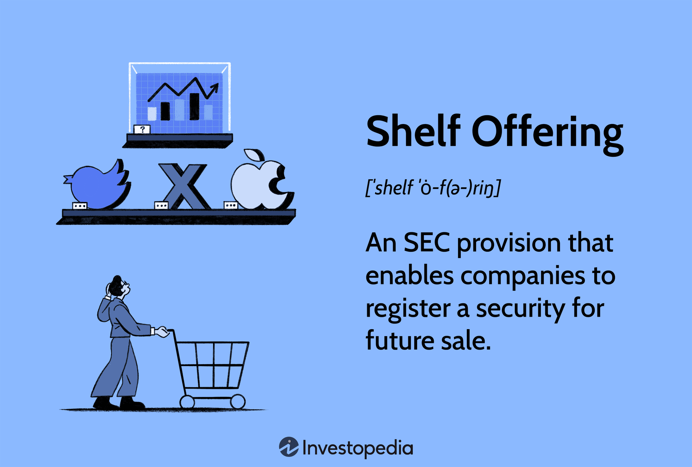

## Table of Contents

## What is a shelf offering?

A shelf offering is a way for companies to sell new stocks or bonds over time. Instead of selling all the stocks or bonds at once, the company can sell them little by little whenever they want. This is helpful because it lets the company get money when they need it without having to go through a big process each time.

To do a shelf offering, a company first registers the total amount of stocks or bonds they might want to sell with a group called the Securities and Exchange Commission (SEC). After that, they can sell parts of it over the next few years. This is good for the company because it makes it easier to raise money, and it can be good for investors because they can buy the stocks or bonds at different times.

## How does a shelf offering work?

A shelf offering is a way for a company to sell new stocks or bonds over time without having to go through the whole process each time they want to sell more. First, the company tells the Securities and Exchange Commission (SEC) how many stocks or bonds they might want to sell. This is called registering the securities. Once the SEC says it's okay, the company can keep these securities "on the shelf" for up to three years.

When the company needs money, they can take some of the stocks or bonds off the shelf and sell them. They don't need to ask the SEC again; they can just sell them whenever they want within those three years. This makes it easier for the company to get money when they need it, and it can be good for investors too because they can buy the stocks or bonds at different times.

## What are the key components of a shelf offering?

A shelf offering has a few important parts. First, there's the registration with the Securities and Exchange Commission (SEC). The company tells the SEC how many stocks or bonds they might want to sell. This step is important because it lets the company keep these securities ready to sell for up to three years. It's like putting them on a shelf, waiting to be sold when the company needs money.

The second key part is the timing and flexibility of selling. Once the securities are registered, the company can sell them little by little whenever they need to. They don't have to ask the SEC again each time they want to sell more. This makes it easier for the company to get money when they need it, without going through a big process every time. It also gives investors a chance to buy the stocks or bonds at different times, which can be good for them too.

## What are the benefits of a shelf offering for a company?

A shelf offering helps a company by giving them the freedom to sell stocks or bonds when they need money. Instead of selling everything at once, they can do it little by little. This means they can wait for a good time to sell, like when the price is high. It's like having a piggy bank they can dip into whenever they want, without having to go through a big process each time.

Another benefit is that it saves time and money. When a company registers a shelf offering with the SEC, they only have to do it once. Then, they can sell parts of it over the next few years without needing to ask the SEC again. This makes it easier and cheaper for the company to raise money. It's like having a shortcut to get the money they need, without all the extra work.

## How does a shelf offering differ from a traditional public offering?

A shelf offering is different from a traditional public offering because it lets a company sell stocks or bonds over time instead of all at once. With a traditional public offering, a company sells all the stocks or bonds they want to sell right away. They have to go through a big process with the SEC each time they want to do this. But with a shelf offering, a company can register the stocks or bonds once and then sell them little by little over the next few years. This makes it easier and quicker for the company to get money when they need it.

Another difference is that a shelf offering gives the company more flexibility. They can wait for a good time to sell, like when the price is high. This can help them get more money for their stocks or bonds. With a traditional public offering, the company doesn't have this choice. They have to sell everything at once, no matter what the market is like. So, a shelf offering is like having a piggy bank they can dip into whenever they want, while a traditional public offering is more like a one-time big sale.

## What are the regulatory requirements for a shelf offering?

The main regulatory requirement for a shelf offering is that the company must register the securities with the Securities and Exchange Commission (SEC). This means the company tells the SEC how many stocks or bonds they might want to sell. Once the SEC approves the registration, the company can keep these securities ready to sell for up to three years. This is like putting them on a shelf, waiting to be sold when the company needs money.

After the initial registration, the company must follow certain rules when they decide to sell the securities. They need to file a short document called a prospectus supplement with the SEC each time they take securities off the shelf to sell. This document gives updated information about the securities and the company's current situation. This helps keep investors informed and ensures that the company is following the rules set by the SEC.

## Can you explain the process of filing a shelf registration?

Filing a shelf registration starts with the company deciding how many stocks or bonds they might want to sell in the future. They then prepare a document called a registration statement and send it to the Securities and Exchange Commission (SEC). This document tells the SEC all about the securities the company wants to sell, like how many there are and what they're for. The SEC looks at this document to make sure everything is okay. If the SEC approves it, the company can keep these securities ready to sell for up to three years.

Once the SEC approves the registration, the company can start selling the securities whenever they need money. But each time they want to sell some of the securities, they have to file another short document called a prospectus supplement with the SEC. This document gives updated information about the securities and the company's current situation. It helps keep investors informed and makes sure the company is following the rules. This way, the company can sell the securities little by little over time, without having to go through the whole registration process again.

## What types of securities can be included in a shelf offering?

A shelf offering can include different types of securities, like stocks and bonds. Stocks are pieces of ownership in a company, and when a company sells stocks, it's like selling little pieces of itself to investors. Bonds are like loans that investors give to the company, and the company promises to pay the money back with interest over time. Both stocks and bonds can be part of a shelf offering, giving the company a lot of choices for raising money.

Besides stocks and bonds, a shelf offering can also include other types of securities, like convertible securities and warrants. Convertible securities are special bonds that can be turned into stocks later on. Warrants are like tickets that give investors the right to buy stocks at a certain price in the future. By including these different types of securities in a shelf offering, a company can meet different needs and attract different kinds of investors.

## How does market timing affect the decision to use a shelf offering?

Market timing plays a big role in deciding when to use a shelf offering. With a shelf offering, a company can wait for the right time to sell their stocks or bonds. If the market is doing well and the price is high, the company can sell their securities and get more money for them. This is good because it means the company can raise more money when they need it. But if the market is not doing well, they can wait until things get better before selling.

This flexibility is a big advantage of shelf offerings. It lets companies be smart about when they sell their securities. They don't have to rush to sell everything at once like in a traditional public offering. Instead, they can take their time and choose the best moments to get the most money. This can help the company grow and stay strong, even when the market goes up and down.

## What are the potential risks and drawbacks of shelf offerings?

One risk of shelf offerings is that the market might not be good when the company wants to sell their securities. If the market is down, the company might not get as much money as they hoped for. This can make it hard for them to raise the money they need. Also, if investors see that the company is selling securities often, they might think the company is in trouble and needs money fast. This can make the stock price go down, which is bad for the company.

Another drawback is that shelf offerings can be confusing for investors. When a company sells securities little by little, it can be hard for investors to know what's going on. They might not understand why the company is selling now or how much they are selling. This can make investors nervous and less likely to buy the securities. Plus, the company has to keep filing extra documents with the SEC each time they sell, which can be a lot of work and cost money.

## Can you provide an example of a successful shelf offering?

A good example of a successful shelf offering is when Apple Inc. used it in 2013. Apple wanted to have money ready for things like buying back its own stock and paying dividends to shareholders. They registered a shelf offering with the SEC for up to $17 billion in securities. This let them sell stocks and bonds whenever they needed money, without having to go through the whole process again.

Over the next few years, Apple used this shelf offering to sell securities at good times. They waited until the market was doing well and the price was high, so they could get more money for their stocks and bonds. This helped Apple raise the money they needed to keep growing and doing well. It shows how a shelf offering can be a smart way for a big company to get money when they need it.

## How do investors perceive shelf offerings, and what impact does it have on stock prices?

Investors can see shelf offerings in different ways. Some might think it's a good sign because it shows the company is planning ahead and wants to have money ready for future projects or to pay back debts. They might feel more confident in the company's long-term plans. But others might worry that the company is selling stocks or bonds because it needs money fast. This can make investors nervous, and they might think the company is in trouble.

When a company does a shelf offering, it can affect the stock price. If investors think it's a good sign, the stock price might go up because more people want to buy the stock. But if they think it's a bad sign, the stock price might go down because people might want to sell their stocks. It all depends on what investors think about why the company is doing the shelf offering and how the market is doing at the time.

## References & Further Reading

[1]: Securities and Exchange Commission (SEC). ["Shelf Offerings under Rule 415."](https://www.sec.gov/files/rules/sro/occ/2024/34-101684.pdf)

[2]: Merton H. Miller and Kevin Rock, "Dividend Policy under Asymmetric Information," The Journal of Finance, Vol. 40, No. 4 (September 1985), pp. 1031-1051.

[3]: DePamphilis, Donald M. (2019). ["Mergers, Acquisitions, and Other Restructuring Activities."](https://www.sciencedirect.com/book/9780128016091/mergers-acquisitions-and-other-restructuring-activities) Academic Press.

[4]: Gitman, Lawrence J., et al. ["Principles of Managerial Finance."](https://archive.org/details/principlesofmana0000gitm) Pearson.

[5]: Lhabitant, François-Serge. ["Handbook of Hedge Funds."](https://www.amazon.com/Handbook-Hedge-Funds-Fran%C3%A7ois-Serge-Lhabitant/dp/0470026634) Wiley Finance. 

[6]: Prado, Marcos Lopez de. ["Advances in Financial Machine Learning."](https://www.amazon.com/Advances-Financial-Machine-Learning-Marcos/dp/1119482089) Wiley.

[7]: Securities and Exchange Commission. ["Form S-3."](https://www.sec.gov/files/forms-3.pdf)