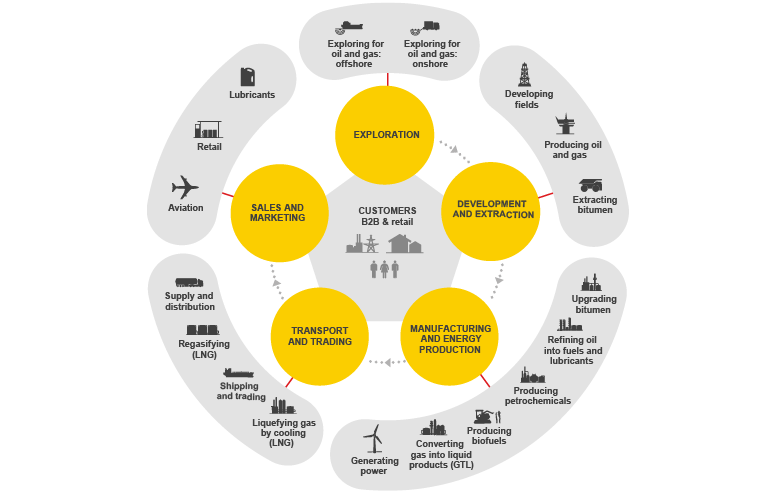

## Table of Contents

## What is a shell corporation?

A shell corporation is a company that exists mostly on paper and doesn't have many real business activities. It might have an office address, but it usually doesn't have employees or make products. People or other companies set up shell corporations for different reasons. Sometimes, they use them to keep their business activities private or to manage money in a way that helps them pay less tax.

However, shell corporations can also be used for illegal activities. Because they can hide who really owns them, some people use shell corporations to hide money they got from crimes or to avoid paying taxes they owe. Governments around the world are trying to make rules stricter so that it's harder to use shell corporations for bad things, but they are still a part of the business world.

## What are the common uses of shell corporations?

Shell corporations are often used for legal and legitimate purposes. One common use is to help businesses manage their money more efficiently. For example, a company might set up a shell corporation in a country with lower taxes to save money. This is called tax planning. Another use is to protect the privacy of the business owners. By setting up a shell corporation, the real owners can keep their names out of public records, which can be useful for personal safety or business strategy.

However, shell corporations can also be misused for illegal activities. Some people use them to hide money they got from crimes like fraud or drug trafficking. This is called money laundering. Shell corporations can make it hard for the police to find out who really owns the money. Another illegal use is to avoid paying taxes that are owed. By moving money through shell corporations in different countries, some people try to trick the tax authorities.

Governments are working to make rules stricter to stop the misuse of shell corporations. They want to make it easier to find out who really owns these companies. But shell corporations are still used in many parts of the world, both for good and bad reasons.

## How do shell corporations differ from regular corporations?

Shell corporations and regular corporations are different in a few big ways. A regular corporation is a real business that makes things or offers services. It has employees, an office, and does business every day. A shell corporation, on the other hand, is mostly just on paper. It might have an address, but it doesn't have many employees or do much business. People set up shell corporations for different reasons, like saving on taxes or keeping their business private.

The main difference is what they do. A regular corporation is active and has a lot going on. It makes money by selling things or services. A shell corporation doesn't do much. It might be used to hold money or own other companies, but it doesn't have its own business activities. Because of this, shell corporations can be used in ways that regular corporations can't, like hiding who really owns the money or avoiding taxes.

## What are the legal requirements for setting up a shell corporation?

Setting up a shell corporation involves following the legal rules of the country where you want to set it up. You usually need to file some papers with the government. These papers tell the government the name of the company, who owns it, and where it is located. Sometimes, you also need to pay a fee to set up the company. The exact rules can be different in each country, so it's important to check what you need to do in the place where you want to set up the shell corporation.

After you set up the shell corporation, you need to follow other rules to keep it running. This might include filing yearly reports with the government and paying any taxes that the company owes. Even though a shell corporation doesn't do much business, it still has to follow the law. If you don't follow these rules, the government might close down the company or you might have to pay fines. It's a good idea to talk to a lawyer or someone who knows about business to make sure you do everything right.

## In which jurisdictions are shell corporations most commonly established?

Shell corporations are often set up in places known as tax havens. These are countries or areas that have low taxes and strong privacy laws. Some popular tax havens for shell corporations are the British Virgin Islands, the Cayman Islands, and Panama. These places make it easy to set up a company and keep the owners' names secret. This can help people save on taxes or keep their business private.

However, shell corporations are not only used in tax havens. They can also be set up in many other countries around the world, like the United States, the United Kingdom, and Singapore. These places might not offer the same low taxes as tax havens, but they still have rules that make it easy to set up a shell corporation. People might choose these places because they want to do business in a certain area or because they are familiar with the laws there.

## What are the tax implications of using a shell corporation?

Using a shell corporation can help a business or person save on taxes. By setting up a shell corporation in a country with low taxes, called a tax haven, they can move their money there and pay less tax. This is called tax planning. For example, if a company makes a lot of money in a country with high taxes, it can use a shell corporation to move that money to a place with low taxes. This way, the company can keep more of its money.

However, using shell corporations for tax purposes can sometimes be illegal. If a person or company uses a shell corporation to hide money and not pay taxes they owe, it's called tax evasion. This is against the law and can lead to big fines or even jail time. Governments around the world are trying to stop tax evasion by making rules stricter and sharing information about who owns shell corporations. So, while shell corporations can be used to save on taxes, it's important to follow the law and not use them to cheat on taxes.

## How can shell corporations be used for asset protection?

Shell corporations can help protect assets by keeping them separate from the main business. If someone owns a business and wants to protect their personal money or other things they own, they can set up a shell corporation. This shell corporation can own important assets, like property or investments. If the main business has problems, like getting sued, the assets in the shell corporation are usually safe. This is because the shell corporation is a separate legal thing, so its assets are not part of the main business's problems.

However, using shell corporations for asset protection must be done carefully and legally. If someone tries to use a shell corporation to hide assets from people they owe money to, it can be seen as fraud. Courts can look through the shell corporation and still take the assets if they think it's being used to cheat people. So, while shell corporations can be a good way to protect assets, it's important to set them up the right way and follow the law.

## What are the potential risks and ethical concerns associated with shell corporations?

Using shell corporations can come with risks and ethical problems. One big risk is that they can be used to do bad things, like hiding money from crimes or avoiding taxes. If someone uses a shell corporation for these illegal activities, they can get in big trouble with the law. They might have to pay big fines or even go to jail. Also, if a shell corporation is used to hide who really owns a business, it can make it hard for people to know if they can trust the company. This can hurt the business world because trust is important for doing business.

There are also ethical concerns about shell corporations. Some people think it's not right to use them to save on taxes or keep business private. They say it's unfair because it lets rich people and big companies pay less tax than others. This can make it harder for governments to help people who need it, like by building schools or hospitals. Also, using shell corporations to hide who owns a business can make it harder for people to make good choices about who to do business with. This can lead to problems like companies not being held responsible for what they do.

## How do shell corporations impact transparency and financial regulation?

Shell corporations can make it harder for people to see what's really going on in the business world. They can hide who owns a company and where the money is going. This lack of transparency can make it tough for people to trust businesses and for governments to keep an eye on them. When it's hard to know who is behind a company, it can be easier for bad people to do things like hide money from crimes or avoid paying taxes. This can hurt the economy and make it harder for everyone to feel safe about doing business.

Governments and financial regulators are trying to fix these problems by making new rules. They want to make it easier to find out who really owns shell corporations. This can help stop people from using them to do bad things. But it's not easy to change the rules everywhere because different countries have different laws. Also, some people think that too many rules can make it harder for businesses to grow and create jobs. So, finding the right balance between stopping bad behavior and letting good businesses work is a big challenge.

## What role do shell corporations play in international business and finance?

Shell corporations play a big role in international business and finance. They are often used to make it easier for companies to do business in different countries. For example, a company might set up a shell corporation in a country where it wants to do business to help manage its money there. This can help the company save on taxes or keep its business plans private. Shell corporations can also help businesses move money around the world more easily. This can be useful for big companies that have offices in many different countries.

However, shell corporations can also cause problems in international business and finance. Because they can hide who really owns a company, they can be used for bad things like hiding money from crimes or avoiding taxes. This can make it hard for governments to keep the economy fair and safe. To stop these problems, countries are working together to make new rules. These rules try to make it easier to find out who owns shell corporations and stop people from using them to do bad things. But it's a big challenge because different countries have different laws and ideas about what's fair.

## How can shell corporations be detected and what are the signs of their misuse?

Detecting shell corporations can be tricky, but there are ways to spot them. One way is to look at where the company is set up. If it's in a tax haven like the British Virgin Islands or the Cayman Islands, it might be a shell corporation. Another way is to check if the company has a real office and employees. If it's just an address with no real business happening, it could be a shell corporation. Governments and financial experts also use special tools and databases to track money and see if it's moving through shell corporations.

There are signs that a shell corporation might be misused. One big sign is if the company is used to hide who really owns it. This can be a problem if the owners are trying to do something illegal, like hiding money from crimes or avoiding taxes. Another sign is if the company moves a lot of money around, especially to different countries, without doing any real business. This can be a way to trick the tax authorities or hide money. If people see these signs, they should be careful and maybe tell the authorities so they can check if anything illegal is going on.

## What are the advanced strategies for managing and utilizing shell corporations effectively?

Using shell corporations in a smart way means understanding the rules and setting them up in the right places. People often choose to set up shell corporations in countries with low taxes, called tax havens, like the British Virgin Islands or the Cayman Islands. These places make it easier to save on taxes and keep business private. It's important to follow the rules in these places and keep good records. This helps avoid problems with the law and keeps the shell corporation working well. Talking to a lawyer or someone who knows about business can help make sure everything is done right.

Another important thing is to use shell corporations to protect money and other things people own. By setting up a shell corporation, someone can keep their important assets safe if their main business has problems. This means if the main business gets sued or goes bankrupt, the assets in the shell corporation are usually safe. But it's important to use shell corporations in an honest way. If someone tries to hide assets to avoid paying what they owe, it can be seen as fraud. So, while shell corporations can be a good tool for managing money and protecting assets, it's important to use them the right way and follow the law.

## What are the legal and ethical considerations of shell corporations?

Shell corporations often stand at the center of heated debates regarding their legal and ethical implications. Their potential for misuse in activities such as tax evasion and money laundering is a significant concern. Tax evasion, for instance, can occur when companies use shell corporations to artificially shift profits to low-tax jurisdictions, which can be described mathematically by the formula:

$$
\text{Effective\ Tax\ Rate} = \frac{\text{Taxes\ Paid}}{\text{Total\ Income}}
$$

By manipulating funds through shell entities, companies may report lower taxes paid relative to total income, reducing their effective tax rate and thus their tax liability.

Certain jurisdictions, commonly referred to as tax havens, provide a veil of privacy that can obscure the actual ownership and operations of these shells. Notable tax havens include the Cayman Islands, Bermuda, and Luxembourg, among others. These locations offer favorable tax regimes and strict confidentiality laws, enabling individuals and corporations to mask the true nature of their financial dealings. 

In response, regulatory bodies at national and international levels strive to increase transparency and enforce compliance. Initiatives like the Base Erosion and Profit Shifting (BEPS) project spearheaded by the Organisation for Economic Co-operation and Development (OECD) aim to curb profit shifting and improve tax disclosure. Additionally, the Financial Action Task Force (FATF) provides recommendations to combat money laundering, requiring jurisdictions to implement measures that ensure the beneficial ownership of companies is adequately disclosed and accessible to authorities.

Navigating the legal landscape surrounding shell corporations demands meticulous attention to compliance and ethical considerations. Companies must balance legal tax planning with obligations to transparency and corporate integrity. Failure to comply with emerging regulations can result in severe penalties, reputational damage, and potential legal action. Corporate governance structures must, therefore, prioritize ethical standards while engaging in cross-border transactions, ensuring that their operational strategies adhere to both the letter and spirit of the law.

By understanding the legal and ethical dimensions of shell corporations, businesses can mitigate risks and uphold their reputations in the global financial marketplace. As global efforts to enhance corporate transparency intensify, maintaining compliance will remain critical for sustainable business operations.

## References & Further Reading

[1]: Johnston, D. (2021). ["Shell Corporations: A Key to Understanding Modern Finance."](https://accountinginsights.org/understanding-shell-companies-structure-roles-and-financial-impact/) Corporate Finance Institute.

[2]: OECD (2015). ["Base Erosion and Profit Shifting Project."](https://www.oecd.org/en/topics/base-erosion-and-profit-shifting-beps.html) Organisation for Economic Co-operation and Development.

[3]: DeGrazia, D. (2020). ["Understanding the Role of Shell Companies."](https://lawjournal.ku.edu/wp-content/uploads/2020/12/3_Pacini-et-al_Money-Laundering_V30_I1.pdf) Forbes Magazine.

[4]: Narang, R. (2013). ["Inside the Black Box: A Simple Guide to Quantitative and High-Frequency Trading."](https://onlinelibrary.wiley.com/doi/book/10.1002/9781118662717) Wiley.

[5]: Markham, J. W. (2015). ["A Financial History of Modern U.S. Corporate Scandals: From Enron to Reform."](https://www.routledge.com/A-Financial-History-of-Modern-US-Corporate-Scandals-From-Enron-to-Reform/Markham/p/book/9780765615831) Routledge.
