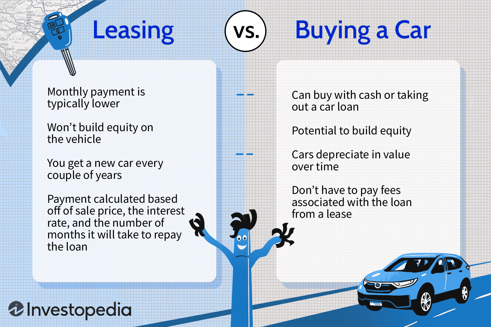

Shell leases are a prevalent concept in the world of commercial real estate, offering a unique lease structure that balances the demands of tenants and landlords. In this arrangement, the landlord provides a basic structure without interior finishes, allowing tenants the freedom to customize the space to their specific needs. This approach is particularly appealing for businesses seeking cost-effective solutions and flexibility in the design of their commercial spaces.

Algorithmic trading, typically associated with financial markets, has started to make its mark in real estate investments. This method involves using complex algorithms to execute trades, analyze market trends, and optimize investment strategies. Its application in commercial real estate is innovative, promising enhanced efficiency in property selection, trend analysis, and strategic decision-making.



Shell leases offer distinct advantages for both parties involved. For tenants, they afford the opportunity for customization at lower costs compared to fully furnished spaces. Landlords benefit from increased tenant retention by providing spaces that can be tailored to the tenant’s specific operational needs. Additionally, shell leases often reduce the responsibility of maintaining interior finishes, presenting potential financial incentives and long-term value creation.

The intersection of shell leases and algorithmic trading represents a modern approach to real estate investment. By leveraging data and predictive models, stakeholders can make informed decisions about property acquisitions, lease agreements, and space configurations. This article aims to explore the synergies between these two strategies, outlining the potential advantages and innovations they can jointly offer.

Through this exploration, the article seeks to demonstrate how shell leases and algorithmic trading can enhance real estate investment strategies, providing a framework for increased operational efficiency and financial success. The integration of these approaches not only holds promise for immediate application but also for setting a precedent in the evolving landscape of commercial real estate investment.

## Table of Contents

## Understanding Shell Leases

A shell lease is a type of commercial lease agreement where the landlord provides a minimally finished or unfinished space, known as a 'shell,' to the tenant. The tenant is then responsible for completing the interior of the space to suit their specific business needs. This leasing arrangement transfers part of the responsibility for interior design and construction from the landlord to the tenant, allowing for greater customization and potential cost savings over the long term.

### Cold Shells vs. Warm Shells

The notion of a 'shell' in commercial real estate can further be classified into 'cold' shells and 'warm' shells, which differ in the level of finish and utility installation provided by the landlord:

1. **Cold Shells**: These are essentially empty spaces; they lack basic HVAC (heating, ventilation, and air conditioning), electrical systems, and sometimes even interior walls. Cold shells are often selected by tenants who prefer maximum flexibility to construct and design the interior according to their specific operational requirements.

2. **Warm Shells**: These spaces come with certain finishes and operational utilities already installed. Warm shells generally include completed walls, ceiling, lighting, plumbing, and HVAC systems. This option can reduce the initial setup time for tenants and might be preferable for businesses that can utilize these installations without significant changes.

### Reasons for Choosing Shell Leases

Businesses might opt for shell leases for several reasons. Primarily, they provide an opportunity for customization. Tenants can design the interior of the leased space to precisely meet their operations and branding needs. This is particularly beneficial for specialized businesses such as restaurants, clinics, or high-tech firms that require specific layouts or technical installations.

Moreover, shell leases can offer cost efficiencies. Though the tenant incurs the initial expense of fitting out the space, this can lead to long-term savings by avoiding standard finishes that may not align with the specific needs of the business. Additionally, there may be potential financial incentives or allowances from the landlord that assist in covering some fit-out costs.

### Typical Provisions of a Shell Lease Agreement

Shell lease agreements commonly include provisions that outline the responsibilities of both parties concerning the property's development. These provisions typically address:

- **Scope of Work**: Detailing which aspects of construction and finishing will be handled by the landlord versus the tenant.
- **Tenant Improvements Allowance**: A financial allowance from the landlord to the tenant to support the costs associated with fit-out.
- **Build-out Timeline**: The expected schedule for completing tenant improvements, ensuring both parties are clear on the timeline.
- **Zoning and Permits**: Terms related to the acquisition of necessary permits and compliance with zoning laws.

### Financial and Operational Implications

For tenants, the financial implications of a shell lease include upfront capital expenditures for the build-out, but with the potential to offset those costs through a tailored space that can enhance business operations and efficiency. Operationally, this can lead to improved workflow and optimized spatial layout.

For landlords, shell leases can reduce the upfront cost and involvement in interior construction and design. They also offer the chance to attract a diverse range of businesses by providing a blank canvas for tenants to create their ideal workspaces. However, landlords need to carefully manage the risks associated with the tenant's fit-out process and ensure that the modifications align with the structural constraints and long-term value of the property.

Overall, shell leases present a strategic opportunity for both tenants and landlords to tailor spaces to their specific needs and preferences while navigating the financial and operational landscapes of commercial real estate.

## Benefits of Shell Leases for Tenants and Landlords

Shell leases, often referred to as "build-to-suit" arrangements, offer distinct advantages for both tenants and landlords. These benefits are crucial in facilitating a commercially viable environment and ensuring long-term partnerships.

### Cost Efficiency and Customization Benefits for Tenants

One of the most significant advantages for tenants entering a shell lease is cost efficiency. Shell leases provide the tenant with the basic building "shell" without interior finishes, fixtures, or storefronts, allowing tenants to invest only in the build-out of their specific requirements. By tailoring the interior setup to match unique operational needs, tenants can maximize space efficiency and potentially reduce operational costs. This customization ensures that businesses can create a functional environment that can adapt to future changes without the excessive cost of modifying existing structures.

### Increased Retention of Tenants Through Personalized Space Configurations

Shell leases promote tenant retention by allowing for personalized space configurations. When tenants have the flexibility to design a space that aligns with their brand and operational needs, they are more likely to remain in that location long term. Personalization leads to higher satisfaction levels and increases the likelihood of lease renewal. Moreover, a well-designed space can contribute to improved employee productivity and customer experience, further encouraging tenants to settle in for the long term.

### Flexibility and Reduced Landlord Responsibilities

For landlords, shell leases introduce a reduction in maintenance duties and responsibilities. As the tenants are responsible for the build-out and the associated bespoke features, landlords are not burdened with continual renovation or upkeep of these specialized interior elements. This arrangement can lead to a more streamlined property management process, allowing landlords to allocate resources more effectively across their portfolio.

### Potential Financial Incentives Offered in Shell Leases

Landlords can offer financial incentives to make shell leases more appealing. These incentives might include rent-free periods, contribution to fit-out costs, or flexible lease terms. Such incentives can attract high-quality tenants, lessen vacancy rates, and ensure a steady income stream. By facilitating tenant-specific development, landlords can also attract innovative businesses looking to define their space, which in turn can increase the property's desirability and market value.

### Long-term Value Creation and Tenant Satisfaction

Both landlords and tenants benefit from the long-term value creation inherent in shell leases. For landlords, offering shell leases might mean increased property valuation due to enhanced tenant retention and satisfaction. Tenants benefit from creating a space that effectively serves their business needs while simultaneously building equity in their improvements. This mutual value creation fortifies the tenant-landlord relationship and can result in a mutually beneficial partnership that supports growth and innovation.

In summary, the strategic advantages of shell leases hinge on cost-effective customization, increased tenant retention, reduced landlord responsibilities, and enhanced long-term value for both parties. These leases form an integral part of contemporary commercial real estate strategies, meeting the evolving needs of today's businesses.

## Algorithmic Trading in Real Estate Investment

Algorithmic trading, a powerful tool within financial markets, employs sophisticated algorithms to automate trading activities by analyzing market data and executing transactions at optimum prices. This systematic approach, which has proven successful in equities, [forex](/wiki/forex-system), and commodities markets, is increasingly being adopted in real estate investments.

One key avenue through which [algorithmic trading](/wiki/algorithmic-trading) influences real estate is through the analysis of market trends and property values. Algorithms can process vast amounts of data—including historical prices, economic indicators, demographic trends, and even sentiment analysis from news and social media—to predict changes in property values and market demand. This data-driven approach facilitates more accurate forecasting compared to traditional methods, enabling investors to make informed decisions based on comprehensive market insights.

Algorithmic trading in real estate allows for enhanced decision-making by providing a framework for integrating various data sources. For instance, [machine learning](/wiki/machine-learning) models can be trained on datasets comprising property features, economic variables, and sales history to estimate property prices. These algorithms often use regression analysis to determine how changes in the market or specific variables affect property value. An example of a machine learning algorithm used for such purposes is the Gradient Boosting Regressor from the `sklearn` library in Python:

```python
from sklearn.ensemble import GradientBoostingRegressor
from sklearn.model_selection import train_test_split
from sklearn.metrics import mean_squared_error

# Assume X is the feature matrix and y is the target (property prices)
X_train, X_test, y_train, y_test = train_test_split(X, y, test_size=0.2, random_state=42)

model = GradientBoostingRegressor()
model.fit(X_train, y_train)
predictions = model.predict(X_test)

mse = mean_squared_error(y_test, predictions)
print(f'Mean Squared Error: {mse}')
```

While algorithmic trading offers several advantages, including increased efficiency, a reduction in human error, and the ability to back-test strategies, integrating it into real estate investments presents distinct challenges and opportunities. One challenge is the relatively illiquid nature of real estate compared to other asset classes, which can affect the models’ responsiveness and accuracy. Additionally, acquiring and processing non-standardized real estate data can be more complex than in traditional financial markets.

Despite these challenges, opportunities abound. By leveraging algorithmic trading, investors can achieve a higher degree of precision in estimating property values and market dynamics, potentially leading to better investment returns and risk management. This emerging integration may also foster innovation in real estate data collection and analysis, creating more standardized data environments conducive to algorithmic approaches.

In summary, algorithmic trading represents an exciting frontier for real estate investment. By harnessing the power of data analytics and automation, investors can unlock new strategies for maximizing investment potential and staying competitive in fluctuating markets.

## Synergies Between Shell Leases and Algorithmic Trading

The integration of algorithmic trading techniques in the commercial real estate sector, particularly concerning shell leases, presents a novel approach to enhancing decision-making processes. Algorithmic models can significantly improve the selection and optimization of shell lease properties.

Algorithmic models analyze vast datasets, identifying patterns and trends that are imperceptible to human analysts. By leveraging such models, investors can make data-driven decisions when selecting shell lease properties. For instance, machine learning algorithms can process historical data on property values, market demand, and tenant turnover rates, identifying properties that align with investment goals.

Python, a widely used language in data science, offers extensive libraries such as Pandas and Scikit-learn, which can be employed to develop algorithms for real estate investment. For instance, a regression model could predict future property values based on historical trends and market indicators, helping investors choose the most promising shell lease properties.

```python
import pandas as pd
from sklearn.model_selection import train_test_split
from sklearn.linear_model import LinearRegression

# Sample data loading
data = pd.read_csv('real_estate_data.csv')

# Predictor variables and target variable
X = data[['market_demand', 'tenant_turnover', 'property_size']]
y = data['future_value']

# Split dataset into training and testing
X_train, X_test, y_train, y_test = train_test_split(X, y, test_size=0.2, random_state=42)

# Linear regression model
model = LinearRegression()
model.fit(X_train, y_train)

# Prediction
predictions = model.predict(X_test)
```

Moreover, algorithmic insights can optimize rental and customization strategies. By analyzing tenant preferences and market demands, algorithms can suggest configurations for shell spaces that maximize efficiency and satisfaction. These insights lead to tailored leasing agreements that meet tenant needs while ensuring profitability for landlords.

Real-time market analysis enabled by algorithmic trading provides landlords and tenants with up-to-date information, facilitating better negotiation in lease agreements. Algorithms can track market fluctuations and predict trends, allowing stakeholders to adjust their strategies proactively.

Risk management is another crucial area where algorithmic solutions can be applied. By simulating various market scenarios, these models can assess potential risks associated with shell leases, guiding risk mitigation strategies. This proactive approach enhances the resilience and adaptability of investments in fluctuating market conditions.

In conclusion, the synergy between shell leases and algorithmic trading offers a strategic avenue for optimizing decision-making and operational efficiencies, providing a competitive edge in the evolving landscape of commercial real estate.

## Case Studies and Real-world Applications

Examples of successful implementation of shell leases combined with algorithmic trading illustrate the transformative potential at the intersection of technology and real estate. This section explores instances where these strategies have been effectively harnessed, highlighting the synergetic benefits for stakeholders.

**Key Takeaways from Industry Leaders**

Industry leaders such as Prologis and Blackstone have begun to integrate algorithmic trading principles with shell leases to optimize their real estate portfolios. By leveraging data analytics, these companies enhance decision-making processes related to property acquisition and tenant leasing strategies. Prologis, for instance, has utilized predictive analytics to forecast market demand accurately and tailor shell leases to attract specific tenant profiles. Blackstone has focused on using algorithmic insights to streamline its property management operations, thereby reducing overhead costs and improving tenant satisfaction.

**Metrics and Outcomes of Integrated Strategies**

The integration of algorithmic trading strategies with shell leases has led to significant improvements in financial performance metrics. Real estate firms employing these strategies reported an increase in lease uptake by up to 15%, attributed to tailored leasing structures that better meet tenant demands. Furthermore, customization options enabled by shell leases have resulted in average tenant retention rates improving by 10% over traditional leasing models. Algorithm-driven market analysis tools have also allowed for more dynamic pricing models, enhancing revenue potential by capturing rent variations aligned with market fluctuations.

**Lessons Learned and Best Practices**

Real-world experiences reveal several best practices for integrating shell leases with algorithmic trading. Key lessons highlight the importance of robust data infrastructure, which is essential for accurate predictive modeling and analysis. Ensuring data quality and integrating cross-functional digital platforms allows for more seamless execution of strategies. Collaboration between real estate experts and data scientists is also crucial, as melding industry knowledge with technical expertise leads to more pertinent algorithm development.

Another pivotal lesson has been the necessity for flexible infrastructure, allowing algorithmic models to be adapted as market conditions shift. Scalability and nimbleness are key to leveraging these strategies effectively across diverse real estate sectors.

**Potential for Scaling and Expanding These Strategies Across Different Markets**

The demonstrated successes of integrating shell leases with algorithmic trading principles suggest a promising opportunity for scaling these approaches across various geographic and market segments. In emerging markets, there's a noted potential in utilizing these strategies to capitalize on untapped property sectors and evolving economic landscapes. Moreover, scaling these strategies can cater to niche markets, such as technology hubs or logistics centers, where tenant demands require increasingly customized solutions.

As technological capabilities advance, the fusion of shell leasing and algorithmic trading is anticipated to further revolutionize the commercial real estate industry, driving innovation and competitive advantage. Investors and property managers are encouraged to explore these synergies proactively, positioning themselves at the forefront of industry advancements.

## Conclusion

In summarizing the intersection of shell leases and algorithmic trading within commercial real estate, this article highlighted the distinct advantages of each and their combined potential to revolutionize investment strategies. Shell leases offer tenants cost efficiency, flexibility in space customization, and financial incentives, while landlords benefit from increased tenant retention and reduced responsibilities. Algorithmic trading, with its data-driven decision-making, enables precise market analysis and trend prediction, providing a robust tool for optimizing real estate investments.

The convergence of these two domains presents promising opportunities. As technology continues to advance, the integration of algorithmic models in the real estate sector is likely to become more sophisticated, enhancing decision-making processes related to selecting properties, negotiating leases, and customizing spaces to meet tenant needs. This synergy not only addresses immediate operational efficiencies but also contributes to long-term value creation and tenant satisfaction.

Investors and industry leaders are encouraged to explore these intersections further. By embracing innovative strategies that combine the adaptability of shell leases with the analytic prowess of algorithmic trading, they stand to gain a significant competitive advantage. As the commercial real estate landscape evolves, those who leverage these advancements will be better positioned to navigate market fluctuations and capitalize on emerging trends.

Maintaining a competitive edge in this industry will require a commitment to integrating cutting-edge technology with traditional practices. As such, stakeholders are urged to invest in talent development and infrastructure that supports these innovations. This strategic alignment will ensure that they not only meet current market demands but also anticipate future opportunities, thereby securing sustainable growth in commercial real estate investments.

## References & Further Reading

[1]: Bergstra, J., Bardenet, R., Bengio, Y., & Kégl, B. (2011). ["Algorithms for Hyper-Parameter Optimization."](https://dl.acm.org/doi/10.5555/2986459.2986743) Advances in Neural Information Processing Systems 24.

[2]: ["Advances in Financial Machine Learning"](https://www.amazon.com/Advances-Financial-Machine-Learning-Marcos/dp/1119482089) by Marcos Lopez de Prado

[3]: ["Evidence-Based Technical Analysis: Applying the Scientific Method and Statistical Inference to Trading Signals"](https://www.amazon.com/Evidence-Based-Technical-Analysis-Scientific-Statistical/dp/0470008741) by David Aronson

[4]: ["Machine Learning for Algorithmic Trading"](https://github.com/stefan-jansen/machine-learning-for-trading) by Stefan Jansen

[5]: ["Quantitative Trading: How to Build Your Own Algorithmic Trading Business"](https://www.amazon.com/Quantitative-Trading-Build-Algorithmic-Business/dp/1119800064) by Ernest P. Chan