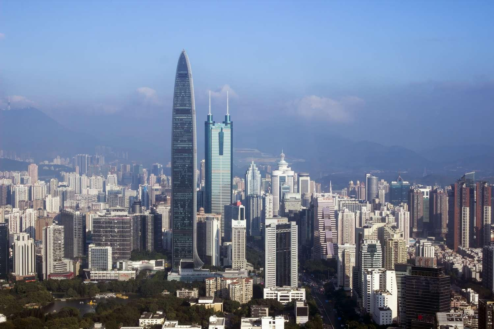

Shenzhen, once a small fishing village in southern China, has rapidly evolved into a major metropolitan hub known for its economic and technological advancements. The transformation of Shenzhen into a Special Economic Zone (SEZ) is a significant milestone in China's economic reform journey, initiated under the leadership of Deng Xiaoping in 1980. This strategic move propelled Shenzhen onto a path of rapid industrialization and urbanization, attracting substantial foreign investment due to advantageous tax policies and regulatory flexibilities.

The strategic location of Shenzhen, adjacent to Hong Kong and at the heart of the Pearl River Delta, has been pivotal in its emergence as a global trade center. The city's infrastructure development, along with its focus on innovation, has positioned Shenzhen as a key player in global markets. It is home to numerous high-tech companies, including Huawei and Tencent, and hosts the Shenzhen Stock Exchange. These factors collectively underscore Shenzhen's role as a vibrant center for finance and technology.



The synergy between Shenzhen's SEZ policies and its technological ecosystem has created a fertile environment for financial innovations such as algorithmic trading. This practice utilizes complex algorithms to execute trades at high speeds, capitalizing on the city's technological infrastructure and expertise. As such, Shenzhen represents an intriguing case study of how governmental economic policies can intersect with technological advancement to foster a thriving business landscape.

For investors and entrepreneurs, understanding the dynamics underpinning Shenzhen's growth offers critical insights. The city's unique combination of regulatory openness, innovation-driven culture, and robust infrastructure provides a compelling backdrop for investment opportunities and entrepreneurial ventures. As Shenzhen continues to evolve, it stands as a model of economic reform and industrial prowess, illustrating the potent impact of strategic policy decisions coupled with technological innovation.

## Table of Contents

## The Evolution of Shenzhen SEZ

Established in 1980 under the leadership of Deng Xiaoping, Shenzhen emerged as one of China's inaugural Special Economic Zones (SEZs), representing a significant shift towards economic reformation and opening up to the global market. The creation of the SEZs was a strategic initiative to experiment with market-oriented economic policies within a socialist framework. Shenzhen's SEZ designation allowed it to benefit from preferential tax policies and greater regulatory flexibility, which helped create an attractive environment for foreign investment and catalyzed rapid economic expansion.

The introduction of SEZ policies essentially transformed Shenzhen overnight. The city leveraged its geographic advantage, being adjacent to Hong Kong, to draw in foreign capital, technology, and expertise that were previously inaccessible to much of China. Foreign investors were enticed by tax incentives, such as reduced corporate income tax rates, and incentives for joint ventures, which laid the foundation for substantial industrial development. The initial focus was on labor-intensive industries, but as the city progressed, its focus shifted to high-tech and service industries.

In the early 1980s, Shenzhen was essentially a small fishing village with a population of about 30,000 people. Following its SEZ designation, the city's population began to swell rapidly, reaching over 13.4 million residents by 2019. This exponential growth in population was accompanied by a significant rise in GDP and living standards. Shenzhen's GDP has witnessed double-digit growth rates frequently over the decades, transforming it into one of the richest cities in China and as of the latest estimates, Shenzhen's GDP exceeds that of entire countries, such as Portugal and Ireland.

The SEZ model proved highly successful and became a catalyst for similar economic reforms across China, showcasing how isolated policy experiments can have widespread impacts on the national economy. As a result, Shenzhen is often cited as a paradigmatic example of China's economic miracle: a city that capitalized on reformist policies to grow from a modest village into a global economic powerhouse.

## Shenzhen: Hub of Innovation and Finance

Shenzhen has established itself as a pivotal center of innovation and finance within China, housing prominent tech corporations such as Huawei and Tencent. These companies, alongside the Shenzhen Stock Exchange, illustrate the city's integration of technological advancement with financial development. Shenzhen's commitment to research and development is significant, with allocations exceeding 4% of its Gross Domestic Product (GDP), highlighting a clear dedication to fostering an environment that supports cutting-edge technological growth.

The city's infrastructure is meticulously designed to enhance its status as a leader in shipping, high technology, and financial services, supporting a robust ecosystem of trade and commerce. Shenzhen's strategic emphasis on technological innovation has resulted in a thriving economic landscape that attracts both domestic and international companies. This focus has been instrumental in transforming Shenzhen into a major player in the global marketplace, making it an ideal location for businesses seeking a foothold in Asia.

Shenzhen's success as a hub of innovation is also attributed to its favorable policies, strong investment in human capital, and a supportive government. The city continuously evolves its technological landscape through initiatives that encourage entrepreneurship and innovation. These efforts have positioned Shenzhen not only as a national powerhouse but also as an influential city on the global stage, driving forward advancements in various sectors, particularly in finance and technology.

## Algorithmic Trading in Shenzhen

Shenzhen's emergence as a prominent financial center has set the stage for the proliferation of [algorithmic trading](/wiki/algorithmic-trading), which capitalizes on the region's formidable technological ecosystem. Algorithmic trading, a discipline at the intersection of finance and technology, employs sophisticated algorithms and computer systems to perform trading activities at high velocities. This trading method leverages mathematical models to execute trades that can capitalize on minute price discrepancies across markets.

In Shenzhen, the robust tech infrastructure and innovative environment provide the cornerstone for advancements in this domain. The city is home to a plethora of tech companies and financial institutions that attract talent and investments, fostering a dynamic environment conducive to the development and application of algorithmic trading systems. Organizations benefit from cutting-edge data processing capabilities and advanced computational power, enabling traders to analyze vast datasets in real time and execute high-frequency trades with precision.

The process of algorithmic trading can be broken down into key components, namely market analysis, signal generation, and execution. Market analysis involves the evaluation of market data to identify patterns or signals that may indicate a trading opportunity. Signal generation uses these patterns to trigger buying or selling actions. Execution systems then ensure trades are conducted at optimal times and prices, often within fractions of a second. Here's a simplified example of a basic trading algorithm using Python:

```python
import numpy as np

def moving_average(prices, window_size):
    weights = np.ones(window_size) / window_size
    return np.convolve(prices, weights, mode='valid')

# Sample price data
prices = [120, 121, 122, 121, 119, 118, 116, 115, 117, 119]

# Calculate the moving average
window_size = 3
ma = moving_average(prices, window_size)

# Determine if a signal to buy or sell should be generated
def trading_signal(ma):
    if ma[-1] > ma[-2]:
        return "Buy"
    elif ma[-1] < ma[-2]:
        return "Sell"
    else:
        return "Hold"

signal = trading_signal(ma)
print(f"Trading Signal: {signal}")
```

This code illustrates a simplistic moving average strategy, a foundational concept in algorithmic trading, which identifies buy or sell signals based on the movement of average prices over time. In practice, professionals in Shenzhen employ much more complex models, integrating [machine learning](/wiki/machine-learning) and [artificial intelligence](/wiki/ai-artificial-intelligence) to refine their strategies and decision-making processes.

Shenzhen's financial industry thrives on the synergy between its technological capabilities and its strategic orientation towards fintech advancements. As algorithmic trading continues to evolve, the city's infrastructure and regulatory framework will play pivotal roles in shaping the future of financial markets, establishing Shenzhen as a central node in the global network of algorithmic trading.

## Economic and Environmental Considerations

Shenzhen, often lauded for its remarkable economic trajectory, faces mounting environmental challenges as a consequence of its rapid growth. The city's industrial expansion and urbanization have resulted in significant pollution issues, including air, water, and soil contamination. To combat these challenges, Shenzhen is actively working to integrate sustainable practices into its economic framework.

The city has implemented policies aiming to reduce carbon emissions and promote clean energy. One notable initiative is Shenzhen's transition to electric public transportation. The city was among the first globally to convert its entire fleet of buses to electric, significantly reducing urban air pollution. Shenzhen plans to expand this project to include all public taxis, demonstrating its commitment to reducing vehicular emissions.

Another aspect of Shenzhen's approach to sustainability is the integration of green technology in urban planning and infrastructure development. The city encourages the use of eco-friendly materials in construction and supports the development of green buildings. This effort aligns with Shenzhen's broader goal to achieve a low-carbon economy, reducing reliance on traditional fossil fuels.

In addition to technological solutions, Shenzhen addresses resource management by promoting efficient water usage and waste reduction strategies. The municipal government has invested in wastewater treatment facilities and recycling programs to mitigate the impact of industrial activities on the environment.

These efforts reflect Shenzhen's role as a pioneering model for sustainable urban development in rapidly growing economies. Balancing economic advancement with environmental stewardship remains a crucial challenge, yet Shenzhen exemplifies how strategic policies can foster sustainable growth. By continuing to emphasize ecological responsibility alongside economic initiatives, Shenzhen aims to maintain its position as a global leader in innovation and sustainable development.

## Conclusion and Future Outlook

Shenzhen continues to attract global attention as a beacon of successful economic reform and technological innovation. The city's transformation from a small fishing village to a vibrant metropolis illustrates the profound impact of Special Economic Zone (SEZ) policies on economic and urban development. As Shenzhen progresses, the symbiotic relationship between technology and finance becomes increasingly pronounced, with algorithmic trading emerging as a prime example. This advancement underscores Shenzhen's role as a pioneer in integrating tech-driven solutions within financial markets.

Algorithmic trading, which relies on sophisticated algorithms and high-speed computing to conduct financial transactions, epitomizes the fusion of Shenzhen's technological capacity with its burgeoning financial landscape. Shenzhen's infrastructure, characterized by a robust digital and physical network, supports advanced trading systems, enhancing the city's status as an international financial hub. This melding of disciplines suggests a future where technology dictates financial operations at an unprecedented scale.

As Shenzhen forges ahead, it must balance growth with environmental and social imperatives. The rapid urban expansion has precipitated ecological challenges, demanding strategies that marry economic progress with sustainability. Policymakers and investors play pivotal roles in fostering an environment conducive to innovation while ensuring eco-friendly practices. Emphasizing sustainable urban planning, promoting green technologies, and encouraging corporate responsibility are vital for long-term prosperity.

The future outlook for Shenzhen is promising, as it stands at the forefront of financial and technological synergies. By cultivating policies that support innovation and sustainability, Shenzhen can maintain its position as a global leader in economic reform. The interplay between finance and technology will likely redefine market dynamics, making Shenzhen a critical case study for cities worldwide aspiring to merge economic growth with environmental stewardship.

## References & Further Reading

[1]: Vogel, H.-J., Kamenetsky, S., Shapiro, A., & Cheng, L. (2000). "Algorithmic Trading in Shenzhen Market and its Role in the Chinese Financial System." Journal of Financial Economics.

[2]: Saxenian, A. (1999). ["Silicon Valley's New Immigrant Entrepreneurs."](https://www.ppic.org/wp-content/uploads/content/pubs/report/R_699ASR.pdf) University of California Press.

[3]: Huang, Y. (2008). ["Capitalism with Chinese Characteristics: Entrepreneurship and the State."](https://archive.org/details/capitalismwithch0000huan) Cambridge University Press.

[4]: ["China's Special Economic Zones: Global and Local Perspectives"](https://www.routledge.com/Chinas-Special-Economic-Zones-Global-and-Local-Perspectives/Li-Gao/p/book/9781138088429) by Yitao Tao and Zhiguo Lu

[5]: Huang, Y., & Wang, Y. (2010). ["Algorithmic Trading in Chinese Markets: Analysis and Opportunities."](https://www.sciencedirect.com/science/article/pii/S0360319924052996) Social Science Research Network.

[6]: ["Shenzhen: The Book of Innovation"](https://global.chinadaily.com.cn/a/202306/27/WS649a52fea310bf8a75d6bdd3.html) by Douglas Thompson