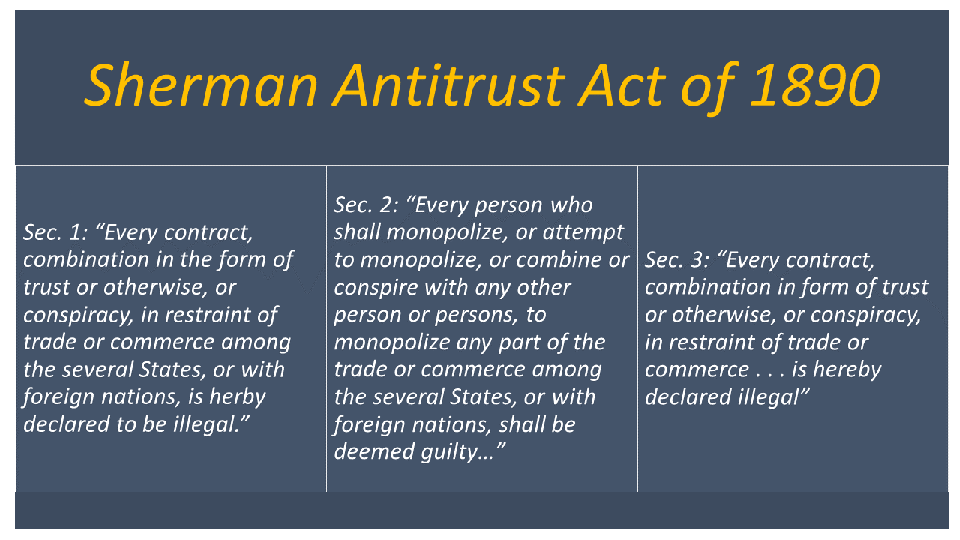

## Table of Contents

## What is the Sherman Antitrust Act?

The Sherman Antitrust Act is a law in the United States that was made to stop big companies from working together in ways that hurt smaller businesses and consumers. It was signed into law in 1890 by President Benjamin Harrison. The main goal of the act is to keep the market fair by stopping companies from doing things like setting prices together or dividing up markets so they don't have to compete.

The law has two main parts. The first part says that it's illegal for companies to work together to limit trade or competition. This means companies can't make secret deals to keep prices high or to keep other companies out of the market. The second part says it's illegal for one company to become too powerful and control a whole industry. This is called a monopoly. If a company gets too big, it might be broken up into smaller parts to make the market fair again.

The Sherman Antitrust Act is still used today to make sure businesses compete fairly. The government can take companies to court if they break the rules of the act. This helps keep prices fair for consumers and gives smaller businesses a chance to succeed. Over time, other laws like the Clayton Act and the Federal Trade Commission Act have been added to help enforce fair competition even more.

## When was the Sherman Antitrust Act passed?

The Sherman Antitrust Act was passed in 1890. It was signed into law by President Benjamin Harrison. The main reason for this law was to stop big companies from working together in ways that hurt smaller businesses and consumers. The act wanted to make sure that the market stayed fair.

The law has two main parts. The first part says that it's illegal for companies to work together to limit trade or competition. This means companies can't make secret deals to keep prices high or to keep other companies out of the market. The second part says it's illegal for one company to become too powerful and control a whole industry. This is called a monopoly. If a company gets too big, it might be broken up into smaller parts to make the market fair again.

## What are the main provisions of the Sherman Antitrust Act?

The Sherman Antitrust Act has two main parts that help keep the market fair. The first part says that it's not okay for companies to work together in ways that hurt competition. This means they can't make secret deals to keep prices high or stop other companies from selling their products. The goal is to make sure that businesses compete fairly and don't team up to control the market.

The second part of the act focuses on stopping one company from getting too big and powerful. If a company becomes a monopoly, meaning it controls a whole industry, it's breaking the law. The government can step in and break up the big company into smaller parts. This helps to make sure that other businesses have a chance to compete and that consumers have choices in the market.

These rules are still used today to make sure that businesses play fair. If a company breaks these rules, the government can take them to court. This helps keep prices fair for everyone and gives smaller businesses a chance to succeed.

## Why was the Sherman Antitrust Act created?

The Sherman Antitrust Act was created because people were worried about big companies working together in ways that hurt smaller businesses and consumers. Back in the late 1800s, some big companies were making secret deals to keep prices high and stop new businesses from starting. This was not fair to everyone else. So, the government made this law to stop these unfair practices and make sure that businesses had to compete fairly.

The main goal of the Sherman Antitrust Act was to keep the market open and fair for everyone. It wanted to stop companies from teaming up to control prices or divide up markets, which would hurt competition. It also wanted to stop one company from getting too big and powerful, which could lead to a monopoly. By breaking up these big companies, the law helped to make sure that smaller businesses had a chance to succeed and that consumers had choices in the market.

## How does the Sherman Antitrust Act define a monopoly?

The Sherman Antitrust Act defines a monopoly as when one company gets too big and powerful, controlling a whole industry. This means that the company can set prices however it wants and other businesses can't compete fairly. The act says that having a monopoly is illegal because it's not fair to other companies and consumers.

The law wants to make sure that the market stays open and fair for everyone. If a company becomes a monopoly, the government can take action. They might break up the big company into smaller parts so that other businesses have a chance to compete and consumers have more choices. This helps to keep prices fair and supports a healthy competition in the market.

## What are some early cases that tested the Sherman Antitrust Act?

One of the first big cases that tested the Sherman Antitrust Act was the United States v. E. C. Knight Company in 1895. The government tried to stop the American Sugar Refining Company from buying out other sugar companies. They thought this would make a monopoly. But the Supreme Court said that making sugar was not the same as trading it, so the Sherman Act didn't apply. This made it hard for the government to stop monopolies at first.

Another important early case was the Northern Securities Company case in 1904. This case was about a big railroad company that was trying to control all the railroads in the Northwest. President Theodore Roosevelt thought this was wrong and took the company to court. The Supreme Court agreed with him and said that the Northern Securities Company was breaking the Sherman Act. This was a big win for the government and showed that they could use the Sherman Act to stop big companies from taking over whole industries.

These early cases showed how hard it could be to use the Sherman Act, but they also set the stage for the government to keep fighting against unfair business practices. Over time, more cases helped to make the law stronger and clearer, so it could better protect fair competition in the market.

## How has the enforcement of the Sherman Antitrust Act evolved over time?

The enforcement of the Sherman Antitrust Act has changed a lot since it was first passed in 1890. At the beginning, it was hard for the government to use the law to stop big companies from making monopolies. The first big case, United States v. E. C. Knight Company, showed that the law had some limits. The Supreme Court said that making sugar was different from trading it, so the Sherman Act didn't apply. This made it tough for the government to stop companies from getting too big. But things started to change with the Northern Securities Company case in 1904. President Theodore Roosevelt used the Sherman Act to break up a big railroad company, and the Supreme Court agreed with him. This was a big win and showed that the government could use the law to fight against unfair business practices.

Over time, more cases helped to make the Sherman Act stronger and clearer. The government started to use the law more often to stop companies from working together to set prices or divide up markets. They also used it to break up big companies that were controlling whole industries. New laws like the Clayton Act and the Federal Trade Commission Act were added to help enforce fair competition even more. These laws made it easier for the government to stop unfair business practices before they got out of control. Today, the Sherman Act is still an important tool for keeping the market fair and making sure that businesses compete honestly.

## What is the difference between Section 1 and Section 2 of the Sherman Antitrust Act?

Section 1 of the Sherman Antitrust Act focuses on stopping companies from working together in ways that hurt competition. It says that it's illegal for companies to make deals to set prices high or to keep other companies out of the market. This is to make sure that businesses compete fairly and don't team up to control the market. If companies do this, it's called a conspiracy or a cartel, and the government can take them to court to stop it.

Section 2 of the Sherman Antitrust Act is about stopping one company from getting too big and powerful. It says that it's illegal for a company to become a monopoly, which means controlling a whole industry. If a company gets too big, it might set prices however it wants and stop other businesses from competing fairly. The government can break up these big companies into smaller parts to make the market fair again. This helps smaller businesses have a chance to succeed and keeps prices fair for consumers.

## Can you explain the 'rule of reason' in relation to the Sherman Antitrust Act?

The 'rule of reason' is a way the courts use to decide if something breaks Section 1 of the Sherman Antitrust Act. Instead of saying that all agreements between companies are bad, the rule of reason looks at the whole situation. It checks if the agreement helps or hurts competition. If an agreement helps competition more than it hurts it, it might be okay. This rule started with a big case called Standard Oil Co. of New Jersey v. United States in 1911. The court said that not all agreements are bad if they are reasonable and don't hurt the market too much.

This rule is important because it makes the law more fair. It means that the government can't just say that any agreement between companies is illegal. They have to look at the details and see if it really hurts competition. For example, if two small companies agree to work together to compete better against a big company, that might be okay under the rule of reason. But if companies are working together just to keep prices high, that would not be okay. The rule of reason helps make sure that the Sherman Antitrust Act is used in a way that is fair and helps keep the market open for everyone.

## How has the Sherman Antitrust Act impacted modern business practices?

The Sherman Antitrust Act has had a big impact on how businesses work today. It makes sure that companies can't team up to set high prices or keep other businesses out of the market. This means that businesses have to compete fairly with each other. If companies try to make secret deals, the government can take them to court and stop them. This helps to keep prices fair for everyone and gives smaller businesses a chance to succeed. Because of the Sherman Act, companies know they have to play by the rules or face big problems.

The law also stops one company from getting too big and controlling a whole industry. If a company becomes a monopoly, the government can break it up into smaller parts. This helps to make sure that other businesses can compete and that consumers have choices. Over time, other laws like the Clayton Act and the Federal Trade Commission Act have been added to help enforce fair competition even more. Today, the Sherman Act is still an important tool for keeping the market fair and making sure that businesses compete honestly.

## What are the criticisms and limitations of the Sherman Antitrust Act?

Some people think the Sherman Antitrust Act has problems. One big problem is that it can be hard to decide what counts as a monopoly or unfair competition. The law uses a "rule of reason" to look at each case, but this can make things confusing. It means that some companies might get away with bad behavior if they can argue that their actions help competition in some way. Another criticism is that the law can be slow to act. By the time the government takes a company to court and wins, the damage to competition might already be done. This can make it hard to stop big companies from hurting smaller ones or consumers.

Another limitation is that the Sherman Act mostly focuses on stopping big problems after they happen, rather than preventing them in the first place. It's like trying to fix a broken window after it's already smashed, instead of stopping someone from throwing a rock at it. This means that smaller, sneaky actions by companies might go unnoticed until they grow into bigger issues. Also, some people say that the government doesn't always use the law the same way for every case. This can make businesses unsure about what they can and can't do, which might stop them from trying new things or growing.

## How does the Sherman Antitrust Act interact with other antitrust laws and international regulations?

The Sherman Antitrust Act works together with other laws in the United States to keep the market fair. One important law is the Clayton Act, which was passed in 1914. The Clayton Act makes it easier for the government to stop unfair business practices before they become big problems. It also helps to protect smaller businesses from being hurt by big companies. Another law is the Federal Trade Commission Act, which set up the Federal Trade Commission (FTC). The FTC helps to enforce the Sherman Act and other antitrust laws by watching over businesses and stopping them from doing things that hurt competition. Together, these laws make sure that businesses have to compete fairly and can't team up to control prices or markets.

The Sherman Antitrust Act also has to work with international laws and regulations. Many countries have their own antitrust laws, and they work together to stop big companies from hurting competition around the world. For example, the European Union has strong antitrust rules that are similar to the Sherman Act. If a company breaks these rules in the EU, it can be punished there, even if it's based in the United States. The U.S. and other countries often share information and work together on big cases to make sure that businesses can't get away with unfair practices just by moving to a different country. This helps to keep the global market fair for everyone.

## References & Further Reading

[1]: Kovacic, W. E. (2007). ["The Intellectual DNA of Modern U.S. Competition Law for Dominant Firm Conduct: The Chicago/Harvard Double Helix."](https://journals.library.columbia.edu/index.php/CBLR/article/view/2969) Columbia Business Law Review.

[2]: ["The Antitrust Revolution: Economics, Competition, and Policy"](https://www.amazon.com/Antitrust-Revolution-Economics-Competition-Policy/dp/0190668830) by John E. Kwoka Jr. and Lawrence J. White

[3]: Boudreaux, D. J. (2018). ["The Real Impact of the Sherman Antitrust Act."](https://scholar.google.com/citations?user=gEsbWZwAAAAJ&hl=en) The Mercatus Center at George Mason University.

[4]: Stigler, G. J. (1985). ["The Origin of the Sherman Act."](https://www.jstor.org/stable/724314) The Journal of Legal Studies, 14(1), 1-12.

[5]: ["Antitrust Law in Perspective: Cases, Concepts, and Problems in Competition Policy"](https://www.amazon.com/Antitrust-Law-Perspective-Concepts-Competition/dp/0314266054) by Andrew I. Gavil, William E. Kovacic, and Jonathan B. Baker