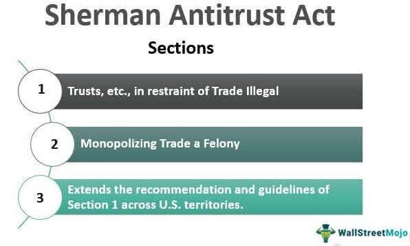

The Sherman Antitrust Act signifies a crucial advancement in legislative efforts designed to eliminate anti-competitive behavior. Enacted in 1890, this law laid the foundation for antitrust regulation aimed at maintaining market competitiveness within the United States. By targeting trade restrictions and curbing monopolistic business structures, the Act was instrumental in shaping fair and open markets. This article examines the importance of the Sherman Antitrust Act, the broader framework of antitrust legislation, and how these principles integrate with competition policy in the rapidly evolving domain of algorithmic trading.

## Table of Contents

## Understanding the Sherman Antitrust Act

The Sherman Antitrust Act, enacted in 1890, marked a significant moment in U.S. legislative history by targeting business practices that could harm market competition. This groundbreaking legislation was introduced to address issues arising from the growing dominance of large corporations and their monopolistic tendencies. It serves as the foundation for U.S. antitrust laws, aimed at curbing anti-competitive behavior, protecting consumers, and promoting fair market competition.

The Act's primary provisions focus on prohibiting monopolies, cartels, and any anti-competitive agreements that restrict trade or manipulate markets. Section 1 of the Act explicitly states that any contract, combination, or conspiracy that unduly restrains interstate or international trade is illegal. This includes various agreements between businesses that could lead to price-fixing or market allocation schemes.

Section 2 of the Sherman Act specifically addresses the issue of monopolization. It makes it unlawful to monopolize or attempt to monopolize any part of trade or commerce in the United States. The Act targets not only the existence of a monopoly but also the strategies used by firms to achieve or maintain such market dominance, highlighting practices like predatory pricing and exclusive dealing contracts.

The introduction of the Sherman Antitrust Act was largely driven by the efforts of Senator John Sherman, who recognized the detrimental effects that large corporate entities could have on the market. Sherman believed in the necessity of preserving competition as a means to protect consumers and ensure a dynamic and innovative economic environment. His concern was that unchecked corporate power could lead to exploitation, reduced consumer choices, and stifled innovation.

The enforcement of the Sherman Antitrust Act has been instrumental in breaking up major monopolies throughout history. Notable cases include the dissolution of Standard Oil in 1911 and the breakup of AT&T in the 1980s. These actions underscored the federal government's commitment to maintaining competitive markets.

Overall, the Sherman Antitrust Act set a precedent for future antitrust legislation and litigation. It laid the groundwork for subsequent laws, such as the Clayton Antitrust Act and the Federal Trade Commission Act, which further refined and expanded the legal tools available to combat anti-competitive practices. As markets evolved, especially with the advent of digital technology, the principles established by the Sherman Act continued to influence regulatory approaches to ensure businesses operate within competitive and fair environments.

## The Role and Impact of Antitrust Laws

Antitrust laws, including the Sherman Antitrust Act, are fundamental tools in promoting and maintaining competitive markets. These laws are essential for preventing monopolistic practices that can harm consumers and stifle innovation. By targeting anti-competitive behavior such as price fixing, market division, and unfair mergers, antitrust laws ensure that businesses compete on a level playing field.

The primary objective of antitrust laws is to safeguard consumer interests by offering more choices and better prices. In a monopolistic market, a single entity can control prices and output, reducing consumer welfare. By curbing these practices, antitrust laws help maintain a dynamic marketplace where innovation can thrive. For example, prohibiting anti-competitive mergers can prevent a reduction in market competitors, thereby preserving the diversity of products and services available to consumers.

Moreover, antitrust laws play a critical role in stimulating economic efficiency. When firms are driven to compete rather than collude, they are more likely to invest in new technologies and improve their products or services. This competition not only benefits consumers but also contributes to economic growth.

The legal framework established by antitrust laws is crucial for adapting to evolving market conditions. As industries change and new risks emerge, such as those associated with digital platforms and technology-driven markets, antitrust laws need to be flexible and robust enough to address these challenges. In recent years, there has been increasing scrutiny of technological giants whose market behaviors may hinder competition due to their sheer size and influence. This underscores the significant role antitrust laws play in the modern economy, ensuring that competitive equity is upheld even as market dynamics shift.

In summary, the impact of antitrust laws extends beyond preventing monopolies and anti-competitive practices. They are pivotal in maintaining an open economic environment conducive to innovation and consumer choice, adapting to the ever-changing landscape of global markets.

## Competition Policy within the Modern Economy

Competition policy encompasses regulations aimed at promoting market competition and preventing anti-competitive behavior. These policies are essential in ensuring that businesses engage in fair competition, thereby safeguarding consumer interests and fostering innovation. As the global economy becomes increasingly digital, the significance of effective competition policy has never been more pronounced.

In today's digital economy, competition policy plays a critical role in monitoring technological giants. Companies such as Google, Amazon, and Facebook hold significant market power, raising concerns about monopolistic tendencies and anti-competitive practices. The rapid growth and dominance of these entities necessitate rigorous scrutiny and regulation to prevent abuses of market power that could harm consumers and stifle innovation.

Digital markets present unique challenges that traditional competition policy must adapt to address. The nature of digital goods and services, such as the prevalence of network effects and economies of scale, can create barriers to entry for new competitors. These characteristics necessitate a nuanced approach to regulation, ensuring that new and innovative businesses can compete on a level playing field.

Moreover, the increased role of technology in trading, particularly through digital marketplaces, presents additional complexities for competition policy. Online platforms often function as gatekeepers, controlling access to vast amounts of data and consumer attention. Consequently, competition policy must address issues related to data privacy, platform neutrality, and the equitable treatment of different market participants.

Adapting competition policy to these shifts requires a dynamic and forward-thinking approach. Regulators must continuously assess and revise their strategies to account for the evolving nature of digital markets and the technologies that drive them. This necessitates international cooperation and the sharing of best practices, as digital markets often transcend national boundaries.

In summary, competition policy within the modern economy is vital for maintaining fair and open markets. By effectively addressing the challenges posed by digital marketplaces and the growing influence of technology, these policies can safeguard consumer interests, promote innovation, and ensure that the benefits of the digital economy are widely shared.

## Algorithmic Trading and Competition Policy

Algorithmic trading is a transformative force in financial markets that leverages complex algorithms to execute trades with remarkable speed and precision. This technological advancement in trading methodologies has introduced significant challenges and opportunities for competition policy.

Algorithmic trading has fundamentally altered market dynamics by providing the ability to process vast amounts of data and execute trades in fractions of a second. This capability can lead to more efficient markets through enhanced [liquidity](/wiki/liquidity-risk-premium) and narrowed bid-ask spreads. However, it also presents the risk of market manipulation and unfair competitive practices. Flash crashes, as seen in the event of May 6, 2010, exemplify the potential disruptive consequences of [algorithmic trading](/wiki/algorithmic-trading), necessitating careful regulation to maintain market stability and fairness.

The primary challenge for regulators is to develop frameworks that both nurture innovation and mitigate risks associated with algorithmic trading. This requires comprehensive monitoring of trading activities and the implementation of safeguards to prevent market abuse. Techniques such as real-time surveillance systems and the use of circuit breakers are instruments considered to manage the rapid trading activities effectively.

Regulatory bodies must also address the competitive inequities that may arise from high-frequency trading ([HFT](/wiki/high-frequency-trading-strategies)). Firms with superior technology or data access could gain unprecedented advantages, potentially edging out smaller competitors. Therefore, policies need to ensure a level playing field, where access to high-speed trading infrastructure and data is not disproportionately skewed toward a select few.

Furthermore, competition policy must evolve to address the complexities introduced by algorithmic trading. This involves revisiting traditional antitrust concepts to include new forms of market power and concentration that might be exerted through technological dominance in trading systems. Collaborative efforts between regulators and industry experts are crucial to understanding and mitigating the unique risks posed by these modern trading practices.

In summary, algorithmic trading exemplifies the fine balance that competition policy must strike between fostering technological innovation and safeguarding market integrity. Regulators are tasked with crafting policies that prevent anti-competitive practices while accommodating the innovative potential of automated trading systems. Ensuring this balance is vital for maintaining competitive equity in the continually evolving landscape of the financial markets.

## Conclusion

The Sherman Antitrust Act continues to play a fundamental role in shaping U.S. competition policy, even as digital markets and algorithmic trading redefine traditional market boundaries. Historically focused on combating monopolies and ensuring competitive practices, antitrust laws now serve as crucial instruments in a rapidly evolving economic landscape, characterized by significant technological advancements. In this context, a robust integration of these laws with adaptive competition policies is essential to maintain fair play and foster innovation. This integration ensures that as market landscapes transform due to digitalization and algorithmic advancements, core principles of market competition such as transparency, choice, and consumer protection are not compromised.

Technological advancements, notably in algorithmic trading, present both opportunities for market efficiency and risks of market dominance by technologically adept firms. Algorithmic trading, through its high-speed and data-driven approach, can enhance market liquidity and accuracy, yet also poses challenges in terms of unequal competitive practices, such as flash crashes or market manipulation through coordinated algorithmic strategies.

Ongoing vigilance by regulatory bodies is crucial to address these challenges. Strategic regulation, which remains flexible yet firm, will be necessary to oversee and manage this intricate balance. Effective antitrust enforcement will rely on innovative regulatory frameworks capable of analyzing and reacting to the complexities of modern economics. Such frameworks should account for factors unique to digital markets, including network effects, data monopolies, and the pivotal role algorithms play in shaping market dynamics.

To uphold principles of competitive equity, it is important for modern antitrust and competition policies to evolve in tandem with technological changes. The goal is to prevent anti-competitive behavior without stifling innovation. Antitrust authorities must continue to adopt advanced analytical tools and methodologies that reflect the unique conditions of digital and algorithm-driven markets. By doing so, they can better ensure that these markets remain competitive and equitable for all participants.

As economic landscapes continue to shift, strategic regulation and the vigilant application of antitrust laws will be essential to preserving the competitive spirit that has been central to economic progress and consumer welfare. These efforts will help to safeguard against new forms of market power that may arise in a technology-driven future, ensuring that innovation and competition continue to thrive.

## References & Further Reading

[1]: Kovacic, W. E. (2007). ["The Intellectual DNA of Modern U.S. Competition Law for Dominant Firm Conduct: The Chicago/Harvard Double Helix."](https://journals.library.columbia.edu/index.php/CBLR/article/view/2969) Columbia Business Law Review.

[2]: ["The Antitrust Revolution: Economics, Competition, and Policy"](https://www.amazon.com/Antitrust-Revolution-Economics-Competition-Policy/dp/0190668830) by John E. Kwoka Jr. and Lawrence J. White

[3]: Boudreaux, D. J. (2018). ["The Real Impact of the Sherman Antitrust Act."](https://scholar.google.com/citations?user=gEsbWZwAAAAJ&hl=en) The Mercatus Center at George Mason University.

[4]: Stigler, G. J. (1985). ["The Origin of the Sherman Act."](https://www.jstor.org/stable/724314) The Journal of Legal Studies, 14(1), 1-12.

[5]: ["Antitrust Law in Perspective: Cases, Concepts, and Problems in Competition Policy"](https://www.amazon.com/Antitrust-Law-Perspective-Concepts-Competition/dp/0314266054) by Andrew I. Gavil, William E. Kovacic, and Jonathan B. Baker