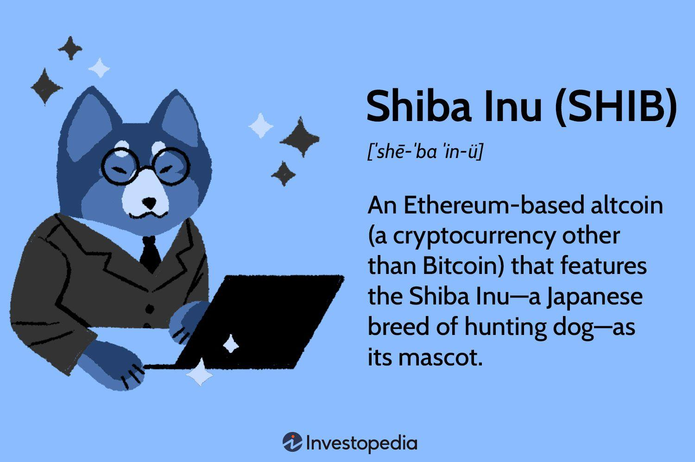

## Table of Contents

## What is Shiba Inu (SHIB) and its origin story?

Shiba Inu, often called SHIB, is a type of cryptocurrency that started in August 2020. It was created by someone who uses the name "Ryoshi." SHIB is known for its cute logo of a Shiba Inu dog, which is a popular breed in Japan. The idea behind SHIB was to make a fun and community-driven cryptocurrency. It was inspired by Dogecoin, another cryptocurrency with a dog logo. People who like SHIB call themselves the "SHIB Army."

The story of how SHIB began is interesting. Ryoshi, the creator, decided to make SHIB after seeing the success of Dogecoin. He wanted to create a coin that could be used for everyday things and have a strong community behind it. To start, Ryoshi sent half of all the SHIB coins to Ethereum's creator, Vitalik Buterin, as a way to show that SHIB was not just about making money. Vitalik later donated most of those coins to help people during the Covid-19 crisis in India. Since then, SHIB has grown a lot and even created its own projects like a decentralized exchange called ShibaSwap.

## How does Shiba Inu (SHIB) differ from other cryptocurrencies like Bitcoin and Ethereum?

Shiba Inu (SHIB) is different from Bitcoin and Ethereum in many ways. First, SHIB was made as a fun and community-focused cryptocurrency. It started as a joke, inspired by Dogecoin, which also has a dog logo. Unlike Bitcoin, which is often seen as a serious investment, SHIB is more about having fun and building a community. People who like SHIB call themselves the "SHIB Army" and work together on different projects. Bitcoin, on the other hand, is more focused on being a store of value and a way to pay for things without banks.

Another big difference is how SHIB was created and distributed. When SHIB started, half of all the coins were sent to Ethereum's creator, Vitalik Buterin, to show that SHIB was not just about making money. This is very different from Bitcoin, which has a fixed supply that is slowly released over time. Ethereum, too, has a different approach to its supply. SHIB also has its own platform called ShibaSwap, where people can trade SHIB and other tokens. This is different from Bitcoin, which doesn't have its own trading platform, and Ethereum, which has many different platforms built on it.

## What are the key features of Shiba Inu (SHIB) that attract investors?

One of the main things that attract investors to Shiba Inu (SHIB) is its strong community. People who like SHIB call themselves the "SHIB Army" and work together on different projects. This community spirit makes SHIB feel like more than just a [cryptocurrency](/wiki/cryptocurrency); it's like being part of a big group of friends. Investors like this because it can help the value of SHIB grow as more people get involved and support it.

Another key feature is that SHIB is very easy to buy and trade. It's available on many big cryptocurrency exchanges, which makes it simple for anyone to get SHIB. Plus, SHIB has its own platform called ShibaSwap where people can trade SHIB and other tokens. This makes it easier for investors to use SHIB for different things, like trading or even using it in games and apps. The fact that SHIB is easy to use and has many ways to be involved is a big reason why investors are interested in it.

## How can someone buy and store Shiba Inu (SHIB)?

To buy Shiba Inu (SHIB), you first need to choose a place to buy it from. There are many big websites called cryptocurrency exchanges where you can buy SHIB. Some popular ones are Binance, Coinbase, and KuCoin. You need to sign up for an account on one of these websites, and then you can use money from your bank to buy SHIB. Once you have SHIB, you can keep it on the exchange, but it's safer to move it to a wallet.

To store SHIB safely, you need a wallet that works with the Ethereum network because SHIB is built on Ethereum. There are two main types of wallets: hot wallets and cold wallets. Hot wallets are online and easy to use, like MetaMask or Trust Wallet. Cold wallets are offline and more secure, like Ledger or Trezor. To move your SHIB to a wallet, you need to send it from the exchange to your wallet's address. Always make sure you have the right address before you send your SHIB, or you might lose it.

## What role does the Shiba Inu ecosystem, including Shibaswap, play in the cryptocurrency's function?

The Shiba Inu ecosystem, including Shibaswap, is really important for making SHIB useful and fun. Shibaswap is like a special store where people can trade SHIB and other tokens. It's part of what makes the SHIB community so strong because it gives people a place to come together and do things with their SHIB. Besides trading, Shibaswap also lets people earn more SHIB by locking up their tokens in something called "staking." This makes people want to hold onto their SHIB instead of selling it, which can help keep the price steady.

The ecosystem also includes other projects like SHIB: The Metaverse, which is a virtual world where people can use SHIB to buy things and have fun. There's also a charity project called SHIBOSHIS, where people can donate SHIB to help others. All these parts work together to make SHIB more than just a cryptocurrency. They give people lots of ways to use SHIB, which makes it more interesting and valuable. By having all these different things to do, the Shiba Inu ecosystem helps keep people excited about SHIB and keeps the community growing.

## What are the potential risks and rewards of investing in Shiba Inu (SHIB)?

Investing in Shiba Inu (SHIB) can be exciting but also risky. One big risk is that SHIB's price can go up and down a lot. This is because SHIB is what people call a "meme coin," which means its value can change a lot based on what people are talking about online. If fewer people are interested in SHIB, its price can drop quickly. Another risk is that SHIB is not as well-known or trusted as bigger cryptocurrencies like Bitcoin or Ethereum. This can make it harder to use SHIB to buy things or trade it on some websites. Also, since SHIB is new, there might be more chances for people to try to trick others with scams or fake projects.

On the other hand, there are also big rewards that can come from investing in SHIB. If more people start to like and use SHIB, its price can go up a lot. This is what happened before when SHIB became very popular online. The strong community around SHIB, called the "SHIB Army," can also help make the coin more valuable by working on new projects and ways to use SHIB. Another reward is that SHIB can be fun to invest in because it's part of a big, friendly group of people who are excited about the coin. If you like being part of a community and trying new things, SHIB might be a good choice for you.

## How has the market performance of Shiba Inu (SHIB) been historically?

Shiba Inu (SHIB) has had a wild ride since it started in August 2020. At first, not many people knew about SHIB, so its price was very low. But then, in early 2021, SHIB started to get a lot of attention online. People started talking about it a lot, and its price went up really fast. By May 2021, SHIB reached its highest price ever, which was a huge jump from where it started. This big increase made a lot of people excited about SHIB and made them want to buy it.

After that big jump, SHIB's price went up and down a lot. Sometimes it would go up a bit, and other times it would drop. This is pretty normal for a cryptocurrency like SHIB that a lot of people talk about online. Even though its price has gone down from its highest point, SHIB is still more valuable than when it started. A lot of people are still interested in SHIB because of its fun community and the new projects they keep working on. So, even though SHIB's price can be hard to predict, it has definitely made a big mark in the world of cryptocurrencies.

## What are the future developments and roadmaps for Shiba Inu (SHIB)?

The Shiba Inu team has big plans for the future. They want to make SHIB more useful and fun for everyone. One of the main things they're working on is SHIB: The Metaverse. This is a big virtual world where people can use SHIB to buy things and have adventures. They also want to make more games and apps where SHIB can be used. Another big project is called Shibarium, which is a special platform that will make SHIB faster and cheaper to use. These new projects will help SHIB grow and become more than just a cryptocurrency.

The team also wants to keep the SHIB community strong and happy. They're always coming up with new ideas and ways for people to get involved. For example, they have a charity project called SHIBOSHIS where people can donate SHIB to help others. They also want to make it easier for people to use SHIB to buy things in the real world. By working on all these different things, the Shiba Inu team hopes to keep people excited about SHIB and make it a big part of the future of money and fun.

## How does Shiba Inu (SHIB) contribute to or participate in decentralized finance (DeFi)?

Shiba Inu (SHIB) plays a big role in decentralized finance, or DeFi, by giving people new ways to use their money without banks. One of the main ways SHIB does this is through Shibaswap, which is like a special store where people can trade SHIB and other tokens. On Shibaswap, people can also earn more SHIB by locking up their tokens in something called "staking." This is a big part of DeFi because it lets people make money from their SHIB without needing a bank or other middleman. By doing this, SHIB helps make the world of money more open and fair for everyone.

Another way SHIB is involved in DeFi is through a project called Shibarium. Shibarium is a special platform that will make SHIB faster and cheaper to use. This is important for DeFi because it means more people can use SHIB for things like trading or lending money. Shibarium will also help connect SHIB with other DeFi projects, making it easier for people to use SHIB in lots of different ways. By working on these projects, SHIB is helping to build a future where people have more control over their money and can use it in new and exciting ways.

## What is the community and cultural impact of Shiba Inu (SHIB)?

Shiba Inu (SHIB) has created a big and lively community called the "SHIB Army." This community is full of people who love SHIB and want to help it grow. They work together on different projects and share ideas online. The SHIB Army is known for being friendly and welcoming, which makes people feel good about being part of it. This strong community spirit has helped SHIB become more than just a cryptocurrency; it's like being part of a big, fun club. People in the community often help each other out and celebrate when SHIB does well, which keeps everyone excited and involved.

The cultural impact of SHIB goes beyond just the cryptocurrency world. SHIB has become a symbol of fun and creativity in the world of money. It shows that money can be more than just serious business; it can also be something that brings people together and makes them happy. SHIB's cute Shiba Inu dog logo and its fun projects, like SHIB: The Metaverse and charity work, have caught the attention of people all over the world. This has helped spread the idea that cryptocurrencies can be used for good and can be a part of everyday life. By doing this, SHIB has changed the way some people think about money and has made the world of finance a little more exciting and inclusive.

## How does Shiba Inu (SHIB) address scalability and transaction speed compared to other cryptocurrencies?

Shiba Inu (SHIB) is working on a project called Shibarium to make its transactions faster and cheaper. Right now, SHIB uses the Ethereum network, which can sometimes be slow and expensive. Shibarium will be a special platform that helps SHIB work better by making it easier to handle lots of transactions at once. This is important because it means more people can use SHIB without waiting a long time or paying a lot of money. By doing this, SHIB is trying to solve some of the big problems that other cryptocurrencies like Bitcoin and Ethereum also face.

Compared to other cryptocurrencies, SHIB is still catching up in terms of scalability and speed. Bitcoin, for example, can only handle a few transactions per second, which can make it slow during busy times. Ethereum is a bit better but can still get expensive and slow when a lot of people are using it. SHIB, by working on Shibarium, is trying to be faster and cheaper than both of these. This could make SHIB more useful for everyday things like buying stuff or playing games. But until Shibarium is ready, SHIB still faces the same challenges as other cryptocurrencies built on Ethereum.

## What are the expert analyses and predictions for the long-term viability of Shiba Inu (SHIB)?

Experts have different opinions about the long-term future of Shiba Inu (SHIB). Some think SHIB could do well because it has a strong community and keeps coming up with new projects. They say that if SHIB keeps growing its ecosystem, like with Shibarium and SHIB: The Metaverse, it could become more useful and valuable. These experts believe that SHIB's fun and friendly vibe could help it stay popular and attract more people to use it for different things.

On the other hand, some experts are not so sure about SHIB's future. They worry that SHIB is too much like a "meme coin," which means its price can go up and down a lot based on what people are talking about online. These experts think that SHIB might not be as stable or trustworthy as bigger cryptocurrencies like Bitcoin or Ethereum. They also point out that SHIB needs to keep working on making its transactions faster and cheaper to really compete with other cryptocurrencies in the long run.

## References & Further Reading

[1]: ["Algorithms for Hyper-Parameter Optimization"](https://dl.acm.org/doi/10.5555/2986459.2986743) by Bergstra, J., Bardenet, R., Bengio, Y., & Kégl, B. (2011), Advances in Neural Information Processing Systems 24.

[2]: ["Advances in Financial Machine Learning"](https://www.amazon.com/Advances-Financial-Machine-Learning-Marcos/dp/1119482089) by Marcos Lopez de Prado.

[3]: ["Evidence-Based Technical Analysis"](https://www.amazon.com/Evidence-Based-Technical-Analysis-Scientific-Statistical/dp/0470008741) by David Aronson.

[4]: ["Machine Learning for Algorithmic Trading"](https://github.com/PacktPublishing/Machine-Learning-for-Algorithmic-Trading-Second-Edition) by Stefan Jansen.

[5]: ["Quantitative Trading: How to Build Your Own Algorithmic Trading Business"](https://books.google.com/books/about/Quantitative_Trading.html?id=j70yEAAAQBAJ) by Ernest P. Chan.