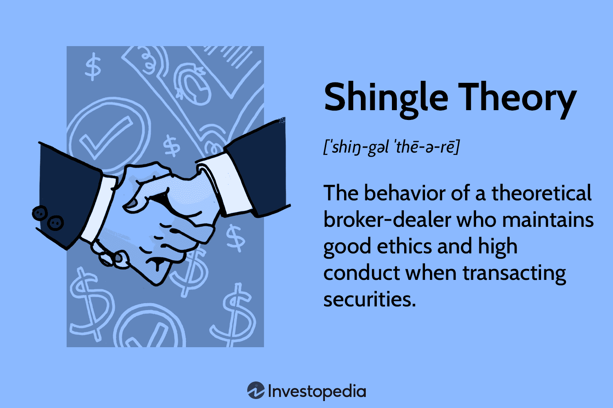

In the fast-paced world of financial markets, the intersection of technology and trading strategies plays a crucial role. Algorithmic trading, a method that uses algorithms to automate trading decisions, has become a cornerstone of modern trading. These algorithms help traders and firms execute transactions at speeds and frequencies that a human trader cannot manage.

In recent years, the quest for more effective and efficient trading strategies has led to the exploration of innovative concepts. One such concept that has gained traction is the Shingle Theory. Originally developed for purposes such as document similarity detection, Shingle Theory involves breaking down data into overlapping subsets, or 'shingles'. This method aids in identifying patterns within extensive datasets, which might be challenging to detect through simple observation.



Understanding the importance of Shingle Theory in algorithmic trading can provide traders with a competitive edge. By leveraging this technique, traders can dissect complex market data into smaller, manageable pieces, allowing for the identification of subtle trends and anomalies. This analytic capability can significantly enhance trading strategies, offering insights beyond the reach of conventional methods.

This article examines the essence of Shingle Theory, exploring its role, benefits, and challenges within algorithmic trading. By investigating its significance, applications, and the potential it holds for future advancements, traders and technologists can better understand how to harness this innovative concept to thrive in the dynamic financial market landscape.

## Table of Contents

## Understanding Shingle Theory

Shingle Theory is a data analysis technique that involves segmenting data into smaller, overlapping subsets known as "shingles." This method was initially developed for the purpose of document similarity detection, where it helps in identifying patterns and similarities across different textual datasets. The core idea is to break down a document or data stream into fixed-length substrings, or shingles. These shingles capture the contextual flow of the document, enabling comparison with other documents based on shared shingles.

Traditionally, the shingle size is determined depending on the desired level of granularity and the specific application context. For instance, a shingle size of three might mean breaking a document into substrings of three characters or words. This allows for the analysis of overlapping segments, providing a robust way to compare differing texts or data sequences despite potential variations in length or structure.

### Shingle Theory in Financial Markets

In financial markets, Shingle Theory can be applied to dissect complex market data into more manageable and analyzable pieces. For traders, this means converting streams of numerical data, such as stock prices or trading volumes, into overlapping windows of data that reflect recent market behaviors and trends. By splitting market data into shingles, analysts can focus on recent trends while maintaining a historical context.

Consider a trading scenario where a data stream of stock prices is translated into shingles. Each shingle can cover prices over a specific time frame, such as a week or a month, with a certain overlap between them. This overlapping nature ensures that the transformation retains valuable temporal correlations and patterns that might be lost with other segmentation methods.

### Detecting Trends and Anomalies

Using shingles to analyze market data allows traders to spot trends, such as upward or downward stock movements, and identify anomalies that might indicate market [volatility](/wiki/volatility-trading-strategies) or investment opportunities. For example, by looking at the frequency and variation of certain patterns within shingles, traders can predict significant changes in stock behavior, such as shifts in [momentum](/wiki/momentum) or unexpected spikes in trading [volume](/wiki/volume-trading-strategy).

The application of Shingle Theory in trading algorithms is primarily to enhance pattern recognition and trend detection capabilities. Traders can implement algorithms that aggregate shingle patterns over time, deriving actionable insights from the frequency and distribution of these patterns. This not only facilitates more nuanced market predictions but also aids in gaining a strategic advantage by reacting promptly to emerging trends. 

Consequently, Shingle Theory provides a methodological approach to parsing raw data into actionable insights, thus playing an integral role in improving decision-making processes within [algorithmic trading](/wiki/algorithmic-trading).

## The Role of Shingle Theory in Algorithmic Trading

Algorithmic trading relies on the rapid analysis and processing of substantial data volumes to execute trades effectively. Shingle Theory presents a powerful framework for simplifying and parsing these complex datasets. By using shingles, data is divided into overlapping subsets, which are then analyzed to recognize and interpret patterns in market behavior with greater precision.

The application of shingles allows trading algorithms to segment continuous data streams, such as price changes or transaction volumes, into discrete, overlapping sections. This segmentation helps in identifying local patterns and trends that are significant in making trading decisions. For instance, a trading algorithm might break down a time series of stock prices into overlapping five-minute intervals (shingles) to detect short-term trends or price reversals.

Real-world implementations of Shingle Theory in trading algorithms have shown tangible benefits. One example involves using shingles to process historical price data, enabling the identification of candlestick patterns that predict future price movements. By analyzing the frequency and distribution of these patterns within the shingles, algorithms can be trained to anticipate bullish or bearish trends more accurately.

Moreover, Shingle Theory enhances decision-making efficiency by reducing the complexity of dataset analysis. Algorithms that utilize shingles can achieve faster processing speeds, as they focus only on relevant data segments rather than entire datasets. This targeted approach allows for quicker response times to market changes, which is crucial in high-frequency trading environments.

The processing of shingles can be implemented using straightforward Python code, where pandas and numpy libraries facilitate data manipulation. Consider this illustrative snippet:

```python
import pandas as pd
import numpy as np

# Example dataframe of market data with a price column
data = pd.DataFrame({'price': np.random.random(1000)})

# Function to create shingles of specified width
def create_shingles(data, shingle_width):
    return [data.iloc[i:i + shingle_width].copy() for i in range(len(data) - shingle_width + 1)]

shingle_width = 10
shingles = create_shingles(data['price'], shingle_width)

# Example operation on each shingle
for shingle in shingles:
    pattern = shingle.mean()  # Simple pattern recognition (e.g., average price)
    # Further processing for prediction
```

In this example, overlapping price segments (shingles) are generated and analyzed independently, allowing the detection of local price patterns that inform trading strategies.

The efficient parsing of data into shingles also enhances predictive model precision. By focusing on local patterns, algorithms can better filter out noise and base predictions on patterns that are actually indicative of market behavior. This precision is particularly valuable in managing risk and developing strategies for volatile markets, where rapid decision-making can lead to significant competitive advantages.

In summary, Shingle Theory is instrumental in simplifying data for algorithmic parsing and interpretation, leading to enhanced pattern recognition and prediction accuracy in trading algorithms. Its application results in notable efficiency gains, enabling algorithms to make faster and more informed trading decisions.

## Benefits of Utilizing Shingle Theory in Algo Trading

Integrating Shingle Theory into algorithmic trading systems provides a range of critical benefits that collectively enhance trading efficiency and accuracy.

Firstly, Shingle Theory improves data processing speed, thereby enabling faster decision-making. By breaking down complex datasets into smaller, overlapping pieces—known as shingles—the theory allows algorithms to focus on essential data patterns rather than sifting through vast amounts of irrelevant information. This fragmentation strategy optimizes the computational resources required, resulting in quicker analyses and more responsive trading decisions. 

Secondly, Shingle Theory enhances the precision of predictive models. When trading algorithms apply this methodology, they are better equipped to isolate and analyze significant patterns within the market data, which significantly contributes to the accuracy of market forecasts. By honing in on specific trends through the segmentation of data, predictive models become more reliable, reducing the likelihood of erroneous trades based on irrelevant or misleading data factors.

Additionally, the application of Shingle Theory aids in risk management by allowing traders to detect early indicators of market volatility. Through the precise analysis of data subsets, traders can identify anomalies or unusual patterns earlier than traditional methods might permit. This early detection is critical for implementing preemptive measures, safeguarding trading portfolios against potential market disruptions or sudden fluctuations. 

These benefits underscore the practical advantages of adopting Shingle Theory in algorithmic trading, offering traders the tools to not only enhance speed and accuracy but also to better manage risks. As financial markets continue to evolve, incorporating such advanced data analysis techniques is crucial for maintaining a competitive edge.

## Challenges and Limitations

Incorporating Shingle Theory in algorithmic trading offers numerous advantages, but it also presents significant challenges. One of the foremost challenges is the computational cost required to process and analyze large datasets. The nature of Shingle Theory involves creating overlapping subsets of data, which increases the volume of data operations. When applied to financial markets, where data is continuously generated, the computational demand can be substantial. Algorithms must efficiently handle this data to provide timely insights. To mitigate this, optimizing data structures and employing parallel processing techniques can be effective. For instance, using distributed computing frameworks like Apache Spark or employing GPUs can facilitate faster data processing.

Another limitation of using Shingle Theory in trading is the risk of overfitting. Overfitting occurs when a model learns patterns that are too specific to the historical data used in its training. This can result in models that perform well on past data but fail to generalize to future market conditions. To address overfitting, it's essential to employ robust validation techniques. For example, cross-validation methods can be integrated to test the model on different data subsets. Additionally, regularization techniques, such as L1 or L2 regularization, can help prevent overly complex models by adding a penalty for large coefficients.

Balancing complexity and efficiency is vital in developing trading algorithms that leverage Shingle Theory. While increasing the complexity of shingles might capture detailed patterns, it may also result in slower processing speeds and increased computational costs. Therefore, it is crucial to find an optimal balance between extracting meaningful patterns and maintaining rapid response times. Techniques such as dimensionality reduction might be employed to streamline data processing without significantly compromising the model's predictive capabilities.

In conclusion, while Shingle Theory provides a powerful framework for data analysis in algorithmic trading, its integration comes with challenges that require careful consideration. By addressing computational demands and mitigating overfitting risks, traders can better harness the potential of this technique. Advances in computational technologies and analytical methods hold promise for overcoming these limitations, enhancing the effectiveness of trading strategies.

## Future Perspectives

The future of algorithmic trading is set to be significantly influenced by advancements in data analysis techniques, with Shingle Theory poised to play an increasingly pivotal role. As computational resources become more affordable and widespread, the entry barriers for implementing complex algorithms and large-scale data processing are lowered. This accessibility opens the door to more sophisticated applications of Shingle Theory, enabling traders to leverage its full potential in parsing and interpreting vast amounts of financial data.

One of the emerging trends is the integration of Shingle Theory with [machine learning](/wiki/machine-learning) and other advanced analytical tools. By combining these technologies, traders can achieve a deeper and more nuanced understanding of market dynamics. For instance, machine learning algorithms can be employed to learn from the shingled datasets, improving predictive accuracy by identifying previously unnoticed patterns and correlations. Such integration not only enhances the predictive power of trading models but also reduces the risk of overfitting by providing more generalized insights into market behavior.

Moreover, Shingle Theory's ability to break down complex data into manageable segments makes it an ideal candidate for cloud-based computing platforms, which offer scalable resources for running sophisticated trading algorithms. This aligns with the trend towards decentralization and distributed computing, where traders can deploy shingle-based algorithms across multiple cloud servers to handle fluctuating market data in real-time.

Ongoing research is focusing on optimizing the application of Shingle Theory in algorithmic trading. This includes developing new methods to efficiently process shingled data and minimize computational costs. Another area of interest is the refinement of shingle size and overlap parameters, which are crucial in balancing detail with computational feasibility. Such advancements aim to enhance the computational efficiency and cognitive capability of algorithms, facilitating their application in high-frequency trading environments.

The innovative potential of Shingle Theory is not limited to mere data analysis. Its evolution is likely to impact risk management frameworks as well, providing early warnings for market anomalies and potential risks through the detection of subtle shifts in data patterns. As financial markets become more complex and interconnected, the ability to preemptively identify risks will be an invaluable asset.

In conclusion, as technological capabilities continue to advance, Shingle Theory is expected to evolve into a cornerstone analytical technique within algorithmic trading. Its integration with machine learning and adoption in cloud-based systems will likely drive future innovations, equipping traders with robust tools for navigating the ever-evolving landscape of global financial markets.

## Conclusion

Shingle Theory represents a significant advancement in algorithmic trading by enabling the dissection of complex data into actionable insights. This analytical approach allows traders to identify subtle patterns and anomalies, crucial for the development of sophisticated trading strategies. By breaking data into overlapping subsets or 'shingles', traders can harness this refined perspective to enhance their decision-making processes.

Despite its advantages, the full potential of Shingle Theory is yet to be realized, due in part to the computational challenges it poses. However, ongoing advancements in data processing and computational resources are likely to mitigate these barriers, leading to more efficient applications. As technology progresses, the capability to handle larger datasets with greater precision will further amplify the impact of Shingle Theory in algorithmic trading.

Traders and technologists should closely monitor developments in Shingle Theory. The continuous evolution of computational techniques signals promising future breakthroughs, offering new ways to stay competitive in financial markets. By integrating Shingle Theory into their trading frameworks, market participants can potentially achieve a significant competitive advantage, maintaining a proactive stance in this ever-changing landscape.

In conclusion, while challenges remain, the strategic application of Shingle Theory stands as a pivotal tool in the enhancement of trading strategies. Embracing this concept not only facilitates a deeper understanding of market dynamics but also ensures that traders remain at the forefront of financial innovation.

## References & Further Reading

[1]: Bergstra, J., Bardenet, R., Bengio, Y., & Kégl, B. (2011). ["Algorithms for Hyper-Parameter Optimization."](https://papers.nips.cc/paper/4443-algorithms-for-hyper-parameter-optimization) Advances in Neural Information Processing Systems 24.

[2]: ["Advances in Financial Machine Learning"](https://www.amazon.com/Advances-Financial-Machine-Learning-Marcos/dp/1119482089) by Marcos Lopez de Prado

[3]: ["Evidence-Based Technical Analysis: Applying the Scientific Method and Statistical Inference to Trading Signals"](https://www.amazon.com/Evidence-Based-Technical-Analysis-Scientific-Statistical/dp/0470008741) by David Aronson

[4]: ["Machine Learning for Algorithmic Trading"](https://github.com/stefan-jansen/machine-learning-for-trading) by Stefan Jansen

[5]: ["Quantitative Trading: How to Build Your Own Algorithmic Trading Business"](https://www.amazon.com/Quantitative-Trading-Build-Algorithmic-Business/dp/1119800064) by Ernest P. Chan