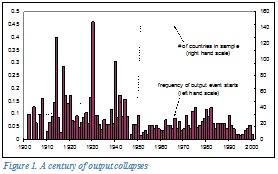

## Table of Contents

## What is shock therapy in economics?

Shock therapy in economics is a sudden and drastic change in a country's economic policies. It is often used to quickly move from a centrally planned economy to a free market economy. This method was popular in the 1990s, especially in countries that used to be part of the Soviet Union. The idea is to make big changes quickly, like freeing prices, cutting subsidies, and opening up trade, to shake up the economy and get it moving in a new direction.

The goal of shock therapy is to fix problems fast and start growing the economy. But it can be very hard on people. Prices can go up a lot, and many people might lose their jobs. This can cause a lot of unhappiness and even social unrest. While some countries have had success with shock therapy, others have faced big challenges and long recovery times. It's a risky approach, but when it works, it can lead to big improvements in the economy.

## What are the main goals of implementing shock therapy?

The main goal of shock therapy is to quickly change a country's economy from one that is controlled by the government to one that is more open and free. This means getting rid of old rules and letting businesses and markets decide things like prices and what to produce. By doing this fast, the idea is to kickstart the economy and get it growing again. It's like trying to fix a broken machine by giving it a big jolt to get it working.

Another goal is to stop problems like high inflation and not having enough goods. When prices are set free and the government stops giving out subsidies, it can help to balance out the economy. This can lead to more goods being available and prices becoming more stable over time. But it's a tough process, and it can be hard on people in the short term as they adjust to the new way of doing things.

## How does shock therapy differ from gradual economic reform?

Shock therapy and gradual economic reform are two different ways to change a country's economy. Shock therapy is like a big, quick change. It means making a lot of changes all at once, like freeing prices, cutting subsidies, and opening up trade. The idea is to shake up the economy fast and get it moving in a new direction. This can be really hard on people because prices can go up a lot and many might lose their jobs. But if it works, the economy can start growing quickly.

Gradual economic reform, on the other hand, is like taking small steps over time. Instead of making big changes all at once, the government makes smaller changes slowly. This can be easier for people to handle because it gives them time to adjust. Prices might not go up as fast, and fewer people might lose their jobs right away. But it can take a long time for the economy to really start growing, and sometimes the changes can be stopped or slowed down by people who don't want things to change.

Both ways have their good and bad points. Shock therapy can fix problems fast but can be really tough on people. Gradual reform is easier to handle but can take a long time to see big changes. It's up to the leaders of a country to decide which way is best for them, depending on what they want to achieve and how much their people can handle.

## What are the key mechanisms of shock therapy?

Shock therapy uses big, quick changes to fix an economy. It starts by freeing prices, which means letting the market decide how much things cost instead of the government. This can make prices go up fast, but it's meant to stop problems like not having enough goods. Another key part is cutting subsidies, which are like money the government gives to help people or businesses. By cutting these, the government hopes to make the economy more efficient and push people to work harder.

Opening up trade is also important in shock therapy. This means letting other countries buy and sell things more easily. It can bring in more goods and help the economy grow. But all these changes can be hard on people. Many might lose their jobs as businesses close or change, and prices going up can make life harder. The idea is to shake up the economy fast to get it moving in a new direction, even if it's tough at first.

The last key mechanism is privatizing state-owned businesses. This means selling companies that the government owns to private people or companies. It's meant to make businesses more efficient and bring in new ideas. But it can also lead to a lot of changes in who works where and how much they earn. Shock therapy is a risky way to fix an economy, but when it works, it can lead to big improvements and growth.

## Can you explain the concept of price liberalization in shock therapy?

Price liberalization is a big part of shock therapy. It means letting the market decide the prices of things instead of the government. Before, the government might have set prices to control the economy. But with price liberalization, the government stops doing this. Now, businesses can charge whatever they think people will pay. This can make prices go up a lot at first because there might not be enough of some things. But the idea is that over time, more goods will be made, and prices will become more stable.

This change can be really hard on people. When prices go up fast, it can make life more expensive. People might not be able to afford things they used to buy easily. But the goal is to fix big problems like not having enough goods. By letting the market decide prices, the economy can start to balance itself out. More people might start making things to sell, and over time, this can lead to more choices and better prices for everyone. It's a tough change, but it's meant to help the economy grow in the long run.

## How does privatization play a role in shock therapy?

Privatization is a big part of shock therapy. It means selling companies that the government owns to private people or other companies. When a country uses shock therapy, it wants to change from a government-controlled economy to one where businesses can make their own decisions. By selling state-owned businesses, the government hopes to make them work better. Private owners might have new ideas and ways to make the businesses more efficient. This can help the whole economy grow faster.

But privatization can be hard on people. When businesses change hands, workers might lose their jobs or have to work under new rules. The new owners might want to cut costs or change how things are done, which can be tough for employees. Even though it's meant to help the economy in the long run, privatization can cause a lot of problems in the short term. People might feel unsure about their future, and this can lead to unhappiness and even protests. So, while privatization is a key part of shock therapy, it's also one of the reasons why this approach can be so challenging.

## What are the short-term effects of shock therapy on an economy?

When a country uses shock therapy, it can cause big changes fast. In the short term, prices can go up a lot because the government stops controlling them. This can make life more expensive for people. Many might lose their jobs as businesses close or change. This can lead to a lot of unhappiness and even protests. People might feel unsure about their future and have a hard time buying things they need.

But shock therapy also tries to fix big problems quickly. By letting the market decide prices and selling government businesses to private owners, the economy can start to balance itself out. More goods might be made, and over time, this can help prices become more stable. Even though it's tough at first, the idea is to get the economy moving in a new direction and start growing again. It's a risky way to fix things, but it can lead to big improvements if it works.

## What are the long-term effects of shock therapy on an economy?

In the long run, shock therapy can lead to a more open and growing economy. When prices are free and businesses are run by private people, the economy can become more efficient. More goods are made, and over time, prices can become more stable. This can help the country grow and make life better for people. Countries that have used shock therapy, like Poland, have seen their economies get stronger and attract more investment from other countries.

But shock therapy can also cause problems that last a long time. If too many people lose their jobs or can't afford things, it can lead to a lot of unhappiness and even social unrest. Some countries, like Russia, had a hard time recovering from the big changes. It took them a long time to start growing again, and many people felt left behind. So while shock therapy can fix big problems fast, it's a risky way to change an economy, and it can take a long time for everyone to feel the benefits.

## Can you provide a case study of shock therapy in Russia during the 1990s?

In the early 1990s, Russia tried shock therapy to change its economy from one controlled by the government to a more open market. The government freed prices, cut subsidies, and sold many state-owned businesses to private people. This was meant to make the economy more efficient and help it grow. But the changes were very hard on people. Prices went up a lot, and many lost their jobs. Life became much harder for a lot of Russians, and there was a lot of unhappiness and protests.

Even though the goal was to fix the economy quickly, it took Russia a long time to start growing again. The early years were really tough, with a lot of people struggling to make ends meet. Over time, some parts of the economy did get better, and Russia started to attract more investment from other countries. But many people felt left behind, and it took years for the benefits of shock therapy to reach everyone. The shock therapy in Russia shows how risky and hard it can be to make big changes to an economy fast.

## How was shock therapy applied in Poland, and what were the outcomes?

In the late 1980s, Poland tried shock therapy to change its economy from one controlled by the government to a free market. The government freed prices, cut subsidies, and sold many state-owned businesses to private people. This was meant to make the economy more efficient and help it grow. The changes were hard at first. Prices went up a lot, and many people lost their jobs. But the government also helped people by giving them money to buy food and other things they needed.

Over time, Poland's economy started to get better. More goods were made, and prices became more stable. People started to feel better about their future, and the country began to attract investment from other countries. By the mid-1990s, Poland's economy was growing fast. It became one of the success stories of shock therapy. Even though it was tough at first, the changes helped Poland build a strong economy that worked well for a lot of people.

## What are the criticisms and controversies surrounding shock therapy?

Shock therapy has been criticized a lot because it can be really hard on people. When prices go up fast and many lose their jobs, life can become very tough. Critics say that shock therapy doesn't think about how people will handle these big changes. It can lead to a lot of unhappiness and even protests. Some people think that the government should help more during these changes, like giving money to those who need it or making sure people have jobs. They argue that shock therapy is too risky and can cause more problems than it fixes.

Another big criticism is that shock therapy can make things worse before they get better. In some countries, like Russia, it took a long time for the economy to start growing again. Many people felt left behind and didn't see the benefits of the changes for years. Critics say that a slower, more careful way of changing the economy might be better. It might take longer, but it could be easier for people to handle. They worry that shock therapy can lead to big problems that last a long time, and it's not worth the risk.

## How can the success of shock therapy be measured and evaluated?

The success of shock therapy can be measured by looking at how the economy grows over time. If the economy starts to get bigger and more people have jobs, that's a good sign. Another way to measure success is by seeing if prices become more stable. When prices stop going up so fast, it means the economy is balancing out. Also, if the country starts to attract more investment from other countries, it shows that people believe in the changes and think the economy will do well.

But measuring the success of shock therapy isn't just about numbers. It's also important to see how people feel about the changes. If a lot of people are unhappy and struggling, then the shock therapy might not be a success, even if the economy is growing. It's good to look at things like how many people are out of work, how much they can buy, and if they feel better about their future. The goal of shock therapy is to make the economy better, but it should also make life better for people.

## References & Further Reading

[1]: Sachs, J. (1994). ["Poland's Jump to the Market Economy."](https://archive.org/details/polandsjumptomar0000sach). The MIT Press.

[2]: Stiglitz, J. E. (2002). ["Globalization and its Discontents."](https://www.researchgate.net/publication/4755241_Joseph_E_Stiglitz_2002_Globalization_and_Its_Discontents) W.W. Norton & Company.

[3]: Aronson, D. R. (2006). ["Evidence-Based Technical Analysis: Applying the Scientific Method and Statistical Inference to Trading Signals."](https://www.amazon.com/Evidence-Based-Technical-Analysis-Scientific-Statistical/dp/0470008741) John Wiley & Sons.

[4]: Lopez de Prado, M. (2018). ["Advances in Financial Machine Learning."](https://www.amazon.com/Advances-Financial-Machine-Learning-Marcos/dp/1119482089) Wiley.

[5]: Aslund, A. (2007). ["Russia's Capitalist Revolution: Why Market Reform Succeeded and Democracy Failed."](https://www.wilsoncenter.org/publication/russias-capitalist-revolution-why-market-reform-succeeded-and-democracy-failed) Peterson Institute for International Economics.

[6]: Aslund, A. (2013). ["How Capitalism Was Built: The Transformation of Central and Eastern Europe, Russia, the Caucasus, and Central Asia."](https://www.cambridge.org/core/books/how-capitalism-was-built/6DE0658E9F2211E8B5A9CF380459D5FB) Cambridge University Press.