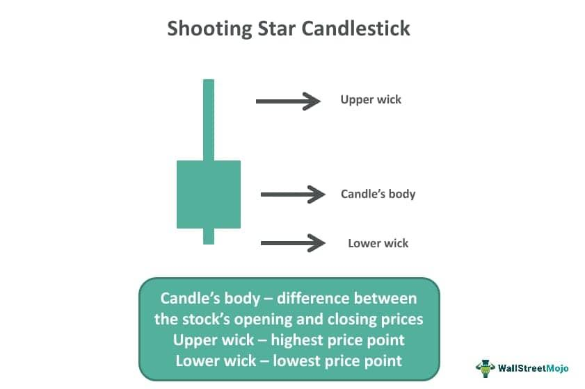

## Table of Contents

## What is a shooting star candle?

A shooting star candle is a type of candlestick pattern that you might see on a stock chart. It looks like a star falling from the sky, which is why it's called a shooting star. This pattern has a small body at the bottom and a long upper shadow, or wick, that is at least twice as long as the body. The long upper shadow shows that the price went up a lot during the day but then fell back down near where it started.

Traders watch for shooting star candles because they can signal that a stock's price might start to go down soon. If you see a shooting star after a stock has been going up for a while, it might mean that the people buying the stock are starting to sell it instead. This change can make the stock's price drop. But, it's important to look at other things too, not just the shooting star, before deciding to buy or sell a stock.

## How is a shooting star candle identified on a chart?

A shooting star candle is easy to spot on a chart. It looks like a small candle with a long line sticking up from the top. The small part of the candle is called the body, and it's at the bottom. The long line is called the upper shadow or wick, and it should be at least twice as long as the body. The candle should also have little to no lower shadow.

When you see a shooting star, it means the price of the stock went up a lot during the day but then came back down near where it started. This can happen when people who were buying the stock start to sell it. If you see a shooting star after the stock has been going up for a while, it might be a sign that the price could start to go down soon. But, it's smart to look at other signs on the chart too, not just the shooting star, before making any decisions about buying or selling.

## What does a shooting star candle indicate in market trends?

A shooting star candle is a sign that the market might be changing direction. It looks like a small candle with a long line on top. This pattern shows that during the day, the price of a stock went up a lot but then came back down near where it started. This can happen when people who were buying the stock start to sell it instead. If you see a shooting star after the stock has been going up for a while, it could mean that the price might start to go down soon.

It's important to remember that a shooting star is just one sign. You should look at other things on the chart too, like other patterns or how the stock has been moving overall. Just because you see a shooting star doesn't mean you should immediately buy or sell. It's a warning that the trend might be changing, but you need more information to make a good decision.

## Can you explain the psychology behind the formation of a shooting star candle?

A shooting star candle forms because of what people are thinking and doing in the market. Imagine a stock that's been going up for a while. People are excited and keep buying it, hoping the price will keep going up. But then, something changes. Maybe some people start to think the stock is too expensive or they hear news that makes them worried. So, they start selling the stock.

When this happens, the price of the stock shoots up at first because there are still a lot of buyers. But then, as more and more people start selling, the price falls back down near where it started. This creates the long upper shadow of the shooting star. It's like the stock tried to go up but couldn't keep going because too many people decided to sell. This shows that the excitement and confidence in the stock might be fading, and it could be a sign that the price might start to go down soon.

## How effective is the shooting star candle as a standalone indicator?

The shooting star candle is a helpful sign that the price of a stock might start to go down, but it's not perfect by itself. It's like a warning that the people who were buying the stock are now selling it, which can make the price drop. But, just seeing a shooting star isn't enough to be sure about what will happen next. The stock market can be tricky, and there are a lot of other things that can affect prices.

Because of this, it's smart to look at other signs on the chart too, not just the shooting star. Things like other patterns, how the stock has been moving overall, and even news about the company can give you a better idea of what might happen. So, while a shooting star can be a good hint, it's best to use it along with other information before making any big decisions about buying or selling.

## What are the key differences between a shooting star and an inverted hammer?

A shooting star and an inverted hammer look a lot alike because they both have a small body at the bottom and a long upper shadow. The main difference is where you see them on a chart. A shooting star shows up after a stock has been going up for a while. It's like a warning that the price might start to go down because people who were buying the stock are now selling it. On the other hand, an inverted hammer appears after a stock has been going down. It's a sign that the price might start to go up because people who were selling the stock are now buying it back.

Both patterns show that the price of the stock tried to go up during the day but couldn't keep going. For a shooting star, this means the buyers lost their power, and sellers took over. For an inverted hammer, it means the sellers lost their power, and buyers are starting to take over. So, while the shapes of these candles are similar, what they mean for the stock's future depends a lot on where they show up on the chart.

## What are the best practices for confirming a shooting star signal?

When you see a shooting star on a stock chart, it's a good idea to look at other signs before deciding what to do. One thing to check is the volume of the stock. If the volume is high when the shooting star appears, it means more people are trading the stock, and the signal might be stronger. Another thing to look at is where the shooting star shows up. It's more important if it comes after the stock has been going up for a while, as this suggests the price might start to go down soon.

Also, it's helpful to look at other patterns on the chart. For example, if you see a bearish pattern like a head and shoulders or a double top along with the shooting star, it can make the signal even stronger. It's also good to check the stock's trend over a longer time. If the stock has been going up for months and then you see a shooting star, it might be a good time to think about selling. But if you're not sure, it's always wise to wait for more signs before making a big decision.

## How can the shooting star candle be integrated into a broader trading strategy?

The shooting star candle can be a useful part of a bigger trading plan. It's like a warning sign that the price of a stock might start to go down soon. But, it's important to not just look at the shooting star by itself. You should also check the volume of the stock when the shooting star appears. If a lot of people are trading the stock at that time, it makes the signal stronger. Also, look at where the shooting star shows up on the chart. If it comes after the stock has been going up for a while, it's a bigger warning that the price might fall.

Another way to use the shooting star in your trading strategy is to look for other patterns on the chart that support the signal. For example, if you see a head and shoulders or a double top along with the shooting star, it can make the warning even stronger. It's also good to think about what's happening with the stock over a longer time. If the stock has been going up for months and then you see a shooting star, it might be a good time to think about selling. But, it's always smart to wait for more signs before making a big decision, so you don't miss out on any important information.

## What are common mistakes traders make when using the shooting star candle?

One common mistake traders make when using the shooting star candle is relying on it too much by itself. They see the shooting star and think they should sell the stock right away, without looking at other signs on the chart. But, the shooting star is just one piece of the puzzle. It's important to check the volume of the stock when the shooting star appears and see if other patterns like a head and shoulders or a double top are also showing up. These extra signs can help confirm that the shooting star is a real warning.

Another mistake is not paying attention to where the shooting star shows up on the chart. A shooting star is more important if it comes after the stock has been going up for a while. If it appears during a time when the stock's price is all over the place, it might not mean as much. Traders need to look at the bigger picture and see how the stock has been moving over a longer time before deciding what to do. Waiting for more signs can help them make better choices and avoid jumping to conclusions too quickly.

## How does the performance of a shooting star candle vary across different markets?

The shooting star candle can work differently in different markets like stocks, forex, or cryptocurrencies. In stock markets, a shooting star might be a good sign that the price could go down soon if it shows up after the stock has been going up for a while. But, in forex markets, where currencies are traded, the shooting star might not be as strong a signal. This is because forex markets are open all the time and can be affected by news from around the world, which can make the patterns less reliable.

In cryptocurrency markets, the shooting star can be even trickier to use. These markets can be very up and down, and a shooting star might not mean as much because the prices can change so quickly. It's important for traders to look at other signs and use the shooting star along with other tools to make better guesses about what might happen next. No matter the market, it's always smart to look at the bigger picture and not just rely on one pattern.

## Can you provide examples of successful trades using the shooting star candle strategy?

In one example, a trader was watching a stock that had been going up for several weeks. One day, they saw a shooting star candle appear on the chart right after the stock hit a new high. The trader checked the volume and saw it was high, which made the signal stronger. They also noticed a head and shoulders pattern forming, which is another sign that the price might go down. So, the trader decided to sell some of their stock. A few days later, the price did start to fall, and the trader was happy they made the right move based on the shooting star and other signs.

In another case, a forex trader was looking at the EUR/USD pair, which had been rising for a while. They spotted a shooting star candle after the pair reached a resistance level. The trader waited to see if the next candle would confirm the signal by closing lower, which it did. They also checked the economic news and saw no big events that could affect the pair's movement. Confident in their analysis, the trader opened a short position. The EUR/USD pair then dropped, and the trader made a profit from their well-timed trade.

## What advanced techniques can be used to enhance the predictive power of a shooting star candle?

To make the shooting star candle a better tool for guessing what the stock market might do next, traders can use other signs and tools along with it. One way is to look at the volume of the stock when the shooting star shows up. If a lot of people are trading the stock at that time, it can make the shooting star a stronger warning that the price might go down soon. Traders can also use other patterns on the chart, like a head and shoulders or a double top, to see if they agree with the shooting star. If these patterns are there too, it can make the signal even stronger.

Another way to improve the shooting star's usefulness is to look at what's happening in the bigger picture. For example, if the stock has been going up for a long time and then a shooting star appears, it's a good sign that the price might start to fall. Traders can also use technical indicators like the Relative Strength Index (RSI) or Moving Averages to see if they support the shooting star's warning. By combining the shooting star with these other tools and looking at the overall trend, traders can make better guesses about what might happen next and avoid making quick decisions based on just one sign.

## What is Backtesting and Performance Analysis?

Backtesting the shooting star pattern on algorithmic trading platforms is an essential practice for evaluating its historical performance and determining its potential profitability. This process involves simulating trades using historical data to assess how the pattern would have performed under past market conditions. Key metrics such as risk-adjusted return, hit rate, and average profit [factor](/wiki/factor-investing) can be analyzed to gauge the effectiveness of the shooting star pattern when isolated or coupled with other technical indicators.

Risk-adjusted return is a critical measure, and it is important to examine the Sharpe Ratio, which is calculated as:

$$

\text{Sharpe Ratio} = \frac{E[R] - R_f}{\sigma}
$$

where $E[R]$ is the expected portfolio return, $R_f$ is the risk-free rate, and $\sigma$ is the standard deviation of the portfolio returns. A higher Sharpe Ratio indicates superior performance on a risk-adjusted basis. The shooting star pattern, when confirmed with other indicators such as moving averages or volume changes, tends to result in improved Sharpe Ratios.

Studies have shown that incorporating the shooting star pattern into a broader algorithmic strategy can contribute positively to trading outcomes. For instance, combining this pattern with moving average crossovers or Relative Strength Index (RSI) signals can enhance signal reliability while reducing false positives. These combined methodologies allow traders to adapt dynamically to market conditions, enhancing profitability while keeping risk in check. Python is often the language of choice for implementing such strategies, given its robust libraries for quantitative analysis like pandas, NumPy, and [backtrader](/wiki/backtrader).

Here's a basic example of how one might begin coding a backtest in Python using a candlestick pattern:

```python
import pandas as pd
import numpy as np

# Sample dataset (assumed to be loaded)
# Load your historical OHLC data
data = pd.read_csv('historical_data.csv')

# Define a function to identify shooting star pattern
def is_shooting_star(data):
    conditions = [
        data['Open'] < data['Close'],  # Bullish close
        (data['High'] - data['Close']) > (data['Close'] - data['Open']) * 2,  # Long upper shadow compared to real body
        (data['Close'] - data['Low']) < (data['Close'] - data['Open']) * 0.1  # Small or no lower shadow
    ]
    return np.all(conditions)

# Apply the function
data['ShootingStar'] = data.apply(is_shooting_star, axis=1)

# Backtesting logic would follow...
```

This simple script identifies the shooting star pattern in historical data, which can then be used to create a trading strategy. By comparing the historical performance of this strategy to benchmarks or risk-free rates, traders can ascertain the effectiveness and adjust parameters to fit their risk appetite.

In conclusion, [backtesting](/wiki/backtesting) provides invaluable insights, enabling traders to refine their strategies and harness the potential of the shooting star pattern while mitigating inherent risks common in financial markets.

## References & Further Reading

[1]: Nison, S. (1991). ["Japanese Candlestick Charting Techniques: A Contemporary Guide to the Ancient Investment Techniques of the Far East."](https://www.amazon.com/Japanese-Candlestick-Charting-Techniques-Contemporary/dp/0139316507) New York Institute of Finance.

[2]: Chan, E. P. (2009). ["Quantitative Trading: How to Build Your Own Algorithmic Trading Business."](https://github.com/ftvision/quant_trading_echan_book) Wiley.

[3]: Jansen, S. (2020). ["Machine Learning for Algorithmic Trading: Predictive models to extract signals from market and alternative data for systematic trading strategies with Python."](https://www.amazon.com/Machine-Learning-Algorithmic-Trading-alternative/dp/1839217715) Packt Publishing.

[4]: Lopez de Prado, M. (2018). ["Advances in Financial Machine Learning."](https://www.amazon.com/Advances-Financial-Machine-Learning-Marcos/dp/1119482089) Wiley.

[5]: Aronson, D. R. (2006). ["Evidence-Based Technical Analysis: Applying the Scientific Method and Statistical Inference to Trading Signals."](https://www.amazon.com/Evidence-Based-Technical-Analysis-Scientific-Statistical/dp/0470008741) Wiley.