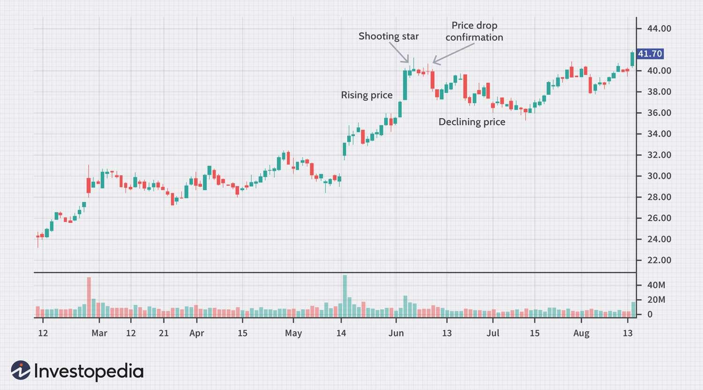

## Table of Contents

## What is a shooting star in stock trading?

A shooting star in stock trading is a type of candlestick pattern that appears on a chart. It looks like a star falling from the sky, which is why it got its name. This pattern forms when a stock's price goes up a lot during the day but then drops back down near where it started by the end of the day. The shooting star has a small body at the bottom and a long upper shadow, showing that the price reached high but couldn't stay there.

Traders watch for shooting stars because they can signal that the stock's price might start to go down soon. If you see a shooting star after a stock has been going up for a while, it might mean that the upward trend is getting tired and could reverse. It's like a warning sign for traders to be careful or maybe sell their stocks before the price falls more. But, it's important to use this pattern along with other signs and not just rely on it alone.

## How does a shooting star candlestick pattern look?

A shooting star candlestick pattern looks like a small candle with a long line sticking out from the top. The small part of the candle, called the body, is at the bottom. This body can be either black or white, meaning the stock can close either lower or higher than it opened. The long line above the body is called the upper shadow or wick. This line shows that the stock price went up a lot during the day but then came back down near where it started.

When you see a shooting star on a chart, it means that the stock tried to go up but couldn't keep the high price. It's like the stock jumped high but then fell back down quickly. Traders look for this pattern because it can mean that the price might start going down soon, especially if the stock has been going up for a while before the shooting star appears.

## What does a shooting star indicate about market trends?

A shooting star candlestick pattern can tell traders that the market might be getting ready to change direction. If a stock has been going up for a while and then you see a shooting star, it means that the price tried to go even higher but couldn't stay there. This shows that the people who want to buy the stock are not as strong as they used to be, and the people who want to sell might be getting stronger.

Seeing a shooting star can be a warning sign for traders. It suggests that the upward trend might be running out of steam and that the price could start going down soon. Traders often use this pattern along with other signs to decide if it's time to sell their stocks before the price drops more. But it's important to remember that one shooting star by itself isn't enough to be sure about the market trend; it's best used with other information.

## In which market conditions is a shooting star most reliable?

A shooting star is most reliable when it shows up after a stock has been going up for a while. This means the stock has been in an uptrend. When you see a shooting star in this situation, it can be a strong sign that the price might start going down soon. The shooting star tells us that even though the price tried to go higher, it couldn't stay there, which might mean that buyers are getting tired and sellers are getting ready to take over.

It's also important that the shooting star happens with a lot of trading happening. If a lot of people are buying and selling when the shooting star appears, it makes the pattern more reliable. This is because it shows that many traders are paying attention and reacting to the price trying to go up but failing. So, in an uptrend with high trading volume, a shooting star can be a good warning sign for traders to be careful or maybe sell their stocks before the price falls more.

## How can a beginner identify a shooting star pattern on a chart?

A beginner can identify a shooting star pattern on a chart by looking for a candle that has a small body at the bottom and a long line sticking out from the top. The small body can be either black or white, which means the stock can close either lower or higher than it opened. The long line above the body is called the upper shadow or wick. This line shows that the stock price went up a lot during the day but then came back down near where it started.

To spot a shooting star, you need to look at the chart after the stock has been going up for a while. If you see this special candle shape after an uptrend, it means the price tried to go even higher but couldn't stay there. This pattern can be a warning sign that the price might start going down soon. So, keep an eye out for a candle with a small body and a long upper shadow after the stock has been moving up.

## What is the significance of the upper shadow in a shooting star?

The upper shadow in a shooting star is very important. It is the long line that sticks out from the top of the small body of the candle. This line shows that the stock's price went up a lot during the day but then came back down near where it started. When you see this long upper shadow, it means that the stock tried to go higher but couldn't stay there. This tells us that the people who want to buy the stock are not as strong as before, and the people who want to sell might be getting stronger.

Seeing a long upper shadow in a shooting star after the stock has been going up for a while is a warning sign. It suggests that the price might start going down soon. Traders look at this pattern to decide if it's time to sell their stocks before the price drops more. But remember, one shooting star by itself isn't enough to be sure about what will happen next. It's best to use this pattern with other signs to make a good decision.

## Can a shooting star be used as a standalone indicator for trading decisions?

A shooting star should not be used as a standalone indicator for trading decisions. It's a warning sign that the stock's price might start going down, but it doesn't tell the whole story by itself. Traders need to look at other things too, like how much people are buying and selling, and other patterns on the chart. Using the shooting star alone can lead to wrong guesses about what the stock will do next.

It's best to use the shooting star along with other signs to make smarter trading choices. For example, if the shooting star shows up after the stock has been going up for a while and there's a lot of trading happening, it's more likely to be a good warning sign. But even then, it's important to keep watching the stock and use other tools to help decide when to buy or sell. This way, traders can make better decisions and not rely on just one pattern.

## What are the key differences between a shooting star and an inverted hammer?

A shooting star and an inverted hammer look similar because they both have a small body at the bottom and a long line sticking out from the top. The main difference is when you see them on a chart. A shooting star usually shows up after a stock has been going up for a while. It means the price tried to go higher but couldn't stay there, so it might start going down soon. On the other hand, an inverted hammer appears after a stock has been going down for a while. It means the price tried to go down more but then came back up, so it might start going up soon.

So, the big difference is what the pattern means for the stock's future. A shooting star is a warning sign that the upward trend might be ending, and the price could fall. An inverted hammer is a hopeful sign that the downward trend might be ending, and the price could rise. Both patterns need other signs to be sure about what will happen next, but knowing when they show up helps traders guess where the stock might go.

## How should one confirm a shooting star pattern before making a trade?

To confirm a shooting star pattern before making a trade, you should look at the stock's price history first. A shooting star is more reliable if it shows up after the stock has been going up for a while. This means the stock was in an uptrend. If you see the shooting star after this, it's a warning sign that the price might start going down soon. So, check if the stock has been moving up before you see the shooting star.

Next, you should also look at how much people are buying and selling the stock when the shooting star appears. If there's a lot of trading happening, it makes the pattern more trustworthy. This shows that many traders are paying attention and reacting to the price trying to go up but failing. So, make sure there's high trading volume when you see the shooting star. Using these two things together - the stock's uptrend and high trading volume - can help you feel more sure about using the shooting star to make a trading decision.

## What are common trading strategies that involve a shooting star pattern?

One common trading strategy that uses a shooting star pattern is to sell the stock or take profits when you see the pattern. If a stock has been going up for a while and you spot a shooting star, it means the price tried to go higher but couldn't stay there. This could be a sign that the upward trend is getting weak and the price might start going down soon. So, traders might decide to sell their stocks before the price drops more. They might also set a stop-loss order just above the shooting star's high to protect themselves if the price goes up instead.

Another strategy is to wait for more signs before making a move. Since a shooting star by itself isn't enough to be sure about what will happen next, traders might look for other patterns or signals that also suggest the price will go down. For example, they might wait for the next candle to close lower than the shooting star's body. This would confirm that the price is indeed starting to fall. Then, they might sell their stocks or even go short, betting that the price will keep going down. This way, they use the shooting star as part of a bigger picture to make smarter trading choices.

## How does volume affect the reliability of a shooting star?

Volume is really important when you're looking at a shooting star pattern. If a lot of people are buying and selling when the shooting star shows up, it makes the pattern more reliable. This means that many traders are paying attention and reacting to the price trying to go up but failing. When you see high volume with a shooting star, it's a stronger sign that the price might start going down soon.

On the other hand, if not many people are trading when the shooting star appears, it might not be as trustworthy. Low volume can mean that not many traders are reacting to the pattern, so it might not be a good sign of what will happen next. So, always check the volume along with the shooting star to make better guesses about where the stock's price might go.

## What are some real-life examples of shooting star patterns in major stock indices?

In 2020, the S&P 500 showed a shooting star pattern in early September. The index had been going up for a while and reached a high on September 2nd. That day, the price tried to go even higher but couldn't stay there. By the end of the day, it came back down near where it started, forming a candle with a small body and a long upper shadow. This shooting star was a warning sign that the upward trend might be getting weak. After that, the S&P 500 did start to go down a bit over the next few weeks, showing that the shooting star was a good signal to be careful.

Another example happened with the Dow Jones Industrial Average in February 2021. The Dow had been on an uptrend and reached a peak on February 12th. On that day, the price went up a lot during trading but then fell back down near the opening price, creating a shooting star pattern. This pattern showed that even though the price tried to go higher, it couldn't hold the gain. Traders who saw this shooting star might have decided to sell their stocks or be more careful. Sure enough, the Dow Jones started to drop in the following days, confirming the shooting star as a useful warning sign.

## References & Further Reading

[1]: Bergstra, J., Bardenet, R., Bengio, Y., & Kégl, B. (2011). ["Algorithms for Hyper-Parameter Optimization."](https://papers.nips.cc/paper/4443-algorithms-for-hyper-parameter-optimization) Advances in Neural Information Processing Systems 24.

[2]: ["Advances in Financial Machine Learning"](https://www.amazon.com/Advances-Financial-Machine-Learning-Marcos/dp/1119482089) by Marcos Lopez de Prado

[3]: ["Evidence-Based Technical Analysis: Applying the Scientific Method and Statistical Inference to Trading Signals"](https://www.amazon.com/Evidence-Based-Technical-Analysis-Scientific-Statistical/dp/0470008741) by David Aronson

[4]: ["Machine Learning for Algorithmic Trading"](https://github.com/PacktPublishing/Machine-Learning-for-Algorithmic-Trading-Second-Edition) by Stefan Jansen

[5]: ["Quantitative Trading: How to Build Your Own Algorithmic Trading Business"](https://www.amazon.com/Quantitative-Trading-Build-Algorithmic-Business/dp/1119800064) by Ernest P. Chan