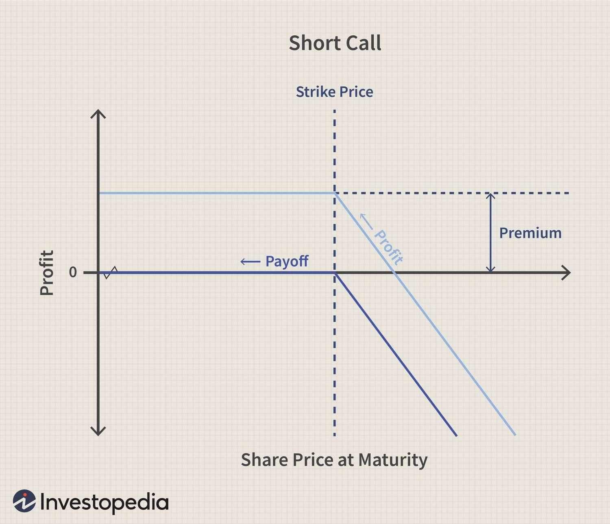

Financial derivatives, particularly options, play a vital role in today's financial markets. They provide traders and investors with essential tools for hedging against potential losses, speculating on market movements, and generating income through premium collection. Options, through their intrinsic versatility and various strategic applications, have become indispensable in managing modern portfolios and navigating complex market dynamics.

This article explores options trading with a specific emphasis on short calls and their strategic application within algorithmic trading. A short call involves selling a call option, where the seller agrees to deliver an underlying asset at a predetermined price, hoping the option expires worthless. This bearish strategy is often used to take advantage of stable or declining markets, offering the seller an upfront premium, albeit with an associated risk of potentially unlimited losses if the market goes against their position.



Understanding the essential concepts of options trading is crucial for leveraging these financial instruments effectively, especially when combined with algorithmic strategies. Algorithmic trading employs automated systems to execute trades based on pre-set rules, enabling traders to respond swiftly to market conditions, capitalize on opportunities, and systematically manage risks. By integrating algorithmic frameworks, traders can enhance the efficiency of short call strategies, ensuring consistent execution and minimizing the impact of human error.

This article aims to provide readers with a comprehensive guide on the mechanics of short call strategies, addressing their benefits, inherent risks, and potential optimizations through algorithmic solutions. Our focus is on equipping both novice and experienced traders with the knowledge and tools necessary to incorporate short call options within an algo-trading setup effectively. By considering both the technical and strategic aspects, this exploration of options trading highlights its significant role in modern financial markets and paves the way for informed decision-making.

## Table of Contents

## Understanding Options Trading

Options trading involves the transaction of contracts that confer the right, but not the obligation, to buy or sell an underlying asset at a set price on or before a specific date. Each option contract has a predetermined expiration date and a strike price, which forms the basis of the contract terms between the buyer and seller. The buyer of an option pays a premium for this right, while the seller, often referred to as the writer, receives this premium as compensation for taking on the obligation.

The two primary types of options are calls and puts. A call option provides the holder the right to purchase the underlying asset at the strike price, making it beneficial when expecting an increase in the asset's market price. Conversely, a put option grants the holder the right to sell the underlying asset at the strike price, suitable when anticipating a decline in the asset's market price. 

Options serve multiple purposes, such as hedging and speculation. They are valuable for risk management, allowing traders and investors to protect other positions against unfavorable market movements. Options can be utilized to hedge equity investments or to speculate by taking advantage of anticipated market directions or [volatility](/wiki/volatility-trading-strategies). 

The versatility of options is evident in the array of strategies they facilitate. From simple strategies like buying a single call or put (long positions) to more complex configurations like straddles, strangles, and spreads, traders can tailor their positions to align with specific market views and risk tolerances. For instance, a covered call strategy involves holding a long position in an asset while writing a call option on the same asset, providing potential income from the option premium while still participating in the asset's price appreciation up to the strike price.

Options are also a crucial component in [algorithmic trading](/wiki/algorithmic-trading) systems due to their complexity and the range of strategic choices they offer. Integrating options in algorithmic models allows traders to programmatically execute trading strategies based on precise criteria, leveraging both the protective features and speculative opportunities presented by options.

## What Is a Short Call?

A short call, also known as "writing" a call, is an options trading strategy that involves selling a call option with the expectation that the price of the underlying asset will decline. In this strategy, the seller, often referred to as the call writer, receives a premium from the option buyer in exchange for taking on the obligation to deliver the asset at the designated strike price if the option is exercised before its expiration date.

The primary objective for the short call seller is to keep the premium as profit. This is achieved when the option expires worthless, meaning the market price of the underlying asset remains below the strike price at expiration. In such a scenario, the buyer has no incentive to exercise the option, allowing the writer to retain the premium without having to fulfill the contractual obligation of selling the asset.

Short calls are inherently bearish strategies. They capitalize on anticipated decreases or negligible increases in the underlying asset's price. The profit potential for short calls is limited to the premium received when the option is sold. However, the risks associated are theoretically unlimited. If the price of the underlying asset surges significantly above the strike price, the call writer faces potentially substantial losses, as they must purchase the asset at potentially much higher market prices to deliver it at the lower strike price.

For example, consider a trader who writes a call for a stock trading at $50 with a strike price of $55, and receives a $2 premium per share. The maximum profit the trader can earn is $2 per share, realized if the stock stays below $55 until expiration. However, if the stock price rises to, say, $65, the trader will incur a $10 loss per share ($65 market price - $55 strike price + $2 premium received).

Formulaically, the profit for a short call can be expressed as:
$$
\text{Profit} = \min(0, \text{Strike Price} - \text{Underlying Price} + \text{Premium Received})
$$

Given the potential for unlimited loss, short calls are generally recommended for experienced traders with a high tolerance for risk or those who utilize sophisticated risk management techniques to protect against adverse price movements.

## Risks and Rewards of Short Call Strategies

The primary appeal of executing a short call strategy lies in the upfront premium received from selling the option. This premium serves as immediate income for the trader and represents the core reward of this strategy. However, the associated risks are significant and demand careful consideration.

One of the principal risks is the theoretically unlimited loss potential inherent in a short call. Since there's no upward limit to how high the price of the underlying asset can rise, a short call seller faces escalating losses if the market moves contrary to their expectations. For example, if a call option is sold at a strike price of $100 and the asset's market price rises to $150, the option writer would face a loss of $50 minus the premium received. The formula for calculating the loss from a short call position can be expressed as:

$$
\text{Loss} = \max(0, \text{Market Price} - \text{Strike Price}) - \text{Premium Received}
$$

This potential for unlimited risk typically implies that short call strategies are favored by experienced traders who are adept at managing substantial risk exposure. To mitigate such risks, traders may employ various techniques such as setting stop-loss orders, utilizing covered calls to limit potential losses, or dynamically adjusting their positions based on market movements.

Furthermore, understanding market conditions and volatility is paramount when utilizing short calls. High volatility can significantly increase the chances that the market price exceeds the strike price, resulting in a loss for the option writer. Therefore, a successful implementation of short call strategies often requires a deep appreciation of current market dynamics and an ability to predict future price movements with reasonable accuracy.

In conclusion, while short call strategies provide immediate financial benefits through premiums, the associated risks underline the necessity for disciplined risk management and a thorough understanding of market conditions to employ these strategies effectively.

## Algorithmic Trading and Short Calls

Algorithmic trading, or algo-trading, leverages computer programs to automatically execute trading strategies based on pre-set rules. This approach is particularly advantageous for trades such as short calls, where timing and precision are critical. In algo-trading, algorithms enable the swift execution of trades and continuous market monitoring, leading to increased efficiency.

Integrating short calls into an algo-trading strategy allows frequent adjustments based on real-time market conditions. Algorithms can quickly react to price movements, ensuring the strategy aligns with the trader's objectives. For instance, if the market indicates a downtrend favorable for a short call position, the algorithm can execute the trade instantaneously, capitalizing on the opportunity.

Risk management is a critical [factor](/wiki/factor-investing) when employing short call strategies due to the potential for unlimited loss. Algorithms assist by dynamically adjusting positions and applying hedging strategies like covered calls. In a covered call, the algorithm ensures that the short call position is backed by holding the underlying asset, thereby limiting potential losses. Python code, leveraging libraries like NumPy or pandas, can be used to implement such hedging techniques:

```python
import numpy as np
import pandas as pd

def check_hedge_condition(option_price, asset_price, threshold):
    # Basic condition to trigger a hedge adjustment
    if abs(option_price - asset_price) > threshold:
        return True
    return False

# Simulated real-time data
option_price = 10
asset_price = 50
threshold = 2

if check_hedge_condition(option_price, asset_price, threshold):
    print("Adjust hedge position.")
else:
    print("Hedge position unchanged.")
```

Advanced traders further enhance their strategies by employing algorithms for back-testing and optimization. This process involves testing the algorithm on historical data to refine strategy parameters and validate performance. Back-testing ensures that the strategy remains robust across various market conditions and reduces the chances of unexpected losses.

Finally, algorithms minimize human error and emotional biases, fostering consistent application of the trading strategy. By relying on data-driven decision-making, algo-trading permits traders to adhere strictly to their defined rules without being swayed by market sentiment or irrational fears. As a result, the systematic nature of algorithms establishes a more disciplined trading environment, allowing traders to navigate complex markets with greater assurance.

## Developing a Short Call Algo-Trading Strategy

Developing a short call strategy within an algorithmic trading framework requires meticulous planning and execution. This process begins by establishing precise entry and [exit](/wiki/exit-strategy) rules that are contingent on specific market indicators. These indicators may include moving averages, volatility indexes, or technical signals such as the Relative Strength Index (RSI). A robust algorithmic approach ensures that these parameters are systematically tracked and utilized in real-time, enabling the trader to respond swiftly to market fluctuations.

One of the most critical aspects of constructing a short call strategy is the implementation of comprehensive risk management protocols. Given the unlimited risk exposure inherent in short calls, traders must institute measures such as stop-loss limits to guard against significant market moves that could lead to substantial losses. Additionally, adjustments may need to be dynamically incorporated, particularly when market conditions deviate from historical norms or expectations.

Automation is a pivotal component of this strategy, facilitating constant market surveillance and enabling the seamless execution of trades as dictated by the pre-defined strategy rules. An algorithm can quickly analyze incoming data and execute trades without the hesitation or error that might occur with manual trading. This enhances both the speed and efficiency of the trading process, allowing for better alignment with strategic objectives.

For continuous improvement and optimization, it is essential to employ historical data for thorough back-testing. This involves simulating the strategy over past market data to verify its effectiveness and identify potential weaknesses. By iterating on these results, traders can refine the strategy parameters to calibrate it for optimal performance under various market scenarios. The use of methodologies like Monte Carlo simulations or stochastic modeling can provide further insights into potential outcomes and help in fine-tuning the strategy.

Incorporating these elements into the development of a short call algo-trading strategy can markedly enhance its robustness and adaptability, enabling traders to capitalize on their insights into market trends while managing inherent risks with precision.

## Conclusion

A well-crafted short call strategy within an algorithmic framework equips traders with a versatile instrument to capitalize on stable or declining markets. By leveraging technology and algorithmic models, the strategy can dynamically respond to market changes, allowing for precise and timely execution. The employment of algorithms mitigates the substantial risks of short calls by implementing real-time risk management techniques, such as automatic hedging and stop-loss protocols, which can significantly reduce potential losses. 

However, the application of such strategies requires careful attention due to the inherent unlimited risk that short calls entail if the market moves against the position. Algorithms can efficiently monitor market conditions, but traders must ensure that their models and strategies are well-structured to handle adverse scenarios robustly. This involves hiring meticulous risk management approaches and continuously refining the algorithms based on performance data.

Emerging traders aiming to incorporate short calls into their algorithmic trading systems should devote substantial effort to mastering the technical and market intricacies associated with these options. Comprehensive knowledge of options dynamics, pricing models, and the broader market environment is crucial for informed decision-making and strategy formulation. Additionally, thorough back-testing using historical data is imperative in validating and optimizing strategy parameters to enhance performance and resilience.

The ongoing advancement in technology and data analytics further broadens the potential of options and algorithmic trading. With increased computational power and access to vast datasets, traders can develop more sophisticated models that efficiently adapt to ever-evolving market conditions. As these methodologies expand, traders equipped with rigorous understanding and cutting-edge tools can better navigate the complexities of financial markets, harnessing the full potential of algorithmic short call strategies.

## References & Further Reading

[1]: Bergstra, J., Bardenet, R., Bengio, Y., & Kégl, B. (2011). ["Algorithms for Hyper-Parameter Optimization."](https://papers.nips.cc/paper/4443-algorithms-for-hyper-parameter-optimization) Advances in Neural Information Processing Systems 24.

[2]: ["Advances in Financial Machine Learning"](https://www.amazon.com/Advances-Financial-Machine-Learning-Marcos/dp/1119482089) by Marcos Lopez de Prado

[3]: ["Evidence-Based Technical Analysis: Applying the Scientific Method and Statistical Inference to Trading Signals"](https://www.wiley.com/en-us/Evidence+Based+Technical+Analysis%3A+Applying+the+Scientific+Method+and+Statistical+Inference+to+Trading+Signals-p-9780470008744) by David Aronson

[4]: ["Machine Learning for Algorithmic Trading"](https://github.com/PacktPublishing/Machine-Learning-for-Algorithmic-Trading-Second-Edition) by Stefan Jansen

[5]: ["Quantitative Trading: How to Build Your Own Algorithmic Trading Business"](https://books.google.com/books/about/Quantitative_Trading.html?id=j70yEAAAQBAJ) by Ernest P. Chan