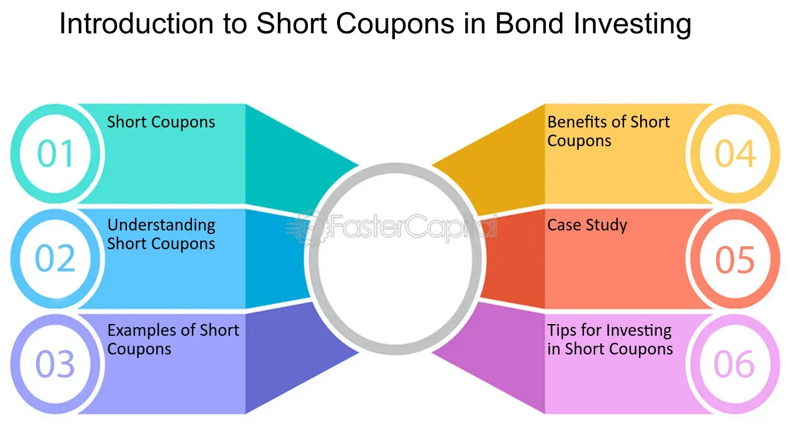

## Table of Contents

## What is a short coupon in finance?

A short coupon in finance refers to a bond that pays interest for a period shorter than the usual six months between coupon payments. When a bond is issued, it might not align perfectly with the standard coupon payment schedule. For example, if a bond is issued on the 15th of the month and the standard coupon dates are the 1st and the 1st of every six months, the first coupon period will be shorter than six months.

This shorter period means the first coupon payment will be less than the regular coupon payments. Investors need to be aware of short coupons because they affect the bond's yield and pricing. The bond's price might be adjusted to reflect the shorter first coupon, ensuring that the yield remains consistent with what investors expect from the bond over its entire term.

## How does a short coupon differ from a regular coupon?

A short coupon is different from a regular coupon because it covers a shorter time period. A regular coupon usually pays interest every six months, but a short coupon might only cover a few months. This happens when a bond is issued at a time that doesn't line up with the usual coupon payment dates. For example, if coupons are normally paid on January 1st and July 1st, but the bond is issued on March 15th, the first coupon will be for less than six months.

Because the short coupon covers less time, the first interest payment will be smaller than the regular coupons. This can affect how much money investors get at the start. To make up for this, the bond's price might be adjusted so that the overall return, or yield, stays the same as what was promised when the bond was sold. This way, even though the first payment is smaller, investors still get the expected return over the life of the bond.

## What are the typical reasons for issuing a short coupon?

A short coupon happens when a bond is sold at a time that doesn't match the usual dates for paying interest. For example, if a company decides to issue a bond on a date that is not the normal start of a coupon period, the first interest payment will be for a shorter time. This can happen because the company needs money quickly and can't wait for the next regular coupon date.

Issuing a bond with a short coupon can also be a way for companies to manage their finances better. If they need to raise money before the next regular coupon date, they might choose to issue a bond with a short first coupon. This way, they can get the money they need without waiting, even if it means the first interest payment will be smaller than usual.

## Can you explain the impact of a short coupon on bond pricing?

When a bond has a short coupon, the first interest payment is smaller because it covers less time than the usual six months. To keep the overall return, or yield, the same as what was promised to investors, the bond's price needs to be adjusted. If the first coupon is smaller, the bond might be sold at a slightly higher price to make up for the lower first payment. This way, even though the first interest payment is less, the total amount of money investors get over the life of the bond stays the same.

Adjusting the bond's price to account for the short coupon is important because it helps keep the bond's yield steady. If the bond's price wasn't changed, the yield would be lower than expected because of the smaller first payment. By setting the price higher, the bond issuer makes sure that investors still get the return they were expecting when they bought the bond. This makes the bond more attractive to investors, even with the short first coupon.

## How do investors account for short coupons in their yield calculations?

Investors need to think about short coupons when figuring out the yield of a bond. The yield is how much money the bond makes for the investor over time. If a bond has a short first coupon, the first interest payment will be smaller because it covers less time than usual. To keep the yield the same as what was promised, investors look at the bond's price. If the bond's price is higher to make up for the smaller first payment, the yield stays the same even though the first coupon is short.

To calculate the yield with a short coupon, investors use a formula that takes into account all the coupon payments, including the shorter first one. They add up all the interest payments and the price they paid for the bond. Then, they figure out the total return over the bond's life. By doing this, they can see that even with a short first coupon, the bond's yield can still match what they expected when they bought it.

## What are the tax implications of receiving a short coupon?

When you get a short coupon from a bond, it can affect your taxes. The interest you earn from the short coupon is usually taxed as regular income. This means you have to add the interest from the short coupon to your total income for the year and pay taxes on it at your normal tax rate.

The short coupon might be smaller than the usual coupon, but you still have to pay taxes on it. If the bond's price was adjusted to make up for the short coupon, this doesn't change how the interest is taxed. You need to report the interest from the short coupon on your tax return, just like you would with any other interest income.

## How does the timing of a short coupon affect investment strategies?

When a bond has a short coupon, it can change how investors plan their investments. If an investor is looking for regular income, a short coupon might not give them as much money at first as they expected. This could make them think twice about buying the bond or make them look for other investments that pay more right away. But if the bond's price is adjusted to make up for the short coupon, the overall return might still be good, so some investors might still want to buy it.

The timing of a short coupon can also affect when investors decide to buy or sell bonds. If someone knows a bond will have a short coupon soon, they might wait to buy it until after the short coupon is paid, so they can get the full regular coupon next time. Or, if they already own the bond, they might sell it before the short coupon is paid to avoid getting a smaller payment. Knowing about short coupons helps investors make better choices about when to buy or sell bonds to fit their investment goals.

## What are the risks associated with short coupons for bond issuers?

When a company issues a bond with a short coupon, it might make investors less interested in buying the bond. This is because the first interest payment is smaller than usual, and some investors might want to wait until the next regular coupon payment instead. If not enough people want to buy the bond, the company might have to offer it at a lower price or with a higher [interest rate](/wiki/interest-rate-trading-strategies) to make it more appealing. This can cost the company more money in the long run.

Another risk for bond issuers is that they might need to adjust the bond's price to make up for the short coupon. If the bond's price goes up, it could make the bond less attractive to some investors who think it's too expensive. On the other hand, if the company doesn't adjust the price, the bond's yield might be lower than what investors expect, which could also make it harder to sell the bond. So, companies need to be careful about when they issue bonds with short coupons to avoid these problems.

## How do market conditions influence the decision to issue a short coupon?

Market conditions can affect whether a company decides to issue a bond with a short coupon. If the market is doing well and investors are looking for good deals, a company might issue a bond with a short coupon to get money quickly. They might think that even with a smaller first payment, investors will still buy the bond if the overall return is good. But if the market is not doing well, and investors are being careful with their money, a short coupon might make the bond less attractive. Investors might wait for the next regular coupon payment instead of buying a bond with a smaller first payment.

The timing of when a company needs money also matters. If a company needs money right away and can't wait for the next regular coupon date, they might issue a bond with a short coupon. This can be a good move if the market is okay with it. But if the market is bad, and investors are worried about the economy, a short coupon might make it harder for the company to sell the bond. So, companies have to look at the market and decide if a short coupon is a good idea based on how investors are feeling and what the economy is doing.

## Can you describe a real-world example where a short coupon was used effectively?

In 2019, a big company called Apple Inc. decided to issue bonds to get money for new projects. They needed the money quickly, so they chose to issue the bonds right away, even though it meant the first interest payment would be smaller than usual. This was because the bond was issued at a time that didn't line up with the normal coupon dates. Even with a short coupon, Apple was able to sell the bonds easily because investors knew the company was strong and the overall return would still be good.

Investors were okay with the short coupon because they trusted Apple and knew the bond's price was adjusted to make up for the smaller first payment. This meant they would still get the return they expected over the life of the bond. Apple's decision to issue bonds with a short coupon worked well because they got the money they needed fast, and the bonds were popular with investors who were happy with the overall deal.

## What are the regulatory considerations for issuing short coupons?

When companies want to issue bonds with short coupons, they have to follow rules set by financial regulators. These rules make sure that companies tell investors clearly about the short coupon and how it affects the bond's price and return. Regulators want to make sure that investors know what they are getting into, so they can make good choices about buying the bond.

Different countries might have different rules about short coupons. In the United States, for example, the Securities and Exchange Commission (SEC) has rules that companies must follow when they issue bonds. These rules say that companies need to give investors all the important information about the bond, including any short coupons. By following these rules, companies can make sure they are doing things the right way and that investors are protected.

## How do short coupons fit into broader financial management and portfolio strategies?

When investors are putting together their portfolios, they need to think about short coupons. A short coupon means the first interest payment from a bond is smaller than usual. This can affect how much money an investor gets right away. If an investor is looking for regular income, a short coupon might not be what they want at first. But if the bond's price is adjusted to make up for the short coupon, the overall return might still be good. So, investors need to look at the whole picture and see if the bond fits with their goals, even with a short coupon.

For financial managers at companies, short coupons can be a useful tool. If a company needs money quickly, they might issue a bond with a short coupon instead of waiting for the next regular coupon date. This can help them manage their finances better. But they need to be careful because a short coupon might make the bond less attractive to some investors. So, financial managers need to think about the market and how investors might react before deciding to issue a bond with a short coupon. By doing this, they can make smart choices that help the company get the money it needs while still appealing to investors.

## What is the understanding of bonds and coupons?

Bonds are financial instruments that represent a loan made by an investor to a borrower, typically corporate or governmental entities. These debt securities are used by issuers to raise capital for various purposes, such as financing projects or operations. Bonds are widely regarded as a stable investment option due to their fixed income nature and potential for preserving capital.

Among the key features of a bond is the coupon, which is the annual interest payment made to bondholders. The coupon is expressed as a percentage of the bond's face value or principal amount. For instance, a bond with a face value of $1,000 and a coupon rate of 5% will pay $50 annually to the bondholder. This predictable income stream is one of the primary reasons bonds are attractive to income-focused investors, who prioritize consistent returns.

Coupons play a crucial role in evaluating the return on investment offered by a bond. They directly impact the bond's yield, which is a critical measure for investors seeking to compare the attractiveness of different bond investments. The bond yield can be calculated using the formula:

$$
\text{Yield} = \frac{\text{Annual Coupon Payment}}{\text{Current Market Price}}
$$

Different types of bonds, such as government bonds (e.g., U.S. Treasury bonds) and corporate bonds, present varying risk and return profiles, heavily influenced by their coupon rates. Government bonds are often associated with lower risk and therefore typically offer lower coupon rates, while corporate bonds may provide higher coupon rates to compensate for the increased risk of potential default.

Investors assess these profiles to optimize their bond portfolios according to specific income goals and prevailing market conditions. By analyzing the coupon rates and associated risks, investors can construct a diversified bond portfolio that balances income generation with risk management. This careful evaluation is essential for achieving desired financial outcomes and ensuring portfolio resilience amidst changing economic environments.

## What is a Short Coupon?

A short coupon refers to the initial coupon payment for a bond that covers a period shorter than the bond's typical payment interval. This occurs because bonds are not always issued on a date that aligns with their regular coupon payment schedule. As a result, the first coupon payment is often a "short" period from the issue date to the first scheduled coupon date.

To calculate the short coupon amount, investors need to determine the accrued interest from the bond's issue date to its first coupon payment date. The formula for calculating accrued interest for a short coupon is generally expressed as follows:

$$
\text{Accrued Interest} = \left(\frac{\text{Coupon Rate} \times \text{Face Value}}{\text{Number of Periods per Year}}\right) \times \left(\frac{\text{Days from Issue to First Payment}}{\text{Days in Period}}\right)
$$

In this formula:
- **Coupon Rate** is the annual interest rate of the bond.
- **Face Value** is the nominal value of the bond.
- **Number of Periods per Year** indicates how often coupons are paid annually (e.g., 2 for semi-annual payments).
- **Days from Issue to First Payment** represents the actual number of days from the issue date to the first coupon date.
- **Days in Period** is the standard number of days in a coupon period (e.g., 180 days for a semi-annual bond).

Understanding short coupons is essential for investors because it affects the bond's initial pricing and influences its yield. The pro-rata nature of short coupons ensures that investors only receive interest for the period they hold the bond immediately after issuance.

For investors, accurately assessing the value of a bond incorporating short coupons is critical for evaluating potential returns. This knowledge supports informed decision-making when purchasing bonds and managing portfolios. By factoring in short coupons during the valuation process, investors can better gauge the attractiveness and overall return profile of their bond investments. This understanding helps optimize the timing of bond acquisitions and adjustments in portfolios, allowing investors to align their strategies with market conditions and investment goals more effectively.

## How do you calculate bond coupons?

Bond coupon calculations are fundamental for investors seeking to understand and maximize potential returns from bond investments. These calculations primarily involve determining the annual interest payment using the bond's coupon rate and its face value. The general formula for calculating the annual coupon payment is:

$$
\text{Coupon Payment} = \text{Coupon Rate} \times \text{Face Value}
$$

Where the Coupon Rate is expressed as a decimal and the Face Value is the bond's nominal value.

Investors must account for the frequency with which these payments are made. Bonds typically disburse interest annually, semi-annually, or quarterly. Therefore, understanding the payment frequency is critical for determining the correct coupon payment amount. For instance, if a bond has a semi-annual payment schedule, the coupon payment for each period would be half of the annual coupon payment calculated above.

Common pitfalls must be avoided to ensure accurate calculations. One such pitfall is confusing the bond's face value with its market value. It's essential to note that the coupon is calculated based on the face value, not the fluctuating market value. Additionally, misunderstandings about payment frequencies can lead to incorrect assessments of cash flows and misaligned investment strategies.

Utilizing technological tools can enhance accuracy and efficiency in performing these calculations. Financial calculators, spreadsheet software like Microsoft Excel, and programming libraries such as Python’s NumPy and Pandas can be instrumental. For example, a basic Python snippet for calculating a coupon payment might look like this:

```python
def calculate_coupon_payment(coupon_rate, face_value, frequency):
    annual_payment = coupon_rate * face_value
    return annual_payment / frequency

# Example usage
coupon_rate = 0.05  # 5% annual coupon rate
face_value = 1000   # $1000 bond face value
payment_frequency = 2  # Semi-annual payments

coupon_payment = calculate_coupon_payment(coupon_rate, face_value, payment_frequency)
print(f"Semi-Annual Coupon Payment: ${coupon_payment:.2f}")
```

Accurate bond coupon calculations facilitate informed investment decisions and effective portfolio management. By precisely determining the expected cash flows from bond investments, investors can better align their portfolios with their financial goals and risk tolerance. Additionally, these calculations support more precise yield analyses and enhance strategic decisions within both traditional investing and [algorithmic trading](/wiki/algorithmic-trading) frameworks. Employing robust analytical tools to perform these calculations ensures clarity and confidence in investment strategies.

## References & Further Reading

[1]: ["Fixed Income Analysis"](https://en.wikipedia.org/wiki/Fixed_income_analysis) by Barbara S. Petitt, Jerald E. Pinto, and Wendy L. Pirie.

[2]: ["Algorithmic Trading: Winning Strategies and Their Rationale"](https://www.wiley.com/en-us/Algorithmic+Trading%3A+Winning+Strategies+and+Their+Rationale-p-9781118746912) by Ernie Chan.

[3]: ["Fixed Income Securities: Tools for Today's Markets"](https://www.amazon.com/Fixed-Income-Securities-Markets-Finance/dp/1119835550) by Bruce Tuckman and Angel Serrat.

[4]: ["Bonds: The Unbeaten Path to Secure Investment Growth"](https://www.amazon.com/Bonds-Unbeaten-Secure-Investment-Growth/dp/1118004469) by Hildy Richelson and Stan Richelson.

[5]: ["Python for Finance: Analyze Big Financial Data"](https://books.google.com/books/about/Python_for_Finance.html?id=E93SBQAAQBAJ) by Yves Hilpisch.

[6]: ["Financial Market Analytics: The Tools You Need to Manage Pricing Uncertainty"](https://www.f9finance.com/financial-analysis-software/) by David S. Nassar.

[7]: ["Principles of Financial Engineering"](https://www.sciencedirect.com/book/9780123735744/principles-of-financial-engineering) by Salih N. Neftci. 

[8]: ["Investing in Bonds For Dummies"](https://www.dummies.com/article/business-careers-money/personal-finance/investing/investment-vehicles/bonds/bond-investing-for-dummies-cheat-sheet-208279/) by Russell Wild.