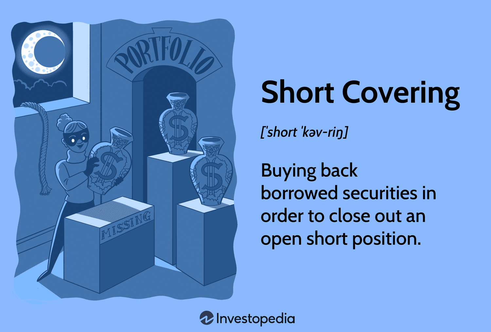

The stock market is a multifaceted and continually changing arena where both investors and traders utilize various strategies to maximize their financial outcomes. One significant strategy within this domain is short covering, which plays a critical role in the market's overall dynamics. 

Short covering involves the process of purchasing securities to close out an existing short position. When traders sell securities they have borrowed, anticipating a drop in their prices, they create short positions. Closing these positions requires buying back the securities, a process known as short covering. This strategy can be significant during market fluctuations as it influences the supply and demand dynamics of the securities involved.



In this article, we aim to unpack the complexities of short covering, including its definition, operational mechanics, and its implications for the stock market. Understanding how short covering functions is crucial as it affects individual stock prices and the broader market environment. Furthermore, we will examine how algorithmic trading, an increasingly prevalent feature of modern financial markets, enhances the efficiency and execution of short covering. Algorithms can process large amounts of market data to execute trades at optimal times, making them indispensable in today's trading strategies.

Grasping these concepts will support traders and investors in making well-informed decisions while effectively managing risks associated with short positions. By appreciating the mechanics of short covering and the integration of algorithmic trading, market participants can navigate the intricate landscape of the stock market with greater confidence and precision.

## Table of Contents

## What is Short Covering?

Short covering refers to the process wherein an investor buys back borrowed securities to close an open short position. In a short sale, an investor borrows shares and sells them with the expectation that the stock price will decline, allowing the investor to repurchase the stock at a lower price and return it to the lender, profiting from the difference. However, if the stock price rises instead of falling, the investor may incur losses. Short covering is executed to limit such potential losses, especially in a rising market.

A "buy to cover" order is used to facilitate this process, enabling the investor to purchase the same number of shares that were initially sold short. The execution of this order allows the investor to settle the borrowed shares, thereby concluding the short sale.

The outcome of a short covering strategy can vary significantly based on market conditions and the timing of the cover. For instance, covering early in an unfavorable market can help mitigate further losses, while covering after a significant price increase can amplify losses. Conversely, in some cases where the stock price has decreased, appropriate timing in covering can transform the strategy into a profitable maneuver. 

Overall, short covering is often employed as a defensive tactic to protect an investor's portfolio from prolonged exposure to a rising stock price. Understanding the nuances of short covering, such as the optimal timing for executing "buy to cover" orders, is crucial for managing risks associated with short selling effectively.

## The Mechanics of Short Covering

Short covering is a crucial aspect of trading that requires a systematic approach and precise execution. The process begins with traders staying vigilant in monitoring the market for fluctuations that could affect the value of their short positions. Identifying potential opportunities or threats enables traders to make timely decisions about when to cover their positions.

Once a trader decides to initiate short covering, the next step involves executing a buy transaction for the same number of shares initially sold short. This action effectively "covers" the short position. A pivotal [factor](/wiki/factor-investing) in this process is the timing of the transaction. Buying back shares too late, when prices have significantly risen, can lead to substantial financial losses. Conversely, a well-timed purchase can help a trader minimize losses or even achieve a favorable outcome if the stock price was declining.

The act of covering short positions can create a ripple effect in the stock market. As traders buy shares to close their positions, demand for the stock increases. This heightened demand can further elevate the stock price, leading to a phenomenon known as a short squeeze. In a short squeeze, as more traders rush to cover their positions, the price continues to rise sharply, potentially exacerbating the situation for those who have yet to cover.

The mechanics of short covering underscore the importance of strategic planning and rapid execution in trading. Staying informed and reactive to market conditions can make the difference between mitigating losses and incurring them.

## Short Covering and Short Squeezes

A short squeeze arises when numerous short sellers, who have bet against a stock, are compelled to cover their positions en masse, leading to a sharp increase in the stock price. This phenomenon often occurs when a stock that is heavily shorted unexpectedly receives positive news, sparking a rush to buy shares and close out short positions. The resulting buying pressure can cause a rapid escalation in the stock price, exacerbating the situation for those with short positions.

One of the most prominent examples of a short squeeze is the GameStop saga of 2021. During this episode, retail investors, primarily organized through online platforms like Reddit's WallStreetBets, engaged in coordinated buying efforts. This created a massive demand spike for GameStop shares, which had been heavily shorted by institutional investors. As the stock price soared, short sellers were forced to purchase shares to cover their positions, driving the price even higher and resulting in substantial financial losses for those holding short positions.

Short squeezes can expose short sellers to considerable financial risk, as there is theoretically no limit to how high a stock's price can rise. This can lead to enormous potential losses for investors who fail to cover their positions promptly. Therefore, understanding the dynamics of short squeezes is crucial for managing risk effectively in short selling strategies.

## Algorithmic Trading and Short Covering

Algorithmic trading significantly influences the effectiveness and efficiency of short covering strategies. This advanced trading method uses sophisticated algorithms or computer programs that can autonomously analyze and respond to market data. These systems are adept at executing trades at speeds and volumes impossible for human traders. In the context of short covering, such algorithms are instrumental in pinpointing the optimal moments to initiate 'buy to cover' orders, thereby mitigating potential losses associated with rising stock prices.

One of the primary benefits of using algorithms in short covering is the ability to process vast amounts of data in real-time. Algorithms routinely monitor various metrics, including short interest — the total number of shares that have been sold short but not yet covered — and market sentiment, which captures the overall attitude of investors towards a particular security or the financial market. By analyzing these indicators, algorithms can anticipate potential short squeezes, situations where short sellers are forced to buy back shares at higher prices due to unforeseen positive movements in stock prices.

Algorithms can also employ [machine learning](/wiki/machine-learning) techniques to enhance their predictive capabilities. For instance, they may be trained on historical market data to recognize patterns and correlations that precede price movements, making them valuable in adjusting short covering strategies dynamically. The use of [artificial intelligence](/wiki/ai-artificial-intelligence) (AI) further bolsters these capabilities, allowing algorithms to continuously improve their decision-making processes through accumulated data and feedback loops.

Consider a Python-based algorithm designed to monitor short covering opportunities. Such a script might connect to a financial API to retrieve live market data and execute trades based on predefined criteria:

```python
import requests
import numpy as np

def get_market_data(stock_symbol):
    response = requests.get(f"API_ENDPOINT/{stock_symbol}/quote")
    data = response.json()
    return data['current_price'], data['short_interest']

def evaluate_short_covering(stock_symbol):
    price, short_interest = get_market_data(stock_symbol)
    # Hypothetical threshold for action
    short_interest_threshold = 10 
    if short_interest > short_interest_threshold and price > previous_close(stock_symbol):
        execute_buy_to_cover(stock_symbol)

def execute_buy_to_cover(stock_symbol):
    # Logic to execute buy order
    print(f"Executing buy to cover for {stock_symbol}")

for stock in ['AAPL', 'TSLA', 'GOOGL']:
    evaluate_short_covering(stock)
```

Incorporating AI in trading strategies enhances precision, reduces risks, and improves profitability. By leveraging advanced data analysis, prediction, and execution techniques, [algorithmic trading](/wiki/algorithmic-trading) simplifies the complexity of navigating volatile markets. As these technologies continue to evolve, their role in short covering and overall market strategies is poised to expand, providing traders with ever more powerful tools to manage their positions effectively.

## Risks and Rewards of Short Covering

Short covering is a critical aspect of trading that involves both potential risks and rewards. The principal risk stems from the possibility of unlimited losses as a stock's price escalates. When an investor shorts a stock, they borrow shares to sell them, aiming to buy them back at a lower price. However, if the market moves contrary to their expectations and the stock price rises significantly, the investor may face substantial financial losses. This is because, theoretically, there is no upper limit to how high a stock price can climb, leaving the short seller vulnerable to escalating buyback costs.

Conversely, short covering executed at an opportune time can mitigate these potential losses. By strategically buying back the borrowed shares before prices rise further, an investor can stabilize their position, curtailing additional financial damage. This protective measure is fundamental when market conditions shift unpredictably, ensuring the investor is not caught in an ever-worsening financial situation.

Additionally, short covering can fuel opportunities for profit, especially when it initiates or contributes to a broader market rally. If a large number of investors simultaneously cover their short positions, this increased buying activity can drive stock prices even higher. This market behavior might attract further investment, enhancing returns for those who managed to act swiftly and cover their positions before or during such [momentum](/wiki/momentum).

Proper risk management techniques are essential when handling short-covering strategies. These techniques may involve setting stop-loss orders to limit potential losses, utilizing technical analysis to identify optimal covering points, or leveraging algorithms to automate decision-making processes. Here is an example of a Python script that can help identify potential short-covering opportunities by analyzing stock price trends:

```python
import numpy as np
import pandas as pd
import matplotlib.pyplot as plt

def calculate_moving_average(data, window_size):
    return data.rolling(window=window_size).mean()

def identify_short_covering_opportunities(stock_prices):
    short_window = 5
    long_window = 20

    short_mavg = calculate_moving_average(stock_prices['Close'], short_window)
    long_mavg = calculate_moving_average(stock_prices['Close'], long_window)

    signals = pd.DataFrame(index=stock_prices.index)
    signals['signal'] = 0.0
    signals['short_mavg'] = short_mavg
    signals['long_mavg'] = long_mavg

    signals['signal'][short_window:] = np.where(
        signals['short_mavg'][short_window:] > signals['long_mavg'][short_window:], 1.0, 0.0)

    signals['positions'] = signals['signal'].diff()

    return signals

# Example stock prices data
stock_prices = pd.DataFrame({
    'Close': [100, 102, 105, 107, 112, 110, 108, 115, 118, 120]
})

signals = identify_short_covering_opportunities(stock_prices)

print(signals)

# Plotting
plt.figure(figsize=(10, 5))
plt.plot(stock_prices['Close'], label='Stock Price')
plt.plot(signals['short_mavg'], label='Short Moving Average')
plt.plot(signals['long_mavg'], label='Long Moving Average')
plt.plot(signals.loc[signals.positions == 1.0].index, 
         signals.short_mavg[signals.positions == 1.0], 
         '^', markersize=10, color='m', lw=0, label='Buy')
plt.xlabel('Time')
plt.ylabel('Price')
plt.title('Short Covering Opportunities')
plt.legend()
plt.show()
```

This script calculates short and long moving averages, signaling potential short-covering opportunities when the short-term average crosses above the long-term average. By utilizing such tools, traders can better navigate the volatile nature of short selling and maximize their strategic outcomes.

## Conclusion

Understanding short covering is essential for anyone involved in short selling or observing market trends as it plays a critical role in the mechanics of the stock market. Short covering is integral to price movement, impacting both individual securities and overall market dynamics. The completion of a short cover order often helps stabilize markets, counteracting potential price spikes that arise when stocks are heavily shorted.

As algorithmic trading advances, its influence in facilitating short covering operations is expected to grow. Algorithms can execute trades with speed and precision, reducing the risks associated with manual trading. By analyzing metrics such as short interest and market sentiment, algorithms enhance the efficiency of short covering decisions and can preemptively address situations that might escalate into short squeezes. This automation leads to faster reaction times and potentially more effective management of short positions, especially amidst volatile market conditions.

Grasping these concepts helps traders and investors navigate the complexities of the stock market more effectively, aiding in risk evaluation and improving decision-making processes. An informed approach to short covering and familiarity with the operational aspects of algorithmic trading establishes a foundation for successful market participation. Understanding these dynamics is crucial in making judicious financial decisions and leveraging market trends for potential gain.

## References & Further Reading

[1]: Saffi, P. A., & Sigurdsson, K. (2011). ["Price Efficiency and Short Selling."](https://academic.oup.com/rfs/article-abstract/24/3/821/1590469) The Review of Financial Studies, 24(3), 821-852.

[2]: Brüggemann, R., and Jain, A. (2020). ["Short Covering Dynamics: The Role of Information and Liquidity."](https://www.academia.edu/40395722/Review_of_W_Brueggemann_The_Role_of_Old_Testament_Theology_in_Old_Testament_Interpretation_and_Other_Essays_James_Clarke_and_Co_2015_) Journal of Financial Markets.

[3]: López de Prado, M. (2018). ["Advances in Financial Machine Learning."](https://www.amazon.com/Advances-Financial-Machine-Learning-Marcos/dp/1119482089) Wiley.

[4]: Stefan Jansen. ["Machine Learning for Algorithmic Trading: Predictive models to extract signals from market and alternative data for systematic trading strategies with Python"](https://github.com/stefan-jansen/machine-learning-for-trading) (2nd ed.). 

[5]: Chan, E. P. (2008). ["Quantitative Trading: How to Build Your Own Algorithmic Trading Business."](https://github.com/ftvision/quant_trading_echan_book) Wiley.

[6]: Aronson, D. R. (2007). ["Evidence-Based Technical Analysis: Applying the Scientific Method and Statistical Inference to Trading Signals."](https://onlinelibrary.wiley.com/doi/book/10.1002/9781118268315) Wiley. 

[7]: Engelberg, J., Reed, A. V., & Ringgenberg, M. (2018). ["Short-selling risk."](https://onlinelibrary.wiley.com/doi/abs/10.1111/jofi.12601) Journal of Financial Economics, 128(3), 507-525.