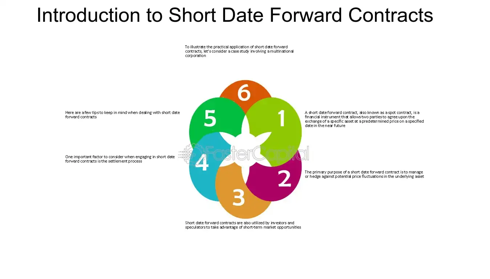

## Table of Contents

## What is a Short Date Forward Contract?

A Short Date Forward Contract is a type of agreement where one person agrees to sell an asset to another person at a future date, but that date is not too far away. It's called "short date" because the time until the delivery of the asset is relatively short, usually less than a year. This kind of contract is often used in financial markets to manage risks or to lock in prices for commodities, currencies, or other financial instruments.

For example, a farmer might use a Short Date Forward Contract to sell their crops at a set price before the harvest. This helps the farmer know how much money they will get, even if the market price changes later. On the other side, a buyer might use this contract to secure a supply of goods at a known price, which can be useful for planning and budgeting.

## How does a Short Date Forward Contract differ from a regular Forward Contract?

A Short Date Forward Contract and a regular Forward Contract are similar because they both involve an agreement to buy or sell something at a future date for a price set now. The main difference is in the length of time until the delivery date. A Short Date Forward Contract has a shorter time frame, usually less than a year, while a regular Forward Contract can have a delivery date that is further away, sometimes even years into the future.

Because the time frame is shorter, Short Date Forward Contracts are often used when people need to manage risks or plan for the near future. For example, a business might use a Short Date Forward Contract to lock in the price of raw materials they need in the next few months. On the other hand, regular Forward Contracts might be used for longer-term planning, like a company securing the price of oil for the next several years. The shorter duration of Short Date Forward Contracts can make them less risky and more flexible for quick adjustments to changing market conditions.

## What are the typical durations for Short Date Forward Contracts?

Short Date Forward Contracts usually last for a short time, often from a few weeks to a few months. They are not meant to go on for a long time. The exact time can change depending on what the contract is for and what the people agreeing to it need.

For example, if a farmer wants to make sure they get a good price for their crops that will be ready in two months, they might use a Short Date Forward Contract that lasts for those two months. In another case, a business might need to lock in the price of materials they will use in the next three months, so they would choose a contract that lasts for that time.

## What are the common uses of Short Date Forward Contracts?

Short Date Forward Contracts are often used by businesses and farmers to manage risks and plan better. For example, a farmer might use a Short Date Forward Contract to sell their crops at a set price before they are ready to be harvested. This helps the farmer know how much money they will get, even if the market price changes later. It's like making sure they have a steady income, no matter what happens in the market.

Businesses also use these contracts to lock in the prices of things they need, like raw materials or currency. If a company knows it will need a certain amount of steel in three months, it can use a Short Date Forward Contract to buy that steel at today's price. This helps the company plan its budget and avoid surprises if the price of steel goes up later. It's all about making sure they can predict costs and keep their business running smoothly.

## Who are the primary users of Short Date Forward Contracts?

The main people who use Short Date Forward Contracts are farmers and businesses. Farmers use these contracts to make sure they get a good price for their crops before they are ready to sell. This helps them plan their money better and not worry if the prices go down later. For example, a farmer might agree to sell their wheat in three months at today's price, so they know exactly how much money they will get.

Businesses also use Short Date Forward Contracts a lot. They use them to lock in prices for things they need, like raw materials or currency. This helps them plan their budget and avoid surprises if prices change. For instance, a company might use a contract to buy steel at today's price for use in three months, so they can keep their costs steady and run their business smoothly.

## What are the risks associated with Short Date Forward Contracts?

Short Date Forward Contracts can help people lock in prices and plan better, but they also come with some risks. One big risk is that the market price might change in a way that's not good for the person who made the contract. For example, if a farmer agrees to sell their wheat at a set price and then the market price goes up, the farmer could lose money because they are stuck selling at the lower price they agreed to.

Another risk is that the other person in the contract might not be able to follow through. If the buyer can't pay or the seller can't deliver what was promised, it can cause problems. This is called counterparty risk. To deal with this, people often check the other person's reliability before making a contract, but there's still a chance things could go wrong.

## How is the price determined in a Short Date Forward Contract?

The price in a Short Date Forward Contract is set when the contract is made. Both the buyer and the seller agree on a price for the thing they are trading, like crops or materials, and that price stays the same until the contract ends. They usually look at the current market price and think about what might happen to prices in the future. This helps them decide on a price that works for both of them.

Sometimes, they might use things like interest rates, storage costs, or how much the price of the thing might change to help set the price. For example, if they think the price of wheat might go up a lot in the next few months, they might set a higher price in the contract. It's all about trying to guess what will happen and agreeing on a price that makes sense for both the buyer and the seller.

## What are the settlement procedures for Short Date Forward Contracts?

When it's time to settle a Short Date Forward Contract, the buyer and seller get together to finish the deal. If it's for something physical, like crops or materials, the seller gives the buyer the thing they agreed on, and the buyer pays the price they set in the contract. It's important that both sides do what they promised. Sometimes, they might meet in person or use a delivery service to make sure everything goes smoothly.

If the contract is for something like currency or a financial product, the settlement might happen through banks or other financial systems. The buyer and seller transfer the money or the financial product according to the terms they agreed on. This can be done electronically, making it quick and easy. Both sides need to make sure they follow the rules and complete the transaction on time to avoid any problems.

## Can Short Date Forward Contracts be customized, and if so, how?

Yes, Short Date Forward Contracts can be customized to fit the needs of the people making the deal. They can change things like the amount of the product, the price, and the date when the contract ends. For example, if a farmer wants to sell a certain amount of wheat but not all at once, they can set up the contract to have different delivery dates for different amounts. This way, the contract can be made to work better for both the buyer and the seller.

Customization also lets people add special conditions to the contract. They might agree on things like how the product should be delivered, or what happens if one side can't meet their part of the deal. For instance, they could include a rule that says if the price of the product changes a lot, they can change the contract price too. This makes the contract more flexible and helps both sides feel more secure about the deal.

## How do regulatory requirements affect Short Date Forward Contracts?

Regulatory requirements can have a big impact on Short Date Forward Contracts. Governments and financial watchdogs make rules to make sure these contracts are fair and safe for everyone. They might set rules about who can make these contracts, how they should be written, and what information needs to be shared. For example, some rules might say that both the buyer and seller have to show they can pay or deliver what they promised. This helps stop people from making deals they can't keep and protects everyone involved.

These rules can also affect how much it costs to make a Short Date Forward Contract. If there are a lot of rules, it might cost more to follow them, and that can make the contract more expensive. But the rules are there to make things more open and fair, so people can trust the contracts they make. Even though it might be a bit harder and more costly, following the rules helps keep the market safe and makes sure everyone plays by the same rules.

## What are the tax implications of engaging in Short Date Forward Contracts?

When you use Short Date Forward Contracts, you need to think about taxes. The money you make or lose from these contracts can affect your taxes. If you make money, you might have to pay taxes on it, just like you do with other kinds of income. The tax rules can be different depending on where you live and what you are trading. For example, if you are trading crops, the tax rules might be different than if you are trading currency.

Sometimes, the tax rules can be tricky because they depend on how long you hold the contract and what you are trading. If you hold the contract for a short time, it might be treated as a short-term gain or loss, which can be taxed differently than long-term gains or losses. It's a good idea to talk to a tax expert to make sure you understand all the rules and how they apply to your Short Date Forward Contracts. They can help you figure out what you need to do to follow the tax laws and avoid any surprises when it's time to pay your taxes.

## How do market conditions influence the effectiveness of Short Date Forward Contracts?

Market conditions can really change how well Short Date Forward Contracts work. If the market is stable and prices don't change much, these contracts can be very helpful. They let people lock in prices and plan ahead without worrying too much about big surprises. For example, a farmer can sell their crops at a good price they know will stay the same, even if the market doesn't move much.

But if the market is very up and down, Short Date Forward Contracts can be riskier. If prices go up a lot after you make the contract, you might miss out on making more money because you're stuck with the old price. On the other hand, if prices drop a lot, the contract can protect you from losing money. So, it's important to think about how the market might change before you decide to use a Short Date Forward Contract.

## References & Further Reading

[1]: Bergstra, J., Bardenet, R., Bengio, Y., & Kégl, B. (2011). ["Algorithms for Hyper-Parameter Optimization."](https://papers.nips.cc/paper/4443-algorithms-for-hyper-parameter-optimization) Advances in Neural Information Processing Systems 24.

[2]: ["Advances in Financial Machine Learning"](https://www.amazon.com/Advances-Financial-Machine-Learning-Marcos/dp/1119482089) by Marcos Lopez de Prado

[3]: ["Evidence-Based Technical Analysis: Applying the Scientific Method and Statistical Inference to Trading Signals"](https://www.amazon.com/Evidence-Based-Technical-Analysis-Scientific-Statistical/dp/0470008741) by David Aronson

[4]: ["Machine Learning for Algorithmic Trading"](https://github.com/stefan-jansen/machine-learning-for-trading) by Stefan Jansen

[5]: ["Quantitative Trading: How to Build Your Own Algorithmic Trading Business"](https://www.amazon.com/Quantitative-Trading-Build-Algorithmic-Business/dp/1119800064) by Ernest P. Chan