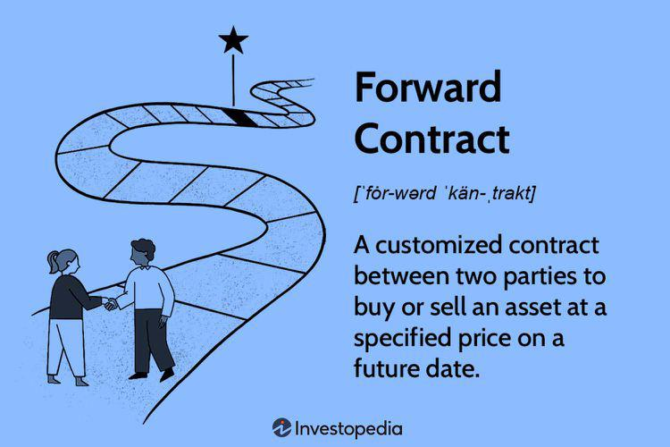

Financial markets are integral components of the global economy, facilitating the exchange of capital, credit, and investment opportunities among participants. They provide platforms where securities, commodities, and financial instruments are traded, enabling the allocation of resources, risk management, and price determination across different economies. These markets underpin economic growth by providing companies the ability to raise capital and offering investors opportunities to gain returns on their investments.

Short-date forward finance contracts are critical instruments within these markets. These contracts are a specific type of forward contract that typically involve agreements to buy or sell an asset at a predetermined price, with a maturity of less than one year. Unlike standard forward contracts, which can span multiple years, short-date forwards are characterized by their shorter duration, making them more sensitive to market fluctuations and economic events. They are commonly used in currency and commodity markets, providing significant utility for hedging purposes and for speculating on short-term price movements. Their significance lies in their ability to offer customized financial products that meet the specific timing and speculative needs of various market participants.



The rise of algorithmic trading has been transformative for financial markets since the early 21st century. Algorithmic trading involves the use of sophisticated computer algorithms to automate the trading process, significantly increasing the speed and efficiency of transactions. By executing trades at a speed and volume unattainable by human traders, algorithmic trading has enhanced liquidity and market depth while also reducing transaction costs. However, this increased automation comes with challenges such as heightened market volatility and systemic risks due to flawed algorithms or technology failures.

The convergence of short-date forward contracts with algorithmic trading is noteworthy. The utilization of algorithms to trade these contracts can amplify their inherent benefits and manage associated risks more efficiently. Algorithms can be designed to execute trades based on specific triggers, such as market news or price thresholds, allowing for rapid response to market conditions. For investors and traders, understanding this integration is crucial as it provides opportunities to optimize their trading strategies, manage risks better, and improve the execution quality of trades.

Grasping the nuances of how short-date forward contracts and algorithmic trading interconnect offers substantial advantages. This understanding enables market participants to hone their investment strategies, ensure compliance with evolving regulatory landscapes, and harness the potential of technological advancements. For investors and traders seeking to thrive in modern financial markets, awareness and adaptation to these dynamic integrations are indispensable.

## Table of Contents

## Understanding Short-Date Forward Finance Contracts

Short-date forward finance contracts are financial derivatives that allow parties to agree upon the purchase or sale of an asset at a predetermined price, with the contract set to mature within a short timeframe, typically less than one year. These contracts are primarily utilized in markets where quick settlement is desired, offering a vehicle for hedging or speculation on the future price movements of various assets.

### Definition and Key Features

A short-date forward finance contract is a customized agreement between two parties to buy or sell an asset at a specified price on a future date. Unlike futures contracts, which are standardized and traded on exchanges, forward contracts are over-the-counter (OTC) agreements, providing flexibility in terms of contract size, duration, and settlement terms. They are particularly beneficial for transactions requiring immediate action and short-term forecasts.

The primary features of short-date forwards include:
- **Non-standardization**: Tailor-made to fit the specific needs of the contracting entities.
- **Over-the-counter nature**: Privately negotiated without an intermediary exchange.
- **Short maturity period**: Typically less than a year, focusing on immediate or near-term settlement.

### Differences from Other Financial Derivatives

Short-date forward contracts differ from other derivatives primarily in terms of their structure and trading environment. For instance, they lack the standardized terms and regulatory oversight of exchange-traded futures, resulting in higher counterparty risk. Unlike options, forwards do not provide the buyer the right to forfeit the transaction; they impose an obligation to settle at maturity.

### Typical Users and Motivations

The primary users of short-date forward contracts include corporations and financial institutions aiming to hedge against short-term price [volatility](/wiki/volatility-trading-strategies) in currency or commodities. Exporters and importers utilize these contracts to lock in exchange rates, mitigating the risk of unfavorable currency movements that could impact their cross-border transactions. Speculators may also engage with these instruments to capitalize on anticipated price shifts in the underlying assets.

### Common Markets

These contracts are predominantly found in:
- **Currency Markets**: Businesses use short-term forwards to stabilize cash flow and exchange rates, especially in volatile currency environments.
- **Commodities Markets**: Traders might secure current market prices for commodities with historically high price fluctuations, like oil or precious metals, avoiding potential future price hikes.

### Risks and Benefits

The principal risk associated with short-date forward contracts is counterparty risk, as there is no centralized clearinghouse acting as an intermediary to guarantee the transaction. Market participants also face the risk of adverse price movements after locking in a price with a forward contract. Despite these risks, these contracts provide significant benefits, including precise matching of cash flow expectations and effective short-term hedging and investment strategies.

In summary, short-date forward contracts play a crucial role in financial markets by providing flexibility, customization, and an effective risk management tool for businesses and investors dealing with short-term volatility. Their strategic use in currency and commodities markets underscores their importance in contemporary finance.

## The Role of Algorithmic Trading in Financial Markets

Algorithmic trading, also known as algo trading, involves the use of pre-programmed instructions to execute trading decisions based on various factors such as price, timing, and [volume](/wiki/volume-trading-strategy). The advent of algo trading has fundamentally changed the dynamics of financial markets by enhancing both the speed and accuracy of trades.

Historically, [algorithmic trading](/wiki/algorithmic-trading) gained [momentum](/wiki/momentum) in the late 20th century with advancements in computer technology and increased access to financial markets. Early adopters recognized the potential of algorithms to outperform human traders, particularly in high-frequency trading ([HFT](/wiki/high-frequency-trading-strategies)), where milliseconds can be a critical advantage. Since then, the sophistication of algorithms has grown exponentially, enabling them to analyze vast data sets and execute trades at unprecedented speeds.

The primary benefits of algorithmic trading include speed, accuracy, and efficiency. Algorithms can process and react to market information far quicker than any human, leading to optimal pricing and reduced transaction costs. This speed and efficiency also translate into enhanced [liquidity](/wiki/liquidity-risk-premium) for the markets, as algo trading can provide continuous buy and sell orders, helping balance the supply and demand.

However, the reliance on algorithms also presents certain challenges and risks. One major concern is the possibility of system failures or bugs, which can lead to significant financial losses. The "flash crash" of May 6, 2010, serves as a stark reminder of how technical glitches can disrupt markets. Additionally, algorithms are typically designed based on historical data, which may not always predict future events accurately, potentially leading to erroneous trading decisions during unforeseen market conditions.

Key market participants driving algorithmic trading forward include institutional investors and hedge funds, which utilize complex algorithms to gain competitive edges. Furthermore, technological advancements, like [machine learning](/wiki/machine-learning) and [artificial intelligence](/wiki/ai-artificial-intelligence), continue to propel the field forward. Platforms such as Python, with libraries like NumPy and pandas, are popular for developing and [backtesting](/wiki/backtesting) trading algorithms due to their robustness and ease of use.

For instance, a simple example of an algorithmic trading strategy using Python might involve implementing a moving average crossover technique:

```python
import pandas as pd

# Load historical price data
data = pd.read_csv('historical_prices.csv')
short_window = 40
long_window = 100

# Calculate moving averages
data['short_mavg'] = data['Close'].rolling(window=short_window, min_periods=1).mean()
data['long_mavg'] = data['Close'].rolling(window=long_window, min_periods=1).mean()

# Generate trading signals
data['Signal'] = 0.0  
data['Signal'][short_window:] = np.where(data['short_mavg'][short_window:] > data['long_mavg'][short_window:], 1.0, 0.0)  
data['Position'] = data['Signal'].diff()

# Output the first few lines to verify results
print(data.head())
```

This snippet outlines a basic strategy using two moving averages to identify buy/sell signals based on their crossovers. As algorithms become more advanced, they integrate sophisticated models and vast amounts of market data to optimize trading strategies further.

In conclusion, algorithmic trading plays a crucial role in modern financial markets, offering numerous advantages while also presenting unique challenges. Continued advancements in technology are expected to further enhance the capabilities and influence of algo trading, necessitating ongoing attention from market participants.

## Combining Algo Trading with Short-Date Forward Contracts

Algorithmic trading has revolutionized the financial industry, and its application to short-date forward contracts provides significant advantages for traders and investors. These contracts, which involve agreements to buy or sell an asset at a set price on an imminent date, benefit from the precision and speed that algorithmic strategies offer.

### Algorithmic Strategies and Their Application

Algorithmic trading involves the use of automated systems to execute pre-programmed trading instructions accounting for variables such as timing, price, and volume. When applied to short-date forward contracts, these strategies enhance decision-making processes by analyzing vast amounts of data to forecast price movements with high accuracy and efficiency.

#### Popular Algorithms in Short-Date Forward Contracts

1. **Market Making Algorithms**: These are designed to provide liquidity by placing both buy and sell orders simultaneously, capitalizing on the bid-ask spread. Effective for short-date contracts, they aim to capture small price differentials frequently and rapidly.

2. **Arbitrage Algorithms**: These algorithms exploit price discrepancies between related markets or instruments, achieving risk-free profits. For example, an arbitrage strategy might seek profit from minor differences between the spot price of a commodity and its near-term forward contract.

3. **Trend Following Algorithms**: These detect and capitalize on market momentum. By identifying patterns or trends in the price data, these algorithms make informed predictions about future price movements, which can be crucial given the brief duration of short-date forwards.

### Advantages of Algorithmic Trading in Short-Date Forwards

The synthesis of algorithmic trading with short-date forward contracts introduces numerous benefits:

- **Speed and Efficiency**: Algorithms can execute trades in microseconds, far quicker than a human trader, ensuring optimal entry and exit points.
- **Reduced Errors**: By automating trading processes, the potential for human error is significantly diminished.
- **Enhanced Data Processing**: Algorithms can analyze multiple markets and assets concurrently, offering a comprehensive view that informs trading decisions in real-time.

### Technical and Analytical Skills Required

Developing and implementing algorithms for short-date forward contracts requires a blend of skills:

- **Quantitative Analysis**: A strong foundation in mathematics and statistics is essential to model market behavior and predict price movements.
- **Programming Expertise**: Proficiency in programming languages like Python, often used for building and testing trading algorithms, is crucial. Libraries such as NumPy, pandas, and scikit-learn are commonly employed for data analysis and machine learning.

- **Financial Knowledge**: Understanding the principles of financial markets, derivatives, and specifically, forward contracts, is necessary to create algorithms that are both effective and compliant with market structures.

### Case Studies of Successful Integration

1. **XYZ Hedge Fund**: By employing a market-making algorithm on currency forwards, XYZ was able to significantly enhance liquidity and market position, achieving superior returns compared to manual traders.

2. **TechTrader Inc.**: Utilized an arbitrage algorithm across commodity forward contracts, exploiting transient market inefficiencies. This resulted in high-frequency, low-risk trades with substantial cumulative profits.

In conclusion, the integration of algorithmic trading with short-date forward contracts represents a powerful convergence of technology and finance, promising enhanced trading efficiency, reduced risk, and improved market outcomes for informed participants.

## Regulatory Considerations and Market Impact

**Current Regulatory Frameworks for Algo Trading and Derivatives**

Algorithmic trading and derivatives are governed by an evolving regulatory landscape designed to ensure market integrity and protect investors. Regulations like the European Union’s Markets in Financial Instruments Directive II (MiFID II) and the U.S. Dodd-Frank Act have addressed algorithmic trading, introducing measures that mandate transparency, risk management, and reporting requirements. These regulations aim to prevent market abuse by requiring algorithms to be tested for fairness and creating audit trails for algorithmic trades.

For derivatives, regulations require centralized clearing and reporting to trade repositories to improve market transparency and reduce systemic risk. The Commodity Futures Trading Commission (CFTC) and the Securities and Exchange Commission (SEC) oversee such transactions in the U.S., ensuring that the entities involved comply with rules that mitigate counterparty risks and promote market stability.

**Potential Regulatory Changes on the Horizon and Their Implications**

Regulatory bodies continuously assess the impact of existing rules and identify areas for improvement, especially as trading technologies evolve. Changes such as tighter controls on leverage and enhanced scrutiny over algorithmic strategies could be on the horizon. The introduction of artificial intelligence in trading further necessitates adaptive regulatory approaches to address unforeseen risks. These potential changes could lead to increased compliance costs and operational challenges for market participants, but they could also enhance market robustness.

**Impact of Algorithmic Trading on Market Liquidity and Volatility**

Algorithmic trading significantly influences market liquidity and volatility. Algorithms can improve liquidity by facilitating continuous trading and narrowing bid-ask spreads. However, they may also exacerbate volatility, especially when similar algorithms operate concurrently, leading to rapid price changes that can destabilize markets. Flash crashes are stark reminders of how algorithms, without adequate safeguards, can induce severe volatility.

**Ethical Considerations of High-Frequency Trading Involving Short-Dated Contracts**

High-frequency trading (HFT) raises ethical considerations due to its potential to create unfair advantages. The speed at which HFT operates can disadvantage traditional traders, fostering a perception of inequality. Moreover, HFT can manipulate price movements, raising questions about the fairness and ethicality of its inclusion in short-dated contracts where rapid trades might lead to market distortions.

**Strategies for Investors to Navigate These Regulatory Landscapes**

Investors and traders should adopt several strategies to navigate the regulatory complexities surrounding algorithmic trading and derivatives. Staying informed about regulatory developments and engaging with compliance experts is critical. Investors should also consider diversifying trading strategies to include both algorithms and traditional methods to mitigate potential disruptions from regulatory changes. Enhancing due diligence processes and risk management frameworks can further help in adapting to this dynamically changing environment.

## Future Trends and Opportunities

Emerging technologies are set to redefine the landscape of algorithmic trading and short-date forward finance contracts, promising enhanced efficiency and novel opportunities for market participants. Machine learning (ML) and artificial intelligence (AI) stand at the forefront, offering robust analytics and predictive capabilities that can optimize trading strategies.

### Emerging Technologies and Influence

AI's integration into algorithmic trading is anticipated to significantly impact efficiency and decision-making. Machine learning algorithms can analyze vast data sets in real-time, identifying patterns and trends beyond human capabilities. For example, a [neural network](/wiki/neural-network) can be employed to predict currency movements by analyzing market microstructure and macroeconomic indicators. As computing power increases and data accessibility improves, these AI-driven models become more accurate and faster, allowing traders to swiftly adjust their positions.

Blockchain technology also presents opportunities by improving the transparency and security of financial transactions, reducing the likelihood of fraud. Smart contracts facilitate peer-to-peer trading without intermediaries, potentially leading to cost savings and increased transaction speed. These technologies can be particularly beneficial in short-date forward contracts, where settlement periods are brief.

### Innovations and Trends

Expected innovations include the proliferation of quantum computing, which could process complex algorithms at unprecedented speeds, thus enhancing high-frequency trading strategies. Additionally, decentralized finance (DeFi) platforms are gaining traction, democratizing access to financial instruments, including derivatives like short-date forwards. As these platforms mature, they may offer seamless, automated environments for executing forward contracts efficiently.

Furthermore, the development of predictive analytics tools enables traders to better forecast market conditions, thus improving risk management in short-date forward markets. Enhanced analytics allow for more precise hedging strategies, optimizing profit margins.

### Opportunities for Investors and Traders

In this evolving landscape, investors and traders have the chance to leverage technological advancements to gain competitive edges. By adopting AI-driven strategies, traders can improve their execution speed and accuracy, reducing the impact of slippage and improving returns. Additionally, utilizing blockchain can lower operational risks and transactional costs.

Investors can also diversify their portfolios by integrating assets from DeFi markets, where novel financial instruments are continuously developed. Furthermore, the adoption of AI in risk management and decision-making processes offers the potential for increased resilience in volatile markets.

### The Role of AI in Enhancing Strategies

AI's role in enhancing algorithmic strategies is significant. Machine learning models, such as convolutional neural networks (CNNs) and recurrent neural networks (RNNs), are used to identify patterns and predict price movements efficiently. AI algorithms can also optimize trading parameters via [reinforcement learning](/wiki/reinforcement-learning), continually learning and adapting to market dynamics.

Implementing AI models can be achieved through Python libraries like TensorFlow and PyTorch:

```python
import tensorflow as tf 

model = tf.keras.Sequential([
    tf.keras.layers.Dense(units=128, activation='relu', input_shape=(input_shape,)),
    tf.keras.layers.Dense(units=64, activation='relu'),
    tf.keras.layers.Dense(units=1, activation='linear')
])

model.compile(optimizer='adam', loss='mse')
model.fit(X_train, y_train, epochs=50, batch_size=32)
```

### Market Evolution Predictions

Over the next decade, financial markets are expected to become increasingly automated, with AI playing a pivotal role in strategy execution and risk management. As technological infrastructure evolves, the markets may witness enhanced liquidity and reduced volatility, facilitated by high-speed trading systems.

Regulatory frameworks are also anticipated to evolve, addressing the complexities introduced by AI and blockchain technologies. These changes could lead to more robust market structures and increased investor protection. Overall, the integration of emerging technologies is poised to transform the landscape of short-date forward finance contracts and algorithmic trading, offering substantial opportunities for growth and innovation.

## Conclusion

Short-date forward contracts are vital instruments in modern finance, offering tools for hedging and speculation across various markets, including currencies and commodities. These contracts provide traders and investors with flexibility and specific advantages due to their short duration, adapting swiftly to market conditions. As financial markets have embraced technology, the integration of algorithmic trading with short-date forward contracts has emerged as a potent combination.

The blend of algorithmic trading with short-date forwards brings several pros and cons. The primary benefits include enhanced trade execution speed and efficiency. Algorithms can rapidly analyze vast datasets, identifying profitable opportunities that might otherwise be overlooked due to human limitations. This capability significantly reduces latency and transaction costs, thereby potentially increasing returns for traders. However, challenges persist, notably the reliance on complex algorithms that may malfunction, and the increased market volatility they can cause due to high-frequency trading tactics.

Algorithmic trading has the potential to revolutionize financial derivatives by offering unprecedented insights and execution capabilities. It allows for executing trades that are not only faster but also optimized according to sophisticated strategic criteria. As technology progresses, the scope and scale of algorithmic integration in trading strategies are anticipated to expand, bringing further transformative changes to market dynamics.

As financial markets continue to evolve, the importance of staying informed and adaptable cannot be overstated. For investors and traders, this means embracing ongoing education and technological acumen to remain competitive. By understanding the nuances of algorithmic trading and short-date forward contracts, market participants can enhance their strategy development and risk management processes.

Therefore, investors and traders are encouraged to consider these insights as they formulate their strategies. By leveraging the opportunities presented by algorithmic trading and short-date forward contracts, they can potentially gain an edge in today's fast-paced financial marketplace.

## References & Further Reading

[1]: Bergstra, J., Bardenet, R., Bengio, Y., & Kégl, B. (2011). ["Algorithms for Hyper-Parameter Optimization."](https://papers.nips.cc/paper/4443-algorithms-for-hyper-parameter-optimization) Advances in Neural Information Processing Systems 24.

[2]: ["Advances in Financial Machine Learning"](https://www.amazon.com/Advances-Financial-Machine-Learning-Marcos/dp/1119482089) by Marcos Lopez de Prado

[3]: ["Evidence-Based Technical Analysis: Applying the Scientific Method and Statistical Inference to Trading Signals"](https://www.amazon.com/Evidence-Based-Technical-Analysis-Scientific-Statistical/dp/0470008741) by David Aronson

[4]: ["Machine Learning for Algorithmic Trading"](https://github.com/stefan-jansen/machine-learning-for-trading) by Stefan Jansen

[5]: ["Quantitative Trading: How to Build Your Own Algorithmic Trading Business"](https://www.amazon.com/Quantitative-Trading-Build-Algorithmic-Business/dp/1119800064) by Ernest P. Chan